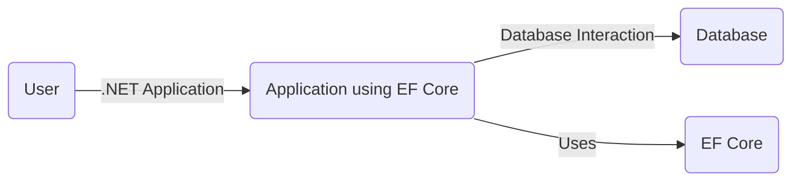
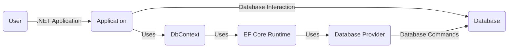
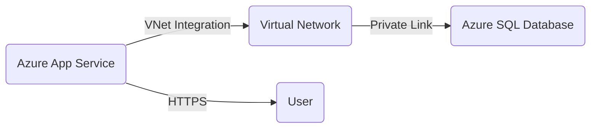
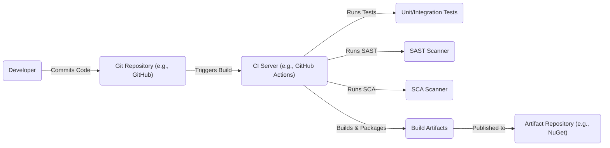

# BUSINESS POSTURE

Business Priorities and Goals:

*   Provide a robust and efficient Object-Relational Mapper (ORM) for .NET developers.
*   Support a wide range of database providers.
*   Enable developers to interact with databases using .NET objects, reducing boilerplate code.
*   Facilitate efficient data access and manipulation.
*   Maintain high performance and scalability.
*   Provide a consistent and well-documented API.
*   Foster a strong community and ecosystem.
*   Ensure compatibility with various .NET versions and platforms.
*   Continuously improve and evolve the framework based on user feedback and industry trends.

Most Important Business Risks:

*   Data breaches or unauthorized access to sensitive data managed by applications using EF Core.
*   Performance bottlenecks or scalability issues impacting application responsiveness.
*   Compatibility issues with different database providers or .NET versions, leading to application failures.
*   Vulnerabilities in EF Core that could be exploited by attackers to compromise applications.
*   Inability to adapt to new database technologies or evolving developer needs.
*   Lack of sufficient documentation or community support, hindering developer adoption and productivity.

# SECURITY POSTURE

Existing Security Controls:

*   security control: Input validation: EF Core performs some level of input validation to prevent SQL injection vulnerabilities. (Implemented in the core library and provider-specific implementations).
*   security control: Parameterized queries: EF Core uses parameterized queries to protect against SQL injection. (Implemented in the core library and provider-specific implementations).
*   security control: Secure coding practices: The EF Core codebase is developed following secure coding guidelines to minimize vulnerabilities. (Described in contribution guidelines and internal development processes).
*   security control: Regular security audits and penetration testing: Microsoft conducts regular security reviews and penetration tests on its products, including EF Core. (Described in Microsoft's security development lifecycle documentation).
*   security control: Vulnerability disclosure program: Microsoft has a vulnerability disclosure program that encourages responsible reporting of security issues. (Described on Microsoft's security website).
*   security control: Code reviews: All code changes undergo code reviews to identify potential security flaws. (Described in contribution guidelines).

Accepted Risks:

*   accepted risk: Third-party database provider vulnerabilities: EF Core relies on third-party database providers, and vulnerabilities in these providers could impact applications using EF Core.
*   accepted risk: Developer misuse: Developers can misuse EF Core features, leading to security vulnerabilities (e.g., disabling input validation or using raw SQL queries insecurely).
*   accepted risk: Configuration errors: Incorrect configuration of database connections or security settings can expose applications to risks.

Recommended Security Controls:

*   security control: Enhanced input validation: Implement additional input validation mechanisms beyond what EF Core provides by default, especially for applications handling sensitive data.
*   security control: Least privilege principle: Ensure that database users and roles have only the necessary permissions to perform their tasks.
*   security control: Encryption at rest and in transit: Encrypt sensitive data both at rest (in the database) and in transit (between the application and the database).
*   security control: Auditing: Enable database auditing to track data access and modifications.
*   security control: Regular security training for developers: Educate developers on secure coding practices and how to use EF Core securely.
*   security control: Static Application Security Testing (SAST): Integrate SAST tools into the build process to identify potential vulnerabilities in the EF Core codebase.
*   security control: Dynamic Application Security Testing (DAST): Perform regular DAST scans on applications using EF Core to identify runtime vulnerabilities.
*   security control: Software Composition Analysis (SCA): Use SCA tools to identify and manage vulnerabilities in third-party dependencies used by EF Core.

Security Requirements:

*   Authentication:
    *   Applications using EF Core should authenticate users securely, using strong authentication mechanisms.
    *   Database connections should use strong authentication credentials.
*   Authorization:
    *   Applications should implement appropriate authorization controls to restrict access to sensitive data based on user roles and permissions.
    *   Database users and roles should be granted only the necessary privileges.
*   Input Validation:
    *   Applications should validate all user inputs thoroughly to prevent injection attacks and other vulnerabilities.
    *   EF Core's built-in input validation should be supplemented with application-specific validation logic.
*   Cryptography:
    *   Sensitive data should be encrypted both at rest and in transit.
    *   Strong cryptographic algorithms and key management practices should be used.

# DESIGN

## C4 CONTEXT

Element Descriptions:

*   Element 1:
    *   Name: User
    *   Type: Person
    *   Description: A user of the application that utilizes EF Core.
    *   Responsibilities: Interacts with the application, provides input, and receives output.
    *   Security controls: Authentication and authorization mechanisms within the application.

*   Element 2:
    *   Name: Application using EF Core
    *   Type: Software System
    *   Description: A .NET application that uses EF Core to interact with a database.
    *   Responsibilities: Handles user requests, processes data, and interacts with the database using EF Core.
    *   Security controls: Input validation, output encoding, authentication, authorization, session management, error handling, and logging.

*   Element 3:
    *   Name: Database
    *   Type: Database System
    *   Description: The database system that stores and manages the application's data.
    *   Responsibilities: Stores data, retrieves data, enforces data integrity, and provides data access control.
    *   Security controls: Database access controls, encryption at rest, auditing, and network security.

*   Element 4:
    *   Name: EF Core
    *   Type: Framework
    *   Description: The Entity Framework Core library.
    *   Responsibilities: Provides an object-relational mapping layer, translates LINQ queries to SQL, manages database connections, and tracks changes to entities.
    *   Security controls: Parameterized queries, input validation (limited), and secure coding practices.

## C4 CONTAINER

Element Descriptions:

*   Element 1:
    *   Name: User
    *   Type: Person
    *   Description: A user of the application.
    *   Responsibilities: Interacts with the application.
    *   Security controls: Authentication and authorization within the application.

*   Element 2:
    *   Name: Application
    *   Type: Container (e.g., Web Application, API, Desktop Application)
    *   Description: The .NET application code that uses EF Core.
    *   Responsibilities: Handles user requests, business logic, and data access.
    *   Security controls: Input validation, output encoding, authentication, authorization, session management, error handling, and logging.

*   Element 3:
    *   Name: Database
    *   Type: Container (Database)
    *   Description: The database system.
    *   Responsibilities: Stores and manages data.
    *   Security controls: Database access controls, encryption at rest, auditing, and network security.

*   Element 4:
    *   Name: DbContext
    *   Type: Component
    *   Description: The application's DbContext class, derived from EF Core's DbContext.
    *   Responsibilities: Represents a session with the database, manages entity tracking, and provides access to database operations.
    *   Security controls: Inherits security features from EF Core Runtime.

*   Element 5:
    *   Name: EF Core Runtime
    *   Type: Component
    *   Description: The core EF Core runtime library.
    *   Responsibilities: Provides the core functionality of EF Core, including query translation, change tracking, and connection management.
    *   Security controls: Parameterized queries, input validation (limited), and secure coding practices.

*   Element 6:
    *   Name: Database Provider
    *   Type: Component
    *   Description: The EF Core database provider for the specific database system being used (e.g., SQL Server, PostgreSQL, MySQL).
    *   Responsibilities: Translates EF Core commands into database-specific commands and manages communication with the database.
    *   Security controls: Implements database-specific security features and relies on the security of the underlying database system.

## DEPLOYMENT

Possible Deployment Solutions:

1.  Azure App Service with Azure SQL Database.
2.  AWS Elastic Beanstalk with Amazon RDS.
3.  Google Cloud Run with Cloud SQL.
4.  On-premises IIS with SQL Server.
5.  Docker container deployed to Kubernetes.

Chosen Deployment Solution (for detailed description): Azure App Service with Azure SQL Database.

Element Descriptions:

*   Element 1:
    *   Name: User
    *   Type: Person
    *   Description: End-user accessing the application.
    *   Responsibilities: Interacts with the application through a web browser or other client.
    *   Security controls: HTTPS for secure communication.

*   Element 2:
    *   Name: Azure App Service
    *   Type: Platform as a Service (PaaS)
    *   Description: The hosting environment for the .NET application.
    *   Responsibilities: Runs the application code, handles HTTP requests, and provides scaling and management features.
    *   Security controls: Azure App Service security features, including TLS/SSL termination, authentication and authorization options, and network security configurations.

*   Element 3:
    *   Name: Virtual Network
    *   Type: Network
    *   Description: An isolated network within Azure.
    *   Responsibilities: Provides network isolation and security for Azure resources.
    *   Security controls: Network security groups (NSGs), firewalls, and virtual network peering.

*   Element 4:
    *   Name: Azure SQL Database
    *   Type: Database as a Service (DBaaS)
    *   Description: The managed SQL Server database service.
    *   Responsibilities: Stores and manages the application's data.
    *   Security controls: Azure SQL Database security features, including firewall rules, threat detection, transparent data encryption (TDE), and Azure Active Directory integration.

* Element 5:
    * Name: Private Link
    * Type: Network
    * Description: Provides private connectivity from the virtual network to Azure services.
    * Responsibilities: Enables secure access to Azure SQL Database without traversing the public internet.
    * Security controls: Network isolation.

* Element 6:
    * Name: VNet Integration
    * Type: Network
    * Description: Connects Azure App Service to the virtual network.
    * Responsibilities: Allows the App Service to access resources within the virtual network.
    * Security controls: Network isolation.

## BUILD

Build Process Description:

1.  Developer commits code to a Git repository (e.g., GitHub).
2.  The commit triggers a build on a CI server (e.g., GitHub Actions, Azure Pipelines, Jenkins).
3.  The CI server runs unit and integration tests.
4.  The CI server runs a Static Application Security Testing (SAST) scanner to identify potential vulnerabilities in the code.
5.  The CI server runs a Software Composition Analysis (SCA) scanner to identify vulnerabilities in third-party dependencies.
6.  If all tests and scans pass, the CI server builds and packages the application into build artifacts.
7.  The build artifacts are published to an artifact repository (e.g., NuGet, Azure Artifacts).

Security Controls:

*   security control: Git repository access control: Restrict access to the Git repository to authorized developers.
*   security control: CI server security: Secure the CI server and its build agents.
*   security control: SAST: Use a SAST scanner to identify vulnerabilities in the code.
*   security control: SCA: Use an SCA scanner to identify vulnerabilities in third-party dependencies.
*   security control: Build artifact signing: Digitally sign build artifacts to ensure their integrity.
*   security control: Secure artifact repository: Use a secure artifact repository with access controls.
*   security control: Branch protection rules: Enforce branch protection rules in the Git repository to prevent unauthorized code changes.
*   security control: Code reviews: Require code reviews for all code changes before they are merged into the main branch.

# RISK ASSESSMENT

Critical Business Processes to Protect:

*   Data access and manipulation: Ensuring that data is accessed and modified only by authorized users and processes.
*   Application availability: Maintaining the availability and responsiveness of applications using EF Core.
*   Data integrity: Protecting the accuracy and consistency of data managed by EF Core.

Data to Protect and Sensitivity:

*   The sensitivity of the data managed by EF Core depends on the specific application.
*   Examples of data that might be managed by EF Core and their potential sensitivity:
    *   Personally Identifiable Information (PII): High sensitivity.
    *   Financial data: High sensitivity.
    *   Health information: High sensitivity.
    *   Application configuration data: Medium sensitivity.
    *   Business data (e.g., sales, inventory): Medium to high sensitivity, depending on the specific data.

# QUESTIONS & ASSUMPTIONS

Questions:

*   What specific database providers are intended to be supported?
*   What are the performance and scalability requirements for applications using EF Core?
*   What level of security auditing and logging is required?
*   What is the expected development lifecycle and release cadence?
*   Are there any specific compliance requirements (e.g., GDPR, HIPAA) that need to be considered?
*   What is the process for handling security vulnerabilities discovered in EF Core or its dependencies?

Assumptions:

*   BUSINESS POSTURE: The primary goal is to provide a reliable and efficient ORM for .NET developers.
*   SECURITY POSTURE: Secure coding practices are followed, and regular security reviews are conducted.
*   DESIGN: The deployment will utilize a managed cloud service for both the application and the database.