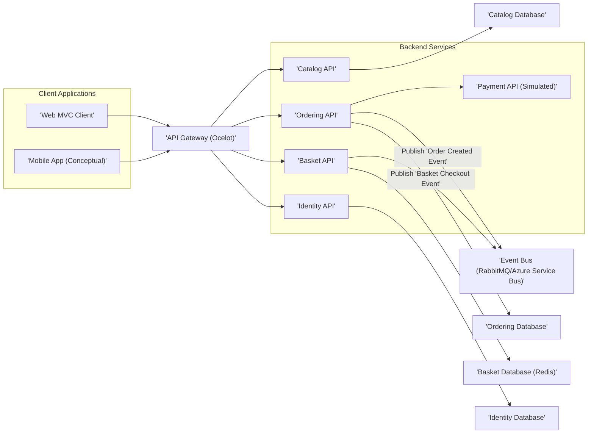
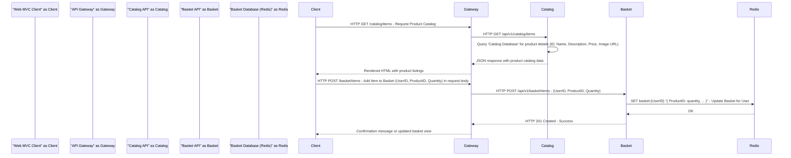

## Project Design Document: eShop (Improved)

**1. Introduction**

This document provides a detailed architectural design of the eShop project, as found in the provided GitHub repository: [https://github.com/dotnet/eShop](https://github.com/dotnet/eShop). This document aims to clearly outline the system's components, their interactions, and the overall architecture. It will serve as a foundation for future threat modeling activities.

**2. Goals**

*   Provide a comprehensive overview of the eShop application's architecture.
*   Identify key components and their responsibilities with greater detail.
*   Describe the data flow within the system, including specific data elements.
*   Highlight important security considerations, elaborating on potential threats.
*   Serve as a robust basis for threat modeling exercises.

**3. Target Audience**

This document is intended for:

*   Security engineers and architects involved in threat modeling and security assessments.
*   Development teams working on or interacting with the eShop project, requiring a deeper understanding of the system.
*   Operations teams responsible for deploying, maintaining, and securing the application.

**4. High-Level Architecture**

The eShop application is a microservices-based architecture built using .NET. It leverages containerization (Docker) and orchestration (Kubernetes) for deployment and management.

**Description:**

*   **Client Applications:** Users interact with the eShop through web browsers (**Web MVC Client**) or potentially mobile applications (**Mobile App (Conceptual)**). These applications initiate requests to the backend services.
*   **API Gateway (Ocelot):** Acts as a reverse proxy and single entry point for client requests. It performs crucial functions like request routing to specific backend services, authentication (verifying user identity), and authorization (ensuring users have the necessary permissions). It can also handle cross-cutting concerns such as rate limiting, request aggregation, and protocol translation.
*   **Backend Services:** These are independent, deployable units responsible for specific business capabilities. They communicate with each other asynchronously via the Event Bus or synchronously through direct calls (often managed by the API Gateway).
    *   **Catalog API:** Manages product information, including details like name, description, price, and availability. It provides endpoints for retrieving, creating, updating, and deleting product data.
    *   **Ordering API:** Handles the entire order lifecycle, from order creation and placement to processing and shipment. It manages order details, line items, and integrates with other services like the Basket and Payment APIs.
    *   **Basket API:** Manages user shopping carts. It allows users to add, remove, and modify items in their basket. It typically stores temporary data and is optimized for fast read/write operations.
    *   **Identity API:** Responsible for user authentication (verifying user credentials) and authorization (managing user roles and permissions). It issues security tokens (like JWT) that are used by other services to verify user identity.
    *   **Payment API (Simulated):**  Simulates the process of payment processing. In a production environment, this would integrate with a third-party payment gateway to handle actual financial transactions.
*   **Event Bus (RabbitMQ/Azure Service Bus):** Facilitates asynchronous, loosely coupled communication between microservices. When an event occurs in one service (e.g., an order is created), it publishes a message to the Event Bus. Other services that are interested in this event can subscribe and react accordingly. This promotes resilience and scalability.
*   **Databases:** Each microservice typically owns its data and uses a dedicated database for persistence. This promotes data isolation and allows for choosing the most appropriate database technology for each service's needs.
    *   **Catalog Database:** Stores persistent product catalog data.
    *   **Ordering Database:** Stores persistent order-related information.
    *   **Basket Database (Redis):** Uses a NoSQL in-memory data store (Redis) for storing temporary and frequently accessed basket data, offering high performance.
    *   **Identity Database:** Stores user credentials, roles, and permissions.

**5. Component Details**

This section provides a more detailed description of the key components, focusing on their functionality, technology, interactions, data storage, and specific security considerations.

*   **Web MVC Client:**
    *   **Functionality:** Presents the user interface for interacting with the eShop. Users can browse products, view details, add items to their basket, and initiate the checkout process. It handles user input and displays data retrieved from the backend.
    *   **Technology:** ASP.NET Core MVC, utilizing HTML, CSS, and JavaScript for the user interface.
    *   **Key Interactions:** Primarily communicates with the **API Gateway** via HTTP requests to access backend functionalities. May also use browser storage for temporary data.
    *   **Data Storage:**  Relies on browser storage (cookies, local storage, session storage) for storing temporary user-specific data like session information or recently viewed items.
    *   **Security Considerations:**  Susceptible to client-side attacks such as Cross-Site Scripting (XSS) and Cross-Site Request Forgery (CSRF). Requires secure communication (HTTPS) with the **API Gateway** to protect data in transit. Proper handling of user input and output is crucial to prevent XSS. Anti-CSRF tokens should be implemented to mitigate CSRF attacks.

*   **API Gateway (Ocelot):**
    *   **Functionality:**  Acts as a central point of contact for all client requests. It routes requests to the appropriate backend services based on pre-configured routes. It handles authentication by verifying the presence and validity of JWT tokens. It performs authorization by checking if the authenticated user has the necessary permissions to access the requested resource. It can also implement rate limiting to protect backend services from overload.
    *   **Technology:**  Ocelot API Gateway (.NET).
    *   **Key Interactions:** Receives requests from client applications and forwards them to the relevant backend services. Interacts with the **Identity API** to validate JWT tokens. May interact with other services for cross-cutting concerns.
    *   **Data Storage:**  Typically stateless, but may cache routing configurations for performance.
    *   **Security Considerations:** A critical component for security. Must be secured against unauthorized access and injection attacks. Proper configuration of routing rules, authentication schemes, and authorization policies is paramount. Vulnerabilities in the API Gateway can expose the entire backend. Rate limiting and input validation at this layer are essential.

*   **Catalog API:**
    *   **Functionality:**  Provides endpoints for managing and retrieving product catalog information. This includes operations like listing products, retrieving details for a specific product, and potentially administrative functions for adding, updating, and deleting products.
    *   **Technology:** ASP.NET Core Web API.
    *   **Key Interactions:**  Receives requests from the **API Gateway**. Interacts with the **Catalog Database** to persist and retrieve product data.
    *   **Data Storage:**  Persists product data (name, description, price, images, etc.) in the **Catalog Database**.
    *   **Security Considerations:**  Requires authorization to manage (create, update, delete) catalog data, typically restricted to administrative users. Input validation is crucial to prevent injection attacks when adding or modifying product information. Securely storing and serving product images is also important.

*   **Ordering API:**
    *   **Functionality:**  Manages the creation, processing, and lifecycle of orders. This includes receiving order requests, validating order details, interacting with the **Basket API** to retrieve basket contents, integrating with the **Payment API** to process payments, and updating order status. It also publishes events to the **Event Bus** to notify other services about order-related events.
    *   **Technology:** ASP.NET Core Web API.
    *   **Key Interactions:** Receives requests from the **API Gateway**. Interacts with the **Ordering Database**, **Basket API** (to retrieve basket contents), and **Payment API** (to initiate payment processing). Publishes "Order Created" events to the **Event Bus**.
    *   **Data Storage:**  Persists order information (order details, line items, shipping information, payment details) in the **Ordering Database**.
    *   **Security Considerations:**  Requires strong authorization to create and manage orders. Sensitive data, such as customer details and order information, needs to be protected both in transit and at rest. Securely handling payment information (even if delegated to a simulated API) is crucial. Input validation is necessary to prevent manipulation of order details.

*   **Basket API:**
    *   **Functionality:**  Manages user shopping carts. It allows users to add items to their basket, remove items, update quantities, and view the contents of their basket. It typically stores temporary data associated with a user's session.
    *   **Technology:** ASP.NET Core Web API.
    *   **Key Interactions:** Receives requests from the **API Gateway**. Interacts with the **Basket Database (Redis)** to store and retrieve basket data. Publishes a "Basket Checkout" event to the **Event Bus** when a user proceeds to checkout.
    *   **Data Storage:**  Stores basket data (user ID, product IDs, quantities) in Redis for fast access and scalability.
    *   **Security Considerations:**  Protecting user basket data is important. Securely managing access to the Redis instance is crucial. Data stored in Redis might contain sensitive information, so appropriate security measures should be in place.

*   **Identity API:**
    *   **Functionality:**  Handles user authentication (verifying user credentials) and authorization (managing user roles and permissions). It provides endpoints for user registration, login, and password management. It issues JWT tokens upon successful authentication, which are then used by other services to verify user identity.
    *   **Technology:** ASP.NET Core IdentityServer4 (or a similar identity provider).
    *   **Key Interactions:**  Interacts with the **API Gateway** to authenticate user requests. Interacts with the **Identity Database** to store and retrieve user credentials and roles.
    *   **Data Storage:**  Stores user credentials (passwords should be securely hashed), user profiles, and role information in the **Identity Database**.
    *   **Security Considerations:**  This is a highly sensitive component. Strong security measures are required to protect user credentials and prevent unauthorized access. Proper configuration of IdentityServer4 is critical. Secure storage of passwords (using strong hashing algorithms) is paramount. Protection against brute-force attacks and account enumeration is necessary.

*   **Payment API (Simulated):**
    *   **Functionality:**  Simulates the process of processing payments. In a real-world scenario, this would involve integrating with a third-party payment gateway to handle secure payment transactions. The simulated API might accept dummy payment information and return a success or failure response.
    *   **Technology:** ASP.NET Core Web API.
    *   **Key Interactions:**  Receives requests from the **Ordering API** containing payment details.
    *   **Data Storage:**  May temporarily store simulated transaction details. In a real implementation, this API would likely not store sensitive payment information directly but would interact with the payment gateway.
    *   **Security Considerations:**  Even in a simulated environment, understanding the security implications of payment processing is important. In a real implementation, PCI DSS compliance would be a major concern. Secure communication and handling of payment data are critical. Input validation is necessary to prevent injection attacks.

*   **Event Bus (RabbitMQ/Azure Service Bus):**
    *   **Functionality:**  Enables asynchronous communication between services through a publish/subscribe mechanism. Services publish events to the bus without needing to know the specific consumers. Other services subscribe to specific event types and receive notifications when those events occur.
    *   **Technology:** RabbitMQ or Azure Service Bus.
    *   **Key Interactions:**  Services publish events to the bus, and other services subscribe to and consume these events.
    *   **Data Storage:**  Stores messages temporarily until they are consumed by subscribers.
    *   **Security Considerations:**  Securing the message broker is important to prevent unauthorized access, message tampering, and eavesdropping. Access control mechanisms should be in place to restrict who can publish and subscribe to specific topics or queues. Consider encrypting messages on the event bus if they contain sensitive information.

*   **Databases (Catalog, Ordering, Identity):**
    *   **Functionality:**  Provide persistent storage for the data managed by their respective microservices.
    *   **Technology:**  SQL Server or other relational databases.
    *   **Key Interactions:**  Backend services interact with their respective databases to perform CRUD (Create, Read, Update, Delete) operations.
    *   **Data Storage:**  Stores application data persistently.
    *   **Security Considerations:**  Database security is paramount. This includes implementing strong access controls (least privilege principle), encrypting data at rest and in transit, regularly patching database systems, and performing regular backups. Protection against SQL injection attacks is crucial.

*   **Basket Database (Redis):**
    *   **Functionality:**  Provides a fast and scalable in-memory data store for temporary basket data.
    *   **Technology:** Redis.
    *   **Key Interactions:**  The **Basket API** interacts with Redis to store and retrieve basket information.
    *   **Data Storage:**  Stores temporary basket information, typically keyed by user ID or session ID.
    *   **Security Considerations:**  Securing access to the Redis instance is important. This includes configuring authentication, restricting network access, and potentially using encryption for data in transit.

**6. Data Flow (Improved)**

This section describes a typical user flow: browsing products and adding an item to the basket, with more detail on the data exchanged.

**Description:**

1. The user interacts with the **Web MVC Client** to browse products.
2. The **Web MVC Client** sends an HTTP GET request to the **API Gateway** at the `/catalog/items` endpoint to retrieve the product catalog.
3. The **API Gateway** routes this request to the **Catalog API** at its `/api/v1/catalog/items` endpoint.
4. The **Catalog API** queries the **Catalog Database** to retrieve product details, including the product ID, name, description, price, and image URL.
5. The **Catalog API** sends a JSON response containing the product catalog data back to the **API Gateway**.
6. The **API Gateway** forwards the JSON response to the **Web MVC Client**.
7. The **Web MVC Client** processes the JSON data and renders the product listings in the user's browser.
8. The user selects a product and adds it to the basket.
9. The **Web MVC Client** sends an HTTP POST request to the **API Gateway** at the `/basket/items` endpoint. The request body includes the UserID, ProductID, and the quantity to add to the basket.
10. The **API Gateway** routes this request to the **Basket API** at its `/api/v1/basket/items` endpoint, passing the UserID, ProductID, and quantity.
11. The **Basket API** interacts with the **Basket Database (Redis)**. It uses the UserID as a key and updates the corresponding basket data, storing the ProductID and quantity.
12. The **Basket Database (Redis)** confirms the update with an "OK" response.
13. The **Basket API** sends an HTTP 201 Created success response back to the **API Gateway**.
14. The **API Gateway** forwards a confirmation message or updates the displayed basket view to the **Web MVC Client**.

**7. Key Security Considerations (Elaborated)**

This section outlines important security considerations for the eShop project, providing more detail on potential threats and mitigation strategies.

*   **Authentication and Authorization:**
    *   **Threats:** Unauthorized access to resources, privilege escalation, impersonation.
    *   **Considerations:** Securely authenticate users via the **Identity API** using strong password policies and multi-factor authentication where possible. Implement robust role-based access control (RBAC) or attribute-based access control (ABAC) to control access to different resources and functionalities. Utilize JWT tokens for secure API authentication, ensuring tokens are signed and verified correctly. Implement proper validation of JWT tokens at the **API Gateway** and backend services to prevent token forgery or manipulation. Regularly rotate signing keys.
*   **Input Validation:**
    *   **Threats:** Injection attacks (SQL injection, NoSQL injection, command injection, cross-site scripting).
    *   **Considerations:** Implement strict input validation on all user inputs at every layer (client-side and server-side). Sanitize and encode user-provided data before displaying it to prevent XSS. Use parameterized queries or prepared statements to prevent SQL injection. Validate data types, formats, and ranges. Implement allow-lists rather than deny-lists for input validation.
*   **Secure Communication (TLS/HTTPS):**
    *   **Threats:** Man-in-the-middle attacks, eavesdropping, data interception.
    *   **Considerations:** Enforce HTTPS for all communication between clients and the **API Gateway**, and between internal services where sensitive data is transmitted. Use valid and up-to-date TLS certificates. Configure secure TLS protocols and cipher suites. Disable insecure protocols like SSL.
*   **Data Protection:**
    *   **Threats:** Data breaches, unauthorized data access, data tampering.
    *   **Considerations:** Encrypt sensitive data at rest in databases using database encryption features or transparent data encryption (TDE). Encrypt sensitive data in transit using HTTPS. Implement appropriate data masking or anonymization techniques for non-production environments or when sharing data with third parties. Securely manage encryption keys.
*   **API Security:**
    *   **Threats:** Denial-of-service attacks, brute-force attacks, unauthorized access to API endpoints.
    *   **Considerations:** Protect API endpoints from unauthorized access by enforcing authentication and authorization. Implement rate limiting to prevent denial-of-service attacks and brute-force attempts. Consider using API keys or OAuth 2.0 for external integrations. Implement input validation and output encoding to prevent injection attacks.
*   **Dependency Management:**
    *   **Threats:** Exploitation of known vulnerabilities in third-party libraries.
    *   **Considerations:** Regularly update dependencies to patch known vulnerabilities. Use dependency scanning tools (e.g., OWASP Dependency-Check, Snyk) to identify and address potential security issues in third-party libraries. Automate dependency updates where possible.
*   **Container Security:**
    *   **Threats:** Vulnerabilities in container images, insecure container configurations, container escape.
    *   **Considerations:** Use minimal and hardened container images from trusted sources. Regularly scan container images for vulnerabilities using tools like Clair or Trivy. Implement proper container orchestration security policies (e.g., Pod Security Policies in Kubernetes). Limit container privileges and resource usage.
*   **Database Security:**
    *   **Threats:** SQL injection, unauthorized data access, data breaches.
    *   **Considerations:** Implement strong access controls for databases, following the principle of least privilege. Regularly patch database systems. Encrypt database backups. Monitor database activity for suspicious behavior.
*   **Event Bus Security:**
    *   **Threats:** Unauthorized access to messages, message tampering, eavesdropping.
    *   **Considerations:** Secure the message broker to prevent unauthorized access and message tampering. Use authentication and authorization mechanisms provided by the message broker. Consider encrypting messages on the event bus if they contain sensitive information.
*   **Logging and Monitoring:**
    *   **Threats:** Undetected security incidents, lack of visibility into system behavior.
    *   **Considerations:** Implement comprehensive logging and monitoring to detect and respond to security incidents. Log relevant events, including authentication attempts, authorization failures, and API requests. Securely store and manage logs. Use security information and event management (SIEM) systems for centralized log analysis and alerting.
*   **Secrets Management:**
    *   **Threats:** Exposure of sensitive credentials (database passwords, API keys).
    *   **Considerations:** Avoid storing sensitive information directly in code or configuration files. Utilize secure secrets management solutions (e.g., Azure Key Vault, HashiCorp Vault) to store and manage secrets securely. Rotate secrets regularly.

**8. Assumptions and Constraints**

*   It is assumed that the underlying infrastructure (network, operating systems, Kubernetes cluster) is reasonably secure and properly configured.
*   The project adheres to standard security best practices for web application and microservices development.
*   The threat model will primarily focus on the application layer, its components, and their interactions. Infrastructure-level threats will be considered but not the primary focus.
*   This document is based on the current understanding of the codebase in the provided GitHub repository. Future changes to the architecture may require updates to this document.

**9. Future Considerations**

*   Conduct detailed threat modeling exercises based on this design document, utilizing methodologies like STRIDE or PASTA.
*   Implement specific security controls and mitigations identified during threat modeling.
*   Perform regular security audits and penetration testing to identify vulnerabilities.
*   Integrate with security information and event management (SIEM) systems for real-time threat detection and response.
*   Implement a security development lifecycle (SDL) to incorporate security considerations throughout the development process.