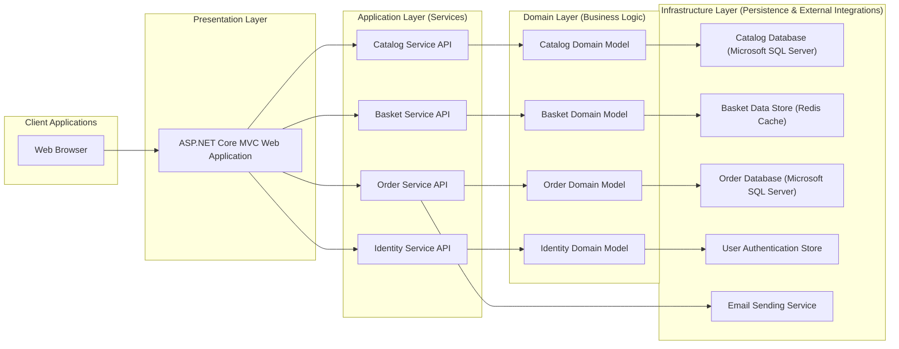

# Project Design Document: eShopOnWeb

**Version:** 1.1
**Date:** October 26, 2023
**Author:** AI Software Architect

## 1. Introduction

This document provides a detailed architectural design for the eShopOnWeb project, a sample .NET Core reference application illustrating a layered application architecture with domain-driven design (DDD) principles. This detailed design will serve as the foundation for subsequent threat modeling activities, enabling a thorough security assessment.

## 2. Project Overview

The eShopOnWeb project is a simplified yet representative online store application. Its primary goal is to demonstrate recommended practices for building modern .NET web applications. Key functionalities include:

*   Browsing and filtering a catalog of products.
*   Viewing detailed information for individual products.
*   Adding and managing products within a personal shopping basket.
*   Completing the checkout process to place orders.
*   User account management, including registration and login.

## 3. Architectural Overview

The application is structured using a layered architecture to promote separation of concerns, enhance maintainability, and facilitate independent development and deployment of components. The core layers and their interactions are visualized below:

## 4. Component Details

This section provides a detailed description of each architectural component, highlighting their responsibilities and potential security considerations:

*   **Web Browser:**
    *   Represents the user's interface to the application.
    *   Communicates with the ASP.NET Core MVC Web Application via standard HTTP requests and responses.
    *   Renders the user interface using HTML, CSS, and potentially JavaScript frameworks (e.g., Bootstrap, custom JavaScript).
    *   *Security Note:*  Vulnerable to client-side attacks like Cross-Site Scripting (XSS) if the application doesn't properly sanitize output.

*   **ASP.NET Core MVC Web Application:**
    *   Serves as the primary entry point for user interactions.
    *   Implements the presentation layer using the Model-View-Controller (MVC) pattern.
    *   Handles user requests, orchestrates interactions with backend services, and returns responses.
    *   May implement client-side logic and UI enhancements.
    *   *Security Note:*  Susceptible to common web application vulnerabilities like Cross-Site Request Forgery (CSRF), insecure redirects, and improper session management.

*   **Catalog Service API:**
    *   Provides an interface for managing and retrieving product catalog data.
    *   Exposes endpoints for browsing, searching, and retrieving product details.
    *   Implements business logic related to catalog management.
    *   Interacts with the Catalog Domain Model and the Catalog Database.
    *   *Security Note:*  Requires proper authorization to prevent unauthorized data access or modification. API endpoints should be secured against injection attacks.

*   **Basket Service API:**
    *   Manages individual user shopping baskets.
    *   Provides endpoints for adding, removing, and viewing items in a user's basket.
    *   Utilizes a distributed cache (Redis) for efficient storage and retrieval of basket data.
    *   Implements business logic related to basket management.
    *   Interacts with the Basket Domain Model.
    *   *Security Note:*  Needs to ensure data integrity and prevent unauthorized modification of user baskets. Securely handles user basket identification.

*   **Order Service API:**
    *   Handles the order placement and management process.
    *   Provides endpoints for creating, retrieving, and updating order information.
    *   Implements business logic related to order processing, including payment integration (potentially through external services).
    *   Interacts with the Order Domain Model and the Order Database.
    *   May interact with external services like the Email Sending Service.
    *   *Security Note:*  Critical component requiring robust security measures to protect sensitive order information and financial transactions. Requires secure handling of payment details and prevention of order manipulation.

*   **Identity Service API:**
    *   Manages user authentication and authorization.
    *   Provides endpoints for user registration, login, password management, and potentially social login integration.
    *   Implements authentication and authorization logic, potentially using standards like OAuth 2.0 or OpenID Connect.
    *   Interacts with the Identity Domain Model and the User Authentication Store.
    *   *Security Note:*  A prime target for attacks. Requires strong security measures to protect user credentials and prevent unauthorized access. Proper implementation of authentication and authorization flows is crucial.

*   **Catalog Domain Model:**
    *   Encapsulates the business logic and entities related to the product catalog.
    *   Defines the core concepts and rules for managing products (e.g., Product, Category, Brand).
    *   Independent of specific data access implementations.

*   **Basket Domain Model:**
    *   Encapsulates the business logic and entities related to the shopping basket.
    *   Defines the core concepts and rules for managing baskets (e.g., Basket, BasketItem).
    *   Independent of specific data access implementations.

*   **Order Domain Model:**
    *   Encapsulates the business logic and entities related to orders.
    *   Defines the core concepts and rules for order processing (e.g., Order, OrderItem, Payment).
    *   Independent of specific data access implementations.

*   **Identity Domain Model:**
    *   Encapsulates the business logic and entities related to user identity and authentication.
    *   Defines the core concepts and rules for user management (e.g., User, Role, Permission).
    *   Independent of specific data access implementations.

*   **Catalog Database (Microsoft SQL Server):**
    *   Provides persistent storage for product catalog data.
    *   Accessed by the Catalog Service API.
    *   *Security Note:* Requires secure configuration and access controls to prevent unauthorized access and data breaches.

*   **Basket Data Store (Redis Cache):**
    *   Provides a fast, in-memory data store for storing shopping basket data.
    *   Accessed by the Basket Service API.
    *   *Security Note:* While primarily used for caching, security considerations include protecting the data from unauthorized access, especially if sensitive information is temporarily stored.

*   **Order Database (Microsoft SQL Server):**
    *   Provides persistent storage for order data.
    *   Accessed by the Order Service API.
    *   *Security Note:*  Similar security concerns as the Catalog Database, with potentially more sensitive financial information.

*   **User Authentication Store:**
    *   Stores user credentials and identity information.
    *   Accessed by the Identity Service API.
    *   *Security Note:*  Requires the highest level of security to protect user credentials. Hashing and salting of passwords are essential.

*   **Email Sending Service:**
    *   Responsible for sending transactional emails (e.g., order confirmations, password resets).
    *   Utilized by the Order Service API and potentially the Identity Service API.
    *   *Security Note:*  Secure configuration is needed to prevent email spoofing and ensure reliable delivery.

## 5. Data Flow

Understanding the flow of data through the system is crucial for identifying potential vulnerabilities. Here are examples of typical data flows:

*   **Browsing Products:**
    1. The **Web Browser** sends an HTTP GET request to the **ASP.NET Core MVC Web Application** to retrieve the product catalog.
    2. The **ASP.NET Core MVC Web Application** calls the **Catalog Service API**.
    3. The **Catalog Service API** queries the **Catalog Database (Microsoft SQL Server)** via the **Catalog Domain Model**.
    4. The **Catalog Database (Microsoft SQL Server)** returns product data to the **Catalog Service API**.
    5. The **Catalog Service API** returns the product data to the **ASP.NET Core MVC Web Application**.
    6. The **ASP.NET Core MVC Web Application** renders the product catalog and sends the HTML response back to the **Web Browser**.

*   **Adding Item to Basket:**
    1. The **Web Browser** sends an HTTP POST request to the **ASP.NET Core MVC Web Application** to add a product to the basket.
    2. The **ASP.NET Core MVC Web Application** calls the **Basket Service API**.
    3. The **Basket Service API** interacts with the **Basket Data Store (Redis Cache)** via the **Basket Domain Model** to add the item.
    4. The **Basket Data Store (Redis Cache)** updates the basket data.
    5. The **Basket Service API** returns a success response to the **ASP.NET Core MVC Web Application**.
    6. The **ASP.NET Core MVC Web Application** updates the UI in the **Web Browser**.

*   **Placing an Order:**
    1. The **Web Browser** initiates the checkout process.
    2. The **ASP.NET Core MVC Web Application** retrieves basket details from the **Basket Service API**.
    3. The **ASP.NET Core MVC Web Application** gathers order details (shipping address, payment information).
    4. The **ASP.NET Core MVC Web Application** calls the **Order Service API** to create a new order.
    5. The **Order Service API** interacts with the **Order Domain Model** and the **Order Database (Microsoft SQL Server)** to persist the order.
    6. The **Order Service API** may interact with an external payment gateway (not explicitly shown) to process payment.
    7. The **Order Service API** interacts with the **Email Sending Service** to send an order confirmation email.

## 6. Deployment Model

The eShopOnWeb application is designed for containerized deployment, enabling scalability and portability. A typical deployment scenario involves:

*   Packaging each service (ASP.NET Core MVC Web Application, Catalog Service API, Basket Service API, Order Service API, Identity Service API) as individual Docker containers.
*   Orchestrating these containers using a platform like Kubernetes (e.g., Azure Kubernetes Service - AKS, Amazon Elastic Kubernetes Service - EKS).
*   Deploying the databases (Microsoft SQL Server) as managed services (e.g., Azure SQL Database, Amazon RDS) or within the Kubernetes cluster using stateful sets.
*   Deploying the Redis cache as a managed service (e.g., Azure Cache for Redis, Amazon ElastiCache) or within the Kubernetes cluster.
*   Utilizing a reverse proxy or API gateway (e.g., Nginx, Azure API Management, Amazon API Gateway) to manage external access, handle routing, and potentially enforce security policies.

## 7. Technology Stack

The following technologies form the foundation of the eShopOnWeb project:

*   **Core Programming Language:** C#
*   **Web Framework:** ASP.NET Core
*   **Domain-Driven Design Libraries/Frameworks:**  Potentially libraries like MediatR for command/query separation.
*   **Databases:** Microsoft SQL Server
*   **Caching:** Redis
*   **Containerization Technology:** Docker
*   **Container Orchestration:** Kubernetes (Likely)
*   **Authentication/Authorization:** ASP.NET Core Identity, potentially with support for OAuth 2.0/OpenID Connect using libraries like IdentityServer4 or Duende IdentityServer.
*   **API Communication:** RESTful APIs over HTTP
*   **Email Sending:** Potentially using libraries like MailKit or integration with cloud-based email services (e.g., SendGrid, Azure Communication Services).
*   **Logging:**  Libraries like Serilog or NLog.
*   **Testing Frameworks:** xUnit, Moq.

## 8. Security Considerations (Detailed)

This section expands on the initial security considerations, providing more specific points relevant for threat modeling:

*   **Authentication and Authorization:**
    *   Implementation of secure authentication mechanisms to verify user identity.
    *   Robust authorization policies to control access to specific resources and functionalities based on user roles and permissions.
    *   Protection against brute-force attacks on login endpoints.
    *   Secure storage of user credentials (password hashing and salting).
    *   Proper handling of session management and prevention of session hijacking.

*   **Input Validation and Output Encoding:**
    *   Strict validation of all user inputs on both the client-side and server-side to prevent injection attacks (SQL injection, XSS, command injection).
    *   Proper encoding of output data to prevent XSS vulnerabilities.

*   **Data Protection:**
    *   Encryption of sensitive data at rest (e.g., using Transparent Data Encryption for databases).
    *   Encryption of data in transit using HTTPS (TLS) for all communication.
    *   Secure handling of sensitive information in memory and logs.

*   **API Security:**
    *   Implementation of authentication and authorization for all API endpoints.
    *   Protection against common API vulnerabilities (e.g., broken authentication, excessive data exposure, lack of resources and rate limiting).
    *   Input validation and output encoding for API requests and responses.

*   **Dependency Management:**
    *   Regularly scanning and updating dependencies to patch known security vulnerabilities.
    *   Utilizing tools for dependency vulnerability analysis.

*   **Secrets Management:**
    *   Secure storage and management of sensitive credentials (database connection strings, API keys, etc.) using tools like Azure Key Vault or HashiCorp Vault.
    *   Avoiding hardcoding secrets in the application code.

*   **Rate Limiting and Throttling:**
    *   Implementation of rate limiting to prevent denial-of-service (DoS) attacks.
    *   Throttling requests to protect backend resources.

*   **Logging and Monitoring:**
    *   Comprehensive logging of security-related events (authentication attempts, authorization failures, suspicious activity).
    *   Real-time monitoring of application and infrastructure for security incidents.
    *   Alerting mechanisms for critical security events.

*   **Infrastructure Security:**
    *   Secure configuration of the underlying infrastructure (Kubernetes cluster, cloud resources).
    *   Network segmentation and firewall rules to restrict access.
    *   Regular security assessments and penetration testing.

## 9. Assumptions and Constraints

The following assumptions and constraints are relevant to this design:

*   The primary purpose of the eShopOnWeb project is educational and demonstrative, and it might require further hardening for production environments.
*   The deployment environment is assumed to be a cloud-based infrastructure, offering various managed services.
*   The anticipated data volume and user traffic are moderate, suitable for the chosen technologies. Specific performance and scalability requirements would necessitate further design considerations.
*   Integration with external payment gateways and shipping providers is assumed but not detailed within this document.

This detailed project design document provides a solid foundation for conducting a thorough threat modeling exercise for the eShopOnWeb application. The identified components, data flows, technologies, and security considerations will be instrumental in understanding potential attack vectors and designing effective security mitigations.