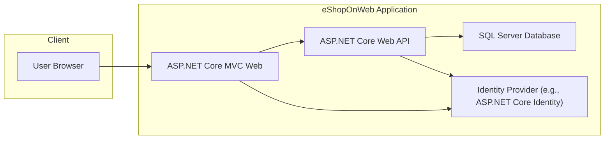
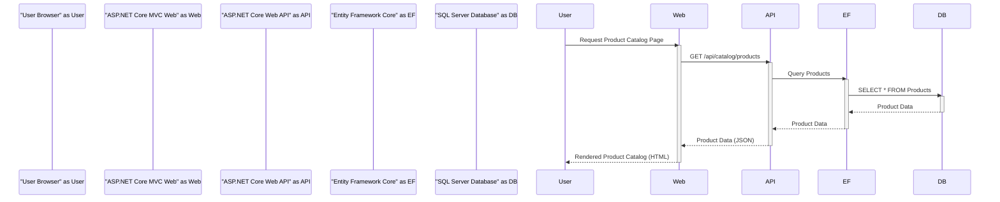
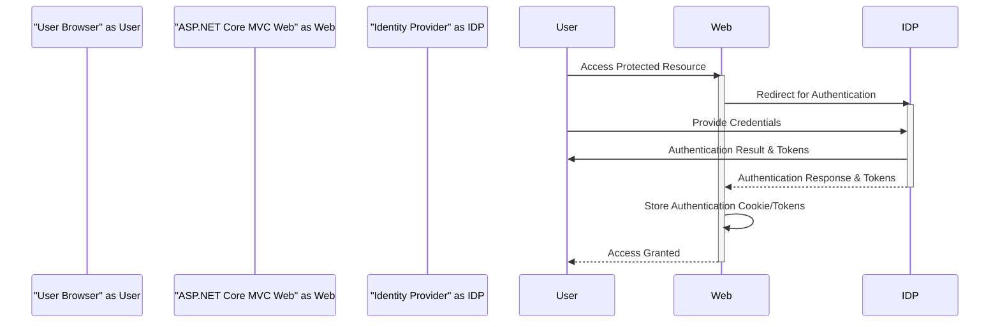
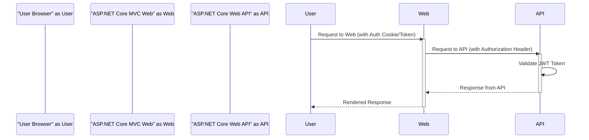

# Project Design Document: eShopOnWeb (Improved)

**Version:** 1.1
**Date:** October 26, 2023
**Author:** AI Software Architect

## 1. Introduction

This document provides an enhanced architectural design of the eShopOnWeb application, an open-source .NET reference application showcasing a simplified eCommerce platform. This design document is specifically created to facilitate subsequent threat modeling activities. It offers a more detailed view of the key components, their interactions, data flows, and security considerations, building upon the previous version.

## 2. Goals

The primary goals of this design document are:

*   Provide a more granular and detailed articulation of the eShopOnWeb application's architecture.
*   Clearly identify the technologies and frameworks used within each major component.
*   Elaborate on the interactions and data flow between components, including authentication and authorization processes.
*   Highlight specific security considerations and potential threat vectors relevant for each component and interaction.
*   Serve as a robust and comprehensive foundation for effective threat modeling sessions.

## 3. Scope

This document covers the core architectural components of the eShopOnWeb application with increased detail, including:

*   The web frontend (ASP.NET Core MVC).
*   The backend API (ASP.NET Core Web API).
*   The data access layer (Entity Framework Core).
*   The identity and authentication mechanisms (likely ASP.NET Core Identity or a similar framework).
*   Key external dependencies and integrations.
*   Specific data elements handled by each component.

This document still does not cover:

*   Highly granular UI/UX design specifics.
*   Detailed implementation specifics within individual classes or methods beyond their architectural role.
*   Precise infrastructure setup or deployment configurations, although a more detailed high-level deployment model is included.

## 4. High-Level Architecture

The eShopOnWeb application maintains a layered architecture. The main layers and their key components are:

*   **Presentation Layer:**
    *   **Component:** ASP.NET Core MVC Web
    *   **Responsibility:** User interface rendering, handling user input, and presenting information.
*   **Application Layer:**
    *   **Component:** ASP.NET Core Web API
    *   **Responsibility:** Business logic execution, orchestration of domain logic, and exposing API endpoints.
*   **Domain Layer:**
    *   **Description:** Contains core business entities and logic (not explicitly a separate deployable component but a logical grouping of code).
*   **Infrastructure Layer:**
    *   **Component:** Entity Framework Core (Data Access)
    *   **Component:** SQL Server Database (Data Persistence)
    *   **Component:** ASP.NET Core Identity (Authentication and Authorization - potentially)
    *   **Component:**  Potentially other services like caching or message queues (if implemented).

Here's an updated high-level diagram illustrating the main components and their relationships:

## 5. Component Details

This section provides a more detailed description of each major component, including technologies and security considerations:

*   **ASP.NET Core MVC Web (Web Frontend):**
    *   **Description:** Renders the user interface, handles user interactions, and communicates with the backend API.
    *   **Technology:**
        *   ASP.NET Core MVC
        *   C#
        *   HTML, CSS, JavaScript (potentially with frameworks like Bootstrap or similar)
        *   Razor view engine
    *   **Key Responsibilities:**
        *   Displaying product catalogs and details.
        *   Managing user authentication flows (redirects to Identity Provider).
        *   Handling shopping cart interactions.
        *   Initiating order placement.
        *   Presenting user account information.
    *   **Security Considerations:**
        *   **Threats:** Cross-Site Scripting (XSS), Cross-Site Request Forgery (CSRF), Clickjacking, Insecure redirects.
        *   **Mitigations:** Input encoding/output escaping, anti-forgery tokens, frame options, secure redirection practices.
        *   Securely manages user session cookies (HttpOnly, Secure flags).
        *   Relies on the backend API for authorization decisions.

*   **ASP.NET Core Web API (Backend API):**
    *   **Description:** Exposes RESTful APIs consumed by the web frontend and potentially other clients. Contains core business logic.
    *   **Technology:**
        *   ASP.NET Core Web API
        *   C#
        *   JSON for data serialization
        *   Potentially uses frameworks like MediatR for command/query separation.
    *   **Key Responsibilities:**
        *   Providing endpoints for retrieving product data (e.g., `/api/catalog/products`).
        *   Handling user authentication and authorization (verifying tokens issued by the Identity Provider).
        *   Processing order creation and management.
        *   Managing user account data (potentially).
        *   Interacting with the data access layer.
    *   **Security Considerations:**
        *   **Threats:** Injection attacks (SQL Injection, Command Injection), Broken Authentication/Authorization, Mass Assignment, Security Misconfiguration.
        *   **Mitigations:** Input validation, parameterized queries (via Entity Framework Core), JWT validation, authorization policies, secure API configuration.
        *   Requires secure handling of API keys or other authentication credentials if interacting with external services.
        *   Should implement proper error handling to avoid information leakage.

*   **SQL Server Database:**
    *   **Description:** Persistent data store for the application.
    *   **Technology:** Microsoft SQL Server.
    *   **Key Responsibilities:**
        *   Storing product information, user details, order history, etc.
        *   Ensuring data integrity and consistency through constraints and transactions.
    *   **Security Considerations:**
        *   **Threats:** SQL Injection, Data Breach, Privilege Escalation, Denial of Service.
        *   **Mitigations:** Secure database configuration, strong password policies, principle of least privilege for database users, regular security patching, data encryption at rest and in transit.
        *   Access should be strictly controlled and limited to authorized components.

*   **Identity Provider (e.g., ASP.NET Core Identity):**
    *   **Description:** Manages user identities, authentication, and authorization. Could be ASP.NET Core Identity or a separate Identity Server implementation.
    *   **Technology:**
        *   ASP.NET Core Identity (or a similar framework like IdentityServer4)
        *   Potentially uses Entity Framework Core for user data persistence.
    *   **Key Responsibilities:**
        *   Authenticating users based on credentials.
        *   Issuing security tokens (e.g., JWTs).
        *   Managing user accounts, roles, and permissions.
        *   Potentially handling password resets and multi-factor authentication.
    *   **Security Considerations:**
        *   **Threats:** Credential Stuffing, Brute-Force Attacks, Account Takeover, Insecure Token Management.
        *   **Mitigations:** Strong password policies, account lockout mechanisms, multi-factor authentication, secure storage of credentials (hashing and salting), secure token generation and storage practices.
        *   Requires protection against common web application vulnerabilities.

## 6. Data Flow (Detailed)

Let's examine a more detailed data flow for a user browsing products and then authenticating:

**Browsing Products:**

**User Authentication:**

**API Request with Authentication:**

## 7. Security Considerations (Expanded)

This section expands on the security considerations for each component and interaction:

*   **Authentication and Authorization:**
    *   **Focus:** Securely verifying user identities and enforcing access control.
    *   **Threats:** Brute-force attacks on login, credential stuffing, session hijacking, privilege escalation.
    *   **Mitigations:** Strong password policies, multi-factor authentication, secure session management (HTTP Only, Secure flags), role-based access control, OAuth 2.0 and OpenID Connect for delegated authorization.
*   **Data Protection:**
    *   **Focus:** Protecting sensitive data at rest and in transit.
    *   **Threats:** Data breaches, eavesdropping, man-in-the-middle attacks.
    *   **Mitigations:** HTTPS for all communication, encryption at rest for sensitive data in the database, secure handling of API keys and secrets (e.g., using Azure Key Vault or similar).
*   **Input Validation and Output Encoding:**
    *   **Focus:** Preventing injection attacks and cross-site scripting.
    *   **Threats:** SQL Injection, Cross-Site Scripting (XSS), Command Injection.
    *   **Mitigations:** Server-side input validation, parameterized queries (Entity Framework Core), output encoding/escaping in the presentation layer.
*   **API Security:**
    *   **Focus:** Securing API endpoints against unauthorized access and misuse.
    *   **Threats:** Broken authentication/authorization, mass assignment vulnerabilities, lack of resource and rate limiting.
    *   **Mitigations:** JWT authentication, authorization policies, input validation, rate limiting, API gateway for centralized security controls.
*   **Dependency Management:**
    *   **Focus:** Ensuring third-party libraries and frameworks are secure.
    *   **Threats:** Exploiting known vulnerabilities in dependencies.
    *   **Mitigations:** Regularly updating dependencies, using vulnerability scanning tools.
*   **Error Handling and Logging:**
    *   **Focus:** Preventing information leakage and enabling security monitoring.
    *   **Threats:** Information disclosure through error messages, lack of audit trails.
    *   **Mitigations:** Generic error messages for users, detailed logging of errors and security events, secure storage and access control for logs.

## 8. Deployment Model (More Detail)

The eShopOnWeb application can be deployed in various environments. Common deployment models include:

*   **Cloud-Based Deployment (e.g., Azure):**
    *   **Web Frontend & API:** Deployed as Azure App Services.
    *   **Database:** Deployed as Azure SQL Database.
    *   **Identity Provider:** Could be Azure Active Directory or a custom Identity Server deployed as an App Service.
    *   **Security Considerations:** Leverage Azure's security features like Azure Firewall, Network Security Groups, Azure Active Directory for identity management, and Azure Key Vault for secret management.
*   **Containerized Deployment (e.g., Docker, Kubernetes):**
    *   **Components:** Each component (Web Frontend, API, Identity Provider) can be containerized.
    *   **Orchestration:** Kubernetes can be used to manage and scale the containers.
    *   **Database:** Can be deployed as a containerized service or as a managed service.
    *   **Security Considerations:** Secure container images, network policies within the Kubernetes cluster, secure secret management within the cluster.
*   **On-Premises Deployment:**
    *   **Components:** Deployed on physical or virtual servers.
    *   **Database:** Deployed on a local SQL Server instance.
    *   **Security Considerations:** Requires careful configuration of firewalls, network segmentation, and server hardening.

Regardless of the deployment model, the following security best practices should be followed:

*   Secure network configuration.
*   Regular security patching of operating systems and infrastructure components.
*   Strong access controls and monitoring.

## 9. Assumptions and Constraints

The following assumptions and constraints remain relevant for this design:

*   The application is primarily accessed through standard web browsers.
*   The backend API adheres to RESTful principles for communication.
*   A relational database (SQL Server) is used for persistent data storage.
*   Standard web security best practices are intended to be implemented throughout the application.
*   A dedicated identity provider is used for managing authentication and authorization.

This improved design document provides a more detailed and comprehensive understanding of the eShopOnWeb application's architecture, specifically tailored for threat modeling activities. The added details about technologies, data flows, and expanded security considerations will enable more effective identification and mitigation of potential security risks.