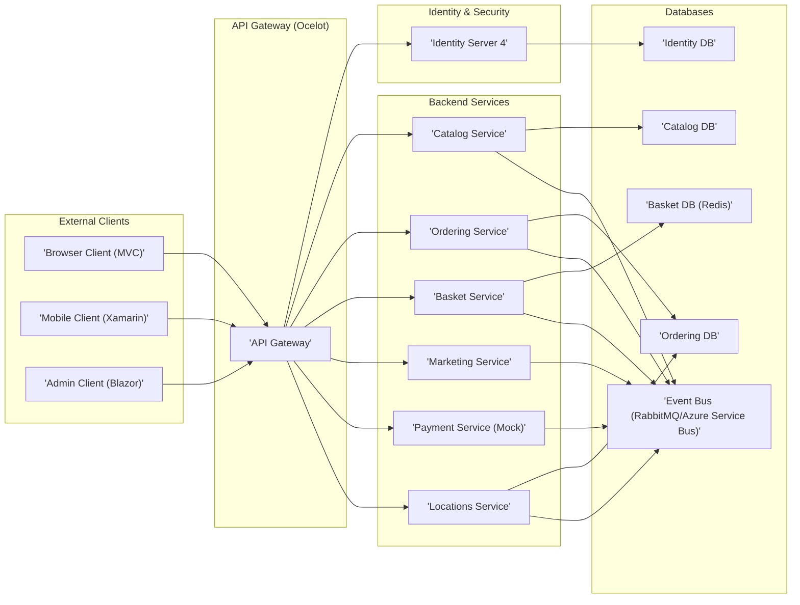
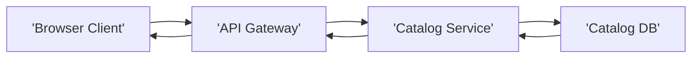
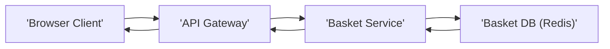
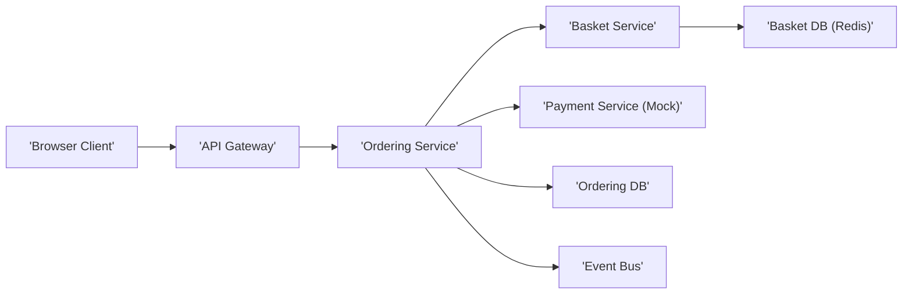
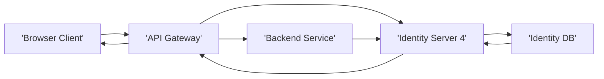
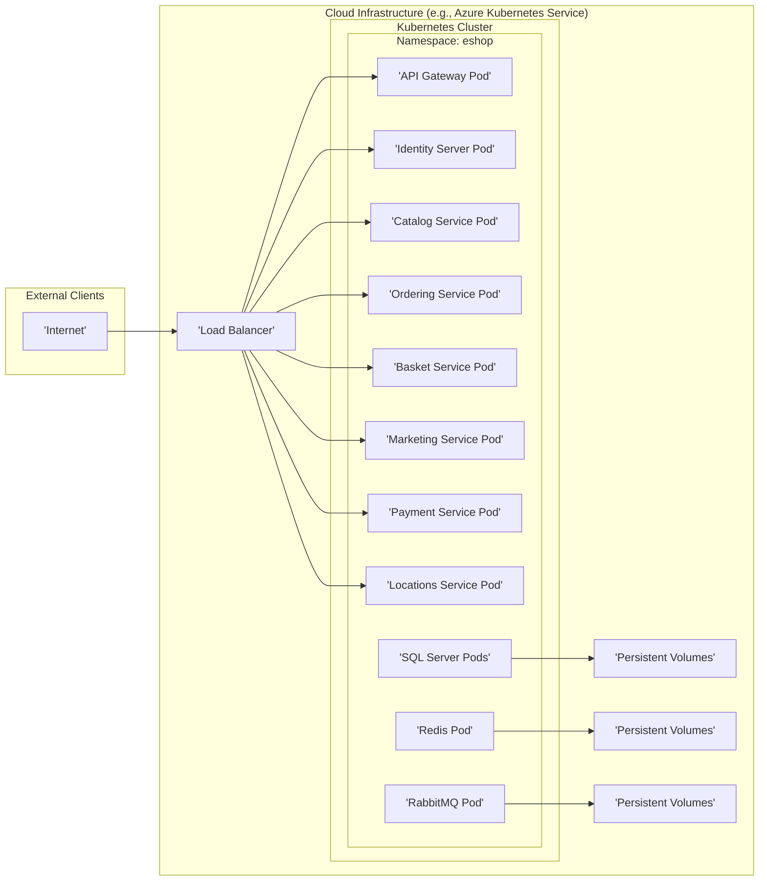

# Project Design Document: eShopOnContainers for Threat Modeling

**Project Name:** eShopOnContainers

**Project Repository:** [https://github.com/dotnet/eshop](https://github.com/dotnet/eshop)

**Document Version:** 1.1
**Date:** 2023-10-27
**Author:** AI Software Architect

## 1. Project Overview

eShopOnContainers is a reference application architecture showcasing a modern, enterprise-grade .NET microservices application deployed to Docker and Kubernetes. It simulates an online e-commerce store and demonstrates best practices for building cloud-native applications using .NET, Docker, and Kubernetes.

**Purpose of this Document:**

This document provides a high-level and detailed design overview of the eShopOnContainers application architecture. It is specifically created to serve as a foundation for subsequent threat modeling activities. The document outlines the system components, their interactions, data flows, and technologies used, highlighting areas relevant to security considerations. This will enable security experts to effectively identify potential threats and vulnerabilities within the eShopOnContainers application.

## 2. Architecture Overview

eShopOnContainers is designed as a microservices architecture. It is composed of several independent, loosely coupled services that communicate with each other to provide the overall e-commerce functionality. The application is containerized using Docker and orchestrated using Kubernetes.

**High-Level Architecture Diagram:**

**Key Components:**

*   **External Clients:**
    *   **Browser Client (MVC):**  A traditional web application built with ASP.NET MVC for customer interaction.
    *   **Mobile Client (Xamarin):** A mobile application (Xamarin Forms) for accessing the e-commerce platform.
    *   **Admin Client (Blazor):** A Blazor WebAssembly application for administrative tasks.
*   **API Gateway (Ocelot):**  Acts as a single entry point for all client requests, routing them to the appropriate backend services. It also handles cross-cutting concerns like authentication, authorization, and rate limiting.
*   **Identity Server 4:**  Provides authentication and authorization services using OpenID Connect and OAuth 2.0 protocols. It manages user identities, issues access tokens, and protects backend APIs.
*   **Backend Services (Microservices):**
    *   **Catalog Service:** Manages product catalog information (products, categories, brands).
    *   **Ordering Service:** Handles order placement, processing, and management.
    *   **Basket Service:** Manages user shopping baskets, typically using Redis for fast access.
    *   **Marketing Service:**  Provides marketing and promotional features (e.g., campaigns, discounts).
    *   **Payment Service (Mock):**  A simulated payment gateway for demonstration purposes. In a real-world scenario, this would integrate with a real payment provider.
    *   **Locations Service:** Manages location-based data, potentially for store locations or delivery zones.
*   **Databases:**
    *   **Catalog DB:**  Database for the Catalog Service (SQL Server).
    *   **Ordering DB:** Database for the Ordering Service (SQL Server).
    *   **Basket DB (Redis):**  In-memory data store for the Basket Service (Redis).
    *   **Identity DB:** Database for Identity Server 4 (SQL Server).
    *   **Event Bus (RabbitMQ/Azure Service Bus):**  Message broker for asynchronous communication between services (RabbitMQ or Azure Service Bus can be used).

## 3. Component Details

This section provides a more detailed description of each key component, focusing on their functionality, technology stack, and security considerations.

### 3.1. External Clients (Browser, Mobile, Admin)

*   **Functionality:**  Provide user interfaces for customers and administrators to interact with the e-commerce platform.
    *   **Browser Client:** Browsing products, adding to basket, placing orders, managing profile.
    *   **Mobile Client:** Similar functionality to the Browser Client, optimized for mobile devices.
    *   **Admin Client:** Managing catalog, orders, marketing campaigns, and other administrative tasks.
*   **Technology Stack:**
    *   **Browser Client:** ASP.NET MVC, HTML, CSS, JavaScript.
    *   **Mobile Client:** Xamarin Forms (.NET MAUI in newer versions), C#.
    *   **Admin Client:** Blazor WebAssembly, C#.
*   **Security Considerations:**
    *   **Client-Side Vulnerabilities:**
        *   **Cross-Site Scripting (XSS):** Potential for injecting malicious scripts into the client-side application.
        *   **Cross-Site Request Forgery (CSRF):** Risk of unauthorized actions performed on behalf of an authenticated user.
        *   **Insecure Client-Side Storage:**  Improper storage of sensitive data (tokens, API keys) in browser local storage or mobile app storage.
        *   **JavaScript Vulnerabilities:**  Vulnerabilities in client-side JavaScript code or libraries.
    *   **Authentication and Authorization:**
        *   **Insecure Authentication Flow:** Weaknesses in the authentication process, potentially leading to unauthorized access.
        *   **Insufficient Authorization:**  Lack of proper authorization checks, allowing users to access resources or perform actions they are not permitted to.
    *   **Input Validation:**
        *   **Client-Side Input Validation Bypass:**  Client-side validation can be bypassed; server-side validation is crucial.
    *   **Secure Communication (HTTPS):**
        *   **Lack of HTTPS:**  Communication over HTTP exposes data in transit to interception.

### 3.2. API Gateway (Ocelot)

*   **Functionality:**  Acts as a reverse proxy and API gateway.
    *   **Request Routing:** Routes incoming requests to the appropriate backend services based on configured routes.
    *   **Authentication and Authorization:**  Integrates with Identity Server to authenticate and authorize requests before forwarding them to backend services.
    *   **Cross-Cutting Concerns:** Handles cross-cutting concerns like rate limiting, request aggregation, and potentially caching.
    *   **Service Discovery:**  May integrate with service discovery mechanisms (e.g., Kubernetes DNS) to dynamically locate backend services.
*   **Technology Stack:**  Ocelot (.NET API Gateway).
*   **Security Considerations:**
    *   **Gateway Security:**
        *   **DDoS Attacks:**  API Gateway as a single entry point is a target for Distributed Denial of Service attacks.
        *   **API Abuse:**  Vulnerability to API abuse if rate limiting and throttling are not properly configured.
        *   **Unauthorized Access to Gateway Configuration:**  Compromise of gateway configuration could lead to routing manipulation and security breaches.
    *   **Authentication and Authorization Enforcement:**
        *   **Bypass of Authentication/Authorization:**  Misconfiguration or vulnerabilities in Ocelot could lead to bypassing authentication and authorization checks.
        *   **Incorrect Route Configuration:**  Improper routing rules could expose backend services directly or grant unintended access.
    *   **Input Validation:**
        *   **Insufficient Gateway Input Validation:**  Failure to validate inputs at the gateway level can allow malicious requests to reach backend services.
    *   **Rate Limiting and Throttling:**
        *   **Ineffective Rate Limiting:**  Poorly configured rate limiting may not prevent abuse.
    *   **Secure Configuration:**
        *   **Insecure Storage of Gateway Configuration:**  Exposure of configuration files containing sensitive information.

### 3.3. Identity Server 4

*   **Functionality:**  Provides centralized identity and access management.
    *   **Authentication:**  Authenticates users using various methods (username/password, social logins, etc.).
    *   **Authorization:**  Issues access tokens (JWTs) based on user roles and permissions.
    *   **Token Management:**  Manages access tokens, refresh tokens, and token revocation.
    *   **User Management:**  Provides user registration, login, password management, and profile management features.
    *   **Protocol Support:** Implements OpenID Connect and OAuth 2.0 protocols.
*   **Technology Stack:**  IdentityServer4 (.NET).
*   **Security Considerations:**
    *   **Identity Server Security:**
        *   **Compromise of Identity Server:**  A compromised Identity Server can grant attackers access to the entire system.
        *   **Vulnerabilities in IdentityServer4:**  Unpatched vulnerabilities in IdentityServer4 software.
    *   **Secure Credential Storage:**
        *   **Weak Password Hashing:**  Use of weak hashing algorithms for storing user passwords.
        *   **Lack of Salting:**  Failure to use salt when hashing passwords.
    *   **Token Security:**
        *   **JWT Signing Key Exposure:**  Exposure or compromise of the private key used to sign JWTs.
        *   **Weak JWT Signing Algorithm:**  Use of weak or insecure JWT signing algorithms.
        *   **Token Leakage:**  Exposure of access or refresh tokens through insecure channels or logging.
    *   **Vulnerability Management:**
        *   **Outdated Identity Server Version:**  Running an outdated version of IdentityServer4 with known vulnerabilities.
    *   **Account Security:**
        *   **Brute-Force Attacks:**  Vulnerability to brute-force attacks on login endpoints.
        *   **Credential Stuffing:**  Attacks using compromised credentials from other services.
        *   **Account Takeover:**  Methods to take over user accounts.
        *   **Lack of Multi-Factor Authentication (MFA):**  Absence of MFA weakens account security.
        *   **Weak Password Policies:**  Permissive password policies leading to easily guessable passwords.
    *   **Protocol Implementation Vulnerabilities:**
        *   **Misconfiguration of OpenID Connect/OAuth 2.0 Flows:**  Incorrect implementation of authentication protocols leading to security flaws.

### 3.4. Backend Services (Catalog, Ordering, Basket, Marketing, Payment, Locations)

*   **Functionality:**  Each service provides specific business capabilities related to e-commerce.
    *   **Catalog Service:** Manages product information, categories, brands, and product images.
    *   **Ordering Service:** Handles order creation, order status updates, payment processing integration (via Payment Service), and order history.
    *   **Basket Service:** Manages user shopping baskets, including adding/removing items, calculating totals, and persisting basket data.
    *   **Marketing Service:** Manages marketing campaigns, promotions, discounts, and potentially personalized recommendations.
    *   **Payment Service (Mock):**  Simulates payment processing. In a real system, it would integrate with a payment gateway.
    *   **Locations Service:** Manages location data, potentially for store locations, delivery zones, or geocoding.
*   **Technology Stack:**  ASP.NET Core Web API, .NET, Entity Framework Core (for most services), Redis (for Basket Service).
*   **Security Considerations:**
    *   **API Security:**
        *   **Broken Authentication:**  Weak or missing authentication mechanisms for backend APIs.
        *   **Broken Authorization:**  Insufficient or flawed authorization logic allowing unauthorized access to API endpoints.
        *   **Injection Flaws:**  Vulnerabilities to SQL injection, NoSQL injection, command injection, and other injection attacks.
        *   **Improper Data Exposure:**  Exposing sensitive data in API responses without proper filtering or masking.
        *   **Lack of Resources & Rate Limiting:**  Absence of rate limiting and resource controls leading to potential DoS or resource exhaustion.
        *   **Security Misconfiguration:**  Misconfigured API servers, frameworks, or dependencies.
        *   **Insufficient Logging & Monitoring:**  Lack of adequate logging and monitoring to detect and respond to security incidents.
    *   **Input Validation:**
        *   **Server-Side Input Validation Failures:**  Insufficient validation of inputs received by backend services.
    *   **Authorization Enforcement:**
        *   **Bypass of Authorization Checks:**  Vulnerabilities allowing bypass of authorization checks within services.
    *   **Data Protection:**
        *   **Insecure Data Storage:**  Storing sensitive data in databases without encryption.
        *   **Data Breach:**  Potential for data breaches due to vulnerabilities or misconfigurations.
    *   **Service-to-Service Communication Security:**
        *   **Unencrypted Service Communication:**  Communication between services over unencrypted channels.
        *   **Lack of Mutual Authentication:**  Services not mutually authenticating each other.
    *   **Dependency Management:**
        *   **Vulnerable Dependencies:**  Use of vulnerable third-party libraries and components.
    *   **Error Handling and Logging:**
        *   **Verbose Error Messages:**  Exposing sensitive information in error messages.
        *   **Insecure Logging Practices:**  Logging sensitive data or insufficient logging.
    *   **Business Logic Security:**
        *   **Business Logic Flaws:**  Vulnerabilities in the application's business logic that can be exploited for malicious purposes (e.g., price manipulation, unauthorized discounts).

### 3.5. Databases (Catalog DB, Ordering DB, Basket DB, Identity DB)

*   **Functionality:**  Persistent storage for each service's data.
    *   **Catalog DB, Ordering DB, Identity DB:** Relational databases (SQL Server) for structured data.
    *   **Basket DB (Redis):**  In-memory data store (Redis) for fast access to basket data.
*   **Technology Stack:**  SQL Server, Redis.
*   **Security Considerations:**
    *   **Database Security:**
        *   **Unauthorized Database Access:**  Gaining unauthorized access to database servers or instances.
        *   **Default Credentials:**  Use of default or weak database credentials.
        *   **Unpatched Database Servers:**  Running outdated database servers with known vulnerabilities.
    *   **Access Control:**
        *   **Excessive Database Privileges:**  Granting overly broad privileges to database users or services.
        *   **Lack of Access Control Lists (ACLs):**  Insufficiently restrictive access controls to database resources.
    *   **Data Encryption:**
        *   **Lack of Encryption at Rest:**  Sensitive data stored in databases without encryption.
        *   **Lack of Encryption in Transit:**  Database connections not encrypted using TLS/SSL.
    *   **Input Validation (Database Level):**
        *   **SQL Injection Vulnerabilities:**  Vulnerabilities allowing SQL injection attacks due to lack of parameterized queries or stored procedures.
    *   **Database Auditing and Monitoring:**
        *   **Insufficient Database Auditing:**  Lack of auditing to track database access and modifications.
        *   **Lack of Monitoring:**  Failure to monitor database activity for suspicious behavior.
    *   **Backup and Recovery:**
        *   **Insecure Backups:**  Storing database backups in insecure locations.
        *   **Lack of Backup Integrity Checks:**  Absence of checks to ensure backup integrity.

### 3.6. Event Bus (RabbitMQ/Azure Service Bus)

*   **Functionality:**  Enables asynchronous communication between microservices using a publish-subscribe pattern.
    *   **Event Publishing:** Services publish events when significant actions occur (e.g., order placed, product updated).
    *   **Event Subscription:** Services subscribe to events they are interested in and react accordingly.
    *   **Decoupling:** Decouples services, improving resilience and scalability.
*   **Technology Stack:**  RabbitMQ or Azure Service Bus.
*   **Security Considerations:**
    *   **Message Bus Security:**
        *   **Unauthorized Access to Message Bus:**  Gaining unauthorized access to the message bus infrastructure.
        *   **Default Credentials:**  Use of default credentials for message bus.
        *   **Unpatched Message Bus Servers:**  Running outdated message bus servers with known vulnerabilities.
    *   **Message Encryption:**
        *   **Lack of Message Encryption:**  Sensitive data transmitted over the event bus without encryption.
    *   **Access Control:**
        *   **Unrestricted Message Publishing/Subscription:**  Lack of access controls on message queues and topics.
    *   **Message Integrity:**
        *   **Message Tampering:**  Potential for message tampering during transit if integrity checks are not in place.
    *   **Denial of Service (DoS):**
        *   **Message Bus DoS:**  Attacks targeting the message bus to disrupt communication.
    *   **Configuration Security:**
        *   **Insecure Storage of Message Bus Configuration:**  Exposure of configuration files containing message bus credentials.

## 4. Data Flow Diagrams

This section illustrates key data flows within the eShopOnContainers application.

### 4.1. User Browsing Catalog

**Data Flow:**

1.  **Browser Client** sends a request to the **API Gateway** to retrieve product catalog information.
2.  **API Gateway** routes the request to the **Catalog Service**.
3.  **Catalog Service** queries the **Catalog DB** to fetch product data.
4.  **Catalog DB** returns product data to the **Catalog Service**.
5.  **Catalog Service** processes the data and returns it to the **API Gateway**.
6.  **API Gateway** forwards the response to the **Browser Client**.

### 4.2. Adding Item to Basket

**Data Flow:**

1.  **Browser Client** sends a request to the **API Gateway** to add an item to the shopping basket.
2.  **API Gateway** routes the request to the **Basket Service**.
3.  **Basket Service** interacts with the **Basket DB (Redis)** to update the user's basket.
4.  **Basket DB (Redis)** updates the basket data and returns confirmation to the **Basket Service**.
5.  **Basket Service** processes the response and returns it to the **API Gateway**.
6.  **API Gateway** forwards the response to the **Browser Client**.

### 4.3. Placing an Order

**Data Flow:**

1.  **Browser Client** sends a request to the **API Gateway** to place an order.
2.  **API Gateway** routes the request to the **Ordering Service**.
3.  **Ordering Service** retrieves the basket from the **Basket Service** and **Basket DB (Redis)**.
4.  **Ordering Service** interacts with the **Payment Service (Mock)** to process payment (in a real system, this would be a real payment gateway).
5.  **Ordering Service** saves the order details to the **Ordering DB**.
6.  **Ordering Service** publishes an "Order Placed" event to the **Event Bus**.
7.  **Ordering Service** returns order confirmation to the **API Gateway**.
8.  **API Gateway** forwards the response to the **Browser Client**.

### 4.4. Authentication Flow

**Data Flow:**

1.  **Browser Client** attempts to access a protected resource via the **API Gateway**.
2.  **API Gateway** redirects the client to **Identity Server 4** for authentication if no valid token is present.
3.  **Identity Server 4** authenticates the user (e.g., username/password against **Identity DB**).
4.  **Identity Server 4** issues an access token (JWT) to the **API Gateway** (and potentially the client).
5.  **API Gateway** now includes the access token in subsequent requests to **Backend Services**.
6.  **Backend Services** validate the access token with **Identity Server 4** (or by verifying the JWT signature) to authorize the request.

## 5. Technology Stack

*   **Programming Languages:** C# (.NET)
*   **Web Framework:** ASP.NET Core (MVC, Web API, Blazor)
*   **API Gateway:** Ocelot
*   **Identity Server:** IdentityServer4
*   **Databases:** SQL Server, Redis
*   **Message Broker:** RabbitMQ or Azure Service Bus
*   **Containerization:** Docker
*   **Orchestration:** Kubernetes
*   **Client Frameworks:** JavaScript, Xamarin Forms (.NET MAUI), Blazor WebAssembly
*   **Operating System (Containers):** Linux (typically Alpine or similar lightweight distributions)
*   **Cloud Platform (Deployment):** Designed to be cloud-agnostic, but commonly deployed on Azure, AWS, or GCP.

## 6. Security Considerations for Threat Modeling

This section provides a categorized and more detailed overview of security considerations to guide threat modeling activities.

### 6.1. Authentication and Authorization

*   **Threats:**
    *   **Broken Authentication:**  Exploiting vulnerabilities in authentication mechanisms to gain unauthorized access (e.g., credential stuffing, brute-force attacks, session hijacking).
    *   **Broken Authorization:**  Bypassing authorization checks to access resources or perform actions beyond permitted privileges (e.g., privilege escalation, insecure direct object references).
    *   **Insecure Token Management:**  Compromising access tokens or refresh tokens due to insecure storage, transmission, or generation.
    *   **Lack of Multi-Factor Authentication (MFA):**  Absence of MFA making accounts more vulnerable to compromise.
*   **Areas to Investigate:**
    *   Strength of password policies and hashing algorithms used by Identity Server.
    *   Implementation of MFA and its enforcement.
    *   Vulnerabilities in Identity Server configuration and code.
    *   Authorization logic within API Gateway and backend services.
    *   Token storage and handling in clients and services.
    *   Session management and timeout policies.

### 6.2. Input Validation

*   **Threats:**
    *   **Injection Attacks:**  Exploiting insufficient input validation to inject malicious code or commands (e.g., SQL injection, XSS, command injection, LDAP injection).
    *   **Data Integrity Issues:**  Corrupting data due to improperly validated inputs.
    *   **Denial of Service (DoS):**  Causing service disruptions by sending malformed or excessively large inputs.
*   **Areas to Investigate:**
    *   Input validation routines in all clients, API Gateway, and backend services.
    *   Effectiveness of validation against various injection attack vectors.
    *   Handling of invalid or unexpected input data.
    *   Data sanitization and output encoding to prevent XSS.

### 6.3. Data Protection

*   **Threats:**
    *   **Data Breach:**  Unauthorized access and exfiltration of sensitive data from databases, storage systems, or during transmission.
    *   **Data Tampering:**  Unauthorized modification or corruption of data.
    *   **Data Loss:**  Loss of data due to security incidents, failures, or lack of backups.
*   **Areas to Investigate:**
    *   Encryption of sensitive data at rest in databases and storage.
    *   Encryption of data in transit over all communication channels (HTTPS, TLS/SSL for database connections, service-to-service communication).
    *   Data masking and anonymization techniques.
    *   Data backup and recovery procedures.
    *   Access control to sensitive data and storage locations.

### 6.4. API Security

*   **Threats:**
    *   **API Abuse:**  Excessive or malicious use of APIs leading to service disruption or resource exhaustion.
    *   **Unauthorized API Access:**  Gaining access to APIs without proper authentication or authorization.
    *   **API Parameter Tampering:**  Manipulating API parameters to bypass security controls or gain unauthorized functionality.
    *   **API Information Disclosure:**  Exposing sensitive information through API responses or documentation.
*   **Areas to Investigate:**
    *   API Gateway security configuration and routing rules.
    *   Rate limiting and throttling mechanisms for APIs.
    *   API authentication and authorization mechanisms.
    *   API input validation and output encoding.
    *   API documentation and exposure of sensitive endpoints.

### 6.5. Infrastructure Security

*   **Threats:**
    *   **Infrastructure Compromise:**  Gaining unauthorized access to the underlying infrastructure (Kubernetes cluster, cloud platform, servers).
    *   **Container Vulnerabilities:**  Exploiting vulnerabilities in Docker containers or container images.
    *   **Network Security Breaches:**  Exploiting network misconfigurations or vulnerabilities to gain access to internal systems.
    *   **Secrets Management Failures:**  Exposure or compromise of secrets (database credentials, API keys, certificates).
*   **Areas to Investigate:**
    *   Kubernetes cluster security configuration and hardening.
    *   Docker image security scanning and vulnerability management.
    *   Network segmentation and firewall rules.
    *   Secrets management practices and tools used.
    *   Operating system and server security patching.

### 6.6. Service-to-Service Security

*   **Threats:**
    *   **Man-in-the-Middle (MITM) Attacks:**  Interception of communication between microservices.
    *   **Unauthorized Service Access:**  Services communicating with each other without proper authentication or authorization.
    *   **Service Impersonation:**  One service impersonating another to gain unauthorized access.
*   **Areas to Investigate:**
    *   Security mechanisms for inter-service communication (e.g., mTLS, service mesh).
    *   Authentication and authorization between services.
    *   Network policies controlling service-to-service traffic.

### 6.7. Logging and Monitoring

*   **Threats:**
    *   **Insufficient Security Logging:**  Lack of adequate logging to detect and investigate security incidents.
    *   **Insecure Logging Practices:**  Logging sensitive data or storing logs insecurely.
    *   **Lack of Security Monitoring:**  Failure to monitor logs and system activity for suspicious behavior.
    *   **Delayed Incident Response:**  Slow or ineffective incident response due to lack of visibility.
*   **Areas to Investigate:**
    *   Scope and detail of security logging across all components.
    *   Secure storage and access control for logs.
    *   Real-time security monitoring and alerting capabilities.
    *   Incident response procedures and tools.

### 6.8. Dependency Management

*   **Threats:**
    *   **Vulnerable Dependencies:**  Use of third-party libraries or components with known security vulnerabilities.
    *   **Supply Chain Attacks:**  Compromise of dependencies through malicious updates or compromised repositories.
*   **Areas to Investigate:**
    *   Dependency scanning and vulnerability management processes.
    *   Software composition analysis (SCA) tools used.
    *   Dependency update and patching procedures.
    *   Verification of dependency sources and integrity.

### 6.9. Business Logic Security

*   **Threats:**
    *   **Business Logic Flaws:**  Exploiting vulnerabilities in the application's business logic to gain unauthorized benefits or cause harm (e.g., price manipulation, unauthorized discounts, inventory manipulation).
    *   **Fraud and Abuse:**  Exploiting business logic weaknesses for fraudulent activities or abuse of the system.
*   **Areas to Investigate:**
    *   Review of business logic for potential vulnerabilities and edge cases.
    *   Security testing of business workflows and processes.
    *   Implementation of fraud detection and prevention mechanisms.
    *   Data integrity checks and validation of business transactions.

## 7. Deployment Architecture (Conceptual)

eShopOnContainers is designed for containerized deployment, typically on Kubernetes.

**Conceptual Deployment Diagram:**

**Deployment Notes:**

*   Each microservice is deployed as a set of pods within a Kubernetes cluster.
*   Databases (SQL Server, Redis) and message broker (RabbitMQ) are also typically deployed within the cluster or as managed cloud services.
*   A Load Balancer is used to expose the API Gateway and potentially Identity Server to the internet.
*   Persistent Volumes are used for database storage to ensure data persistence across pod restarts.
*   Kubernetes Namespaces are used for logical isolation of the eShopOnContainers application.

This document provides a comprehensive design overview of eShopOnContainers for threat modeling purposes. It should be used as a starting point for deeper security analysis and identification of potential vulnerabilities. Further threat modeling activities should involve detailed analysis of each component, data flow, and technology stack to create a robust security posture for the application. The expanded security considerations section in particular provides a more structured and actionable framework for identifying and mitigating potential threats.