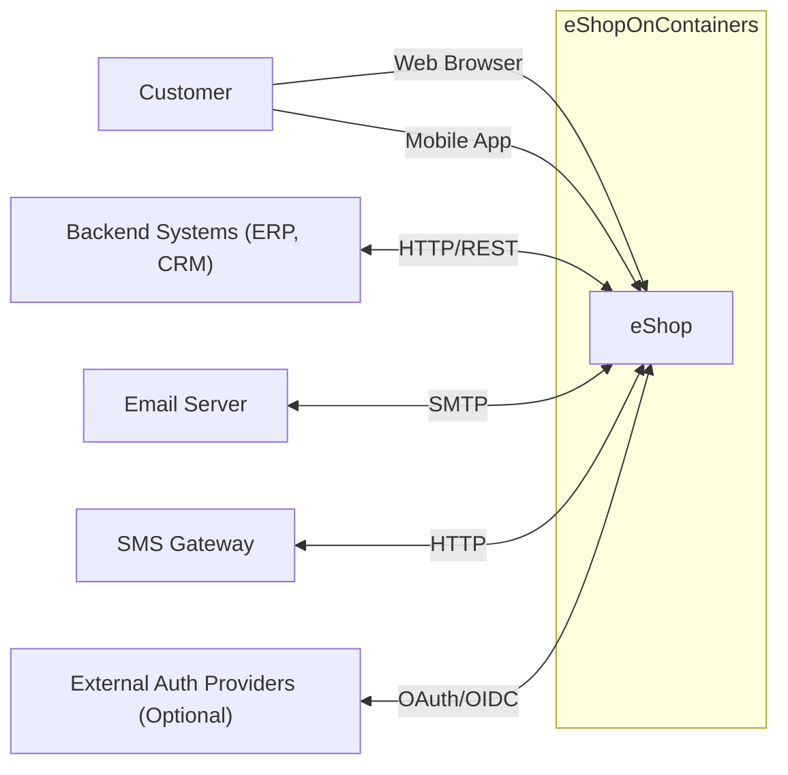
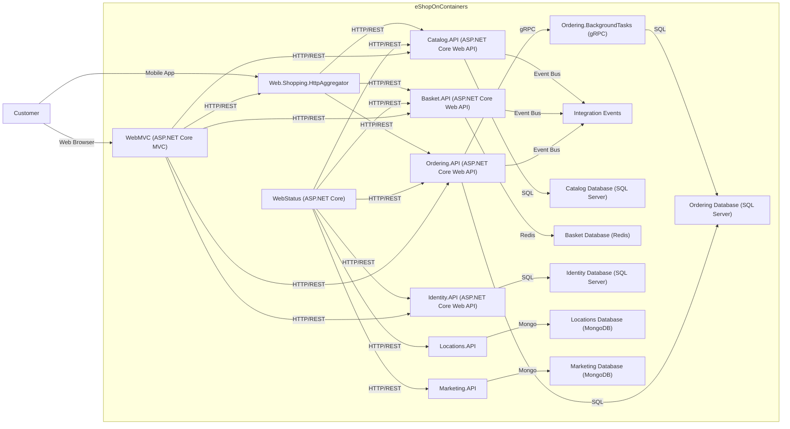
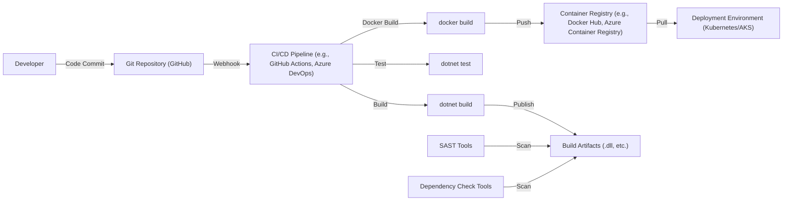

Okay, let's create a design document for the eShopOnContainers project from the provided GitHub repository.

# BUSINESS POSTURE

Business Priorities and Goals:

*   Demonstrate a microservices architecture pattern using .NET technologies.
*   Provide a reference implementation for building cloud-native applications.
*   Showcase best practices for developing, deploying, and managing microservices.
*   Enable developers to learn and experiment with various technologies and patterns.
*   Provide a functional, albeit simplified, e-commerce platform.

Most Important Business Risks:

*   Data breaches: Exposure of sensitive customer data (PII, payment information) due to vulnerabilities in the application or infrastructure.
*   Service unavailability: Downtime of critical services (ordering, catalog, identity) leading to lost sales and customer dissatisfaction.
*   Scalability issues: Inability to handle increased traffic during peak periods, resulting in performance degradation and lost revenue.
*   Supply chain attacks: Compromise of the application through vulnerabilities in third-party dependencies or build processes.
*   Lack of resilience: Failure of individual services impacting the overall system functionality.
*   Insecure deployments: Misconfigurations in the deployment environment leading to vulnerabilities.

# SECURITY POSTURE

Existing Security Controls:

*   security control: Authentication: Implemented using IdentityServer (now Duende IdentityServer), supporting OpenID Connect and OAuth 2.0. Described in the Identity.API project and related documentation.
*   security control: Authorization: Role-based access control (RBAC) is used to restrict access to certain functionalities based on user roles. Implemented within individual microservices and the Identity.API.
*   security control: HTTPS: Communication between services and clients is secured using HTTPS. Enforced through configuration and deployment settings.
*   security control: Input validation: Implemented in various microservices to prevent common vulnerabilities like SQL injection and cross-site scripting (XSS). Present in API controllers and data access layers.
*   security control: API Gateways: Use of API gateways (Ocelot) to centralize routing, authentication, and other cross-cutting concerns. Described in the configuration of the Web.Shopping.HttpAggregator and other gateway projects.
*   security control: Containerization: Use of Docker to package and deploy microservices, providing isolation and consistency. Defined in Dockerfiles and docker-compose files.
*   security control: Health checks: Implemented to monitor the status of individual services and enable self-healing capabilities. Defined in individual microservices and used by orchestrators.
*   security control: Logging and monitoring: Integration with logging frameworks (Serilog) and monitoring tools (Application Insights, Grafana) to track application behavior and identify potential issues. Configured in appsettings.json and startup files.

Accepted Risks:

*   accepted risk: The reference application may not cover all possible security scenarios and edge cases. It serves as a starting point and may require further hardening for production use.
*   accepted risk: Some advanced security features (e.g., advanced threat protection, intrusion detection) may not be fully implemented in the sample application.
*   accepted risk: The focus is on demonstrating architectural patterns, and security is implemented to a reasonable level, but not necessarily to the highest possible standard for every component.

Recommended Security Controls:

*   security control: Implement centralized secret management (e.g., Azure Key Vault, HashiCorp Vault) to securely store and manage sensitive information like connection strings, API keys, and certificates.
*   security control: Integrate static application security testing (SAST) and dynamic application security testing (DAST) tools into the CI/CD pipeline to automatically identify vulnerabilities.
*   security control: Implement a Web Application Firewall (WAF) to protect against common web attacks.
*   security control: Enforce stricter network policies within the Kubernetes cluster (if used) to limit communication between microservices to only what is necessary (least privilege).
*   security control: Implement regular security audits and penetration testing to identify and address potential weaknesses.
*   security control: Implement robust data loss prevention (DLP) measures to protect sensitive data at rest and in transit.
*   security control: Implement a comprehensive vulnerability management program to track and remediate vulnerabilities in third-party dependencies.

Security Requirements:

*   Authentication:
    *   All users must be authenticated before accessing protected resources.
    *   Support for multi-factor authentication (MFA) should be considered.
    *   Implement secure password management practices (hashing, salting).
    *   Implement account lockout policies to prevent brute-force attacks.

*   Authorization:
    *   Access to resources and functionalities should be granted based on user roles and permissions (RBAC).
    *   Implement the principle of least privilege.

*   Input Validation:
    *   All user inputs must be validated to prevent injection attacks (SQL injection, XSS, command injection).
    *   Use whitelisting (allowlisting) instead of blacklisting (denylisting) whenever possible.
    *   Sanitize user inputs before displaying them in the UI.

*   Cryptography:
    *   Use strong, industry-standard cryptographic algorithms and protocols (e.g., TLS 1.3, AES-256).
    *   Securely manage cryptographic keys.
    *   Protect data at rest using encryption.

# DESIGN

## C4 CONTEXT



Element Descriptions:

*   Element:
    *   Name: Customer
    *   Type: Person
    *   Description: A user who interacts with the eShop application to browse products, place orders, and manage their account.
    *   Responsibilities: Browsing products, adding items to cart, placing orders, managing profile, viewing order history.
    *   Security controls: Authentication, authorization, session management, input validation.

*   Element:
    *   Name: eShop
    *   Type: Software System
    *   Description: The e-commerce application, composed of multiple microservices.
    *   Responsibilities: Providing e-commerce functionalities, managing product catalog, processing orders, handling user accounts.
    *   Security controls: Authentication, authorization, input validation, data encryption, secure communication, logging, monitoring.

*   Element:
    *   Name: Backend Systems (ERP, CRM)
    *   Type: Software System
    *   Description: Existing backend systems that the eShop application may integrate with.
    *   Responsibilities: Managing inventory, customer relationships, and other business processes.
    *   Security controls: Dependent on the specific backend systems; assumed to have their own security measures.

*   Element:
    *   Name: Email Server
    *   Type: Software System
    *   Description: A system for sending transactional emails (order confirmations, password resets).
    *   Responsibilities: Sending emails.
    *   Security controls: Secure SMTP configuration, sender authentication.

*   Element:
    *   Name: SMS Gateway
    *   Type: Software System
    *   Description: A system for sending SMS notifications.
    *   Responsibilities: Sending SMS messages.
    *   Security controls: Secure API communication, sender authentication.

*   Element:
    *   Name: External Auth Providers (Optional)
    *   Type: Software System
    *   Description: Third-party authentication providers (e.g., Google, Facebook) that users can use to log in.
    *   Responsibilities: Authenticating users.
    *   Security controls: OAuth 2.0, OpenID Connect.

## C4 CONTAINER



Element Descriptions:

*   Element:
    *   Name: WebMVC
    *   Type: Web Application
    *   Description: ASP.NET Core MVC application serving the web UI.
    *   Responsibilities: Handling user requests, rendering views, interacting with backend APIs.
    *   Security controls: Authentication, authorization, input validation, anti-forgery tokens, HTTPS.

*   Element:
    *   Name: Ordering.API
    *   Type: Web API
    *   Description: ASP.NET Core Web API for managing orders.
    *   Responsibilities: Creating, processing, and retrieving orders.
    *   Security controls: Authentication, authorization, input validation, HTTPS.

*   Element:
    *   Name: Catalog.API
    *   Type: Web API
    *   Description: ASP.NET Core Web API for managing the product catalog.
    *   Responsibilities: Managing product information, images, and inventory.
    *   Security controls: Authentication, authorization, input validation, HTTPS.

*   Element:
    *   Name: Basket.API
    *   Type: Web API
    *   Description: ASP.NET Core Web API for managing user shopping baskets.
    *   Responsibilities: Adding, removing, and updating items in the basket.
    *   Security controls: Authentication, authorization, input validation, HTTPS.

*   Element:
    *   Name: Identity.API
    *   Type: Web API
    *   Description: ASP.NET Core Web API for user authentication and authorization (IdentityServer).
    *   Responsibilities: User authentication, token generation, user management.
    *   Security controls: OAuth 2.0, OpenID Connect, HTTPS, secure password storage.

*   Element:
    *   Name: Web.Shopping.HttpAggregator
    *   Type: Web API
    *   Description: API Gateway for aggregating data from multiple microservices for the mobile app.
    *   Responsibilities: Aggregating data, routing requests, potentially handling authentication.
    *   Security controls: Authentication, authorization, input validation, HTTPS.

*   Element:
    *   Name: WebStatus
    *   Type: Web Application
    *   Description: ASP.NET Core application for monitoring the health of the microservices.
    *   Responsibilities: Displaying service status and health check information.
    *   Security controls: Authentication, authorization, HTTPS.

*   Element:
    *   Name: Ordering.BackgroundTasks
    *   Type: gRPC Service
    *   Description: Background service for processing long-running tasks related to orders.
    *   Responsibilities: Processing orders asynchronously.
    *   Security controls: Authentication, authorization, secure communication (gRPC with TLS).

*   Element:
    *   Name: Integration Events
    *   Type: Message Bus
    *   Description: Event bus for asynchronous communication between microservices.
    *   Responsibilities: Publishing and subscribing to events.
    *   Security controls: Authentication, authorization, message encryption (if sensitive data is transmitted).

*   Element:
    *   Name: Ordering Database
    *   Type: Database
    *   Description: SQL Server database for storing order data.
    *   Security controls: Database authentication, authorization, encryption at rest, auditing.

*   Element:
    *   Name: Catalog Database
    *   Type: Database
    *   Description: SQL Server database for storing product catalog data.
    *   Security controls: Database authentication, authorization, encryption at rest, auditing.

*   Element:
    *   Name: Basket Database
    *   Type: Database
    *   Description: Redis database for storing shopping basket data.
    *   Security controls: Redis authentication, secure communication (TLS).

*   Element:
    *   Name: Identity Database
    *   Type: Database
    *   Description: SQL Server database for storing user identity data.
    *   Security controls: Database authentication, authorization, encryption at rest, auditing.

*   Element:
    *   Name: Locations.API
    *   Type: Web API
    *   Description: ASP.NET Core Web API for managing location data.
    *   Responsibilities: Managing location information.
    *   Security controls: Authentication, authorization, input validation, HTTPS.

*   Element:
    *   Name: Marketing.API
    *   Type: Web API
    *   Description: ASP.NET Core Web API for managing marketing campaigns.
    *   Responsibilities: Managing marketing data.
    *   Security controls: Authentication, authorization, input validation, HTTPS.

*   Element:
    *   Name: Locations Database
    *   Type: Database
    *   Description: MongoDB database for storing location data.
    *   Security controls: Database authentication, authorization, encryption at rest, auditing.

*   Element:
    *   Name: Marketing Database
    *   Type: Database
    *   Description: MongoDB database for storing marketing data.
    *   Security controls: Database authentication, authorization, encryption at rest, auditing.

## DEPLOYMENT

Possible Deployment Solutions:

1.  Docker Compose: Suitable for local development and testing.
2.  Kubernetes: Ideal for production deployments, providing scalability, resilience, and self-healing capabilities.
3.  Azure Kubernetes Service (AKS): Managed Kubernetes service on Azure.
4.  Azure Container Apps: Serverless container platform on Azure.

Chosen Solution (for detailed description): Kubernetes (AKS)

```mermaid
graph LR
    subgraph Kubernetes Cluster (AKS)
        subgraph Node Pool 1
            pod1["WebMVC Pod"]
            pod2["Ordering.API Pod"]
            pod3["Catalog.API Pod"]
        end
        subgraph Node Pool 2
            pod4["Basket.API Pod"]
            pod5["Identity.API Pod"]
            pod6["Web.Shopping.HttpAggregator Pod"]
        end
        subgraph Node Pool 3
            pod7["Ordering.BackgroundTasks Pod"]
            pod8["Locations.API Pod"]
            pod9["Marketing.API Pod"]
        end
        ingress["Ingress Controller"] -- HTTPS --> pod1
        ingress -- HTTPS --> pod6
        service1["Ordering Service"] -- TCP --> pod2
        service2["Catalog Service"] -- TCP --> pod3
        service3["Basket Service"] -- TCP --> pod4
        service4["Identity Service"] -- TCP --> pod5
        service5["Locations Service"] -- TCP --> pod8
        service6["Marketing Service"] -- TCP --> pod9
        service7["Ordering BackgroundTasks Service"] -- TCP --> pod7
        pv1["Persistent Volume (Ordering)"] -- Storage --> orderingdb["Ordering Database (SQL Server)"]
        pv2["Persistent Volume (Catalog)"] -- Storage --> catalogdb["Catalog Database (SQL Server)"]
        pv3["Persistent Volume (Identity)"] -- Storage --> identitydb["Identity Database (SQL Server)"]
        pv4["Persistent Volume (Locations)"] -- Storage --> locationsdb["Locations Database (MongoDB)"]
        pv5["Persistent Volume (Marketing)"] -- Storage --> marketingdb["Marketing Database (MongoDB)"]
        redis["Redis (StatefulSet)"]
    end
    internet["Internet"] -- HTTPS --> ingress
```

Element Descriptions:

*   Element:
    *   Name: Kubernetes Cluster (AKS)
    *   Type: Container Orchestrator
    *   Description: Managed Kubernetes cluster on Azure.
    *   Responsibilities: Orchestrating container deployment, scaling, and management.
    *   Security controls: Kubernetes RBAC, network policies, pod security policies, Azure security center integration.

*   Element:
    *   Name: Node Pool (1, 2, 3)
    *   Type: Virtual Machine Scale Set
    *   Description: Groups of virtual machines that run containerized applications.
    *   Responsibilities: Providing compute resources for pods.
    *   Security controls: Azure VM security features, network security groups.

*   Element:
    *   Name: WebMVC Pod, Ordering.API Pod, Catalog.API Pod, etc.
    *   Type: Pod
    *   Description: Kubernetes pods running instances of the microservices.
    *   Responsibilities: Running the application code.
    *   Security controls: Container image security, resource limits, security context.

*   Element:
    *   Name: Ingress Controller
    *   Type: Ingress Controller
    *   Description: Manages external access to the services in the cluster (e.g., Nginx, Traefik).
    *   Responsibilities: Routing external traffic to the appropriate services.
    *   Security controls: TLS termination, SSL certificates, WAF integration.

*   Element:
    *   Name: Ordering Service, Catalog Service, Basket Service, etc.
    *   Type: Kubernetes Service
    *   Description: Kubernetes services providing a stable endpoint for accessing pods.
    *   Responsibilities: Load balancing traffic across pods.
    *   Security controls: Network policies.

*   Element:
    *   Name: Persistent Volume (Ordering, Catalog, Identity, Locations, Marketing)
    *   Type: Persistent Volume
    *   Description: Persistent storage for databases.
    *   Responsibilities: Providing persistent storage for stateful applications.
    *   Security controls: Data encryption at rest, access controls.

*   Element:
    *   Name: Ordering Database, Catalog Database, Identity Database, Locations Database, Marketing Database
    *   Type: Database
    *   Description: Databases running as stateful sets or managed services.
    *   Security controls: Database authentication, authorization, encryption at rest, auditing.

*   Element:
    *   Name: Redis
    *   Type: StatefulSet
    *   Description: Redis instance running as a StatefulSet for basket data.
    *   Security controls: Redis authentication, secure communication (TLS).

*   Element:
    *   Name: Internet
    *   Type: External Network
    *   Description: The public internet.
    *   Responsibilities: Providing access to the application for users.
    *   Security controls: Firewall, DDoS protection.

## BUILD

The build process for eShopOnContainers utilizes a combination of Docker build commands, .NET build tools, and potentially CI/CD pipelines (although the specific CI/CD setup is not fully detailed in the repository).



Build Process Description:

1.  Developer commits code to the Git repository (GitHub).
2.  A webhook triggers the CI/CD pipeline (e.g., GitHub Actions, Azure DevOps).
3.  The CI/CD pipeline checks out the code.
4.  The `dotnet build` command compiles the .NET code.
5.  The `dotnet test` command runs unit and integration tests.
6.  SAST tools (e.g., SonarQube, OWASP Dependency-Check) scan the code and dependencies for vulnerabilities.
7.  The `docker build` command creates Docker images for each microservice.
8.  Docker images are pushed to a container registry (e.g., Docker Hub, Azure Container Registry).
9.  Build artifacts (.dll files, etc.) are published.
10. The deployment environment (Kubernetes/AKS) pulls the latest images from the container registry.

Security Controls:

*   security control: Use of signed commits to ensure code integrity.
*   security control: Integration of SAST tools to identify code vulnerabilities.
*   security control: Dependency scanning to detect vulnerable third-party libraries.
*   security control: Use of a secure container registry with access controls.
*   security control: Automated build and test processes to ensure consistency and repeatability.
*   security control: Use of minimal base images for Docker containers to reduce the attack surface.
*   security control: Regular updates of build tools and dependencies.

# RISK ASSESSMENT

Critical Business Processes:

*   Order placement and fulfillment: Ensuring customers can successfully place orders and receive their products.
*   Product catalog management: Maintaining an accurate and up-to-date product catalog.
*   User account management: Securely managing user accounts and personal information.
*   Payment processing (although not directly implemented in this reference application, it's a critical aspect of a real e-commerce system).

Data Sensitivity:

*   Customer Personally Identifiable Information (PII): Names, addresses, email addresses, phone numbers (High sensitivity).
*   Order details: Products ordered, quantities, prices (Medium sensitivity).
*   Payment information (not stored in this reference application, but would be High sensitivity in a real system).
*   User authentication data (passwords, tokens): (High sensitivity).
*   Product catalog data (Low to Medium sensitivity).
*   Marketing data (Low sensitivity).
*   Location data (Medium sensitivity).

# QUESTIONS & ASSUMPTIONS

Questions:

*   What is the specific CI/CD pipeline used (GitHub Actions, Azure DevOps, Jenkins, etc.)?  This impacts the specifics of build security controls.
*   What are the specific monitoring and alerting tools and configurations used?
*   What are the specific logging configurations and retention policies?
*   Are there any specific compliance requirements (e.g., GDPR, PCI DSS) that need to be considered?
*   What is the expected traffic volume and scalability requirements?
*   What is the disaster recovery plan?
*   What is the incident response plan?

Assumptions:

*   BUSINESS POSTURE: The primary goal is to provide a learning resource and reference implementation, not a production-ready system without further modifications.
*   SECURITY POSTURE: Basic security measures are in place, but further hardening is required for production use.
*   DESIGN: The architecture is based on microservices and uses common patterns and technologies. The deployment environment is assumed to be Kubernetes (AKS) for this detailed design, but other options are possible. The build process is automated, but the specific CI/CD tooling is not fully specified.