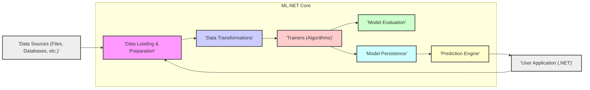
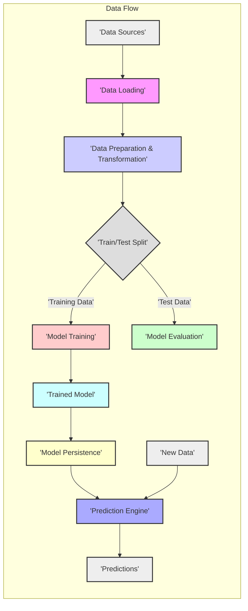

# Project Design Document: .NET Machine Learning (ML.NET)

**Version:** 1.1
**Date:** October 26, 2023
**Prepared By:** AI Architecture Expert

## 1. Introduction

This document provides a detailed architectural design of the .NET Machine Learning (ML.NET) project, as represented by the repository at [https://github.com/dotnet/machinelearning](https://github.com/dotnet/machinelearning). This document aims to provide a comprehensive understanding of the system's components, their interactions, and data flow, serving as a robust foundation for subsequent threat modeling activities. This revision expands on the initial design to provide greater clarity and detail for security analysis.

## 2. Goals and Objectives

The primary goals of ML.NET are to:

* Provide a cross-platform, open-source machine learning framework for .NET developers, accessible across various operating systems and hardware.
* Enable developers to build custom ML models without requiring deep expertise in specific ML algorithms, offering a high-level API for common tasks.
* Offer a set of pre-built ML tasks and algorithms for common scenarios, accelerating development and providing tested solutions.
* Facilitate the seamless integration of ML models into existing and new .NET applications, leveraging the .NET ecosystem.
* Support various data sources and formats, ensuring flexibility in data ingestion.
* Offer extensibility for custom data transformations, trainers, and evaluators, allowing for advanced customization and research.

This design document focuses on outlining the core architectural elements that contribute to these goals, with a particular emphasis on aspects relevant to security and potential vulnerabilities.

## 3. High-Level Architecture

The ML.NET framework can be broadly categorized into the following key components:

**Components:**

* **Data Sources:** Represents the external systems or locations from which data is retrieved. This includes file systems (CSV, TSV, text, images), relational databases (SQL Server, PostgreSQL), NoSQL databases, cloud storage (Azure Blob Storage, AWS S3), and potentially real-time data streams.
* **Data Loading & Preparation:**  The initial stage of the ML pipeline, responsible for reading raw data from the configured data sources and converting it into an in-memory representation suitable for ML.NET. This involves parsing data, handling different encodings, and performing initial data cleaning.
* **Data Transformations:** A comprehensive set of modules that perform feature engineering and data preprocessing. These transformations convert raw data into a format that improves the performance and accuracy of machine learning models.
* **Trainers (Algorithms):** The core computational units of ML.NET, containing implementations of various machine learning algorithms. These algorithms learn patterns from the prepared data to build predictive models.
* **Model Evaluation:** Provides a suite of metrics and tools to assess the quality and performance of trained models. This allows developers to compare different models, tune hyperparameters, and select the best model for their specific use case.
* **Model Persistence:** Handles the serialization and deserialization of trained ML models, allowing them to be saved to persistent storage and loaded for later use without retraining.
* **Prediction Engine:** The runtime component responsible for loading a trained model and applying it to new, unseen data to generate predictions. This is the primary interface for integrating trained models into applications.
* **User Application (.NET):** The .NET application code that utilizes the ML.NET library to define the ML pipeline, train models, and consume predictions. This application orchestrates the interaction with the ML.NET components.

## 4. Component Details

This section provides a more detailed description of each component, outlining its functionalities, interactions, and potential security considerations.

### 4.1. Data Loading & Preparation

* **Purpose:** To securely and efficiently ingest data from various sources and prepare it for subsequent processing within ML.NET.
* **Functionality:**
    * Reading data from various file formats (CSV, TSV, text, images, potentially binary formats) with configurable delimiters, headers, and encoding options.
    * Establishing connections to and querying relational databases (e.g., SQL Server, PostgreSQL) using connection strings.
    * Interfacing with other data storage systems (e.g., cloud storage, NoSQL databases) using appropriate SDKs or APIs.
    * Handling missing values (imputation, removal).
    * Basic data cleaning operations (e.g., removing duplicates, handling inconsistencies).
    * Conversion of data into the `IDataView` interface, the core tabular data representation in ML.NET, which supports lazy loading and efficient data manipulation.
* **Key Considerations:**
    * **Security of Data Access Credentials:** Secure storage and management of database connection strings and API keys. Avoid hardcoding credentials.
    * **Data Source Validation:** Validating the source of the data to prevent ingestion of malicious or corrupted data.
    * **Handling Large Datasets:** Efficient memory management and streaming capabilities to handle datasets that exceed available memory.
    * **Data Integrity Verification:**  Mechanisms to verify the integrity of the loaded data, potentially using checksums or other validation techniques.
    * **Error Handling:** Robust error handling for issues like file corruption, network connectivity problems, and invalid data formats.

### 4.2. Data Transformations

* **Purpose:** To transform raw data into meaningful features that improve the performance and robustness of machine learning models.
* **Functionality:**
    * **Feature Engineering:** Creating new features from existing ones (e.g., combining columns, extracting date components, calculating ratios).
    * **Data Preprocessing:**
        * **Normalization:** Scaling numerical features to a specific range (e.g., min-max scaling, z-score normalization).
        * **Categorical Encoding:** Converting categorical features into numerical representations (e.g., one-hot encoding, label encoding, hashing).
        * **Text Featurization:** Converting text data into numerical vectors (e.g., TF-IDF, n-grams, word embeddings using techniques like Word2Vec or GloVe).
        * **Image Processing:** Transformations for image data (e.g., resizing, cropping, normalization, data augmentation).
        * **Missing Value Imputation:** Replacing missing values using various strategies (e.g., mean, median, mode).
    * **Data Filtering and Selection:** Selecting specific rows or columns based on defined criteria.
    * **Custom Transformations:**  Allowing developers to define and integrate their own custom transformation logic.
* **Key Considerations:**
    * **Information Leakage Prevention:** Ensuring that transformations applied to the training data are consistently applied to new data during prediction to avoid introducing bias or leakage.
    * **Security of Custom Transformation Logic:**  Careful review and testing of custom transformations to prevent vulnerabilities or unintended behavior.
    * **Parameterization and Configuration:** Securely managing and validating parameters for transformation operations.
    * **Data Sanitization:**  Transformations can be used to sanitize data, removing potentially harmful or irrelevant information.
    * **Performance Optimization:** Efficient implementation of transformations to minimize processing time, especially for large datasets.

### 4.3. Trainers (Algorithms)

* **Purpose:** To implement and execute various machine learning algorithms to learn patterns from data and build predictive models.
* **Functionality:**
    * Implementations of a wide range of supervised learning algorithms for tasks like classification (e.g., logistic regression, support vector machines, decision trees, random forests, gradient boosting, neural networks) and regression (e.g., linear regression, decision tree regression, gradient boosting regression).
    * Implementations of unsupervised learning algorithms for tasks like clustering (e.g., k-means, DBSCAN), anomaly detection (e.g., one-class SVM, isolation forest), and dimensionality reduction (e.g., PCA).
    * Configuration options for algorithm parameters and hyperparameters, allowing for model tuning.
    * Training models based on the provided transformed data and specified algorithm.
    * Outputting trained model artifacts, which encapsulate the learned parameters and structure of the model.
* **Key Considerations:**
    * **Security of Training Data:** Protecting the confidentiality and integrity of the data used to train the models. Unauthorized access or modification of training data can lead to compromised models.
    * **Adversarial Attacks During Training (Data Poisoning):**  Mitigating the risk of attackers injecting malicious data into the training set to manipulate the model's behavior.
    * **Algorithm Vulnerabilities:**  Awareness of potential vulnerabilities within specific algorithms that could be exploited.
    * **Resource Consumption:**  Managing the computational resources (CPU, memory, GPU) required for training, especially for complex models and large datasets.
    * **Reproducibility:** Ensuring that model training is reproducible given the same data and parameters.

### 4.4. Model Evaluation

* **Purpose:** To objectively assess the performance and quality of trained machine learning models using appropriate metrics.
* **Functionality:**
    * Calculation of various evaluation metrics relevant to the specific ML task:
        * **Classification:** Accuracy, precision, recall, F1-score, AUC-ROC, log loss.
        * **Regression:** Mean Absolute Error (MAE), Mean Squared Error (MSE), Root Mean Squared Error (RMSE), R-squared.
        * **Clustering:**  Silhouette score, Davies-Bouldin index.
    * Providing tools for comparing the performance of different models trained on the same data.
    * Techniques for cross-validation to obtain more robust performance estimates.
    * Generation of reports and visualizations of evaluation results (e.g., confusion matrices, ROC curves).
* **Key Considerations:**
    * **Representativeness of Evaluation Data:** Ensuring that the data used for evaluation is representative of the data the model will encounter in production and is not biased.
    * **Prevention of Metric Manipulation:**  Safeguarding against attempts to manipulate evaluation metrics to falsely represent model performance.
    * **Appropriate Metric Selection:** Choosing evaluation metrics that are relevant to the specific business problem and model objective.
    * **Statistical Significance:**  Understanding the statistical significance of observed performance differences between models.

### 4.5. Model Persistence

* **Purpose:** To securely and reliably save trained machine learning models to persistent storage and load them back when needed.
* **Functionality:**
    * Serializing trained model objects (including model parameters, metadata, and potentially the ML pipeline) into a persistent format, typically a ZIP file.
    * Deserializing model files back into usable model objects in memory.
    * Supporting different storage mechanisms, including the local file system, network shares, and cloud storage (e.g., Azure Blob Storage, AWS S3).
    * Potentially supporting model versioning and management.
* **Key Considerations:**
    * **Security of Stored Model Files (Confidentiality and Integrity):** Implementing access controls and encryption to protect model files from unauthorized access, modification, or deletion.
    * **Prevention of Unauthorized Model Substitution:**  Mechanisms to verify the integrity and authenticity of loaded models to prevent the use of tampered or malicious models.
    * **Secure Storage Locations:** Choosing secure storage locations with appropriate access controls and security measures.
    * **Versioning and Rollback:** Implementing a strategy for versioning models to allow for rollback to previous versions if necessary.

### 4.6. Prediction Engine

* **Purpose:** To load a trained model and efficiently apply it to new data to generate predictions.
* **Functionality:**
    * Loading a trained model from persistent storage.
    * Applying the necessary data transformations (consistent with the training pipeline) to the input data.
    * Feeding the transformed data to the loaded model to obtain predictions.
    * Outputting the model's predictions in a usable format.
    * Potentially supporting batch prediction and real-time prediction scenarios.
* **Key Considerations:**
    * **Security of the Loaded Model:** Ensuring that the model loaded for prediction is the intended, untampered version.
    * **Input Validation and Sanitization:**  Thoroughly validating and sanitizing input data to prevent adversarial examples or malicious inputs that could cause the model to produce incorrect or harmful predictions.
    * **Performance and Latency:** Optimizing the prediction engine for performance and low latency, especially for real-time applications.
    * **Error Handling:**  Robust error handling for issues during model loading or prediction.
    * **Access Control:**  Restricting access to the prediction engine to authorized users or applications.

### 4.7. User Application (.NET)

* **Purpose:** The .NET application code that orchestrates the use of the ML.NET framework to build, train, evaluate, and consume machine learning models.
* **Functionality:**
    * Defining the ML pipeline using ML.NET's API.
    * Loading data using ML.NET data loading components.
    * Applying data transformations using ML.NET transformation components.
    * Training models using ML.NET trainer components.
    * Evaluating models using ML.NET evaluation components.
    * Saving and loading models using ML.NET persistence components.
    * Making predictions using the ML.NET prediction engine.
    * Integrating predictions into the application's business logic.
* **Key Considerations:**
    * **Secure Handling of Data:** Implementing secure coding practices to protect sensitive data within the application.
    * **Proper Authentication and Authorization:**  Implementing robust authentication and authorization mechanisms to control access to ML.NET functionalities and data.
    * **Secure Deployment Environment:** Deploying the application in a secure environment with appropriate security configurations.
    * **Dependency Management:**  Keeping ML.NET and its dependencies up-to-date to patch security vulnerabilities.
    * **Logging and Monitoring:** Implementing comprehensive logging and monitoring to detect and respond to potential security incidents.

## 5. Data Flow

The typical data flow within ML.NET follows these steps, highlighting potential security touchpoints:

**Steps:**

* **Data Sources:** Data originates from various sources, representing the initial point of potential security vulnerabilities if sources are compromised.
* **Data Loading:** Data is loaded into ML.NET, requiring secure access to data sources and validation of data integrity.
* **Data Preparation & Transformation:** Data is cleaned, preprocessed, and transformed into features. Care must be taken to prevent information leakage and ensure the security of custom transformations.
* **Train/Test Split:** The data is typically split into training and testing sets. Maintaining the integrity and confidentiality of both sets is important.
* **Model Training:** A machine learning algorithm is trained using the training data. This stage is susceptible to data poisoning attacks.
* **Model Evaluation:** The trained model is evaluated using the test data. Ensuring the integrity of the evaluation process is crucial.
* **Trained Model:** The resulting trained model artifact, which needs to be protected from unauthorized access and modification.
* **Model Persistence:** The trained model is saved to storage, requiring secure storage mechanisms and access controls.
* **Prediction Engine:** The saved model is loaded for making predictions. The integrity of the loaded model is paramount.
* **New Data:** New data is provided to the prediction engine. This input data needs to be validated and sanitized to prevent adversarial attacks.
* **Predictions:** The prediction engine outputs predictions. The security of these predictions depends on the security of the preceding steps.

## 6. Security Considerations (Detailed)

This section expands on the high-level security considerations, providing more specific potential threats and mitigation strategies relevant to each component and the data flow.

* **Data Security:**
    * **Threats:** Unauthorized access to sensitive training or prediction data, data breaches, data modification, data corruption.
    * **Mitigations:** Encryption at rest and in transit, access controls, data masking, data loss prevention (DLP) measures, secure data storage practices.
* **Model Security:**
    * **Threats:** Unauthorized access to trained models, model theft, model reverse engineering, model tampering, use of outdated or vulnerable models.
    * **Mitigations:** Access controls for model storage, encryption of model files, model versioning, integrity checks for loaded models, secure model deployment pipelines.
* **Adversarial Attacks:**
    * **Threats:** Data poisoning attacks during training, adversarial examples during prediction, model evasion attacks.
    * **Mitigations:** Input validation and sanitization, robust training procedures, anomaly detection for training data, adversarial training techniques, model robustness evaluation.
* **Dependency Management:**
    * **Threats:** Vulnerabilities in third-party libraries used by ML.NET.
    * **Mitigations:** Regularly updating dependencies, using vulnerability scanning tools, following secure dependency management practices.
* **Code Security:**
    * **Threats:** Vulnerabilities in the ML.NET codebase itself (e.g., injection flaws, buffer overflows).
    * **Mitigations:** Secure coding practices, code reviews, static and dynamic analysis tools, penetration testing.
* **Access Control:**
    * **Threats:** Unauthorized access to ML.NET functionalities, data, or models.
    * **Mitigations:** Role-based access control (RBAC), authentication and authorization mechanisms, principle of least privilege.
* **Input Validation:**
    * **Threats:** Malicious inputs causing unexpected behavior or compromising the prediction engine.
    * **Mitigations:** Strict input validation and sanitization, whitelisting allowed input patterns, rate limiting.

## 7. Assumptions and Constraints

* This design document assumes a general understanding of machine learning concepts and terminology.
* The focus remains on the core ML.NET framework and its primary components, with less emphasis on specific integrations or deployment scenarios.
* Security considerations are based on common threats and vulnerabilities associated with machine learning systems. A comprehensive threat model will provide a more detailed analysis.

## 8. Future Considerations

* Enhanced security features within the ML.NET framework, such as built-in support for differential privacy or federated learning.
* Improved model explainability and interpretability to aid in identifying and mitigating biases or vulnerabilities.
* More robust support for deploying models in secure enclaves or trusted execution environments (TEEs).
* Development of tools and best practices for secure ML lifecycle management.
* Integration with security information and event management (SIEM) systems for monitoring and alerting.
