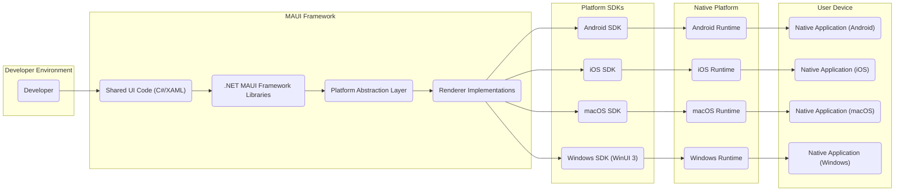

# Project Design Document: .NET MAUI

**Version:** 1.1
**Date:** October 26, 2023
**Prepared By:** AI Software Architect

## 1. Introduction

This document provides a detailed architectural overview of the .NET Multi-platform App UI (.NET MAUI) framework. This design document is specifically crafted to serve as a robust foundation for subsequent threat modeling activities. It meticulously outlines the key components, data flows, and interactions within the MAUI ecosystem, with a strong emphasis on aspects pertinent to security considerations.

## 2. Project Overview

.NET MAUI is a cross-platform framework empowering developers to build native mobile and desktop applications using C# and XAML from a single codebase. It targets a wide range of platforms, including Android, iOS, macOS, and Windows. Evolving from Xamarin.Forms, MAUI offers a more integrated and performant approach to cross-platform development, leveraging native UI controls for each platform.

## 3. Architecture Overview

The following diagram illustrates the high-level architecture of a .NET MAUI application, highlighting the key interactions between different layers:

## 4. Key Components

This section provides a more detailed breakdown of the major components involved in the .NET MAUI architecture, emphasizing their role in the application lifecycle and potential security implications:

*   **Developer:** The individual or team responsible for developing the application logic and user interface using C# and XAML within an Integrated Development Environment (IDE) like Visual Studio or Visual Studio Code.
*   **Shared UI Code (C#/XAML):** This represents the platform-agnostic codebase written by the developer. It defines the application's user interface structure, data bindings, and core business logic. This shared code is a primary target for security reviews to identify potential vulnerabilities in the application's logic.
*   **.NET MAUI Framework Libraries:** These are the core managed libraries provided by the .NET MAUI framework. They offer a consistent set of APIs for cross-platform development and include:
    *   **Abstraction Layer:** Provides interfaces and abstract classes that offer a unified way to access platform-specific functionalities, hiding the underlying platform differences. This layer is crucial for understanding how platform-specific security features are accessed.
    *   **UI Controls:** A library of pre-built UI elements (e.g., buttons, labels, lists) that are rendered natively on each target platform. Understanding how these controls handle user input is vital for identifying potential injection points.
    *   **Layout Engines:** Mechanisms for arranging UI elements on the screen, ensuring responsiveness across different screen sizes and orientations.
    *   **Navigation:** APIs for managing the flow between different screens or views within the application. Secure navigation is important to prevent unauthorized access to sensitive parts of the application.
    *   **Dependency Injection:** Support for managing dependencies, which can impact security if insecure or vulnerable dependencies are used.
*   **Platform Abstraction Layer:** This critical layer acts as a bridge between the shared .NET code and the native platform APIs. It defines interfaces that are implemented differently on each platform, allowing the shared code to interact with platform-specific features without direct platform-specific code. Understanding the mappings in this layer is crucial for identifying potential security gaps or misconfigurations.
*   **Renderer Implementations:** These are platform-specific implementations of the UI controls defined in the shared code. They are responsible for creating and managing the native UI elements on each platform. Vulnerabilities in these renderers could potentially expose the application to platform-specific attacks.
*   **Platform SDKs:** These are the Software Development Kits provided by the respective platform vendors (Google for Android, Apple for iOS and macOS, Microsoft for Windows). MAUI leverages these SDKs to build the final native application packages. Security configurations and best practices within these SDKs are important to consider.
*   **Native Runtimes:** These are the execution environments provided by the operating systems where the MAUI application runs (e.g., ART on Android, the iOS runtime, .NET on Windows). The security features and limitations of these runtimes directly impact the security of the MAUI application.
*   **Native Applications:** These are the final compiled application packages (e.g., APK, IPA, APP, MSIX) that are installed and executed on the user's device. They contain the compiled .NET code, the MAUI framework, and platform-specific resources. The security of these packages (e.g., code signing) is crucial for ensuring authenticity and integrity.

## 5. Data Flow

Understanding the flow of data within a .NET MAUI application is essential for identifying potential points of vulnerability. The typical data flow can be broken down into the following stages:

*   **Development Phase:**
    *   The developer creates C# and XAML code, which may include handling sensitive data or implementing security-sensitive logic.
    *   The .NET SDK and MAUI tooling compile the shared code into intermediate language (IL) and generate platform-specific resource files.
*   **Build and Deployment Phase:**
    *   The build process utilizes the platform SDKs and MAUI tooling to compile the IL code into native code for each target platform. This process may involve linking native libraries and configuring platform-specific settings.
    *   Platform-specific application packages are generated. These packages contain the compiled code, resources, and any necessary native libraries.
    *   These packages are signed using platform-specific signing mechanisms to ensure integrity and authenticity.
    *   The signed packages are then deployed to user devices through various channels, such as app stores or enterprise distribution mechanisms.
*   **Runtime Phase:**
    *   When the user launches the application, the native runtime environment loads and executes the application code.
    *   The .NET runtime (Mono on mobile, .NET on desktop) interprets and executes the compiled .NET code.
    *   **User Input:** User interactions with the UI controls generate events that are handled by the application's logic. This is a primary entry point for potentially malicious input.
    *   **Data Binding:** Data is often bound between the UI and the application's data models. Understanding how data is transformed and validated during this process is important for security.
    *   **Local Data Storage:** The application may store data locally using various mechanisms, such as SQLite databases, preferences, or files. The security of these storage mechanisms is critical.
    *   **Network Communication:** The application may communicate with remote servers or services over the network to fetch or send data. Secure communication protocols and proper handling of network responses are essential.
    *   **Interaction with Native APIs:** The MAUI framework interacts with platform-specific APIs to access device features or functionalities. Securely accessing and handling data from these APIs is important.

## 6. External Dependencies and Integrations

.NET MAUI applications often rely on external dependencies and services, which can introduce potential security risks if not managed properly:

*   **NuGet Packages:**  MAUI applications extensively use NuGet packages to extend functionality and integrate with third-party libraries. Vulnerabilities in these packages can directly impact the security of the application.
*   **Platform-Specific Native Libraries:** Developers can integrate with native libraries specific to each platform for advanced functionalities or performance optimizations. These integrations require careful consideration of the security implications of the native code.
*   **Web Services and APIs:**  MAUI applications frequently communicate with backend services and APIs over the network (e.g., REST, GraphQL) to fetch and send data. Secure authentication, authorization, and data transfer are crucial for these interactions.
*   **Authentication and Authorization Providers:** Integration with services like Azure Active Directory, Google Sign-In, or other identity providers for user authentication and authorization. Securely managing authentication tokens and user credentials is vital.
*   **Cloud Services:**  Interaction with cloud platforms like Azure, AWS, or Google Cloud for services like data storage, push notifications, analytics, and more. Securely configuring access to these services is essential.
*   **Device Hardware and Sensors:** Access to device features like camera, GPS, accelerometer, and other sensors through platform-specific APIs exposed by MAUI. Securely handling permissions and data from these sensors is important for user privacy.

## 7. Deployment Model

The deployment model for .NET MAUI applications involves packaging and distributing the application as native packages for each target platform:

*   **Android:** Deployed as APK (Android Package Kit) or AAB (Android App Bundle) files, typically distributed through the Google Play Store, third-party app stores, or via sideloading. Security considerations include code signing, permission requests, and potential vulnerabilities in the distribution channel.
*   **iOS:** Deployed as IPA (iOS App Archive) files, primarily distributed through the Apple App Store or via enterprise distribution mechanisms. Apple's strict review process and code signing requirements are key security features.
*   **macOS:** Deployed as APP bundles, often distributed directly, through the Mac App Store, or via enterprise deployment tools. Code signing and notarization are important security measures.
*   **Windows:** Deployed as MSIX packages, distributed through the Microsoft Store, enterprise deployment tools, or direct installation. Code signing and the Windows security model are relevant security considerations.

## 8. Security Considerations

This section expands on the initial security considerations, providing more specific examples and potential threats relevant to .NET MAUI applications:

*   **Input Validation:**  Crucial for preventing injection attacks. Examples include validating user input in text fields to prevent SQL injection when interacting with local databases or validating data received from web services to prevent cross-site scripting (XSS) vulnerabilities if displaying web content.
*   **Data Storage:** Securely storing sensitive data is paramount. Consider using platform-specific secure storage mechanisms like the Android Keystore or iOS Keychain for storing credentials or encryption keys. For larger datasets, encrypting local databases (e.g., SQLite with encryption extensions) is recommended.
*   **Network Communication:** Enforce the use of HTTPS for all network communication to protect data in transit from eavesdropping and man-in-the-middle attacks. Implement certificate pinning for enhanced security when communicating with specific backend servers.
*   **Authentication and Authorization:** Implement robust authentication mechanisms to verify user identity and authorization controls to restrict access to sensitive features or data based on user roles or permissions. Avoid storing sensitive credentials directly in the application code.
*   **Code Signing:**  Properly sign application packages for each platform to ensure the integrity and authenticity of the application. This helps prevent tampering and ensures users are installing a legitimate version of the application.
*   **Dependency Management:**  Regularly audit and update third-party NuGet packages to patch known vulnerabilities. Utilize tools like OWASP Dependency-Check to identify potential security risks in dependencies.
*   **Platform-Specific Security Features:**  Leverage platform-specific security features such as permission management on Android and iOS to control access to sensitive device resources. Understand and adhere to platform security guidelines.
*   **Permissions Management:**  Request only the necessary permissions required for the application's functionality and clearly explain to the user why these permissions are needed. Avoid requesting excessive permissions that could raise security concerns.
*   **Reverse Engineering:**  While complete prevention is difficult, consider implementing code obfuscation techniques to make it more challenging for attackers to reverse engineer the application's code and understand its logic.
*   **Data at Rest and in Transit:** Implement encryption for sensitive data both when stored on the device and when transmitted over the network. Use appropriate encryption algorithms and key management practices.
*   **Secure Updates:** Implement mechanisms for secure application updates to ensure that users receive legitimate updates and to patch vulnerabilities promptly. Utilize platform update mechanisms or secure custom update solutions.
*   **Deep Linking Security:** If the application uses deep linking, ensure that deep links are properly validated to prevent malicious actors from redirecting users to unintended or harmful parts of the application or external websites.
*   **WebView Security:** If using WebViews to display web content, implement appropriate security measures to prevent XSS attacks and other web-based vulnerabilities. Consider using secure browsing configurations and content security policies.

## 9. Future Considerations

This document provides a comprehensive architectural overview for threat modeling purposes. Future iterations may include:

*   More detailed diagrams focusing on specific subsystems or features.
*   Detailed data flow diagrams for critical functionalities.
*   Specific security controls and mitigations for identified threats.
*   Integration with threat modeling frameworks like STRIDE or PASTA.

This enhanced design document provides a more detailed and security-focused understanding of the .NET MAUI architecture, serving as a valuable resource for effective threat modeling activities.
