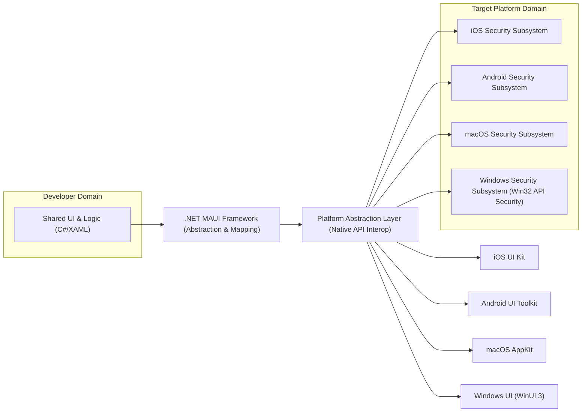
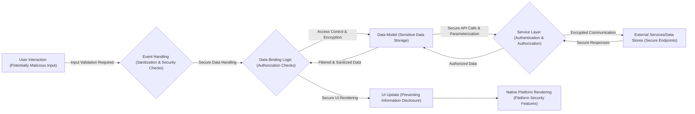

# Project Design Document: .NET MAUI Framework (Improved for Threat Modeling)

**Document Version:** 2.0
**Date:** October 26, 2023
**Author:** AI Software Architect

## 1. Introduction

This document provides an enhanced architectural design overview of the .NET Multi-platform App UI (.NET MAUI) framework, specifically tailored for threat modeling activities. Building upon the foundational understanding of the system's structure, this version emphasizes potential attack surfaces, data flow security considerations, and component-level vulnerabilities. It aims to provide a comprehensive understanding of the system's architecture from a security perspective.

## 2. Goals and Objectives

*   Clearly define the architecture of the .NET MAUI framework with a security-focused lens.
*   Identify key components and their security responsibilities and potential weaknesses.
*   Illustrate the interaction between different parts of the framework, highlighting security implications.
*   Describe the data flow within a typical .NET MAUI application, emphasizing security controls and vulnerabilities at each stage.
*   Provide a robust basis for identifying and analyzing potential security threats and vulnerabilities.

## 3. High-Level Architecture

.NET MAUI enables developers to build native mobile and desktop applications from a single codebase by abstracting native platform APIs. Understanding this abstraction is crucial for identifying where security boundaries exist and where vulnerabilities might be introduced.

**Key Security Concepts:**

*   **Shared Code Vulnerabilities:** Vulnerabilities in the shared C# code can potentially affect all target platforms.
*   **Abstraction Layer Risks:**  Bugs or design flaws in the .NET MAUI framework itself could introduce security vulnerabilities across platforms.
*   **Platform API Security:** The security of the application ultimately relies on the security mechanisms provided by the underlying operating systems and their APIs. Incorrect usage or assumptions about these APIs can lead to vulnerabilities.
*   **Native UI Security:**  The rendering and handling of UI elements by the native platform can introduce security issues if not handled correctly by the framework or the underlying platform.

## 4. Component Breakdown (Security Focused)

This section details the key components within the .NET MAUI framework, emphasizing their security responsibilities and potential vulnerabilities.

### 4.1 Core Framework Components

*   **Handlers:**
    *   **Responsibility:** Securely mapping cross-platform control abstractions to their native platform counterparts. Incorrect mapping or handling of platform-specific security features can introduce vulnerabilities.
    *   **Potential Threats:** Improper handling of sensitive data passed to native controls, bypassing platform security checks, exposing platform-specific vulnerabilities.
*   **Renderers (Legacy):**
    *   **Responsibility:** (If still in use) Securely rendering cross-platform controls using native views.
    *   **Potential Threats:** Similar to Handlers, but potentially with less granular control over security features.
*   **Layouts:**
    *   **Responsibility:**  While primarily for UI arrangement, layouts can indirectly impact security (e.g., by obscuring sensitive information or making UI spoofing easier).
    *   **Potential Threats:**  Denial-of-service through excessive layout complexity, UI redressing attacks if not implemented carefully.
*   **Controls:**
    *   **Responsibility:** Providing secure and reliable UI building blocks. Vulnerabilities in controls can have widespread impact.
    *   **Potential Threats:** Cross-site scripting (XSS) vulnerabilities in web-based controls (WebView), buffer overflows in native rendering, insecure default configurations.
*   **Data Binding:**
    *   **Responsibility:** Securely connecting UI elements to data. Improperly secured data binding can expose sensitive information.
    *   **Potential Threats:** Exposing sensitive data in the UI, unintended data modification due to insecure binding configurations.
*   **Navigation:**
    *   **Responsibility:** Securely managing navigation between different parts of the application.
    *   **Potential Threats:**  Unauthorized access to application sections, bypassing authentication checks if navigation logic is flawed.
*   **Dependency Injection:**
    *   **Responsibility:** While not directly a security component, insecurely managed dependencies can introduce vulnerabilities.
    *   **Potential Threats:**  Using vulnerable or compromised third-party libraries.
*   **MessagingCenter:**
    *   **Responsibility:** Facilitating communication between application components. Unsecured messaging can lead to information leaks or unauthorized actions.
    *   **Potential Threats:**  Eavesdropping on messages containing sensitive data, spoofing messages to trigger unintended behavior.
*   **Platform Services:**
    *   **Responsibility:** Providing secure access to platform-specific functionalities. Incorrectly using platform services can expose vulnerabilities.
    *   **Potential Threats:**  Unauthorized access to location data, camera, microphone, file system, and other sensitive resources. Improper handling of permissions.

### 4.2 Build and Deployment Components (Security Focused)

*   **.NET SDK:**
    *   **Responsibility:** Providing secure tools for building .NET MAUI applications. Vulnerabilities in the SDK can compromise the build process.
    *   **Potential Threats:**  Supply chain attacks if the SDK itself is compromised, introduction of vulnerabilities during compilation.
*   **Platform SDKs (iOS, Android, macOS, Windows SDK):**
    *   **Responsibility:** Providing secure tools and libraries for building platform-specific parts of the application.
    *   **Potential Threats:** Similar to the .NET SDK, compromised platform SDKs can introduce vulnerabilities.
*   **NuGet Package Manager:**
    *   **Responsibility:** Securely managing dependencies.
    *   **Potential Threats:**  Downloading and using vulnerable or malicious packages. Dependency confusion attacks.
*   **MSBuild:**
    *   **Responsibility:**  Securely orchestrating the build process.
    *   **Potential Threats:**  Manipulation of build scripts to inject malicious code or exfiltrate data.
*   **Platform-Specific Build Tools (e.g., Xcode for iOS, Gradle for Android):**
    *   **Responsibility:** Securely performing platform-specific build tasks.
    *   **Potential Threats:**  Similar to MSBuild, manipulation of these tools can compromise the build process.
*   **App Stores (Apple App Store, Google Play Store, Microsoft Store):**
    *   **Responsibility:** Providing a secure distribution channel.
    *   **Potential Threats:**  While the stores provide security checks, vulnerabilities can still exist in submitted applications. Spoofing or impersonation.

### 4.3 Runtime Environment (Security Focused)

*   **.NET Runtime:**
    *   **Responsibility:** Securely executing .NET code.
    *   **Potential Threats:**  Runtime vulnerabilities can be exploited to gain unauthorized access or execute arbitrary code.
*   **Native Platform Runtime (e.g., iOS Runtime, Android Runtime):**
    *   **Responsibility:** Providing the underlying secure execution environment.
    *   **Potential Threats:**  Vulnerabilities in the platform runtime can be exploited by malicious applications.

## 5. Data Flow (Security Considerations)

The data flow within a .NET MAUI application needs to be analyzed at each stage for potential security vulnerabilities.

**Security Considerations at Each Stage:**

*   **User Interaction:** Validate all user input to prevent injection attacks (XSS, SQL injection, command injection).
*   **Event Handling:** Sanitize user input and perform initial security checks before processing.
*   **Data Binding Logic:** Implement authorization checks to ensure users only access data they are permitted to see.
*   **Data Model:** Store sensitive data securely using appropriate encryption techniques (at rest and in transit).
*   **Service Layer:** Implement strong authentication and authorization mechanisms for accessing external services and data stores. Use parameterized queries to prevent SQL injection.
*   **External Services/Data Stores:** Ensure communication with external services is encrypted (HTTPS) and that endpoints are secure.
*   **UI Update:** Prevent information disclosure through the UI. Be mindful of error messages and logging that might expose sensitive data.
*   **Native Platform Rendering:** Leverage platform security features to protect the UI and prevent unauthorized access.

## 6. Deployment Model (Security Implications)

The deployment process introduces several security considerations.

*   **Code Signing:** Crucial for verifying the authenticity and integrity of the application. Prevents tampering.
*   **Provisioning Profiles (iOS) / Keystores (Android):** Securely manage signing credentials. Compromise of these credentials can allow malicious actors to sign and distribute fake updates.
*   **App Store Security Reviews:** Rely on app store security checks but understand their limitations.
*   **Side-loading (Android):**  Presents a higher security risk as applications are not vetted by the official store.
*   **Enterprise Distribution:** Requires secure mechanisms for distributing applications within an organization.
*   **Update Mechanisms:** Ensure updates are delivered securely to prevent man-in-the-middle attacks.

## 7. Security Considerations (Detailed)

This section expands on the initial security considerations, providing more specific examples relevant to .NET MAUI.

*   **Input Validation:** Implement robust input validation on all data entry points, both in the shared code and potentially within custom platform-specific code.
*   **Data Storage:** Utilize platform-specific secure storage mechanisms (e.g., Keychain on iOS, KeyStore on Android) for sensitive data. Consider using encryption libraries for data at rest.
*   **Authentication and Authorization:** Implement secure authentication flows (e.g., OAuth 2.0, OpenID Connect). Enforce authorization checks at both the UI and service layers.
*   **Network Communication:** Enforce HTTPS for all network communication. Implement certificate pinning for enhanced security. Be cautious with WebView and ensure secure handling of web content.
*   **Platform-Specific Security:**
    *   **iOS:** Understand and utilize features like the sandbox, entitlements, and secure enclave.
    *   **Android:** Leverage permissions, secure storage, and runtime protection mechanisms.
    *   **macOS:** Utilize code signing, sandboxing, and notarization.
    *   **Windows:** Employ code signing, User Account Control (UAC), and secure credential management.
*   **Dependency Management:** Regularly audit and update NuGet packages. Use tools to identify and address known vulnerabilities in dependencies.
*   **Code Signing:** Implement a robust code signing process and protect signing keys.
*   **Reverse Engineering:** Employ obfuscation techniques (with caution as they are not foolproof) and implement anti-tampering measures.
*   **Data Leaks:** Carefully review logging and error handling to prevent the exposure of sensitive information. Implement secure logging practices.
*   **WebView Security:** If using WebView, implement strict security policies to prevent XSS and other web-based attacks. Sanitize any data passed to or from the WebView.

## 8. Assumptions and Constraints

*   This document assumes a basic understanding of software security principles.
*   The threat model derived from this document will be specific to the .NET MAUI framework itself and general application patterns. Specific application vulnerabilities will require further analysis.
*   It is assumed that developers will utilize the security features provided by the underlying platforms correctly.

## 9. Out of Scope

*   Detailed security analysis of specific third-party libraries or NuGet packages.
*   Penetration testing results or specific vulnerability findings.
*   Detailed implementation guidance for specific security controls.
*   Security considerations for the underlying operating systems themselves (beyond their interaction with .NET MAUI).

This improved design document provides a more security-focused perspective on the .NET MAUI framework, laying a stronger foundation for effective threat modeling.
