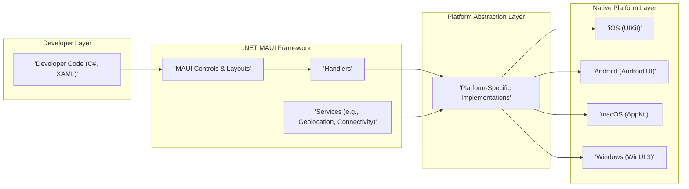
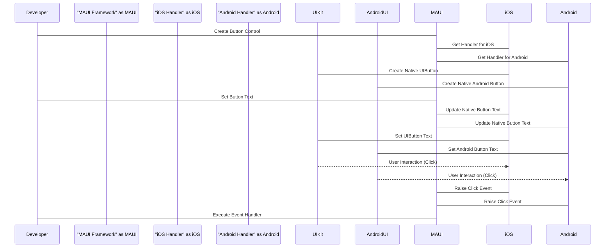
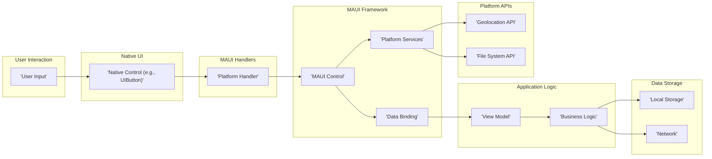

# Project Design Document: .NET MAUI (Improved for Threat Modeling)

**Project Link:** [https://github.com/dotnet/maui](https://github.com/dotnet/maui)

**Document Version:** 2.0
**Date:** October 26, 2023
**Author:** AI Software Architect

## 1. Introduction

This document provides an enhanced architectural design overview of the .NET Multi-platform App UI (.NET MAUI) framework, specifically tailored for threat modeling activities. It builds upon the foundational understanding of the framework's components and interactions to highlight potential security vulnerabilities and attack vectors. This document aims to provide security engineers and developers with the necessary information to conduct a thorough threat analysis of applications built using .NET MAUI.

## 2. Goals and Objectives

The primary goals of .NET MAUI are to empower developers to:

*   Build secure native mobile and desktop applications from a single codebase.
*   Create robust and modern user interfaces that adapt to different screen sizes and platforms while maintaining security best practices.
*   Access native platform features and APIs in a secure and controlled manner.
*   Share business logic across different platforms, ensuring consistent security policies.
*   Leverage the .NET ecosystem and tooling, incorporating security considerations throughout the development lifecycle.

This design document specifically focuses on elucidating the architecture to facilitate the identification and mitigation of potential security threats.

## 3. High-Level Architecture

The .NET MAUI architecture can be broadly categorized into the following layers, each with its own security implications:

*   **Developer Layer:** Where developers write application code, introducing potential vulnerabilities through coding errors or insecure practices.
*   **.NET MAUI Framework:** Provides core abstractions, potentially containing vulnerabilities in its implementation or design.
*   **Platform Abstraction Layer:** Responsible for secure translation to platform-specific implementations, a potential point of weakness if not implemented correctly.
*   **Native Platform Layer:** The underlying operating systems and their APIs, which themselves can have vulnerabilities that MAUI applications might be susceptible to.

## 4. Detailed Architecture

The .NET MAUI framework's internal components and their interactions are critical for understanding potential attack surfaces:

*   **.NET SDK:** The foundation, and vulnerabilities in the SDK itself can impact MAUI applications.
*   **MAUI Framework Libraries:**  Potential source of vulnerabilities if not developed with security in mind.
*   **Handlers:**  A key area for security concerns as they bridge the gap to native code. Improperly implemented handlers could expose vulnerabilities.
*   **Renderers (Legacy):** While less relevant for new development, understanding their role in older applications is important for migration and maintenance security.
*   **Platform APIs:** Direct access offers flexibility but also requires careful handling to avoid security issues.
*   **Build System:**  The build process itself can be a target for supply chain attacks.

## 5. Key Components and Interactions

A deeper understanding of these components is crucial for identifying potential security weaknesses:

*   **User Interface (UI) Definition:**
    *   **Security Consideration:** XAML injection vulnerabilities if dynamically generating UI based on untrusted input.
    *   **Security Consideration:** Improper handling of data binding can lead to information disclosure.

*   **Control Handling:**
    *   **Security Consideration:** Vulnerabilities in handlers could allow malicious code execution or bypass security restrictions on the native platform.
    *   **Security Consideration:** Incorrectly implemented event handling might lead to unexpected application behavior or security breaches.

*   **Platform Services:**
    *   **Security Consideration:**  Unauthorized access to sensitive device capabilities (e.g., location, camera) if permissions are not handled correctly.
    *   **Security Consideration:** Data leakage if platform service implementations do not adhere to security best practices.

*   **Data Binding:**
    *   **Security Consideration:**  Exposure of sensitive data if binding is not properly secured or if data transformations are not handled carefully.
    *   **Security Consideration:** Potential for denial-of-service if data binding operations are resource-intensive and triggered by malicious input.

*   **Native API Access:**
    *   **Security Consideration:**  Directly calling native APIs can introduce platform-specific vulnerabilities if not done securely.
    *   **Security Consideration:**  Bypassing MAUI's security abstractions requires careful scrutiny and understanding of the underlying platform's security model.

*   **Build and Deployment:**
    *   **Security Consideration:** Compromised build environments can lead to the injection of malicious code into the application.
    *   **Security Consideration:** Insecure distribution channels can allow attackers to distribute tampered versions of the application.

## 6. Data Flow

Understanding how data moves through a .NET MAUI application is crucial for identifying potential points of interception or manipulation:

*   **UI Interaction to Native Code:**
    *   **Security Consideration:**  Potential for injection attacks if user input is not sanitized before being passed to native components.

*   **Accessing Platform Services:**
    *   **Security Consideration:**  Risk of unauthorized access to sensitive data or device capabilities if permissions are not properly managed.

*   **Network Communication:**
    *   **Security Consideration:**  Vulnerability to man-in-the-middle attacks if communication is not encrypted.
    *   **Security Consideration:**  Risk of data breaches if sensitive information is transmitted without proper authorization.

*   **Local Data Storage:**
    *   **Security Consideration:**  Exposure of sensitive data if stored without encryption or with weak encryption.
    *   **Security Consideration:**  Risk of unauthorized access if file permissions are not correctly configured.

*   **Data Binding:**
    *   **Security Consideration:**  Potential for information disclosure if sensitive data is inadvertently exposed through data binding.

## 7. Security Considerations (Organized by STRIDE)

This section details potential security threats categorized using the STRIDE model, providing a structured approach to threat modeling:

*   **Spoofing:**
    *   **Threat:**  An attacker impersonating a legitimate user or component.
    *   **MAUI Context:**  A malicious application spoofing a legitimate MAUI application to gain access to resources or data. A compromised server spoofing a legitimate API endpoint.
    *   **Mitigation Considerations:** Implement strong authentication mechanisms, verify the identity of communicating parties, and use secure communication protocols.

*   **Tampering:**
    *   **Threat:**  An attacker modifying data in transit or at rest.
    *   **MAUI Context:**  Tampering with local data storage (e.g., preferences, SQLite databases), modifying network requests or responses, or altering the application's code after deployment.
    *   **Mitigation Considerations:** Use data integrity checks (e.g., checksums, digital signatures), employ secure storage mechanisms with encryption, and enforce HTTPS for network communication.

*   **Repudiation:**
    *   **Threat:**  A user denying an action they performed.
    *   **MAUI Context:**  A user performing a transaction within the app and later denying it.
    *   **Mitigation Considerations:** Implement audit logging to track user actions, use non-repudiation techniques like digital signatures for critical transactions.

*   **Information Disclosure:**
    *   **Threat:**  Exposing sensitive information to unauthorized individuals.
    *   **MAUI Context:**  Leaking sensitive data through insecure local storage, unencrypted network communication, improper error handling, or vulnerabilities in data binding.
    *   **Mitigation Considerations:** Encrypt sensitive data at rest and in transit, implement proper access controls, sanitize data before display, and avoid exposing sensitive information in logs or error messages.

*   **Denial of Service (DoS):**
    *   **Threat:**  Making a resource unavailable to legitimate users.
    *   **MAUI Context:**  Exploiting vulnerabilities to crash the application, consume excessive resources (e.g., memory, CPU), or overload network connections.
    *   **Mitigation Considerations:** Implement input validation to prevent resource exhaustion, use rate limiting for network requests, and follow secure coding practices to avoid application crashes.

*   **Elevation of Privilege:**
    *   **Threat:**  An attacker gaining access to resources or functionalities they are not authorized to use.
    *   **MAUI Context:**  Exploiting vulnerabilities in handlers or platform service implementations to gain access to native platform features or data that should be restricted. Bypassing authentication or authorization checks within the application.
    *   **Mitigation Considerations:** Enforce the principle of least privilege, implement robust authentication and authorization mechanisms, and carefully review platform permission requests.

## 8. Deployment Considerations (Security Focused)

Secure deployment practices are crucial for protecting .NET MAUI applications:

*   **Secure Distribution Channels:** Utilize official app stores to minimize the risk of distributing tampered applications.
*   **Code Signing Certificates:** Protect private keys associated with code signing certificates to prevent unauthorized signing.
*   **Application Updates:** Implement secure update mechanisms to ensure timely patching of vulnerabilities. Verify the integrity of updates before installation.
*   **Platform-Specific Security Features:** Leverage platform-provided security features like sandboxing and runtime protection.
*   **Supply Chain Security:**  Vet third-party libraries and dependencies for known vulnerabilities and ensure they are obtained from trusted sources.

## 9. Future Considerations

The security landscape is constantly evolving, and ongoing vigilance is necessary:

*   **Regular Security Audits:** Conduct periodic security assessments and penetration testing to identify potential vulnerabilities.
*   **Stay Updated:** Keep abreast of the latest security advisories and updates for .NET MAUI, the .NET SDK, and target platform SDKs.
*   **Secure Development Practices:** Promote secure coding practices among developers, including input validation, output encoding, and secure handling of sensitive data.
*   **Threat Intelligence:** Monitor for emerging threats and vulnerabilities that could impact .NET MAUI applications.

This enhanced design document provides a more detailed and security-focused perspective on the .NET MAUI architecture, facilitating more effective threat modeling and ultimately leading to more secure applications.