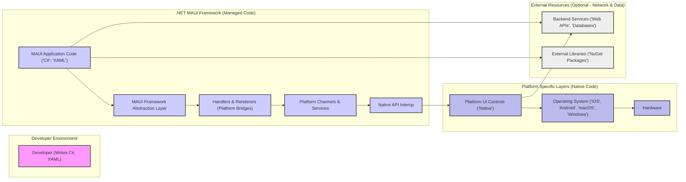
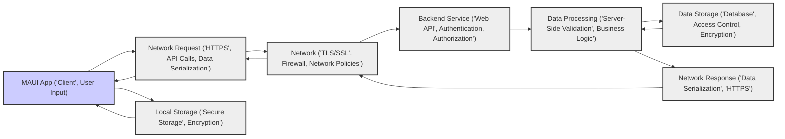

# Project Design Document: .NET MAUI for Threat Modeling (Improved)

**Project Name:** .NET Multi-platform App UI (.NET MAUI)

**Project Repository:** [https://github.com/dotnet/maui](https://github.com/dotnet/maui)

**Document Version:** 1.1
**Date:** October 26, 2023
**Author:** AI Software Architecture Expert

## 1. Introduction

This document provides an enhanced design overview of the .NET Multi-platform App UI (.NET MAUI) framework, specifically tailored for threat modeling activities. Building upon the initial version, this document aims for greater clarity, detail, and actionability for security assessments. It meticulously outlines the architecture, components, data flows, and underlying technologies of .NET MAUI, with a strong focus on security-relevant aspects. This document is intended to be a practical resource for security architects, developers, and anyone involved in identifying, analyzing, and mitigating security risks associated with applications developed using .NET MAUI. It serves as a crucial input for structured threat modeling methodologies like STRIDE or PASTA.

## 2. Project Overview: .NET MAUI

.NET MAUI is a modern, cross-platform framework from Microsoft for building native mobile and desktop applications using a single codebase in C# and XAML. It empowers developers to target multiple platforms – including Android, iOS, macOS, and Windows – significantly reducing development effort and time.  .NET MAUI represents the evolution and unification of Xamarin.Forms within the broader .NET ecosystem, offering a streamlined and integrated development experience. It emphasizes native UI performance and leverages the power of the .NET platform.

**Key Goals of .NET MAUI (Security Perspective):**

* **Secure Cross-Platform Development:**  Provide a framework that facilitates secure development practices across diverse platforms, minimizing platform-specific security pitfalls.
* **Native UI Security Posture:** Inherit and leverage the inherent security features and hardening of native platform UI controls and operating systems.
* **Managed Code Security:** Benefit from the security advantages of managed code environments provided by the .NET runtime, such as memory safety and garbage collection.
* **Extensible Security Model:** Allow developers to integrate platform-specific security features and best practices seamlessly within the cross-platform application.
* **Reduced Attack Surface (Code Reuse):** By promoting code reuse, potentially reduce the overall codebase size and complexity, which can indirectly contribute to a smaller attack surface compared to developing separate native applications.

## 3. System Architecture

.NET MAUI's architecture is designed in layers to abstract platform differences and provide a unified development experience. Understanding these layers is crucial for identifying potential threat vectors.

**3.1. Detailed High-Level Architecture Diagram**

**3.2. Component Description (Enhanced):**

* **Developer (Writes C#, XAML):** The individual responsible for developing the .NET MAUI application. Security considerations start here with secure coding practices and awareness of potential vulnerabilities.
* **MAUI Application Code (C#, XAML):**  The core application logic and UI definitions. This layer is susceptible to common application-level vulnerabilities like logic flaws, insecure data handling, and injection vulnerabilities if not developed securely.
* **MAUI Framework Abstraction Layer:** This is the heart of .NET MAUI, providing the cross-platform abstractions. Security concerns here include vulnerabilities within the framework itself, improper handling of platform differences leading to security gaps, and the security of the abstraction APIs.
* **Handlers & Renderers (Platform Bridges):** These components act as bridges between the abstract UI elements and the native platform UI. Security risks can arise from vulnerabilities in these bridge implementations, incorrect mapping of security features, or exposure of platform-specific vulnerabilities through the abstraction. Handlers are the modern approach, offering better performance and more direct interaction with native UI compared to Renderers (primarily for legacy compatibility).
* **Platform Channels & Services:**  .NET MAUI provides access to platform-specific features (like geolocation, sensors, file system) through abstracted services and channels. Security concerns include improper permission handling, insecure access to device resources, and vulnerabilities in the underlying platform service implementations.
* **Native API Interop:**  .NET MAUI allows developers to directly interact with native platform APIs when needed. While powerful, this introduces risks if not handled carefully.  Potential vulnerabilities include memory corruption, improper resource management, and bypassing managed code security features if native code is insecure.
* **Platform UI Controls (Native):**  These are the native UI elements provided by each OS. While generally secure, vulnerabilities can exist in native UI controls themselves. .NET MAUI relies on the security of these native components.
* **Operating System (iOS, Android, macOS, Windows):** The underlying OS is a critical security boundary. .NET MAUI applications inherit the security posture of the host OS. OS vulnerabilities and misconfigurations can directly impact MAUI applications.
* **Hardware:** The physical device. Hardware vulnerabilities and physical security of the device are outside the scope of .NET MAUI itself but are important considerations for overall application security.
* **Backend Services (Web APIs, Databases):** External services introduce network-based attack vectors. Security concerns include API security (authentication, authorization, input validation), data transmission security (HTTPS), and backend infrastructure security.
* **External Libraries (NuGet Packages):** Third-party libraries can introduce vulnerabilities if they are not well-maintained or contain security flaws. Dependency management and security scanning of NuGet packages are crucial.

## 4. Data Flow (Detailed for Security Analysis)

Understanding data flow is essential for identifying where sensitive data is processed, stored, and transmitted, and thus where security controls are most critical.

**4.1. Application Startup and UI Rendering Flow (Security Focus)**

```mermaid
graph LR
    A["App Start ('OS Entry Point')"] --> B["MAUI Runtime Init (Security Context Setup)"];
    B --> C["App.xaml.cs ('App Definition', Permissions Request)"];
    C --> D["MainPage.xaml ('UI Definition', Data Binding)"];
    D --> E["XAML Parsing ('Potential Injection', Resource Loading)"];
    E --> F["Handler/Renderer Resolution ('Platform Specific Code')"];
    F --> G["Native UI Control Creation ('OS Security Features')"];
    G --> H["UI Rendering ('Data Display', Sensitive Info?)"];
    H --> I["User Interaction ('Input Handling', Event Security')"];
    I --> J["Event Handlers ('C# Code', Logic Vulnerabilities')"];
    J --> K["Data Binding & UI Updates ('Data Sanitization', Secure Display')"];
    K --> G;

    style A fill:#f9f,stroke:#333,stroke-width:2px
    style B fill:#ccf,stroke:#333,stroke-width:2px
    style C fill:#ccf,stroke:#333,stroke-width:2px
    style D fill:#ccf,stroke:#333,stroke-width:2px
    style E fill:#ccf,stroke:#333,stroke-width:2px
    style F fill:#ccf,stroke:#333,stroke-width:2px
    style G fill:#bbe,stroke:#333,stroke-width:2px
    style H fill:#bbe,stroke:#333,stroke-width:2px
    style I fill:#ccf,stroke:#333,stroke-width:2px
    style J fill:#ccf,stroke:#333,stroke-width:2px
    style K fill:#ccf,stroke:#333,stroke-width:2px
```

**Security Considerations in Startup and UI Rendering:**

1. **App Start (OS Entry Point):**  Initial security context is established by the OS.  Application signing and integrity checks are performed at this stage.
2. **MAUI Runtime Init (Security Context Setup):** .NET MAUI runtime initializes within the OS security context.  Permissions requested by the application are often evaluated early in this phase.
3. **App.xaml.cs (App Definition, Permissions Request):**  Application-level permissions are often requested here.  Incorrectly requesting or handling permissions can lead to security vulnerabilities or privacy violations.
4. **MainPage.xaml (UI Definition, Data Binding):** UI definitions can contain data bindings.  If data sources are untrusted, this could lead to vulnerabilities if data is not properly sanitized or encoded before display.
5. **XAML Parsing (Potential Injection, Resource Loading):**  XAML parsing itself could be vulnerable to injection attacks if processing untrusted XAML. Secure resource loading is also important to prevent malicious resource injection.
6. **Handler/Renderer Resolution (Platform Specific Code):** Platform-specific code in handlers/renderers might have vulnerabilities or expose platform-specific security weaknesses.
7. **Native UI Control Creation (OS Security Features):** Native UI controls leverage OS security features.  However, misconfiguration or improper usage can weaken security.
8. **UI Rendering (Data Display, Sensitive Info?):**  Sensitive information displayed in the UI needs to be handled carefully.  Data masking, secure input fields, and preventing information leakage are important.
9. **User Interaction (Input Handling, Event Security):** User input is a major attack vector.  Input validation, sanitization, and secure event handling are crucial to prevent injection attacks and other input-related vulnerabilities.
10. **Event Handlers (C# Code, Logic Vulnerabilities):** Event handlers contain application logic.  Logic flaws, insecure data processing, and improper state management in event handlers can lead to vulnerabilities.
11. **Data Binding & UI Updates (Data Sanitization, Secure Display):** When data changes and the UI updates, ensure data is still sanitized and securely displayed to prevent vulnerabilities like XSS.

**4.2. Data Flow with Backend Services (Security Focus)**

**Security Considerations in Backend Communication:**

1. **MAUI App (Client, User Input):** Client-side vulnerabilities can be exploited to manipulate network requests. Input validation and secure data handling on the client are the first line of defense.
2. **Network Request (HTTPS, API Calls, Data Serialization):**  Use HTTPS for all communication with backend services to encrypt data in transit. Secure serialization of data (e.g., JSON) is important to prevent injection attacks.
3. **Network (TLS/SSL, Firewall, Network Policies):** Network security infrastructure (TLS/SSL configuration, firewalls, network segmentation) is crucial to protect communication channels.
4. **Backend Service (Web API, Authentication, Authorization):** Backend APIs must implement robust authentication and authorization mechanisms to verify the identity of the client and control access to resources.
5. **Data Processing (Server-Side Validation, Business Logic):** Server-side validation is essential to prevent injection attacks and ensure data integrity. Secure business logic implementation is also critical.
6. **Data Storage (Database, Access Control, Encryption):** Backend data storage must be secured with appropriate access controls, encryption at rest, and regular security audits.
7. **Network Response (Data Serialization, HTTPS):** Responses from the backend should also be transmitted over HTTPS and securely serialized.
8. **Local Storage (Secure Storage, Encryption):** If sensitive data is cached or stored locally on the device, use platform-specific secure storage mechanisms and encryption to protect it from unauthorized access.

## 5. Technology Stack (Security Implications)

The technology stack choices have direct security implications.

* **Programming Languages (C#, XAML):** C# is a memory-safe language, reducing risks of memory corruption vulnerabilities compared to languages like C/C++. XAML, while declarative, can introduce vulnerabilities if processing untrusted XAML.
* **.NET Platform (.NET SDK, .NET Runtime):** The .NET platform provides built-in security features like code access security (though largely deprecated in modern .NET), cryptography libraries, and secure coding guidelines. Keeping the .NET runtime updated is crucial for patching vulnerabilities.
* **UI Framework (.NET MAUI Framework):** Vulnerabilities in the .NET MAUI framework itself can have broad impact. Regular updates and security patching of the framework are essential.
* **Platform SDKs (iOS SDK, Android SDK, etc.):** .NET MAUI relies on the security of underlying platform SDKs. Staying updated with platform SDK updates and security advisories is important.
* **Build Tools (.NET CLI, MSBuild):** Security of the build pipeline is critical. Compromised build tools can lead to supply chain attacks. Secure build practices and toolchain security are necessary.
* **Package Management (NuGet):** NuGet is a potential supply chain risk. Vulnerable NuGet packages can introduce vulnerabilities into applications. Dependency scanning and using reputable package sources are important.
* **Communication Protocols (HTTP, HTTPS, WebSockets):** Always prioritize HTTPS for network communication.  Proper configuration of TLS/SSL is crucial. WebSockets, if used, also need to be secured.
* **Data Storage (Client-side & Server-side):** Choice of data storage technology impacts security.  Using secure storage mechanisms, encryption, and access controls is essential for both client-side and server-side data storage.
* **Authentication & Authorization (Application & Backend):** Selection of authentication and authorization protocols (OAuth 2.0, OpenID Connect, platform-specific mechanisms) and their secure implementation are critical for application security.

## 6. Key Security Considerations for Threat Modeling (Expanded)

This section expands on the key security considerations, providing more specific examples and context for threat modeling.

* **Cross-Platform Vulnerabilities:**
    * **Threat Example:** A vulnerability in the .NET MAUI framework's XAML parser could be exploited across all platforms.
    * **Mitigation:** Stay updated with .NET MAUI framework updates and security patches. Conduct security testing of MAUI framework components.
* **Platform-Specific Security Issues:**
    * **Threat Example:**  Android intent hijacking vulnerabilities could be exploited in the Android version of a MAUI app. iOS permission model bypasses could affect the iOS version.
    * **Mitigation:** Understand platform-specific security models and best practices. Implement platform-specific security controls where necessary. Utilize platform-provided security features.
* **Data Storage Security:**
    * **Local Data Storage:**
        * **Threat Example:**  Sensitive data stored in plain text in shared preferences on Android could be accessed by malware.
        * **Mitigation:** Use platform-specific secure storage APIs (e.g., `SecureStorage` in .NET MAUI), encrypt sensitive data at rest.
    * **Backend Data Storage:**
        * **Threat Example:** SQL injection vulnerabilities in backend database queries could lead to data breaches.
        * **Mitigation:** Implement secure database access controls, use parameterized queries, encrypt sensitive data in the database, regularly audit database security.
* **Network Communication Security:**
    * **Data in Transit:**
        * **Threat Example:**  Man-in-the-middle attacks could intercept sensitive data transmitted over unencrypted HTTP.
        * **Mitigation:** Enforce HTTPS for all communication. Implement certificate pinning for enhanced security.
    * **API Security:**
        * **Threat Example:**  Unauthenticated API endpoints could be accessed by unauthorized users.
        * **Mitigation:** Implement robust authentication (e.g., OAuth 2.0, JWT) and authorization mechanisms for all APIs.
    * **Client-Side Validation (Supplement to Server-Side):**
        * **Threat Example:**  Relying solely on client-side validation can be bypassed, leading to injection attacks on the backend.
        * **Mitigation:** Implement both client-side (for user experience) and **mandatory** server-side validation for all input data.
* **Dependency Management (NuGet Packages):**
    * **Threat Example:**  Using a vulnerable NuGet package with a known security flaw could introduce that vulnerability into the MAUI application.
    * **Mitigation:** Regularly scan NuGet package dependencies for vulnerabilities using tools like OWASP Dependency-Check or Snyk. Keep dependencies updated. Use reputable package sources.
* **Authentication and Authorization (Application & Backend):**
    * **Threat Example:**  Insecurely storing user credentials on the device or weak password policies could lead to account compromise.
    * **Mitigation:** Use secure authentication flows (e.g., OAuth 2.0), store credentials securely (e.g., using platform secure storage), enforce strong password policies, implement multi-factor authentication where appropriate.
* **Input Validation and Output Encoding:**
    * **Threat Example:**  Failing to validate user input could lead to SQL injection, command injection, or cross-site scripting (XSS) vulnerabilities.
    * **Mitigation:** Implement robust input validation on both client and server sides. Encode output data appropriately to prevent XSS vulnerabilities.
* **Permissions and Privacy:**
    * **Threat Example:**  Requesting unnecessary permissions could violate user privacy and increase the attack surface.
    * **Mitigation:** Request only necessary permissions. Clearly explain permission usage to users. Handle sensitive user data responsibly and in compliance with privacy regulations (e.g., GDPR, CCPA).
* **Code Security (C#, XAML):**
    * **Threat Example:**  Logic flaws in C# code could lead to vulnerabilities. Insecure deserialization could be exploited if handling untrusted data.
    * **Mitigation:** Follow secure coding practices. Conduct code reviews and static code analysis. Avoid insecure deserialization patterns.
* **Build and Deployment Pipeline Security:**
    * **Threat Example:**  A compromised build server could inject malicious code into the application during the build process.
    * **Mitigation:** Secure the build and deployment pipeline. Implement access controls, code signing, and integrity checks throughout the pipeline.
* **Reverse Engineering and Code Tampering:**
    * **Threat Example:**  Reverse engineering of the application could expose sensitive logic or API keys. Code tampering could allow attackers to modify application behavior.
    * **Mitigation:** Consider application hardening techniques (obfuscation, anti-tampering measures). Store sensitive keys securely (e.g., using platform keystores). Understand that these measures are not foolproof but can increase the difficulty for attackers.

## 7. Threat Modeling Process Integration

This design document is intended to be a key input for a structured threat modeling process.  Here's how it can be used:

1. **Document Review:**  Use this document to understand the .NET MAUI architecture, components, data flows, and technologies.
2. **Identify Assets:** Based on the architecture, identify key assets that need protection (e.g., user data, API keys, backend services, application logic).
3. **Decompose the System:**  Break down the system into smaller components and data flows as described in this document.
4. **Identify Threats:**  Using a threat modeling methodology like STRIDE (Spoofing, Tampering, Repudiation, Information Disclosure, Denial of Service, Elevation of Privilege) or PASTA (Process for Attack Simulation and Threat Analysis), analyze each component and data flow to identify potential threats. The "Key Security Considerations" section provides a starting point for threat identification.
5. **Rank Threats:**  Assess the severity and likelihood of each identified threat to prioritize mitigation efforts.
6. **Mitigation Strategies:**  Develop and document mitigation strategies for the ranked threats.
7. **Validation:**  Validate the effectiveness of implemented mitigations through security testing and code reviews.
8. **Iterate:** Threat modeling is an iterative process. Revisit and update the threat model as the application evolves and new threats emerge.

## 8. Conclusion

This improved design document provides a more detailed and security-focused overview of the .NET MAUI framework. It is designed to be a valuable resource for conducting thorough threat modeling exercises. By understanding the architecture, data flows, technology stack, and key security considerations outlined in this document, security professionals and developers can proactively identify and mitigate potential security risks in .NET MAUI applications, ultimately building more secure and resilient cross-platform solutions.  This document should be considered a living document and updated as .NET MAUI evolves and new security insights emerge.