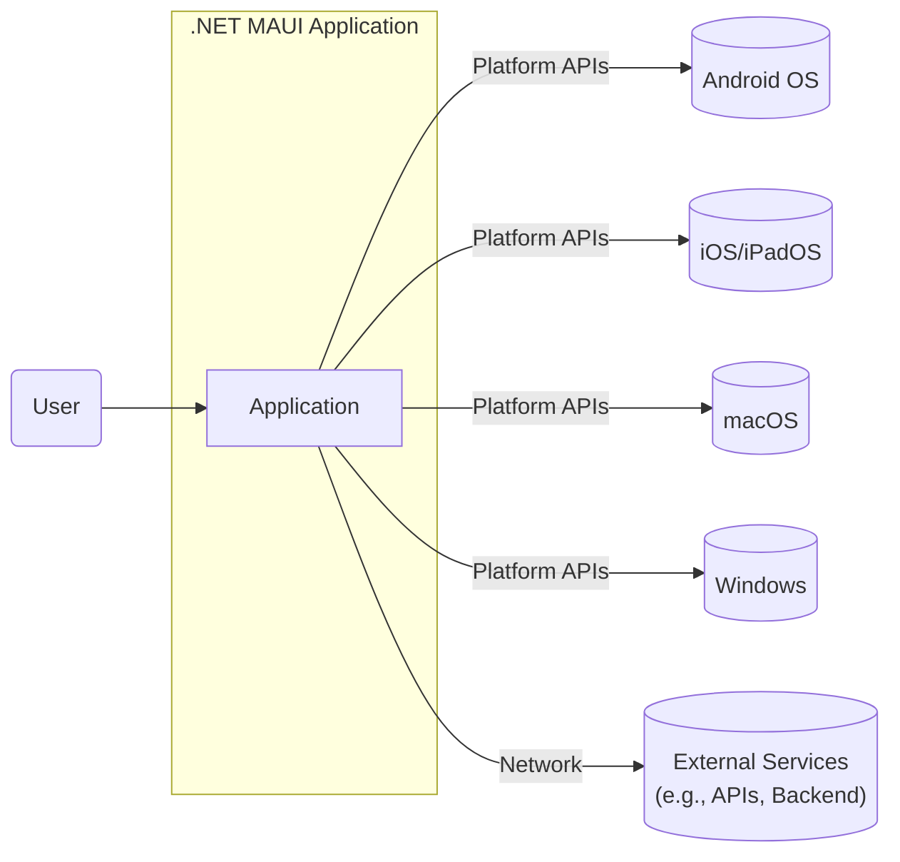
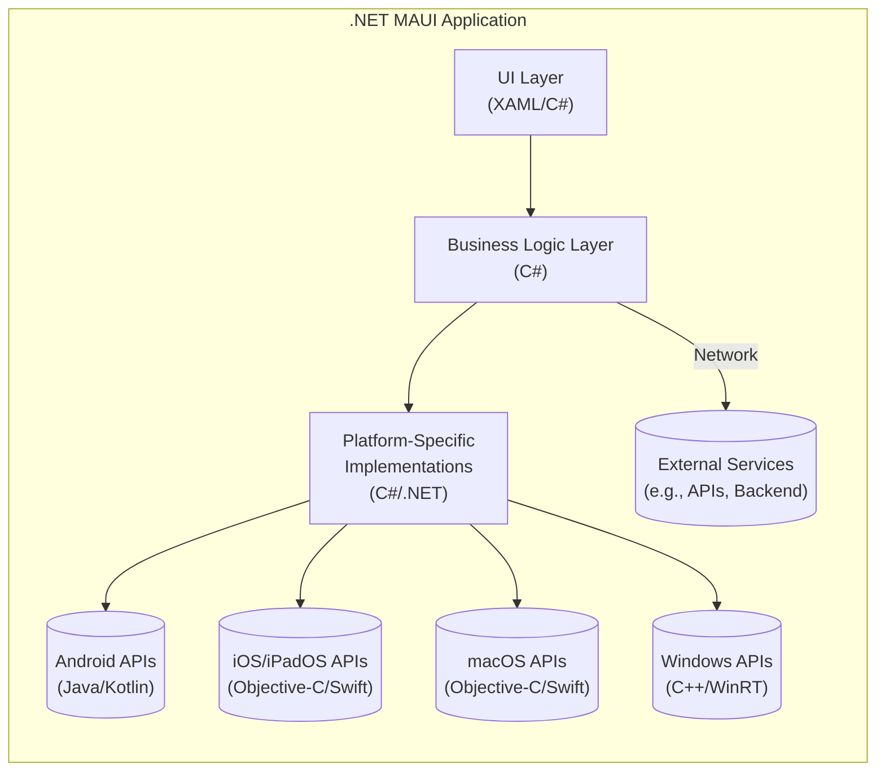
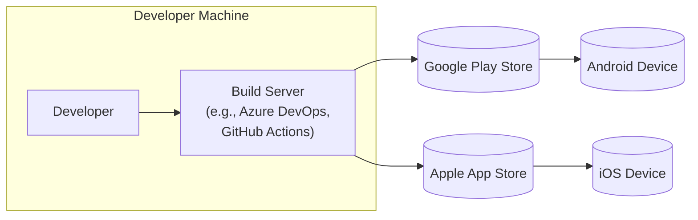
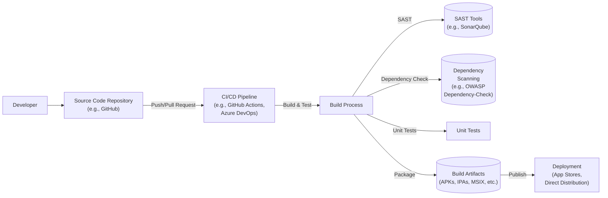

# BUSINESS POSTURE

Business Priorities and Goals:

*   Enable .NET developers to build cross-platform native applications for mobile and desktop from a single codebase.
*   Provide a modern, productive development experience that simplifies and accelerates UI development.
*   Offer a consistent API and UI framework across different platforms (Android, iOS, macOS, Windows).
*   Maintain high performance and native look-and-feel on each platform.
*   Facilitate code reuse and reduce development time and cost.
*   Expand the reach of .NET to new platforms and devices.
*   Attract and retain developers within the .NET ecosystem.

Most Important Business Risks:

*   Failure to deliver a stable and performant framework could lead to developer frustration and abandonment.
*   Inability to keep pace with platform-specific updates (Android, iOS, etc.) could render applications obsolete or incompatible.
*   Security vulnerabilities in the framework could expose user data and damage the reputation of .NET MAUI and Microsoft.
*   Lack of adoption by the developer community could limit the framework's success and impact.
*   Competition from other cross-platform frameworks (e.g., React Native, Flutter) could diminish market share.
*   Inconsistent UI/UX across platforms could lead to a fragmented user experience.

# SECURITY POSTURE

Existing Security Controls (based on the repository and general .NET practices):

*   security control: Secure Development Lifecycle (SDL) practices are likely followed, although the specific details are not fully exposed in the public repository. This includes threat modeling, code reviews, static analysis, and security testing.
*   security control: .NET platform security features: .NET MAUI leverages the underlying security features of the .NET platform, such as code access security (CAS), role-based security, and cryptographic libraries. Implemented in .NET runtime and Base Class Library (BCL).
*   security control: Platform-specific security features: .NET MAUI applications utilize the security mechanisms provided by each target platform (Android, iOS, macOS, Windows). This includes sandboxing, permissions models, and secure storage APIs. Implemented in platform-specific bindings and native code.
*   security control: Managed code: The majority of .NET MAUI code is written in C#, which is a memory-safe language, reducing the risk of common vulnerabilities like buffer overflows. Implemented in .NET MAUI codebase.
*   security control: Regular updates and patching: Microsoft provides regular updates and security patches for .NET and .NET MAUI to address newly discovered vulnerabilities. Implemented through NuGet package updates and platform updates.

Accepted Risks:

*   accepted risk: Reliance on third-party libraries and dependencies: .NET MAUI, like any complex framework, depends on third-party libraries. Vulnerabilities in these libraries could impact the security of .NET MAUI applications.
*   accepted risk: Platform-specific vulnerabilities: While .NET MAUI abstracts away many platform details, vulnerabilities in the underlying operating systems (Android, iOS, macOS, Windows) can still affect applications.
*   accepted risk: Developer errors: The security of a .NET MAUI application ultimately depends on the developers who build it. Poor coding practices or security misconfigurations can introduce vulnerabilities.

Recommended Security Controls:

*   security control: Implement a robust dependency management process, including regular scanning for known vulnerabilities in third-party libraries (e.g., using tools like OWASP Dependency-Check or Snyk).
*   security control: Conduct regular penetration testing and security assessments of .NET MAUI applications, focusing on platform-specific attack vectors.
*   security control: Provide clear security guidance and documentation for developers building .NET MAUI applications, covering topics like secure coding practices, data protection, and authentication/authorization.
*   security control: Implement a mechanism for securely reporting and handling security vulnerabilities discovered in .NET MAUI itself.
*   security control: Integrate automated security checks into the build pipeline, including static application security testing (SAST) and dynamic application security testing (DAST).

Security Requirements:

*   Authentication:
    *   Support for standard authentication protocols (e.g., OAuth 2.0, OpenID Connect).
    *   Integration with platform-specific authentication mechanisms (e.g., biometric authentication).
    *   Secure storage of authentication tokens and credentials.
*   Authorization:
    *   Fine-grained access control to application features and data.
    *   Role-based access control (RBAC) capabilities.
    *   Integration with platform-specific authorization mechanisms.
*   Input Validation:
    *   Thorough validation of all user inputs to prevent injection attacks (e.g., XSS, SQL injection).
    *   Use of whitelisting and input sanitization techniques.
    *   Validation of data received from external sources (e.g., APIs, web services).
*   Cryptography:
    *   Use of strong, industry-standard cryptographic algorithms for data protection (e.g., AES, RSA).
    *   Secure key management practices.
    *   Protection of sensitive data in transit and at rest.
    *   Compliance with relevant cryptographic standards (e.g., FIPS 140-2).

# DESIGN

## C4 CONTEXT

Element Descriptions:

*   Element:
    *   Name: User
    *   Type: Person
    *   Description: A user interacting with the .NET MAUI application on a supported platform.
    *   Responsibilities: Interacts with the application's UI, provides input, and receives output.
    *   Security controls: None directly implemented by the user; relies on the application and platform security.

*   Element:
    *   Name: Application
    *   Type: Software System
    *   Description: The .NET MAUI application built using the framework.
    *   Responsibilities: Provides the application's functionality, handles user input, interacts with platform APIs and external services.
    *   Security controls: Input validation, authentication, authorization, data protection, secure communication.

*   Element:
    *   Name: Android OS
    *   Type: Operating System
    *   Description: The Android operating system.
    *   Responsibilities: Provides the underlying platform for running the .NET MAUI application on Android devices.
    *   Security controls: Sandboxing, permissions model, secure storage, inter-process communication (IPC) security.

*   Element:
    *   Name: iOS/iPadOS
    *   Type: Operating System
    *   Description: The iOS/iPadOS operating system.
    *   Responsibilities: Provides the underlying platform for running the .NET MAUI application on iOS/iPadOS devices.
    *   Security controls: Sandboxing, permissions model, secure storage, keychain, data protection APIs.

*   Element:
    *   Name: macOS
    *   Type: Operating System
    *   Description: The macOS operating system.
    *   Responsibilities: Provides the underlying platform for running the .NET MAUI application on macOS devices.
    *   Security controls: Sandboxing, permissions model, secure storage, keychain, Gatekeeper.

*   Element:
    *   Name: Windows
    *   Type: Operating System
    *   Description: The Windows operating system.
    *   Responsibilities: Provides the underlying platform for running the .NET MAUI application on Windows devices.
    *   Security controls: User Account Control (UAC), sandboxing (for UWP/WinUI apps), data protection API (DPAPI), Windows Defender.

*   Element:
    *   Name: External Services
    *   Type: External System
    *   Description: External services that the .NET MAUI application interacts with, such as APIs, backend systems, or cloud services.
    *   Responsibilities: Varies depending on the specific service.
    *   Security controls: Depends on the specific service; should include secure communication (HTTPS), authentication, and authorization.

## C4 CONTAINER

Element Descriptions:

*   Element:
    *   Name: UI Layer
    *   Type: Container (Code)
    *   Description: The user interface layer of the application, defined using XAML and C#.
    *   Responsibilities: Handles user interaction, displays data, and communicates with the business logic layer.
    *   Security controls: Input validation, output encoding (to prevent XSS), UI-level authorization checks.

*   Element:
    *   Name: Business Logic Layer
    *   Type: Container (Code)
    *   Description: The core logic of the application, written in C#.
    *   Responsibilities: Implements business rules, processes data, interacts with platform-specific implementations and external services.
    *   Security controls: Authentication, authorization, data validation, secure communication with external services.

*   Element:
    *   Name: Platform-Specific Implementations
    *   Type: Container (Code)
    *   Description: Platform-specific code that bridges the gap between the shared business logic and the native platform APIs.
    *   Responsibilities: Provides concrete implementations of platform-specific features (e.g., file access, networking, UI controls).
    *   Security controls: Leverages platform-specific security features, secure handling of native API calls.

*   Element:
    *   Name: Android APIs
    *   Type: External System (Platform)
    *   Description: The native Android APIs, accessed through Java/Kotlin bindings.
    *   Responsibilities: Provides access to Android platform features.
    *   Security controls: Android platform security features (sandboxing, permissions, etc.).

*   Element:
    *   Name: iOS/iPadOS APIs
    *   Type: External System (Platform)
    *   Description: The native iOS/iPadOS APIs, accessed through Objective-C/Swift bindings.
    *   Responsibilities: Provides access to iOS/iPadOS platform features.
    *   Security controls: iOS/iPadOS platform security features (sandboxing, permissions, etc.).

*   Element:
    *   Name: macOS APIs
    *   Type: External System (Platform)
    *   Description: The native macOS APIs, accessed through Objective-C/Swift bindings.
    *   Responsibilities: Provides access to macOS platform features.
    *   Security controls: macOS platform security features (sandboxing, permissions, etc.).

*   Element:
    *   Name: Windows APIs
    *   Type: External System (Platform)
    *   Description: The native Windows APIs, accessed through C++/WinRT.
    *   Responsibilities: Provides access to Windows platform features.
    *   Security controls: Windows platform security features (UAC, sandboxing, etc.).

*   Element:
    *   Name: External Services
    *   Type: External System
    *   Description: External services that the application interacts with.
    *   Responsibilities: Varies depending on the service.
    *   Security controls: Depends on the specific service; should include secure communication (HTTPS), authentication, and authorization.

## DEPLOYMENT

Possible Deployment Solutions:

1.  **Mobile App Stores (Android, iOS):**  Applications are packaged and submitted to the respective app stores (Google Play Store, Apple App Store) for distribution.
2.  **macOS App Store / Direct Distribution:** macOS applications can be distributed through the Mac App Store or directly to users (with appropriate code signing and notarization).
3.  **Windows - Microsoft Store / MSIX / Direct Distribution:** Windows applications can be distributed through the Microsoft Store, packaged as MSIX packages, or distributed directly (with code signing).
4.  **Ad-Hoc Distribution (Mobile):** For testing and internal distribution, mobile applications can be distributed ad-hoc using platform-specific mechanisms (e.g., Android APKs, iOS IPA files with provisioning profiles).

Chosen Solution (for detailed description): Mobile App Stores (Android, iOS)

Element Descriptions:

*   Element:
    *   Name: Developer
    *   Type: Person
    *   Description: The developer building and deploying the .NET MAUI application.
    *   Responsibilities: Writes code, configures build settings, initiates the deployment process.
    *   Security controls: Access controls to development tools and source code repositories.

*   Element:
    *   Name: Build Server
    *   Type: Infrastructure (Server)
    *   Description: A build server (e.g., Azure DevOps, GitHub Actions) that automates the build and packaging process.
    *   Responsibilities: Compiles the code, runs tests, creates platform-specific application packages.
    *   Security controls: Secure access controls, build environment isolation, code signing, vulnerability scanning of build artifacts.

*   Element:
    *   Name: Google Play Store
    *   Type: External System (App Store)
    *   Description: The Google Play Store for distributing Android applications.
    *   Responsibilities: Hosts and distributes Android application packages (APKs or AABs).
    *   Security controls: Google Play Store security checks, app signing verification, user reviews and ratings.

*   Element:
    *   Name: Apple App Store
    *   Type: External System (App Store)
    *   Description: The Apple App Store for distributing iOS/iPadOS applications.
    *   Responsibilities: Hosts and distributes iOS/iPadOS application packages (IPAs).
    *   Security controls: Apple App Store review process, app signing verification, sandboxing enforcement.

*   Element:
    *   Name: Android Device
    *   Type: Device
    *   Description: An Android device running the .NET MAUI application.
    *   Responsibilities: Downloads and installs the application from the Google Play Store.
    *   Security controls: Android platform security features.

*   Element:
    *   Name: iOS Device
    *   Type: Device
    *   Description: An iOS/iPadOS device running the .NET MAUI application.
    *   Responsibilities: Downloads and installs the application from the Apple App Store.
    *   Security controls: iOS/iPadOS platform security features.

## BUILD

Build Process Description:

1.  **Developer:** The developer writes code and commits changes to a source code repository (e.g., GitHub).
2.  **Source Code Repository:** The repository stores the application's source code and tracks changes.
3.  **CI/CD Pipeline:** A CI/CD pipeline (e.g., GitHub Actions, Azure DevOps) is triggered by events in the repository (e.g., push, pull request).
4.  **Build Process:** The pipeline initiates the build process, which typically includes:
    *   **Compilation:** Compiling the .NET MAUI code into platform-specific executables.
    *   **SAST:** Static Application Security Testing (SAST) tools (e.g., SonarQube) analyze the source code for potential security vulnerabilities.
    *   **Dependency Check:** Dependency scanning tools (e.g., OWASP Dependency-Check) identify known vulnerabilities in third-party libraries.
    *   **Unit Tests:** Running unit tests to ensure code quality and functionality.
    *   **Packaging:** Creating platform-specific application packages (e.g., APKs for Android, IPAs for iOS, MSIX for Windows).
5.  **Build Artifacts:** The build process produces build artifacts, which are the deployable application packages.
6.  **Publish:** The pipeline publishes the build artifacts to the appropriate deployment targets (e.g., app stores, direct distribution channels).

Security Controls in Build Process:

*   security control: **Source Code Repository Security:** Access controls, branch protection rules, code review requirements.
*   security control: **CI/CD Pipeline Security:** Secure configuration of the pipeline, limited access to secrets and credentials.
*   security control: **SAST:** Static analysis to identify vulnerabilities in the source code.
*   security control: **Dependency Scanning:** Identifying and mitigating vulnerabilities in third-party libraries.
*   security control: **Code Signing:** Digitally signing the application packages to ensure authenticity and integrity.
*   security control: **Build Artifact Security:** Secure storage and handling of build artifacts.

# RISK ASSESSMENT

Critical Business Processes to Protect:

*   **Application Functionality:** Ensuring the .NET MAUI application functions as intended and provides a positive user experience.
*   **User Data Protection:** Protecting user data from unauthorized access, disclosure, or modification.
*   **Application Availability:** Maintaining the availability of the application and preventing disruptions.
*   **Reputation Management:** Protecting the reputation of .NET MAUI and Microsoft.

Data to Protect and Sensitivity:

*   **User Data (Potentially Sensitive):** Depending on the specific application, this could include personal information, financial data, health data, or other sensitive information. Sensitivity level: High to Very High.
*   **Application Code (Proprietary):** The source code of the .NET MAUI application itself. Sensitivity level: Medium to High.
*   **Configuration Data (Potentially Sensitive):** API keys, connection strings, and other configuration data. Sensitivity level: Medium to High.
*   **Authentication Tokens (Highly Sensitive):** Tokens used to authenticate users and authorize access to resources. Sensitivity level: Very High.

# QUESTIONS & ASSUMPTIONS

Questions:

*   What specific types of user data will .NET MAUI applications typically handle? This will influence the data protection requirements.
*   Are there any specific compliance requirements (e.g., GDPR, HIPAA) that .NET MAUI applications need to adhere to?
*   What is the expected threat model for .NET MAUI applications? (e.g., targeted attacks, opportunistic attacks)
*   What level of security assurance is required for .NET MAUI applications? (e.g., basic security, high security)
*   What are the specific security requirements for interacting with external services (APIs, backend systems)?
*   What are the specific mechanisms used for code signing and notarization on different platforms?
*   What are the details of the SDL practices followed in the development of .NET MAUI?
*   How is secrets management handled within the .NET MAUI framework and recommended for applications built upon it?

Assumptions:

*   BUSINESS POSTURE: The primary business goal is to provide a robust and widely adopted cross-platform development framework.
*   SECURITY POSTURE: Microsoft's standard SDL practices are followed, but details are not fully public.
*   DESIGN: The design follows a layered architecture, separating UI, business logic, and platform-specific implementations. The build process utilizes a CI/CD pipeline with automated security checks. Deployment primarily targets app stores.