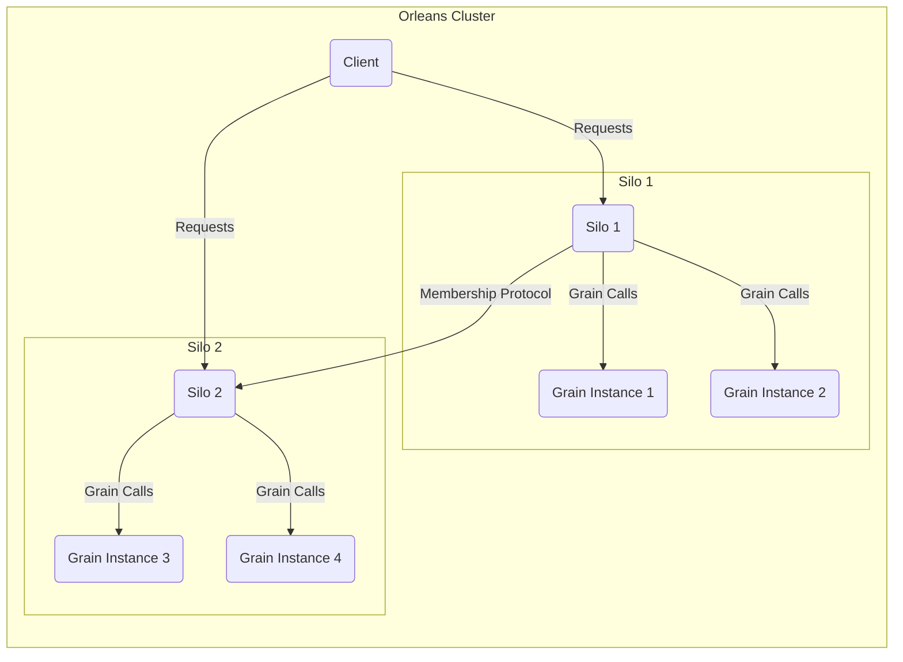
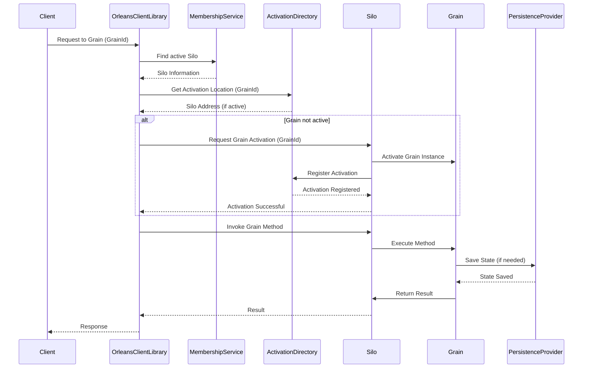

# Project Design Document: Orleans Distributed Actor Framework

**Version:** 1.1
**Date:** October 26, 2023
**Prepared By:** AI Software Architect

## 1. Introduction

This document provides a detailed architectural design overview of the [Orleans](https://github.com/dotnet/orleans) distributed actor framework. This document is intended to serve as a comprehensive foundation for subsequent threat modeling activities. It outlines the key components, their interactions, data flows, and security considerations within the system.

## 2. Goals and Objectives

The primary goal of Orleans is to provide a straightforward approach to building distributed, scalable, and reliable applications. Key objectives include:

* **Simplified Distributed Programming:** Abstracting away the complexities of distributed systems, allowing developers to focus on business logic.
* **Scalability:** Enabling applications to scale horizontally by adding more Silo resources to the cluster.
* **Fault Tolerance:** Ensuring application resilience in the face of individual Silo or component failures.
* **Location Transparency:** Allowing developers to interact with Grains without needing to know their physical location within the cluster.
* **State Management:** Providing built-in mechanisms for managing the persistent state of distributed actors (Grains).

## 3. Architectural Overview

Orleans employs a virtual actor model, where independent units of computation called "Grains" encapsulate state and behavior. These Grains reside within "Silos," which are the runtime environments for Grains. A cluster of interconnected Silos forms the Orleans application.

## 4. Key Components

* **Client:** The entry point for interacting with the Orleans cluster. Clients initiate requests to Grains through the Orleans client library.
* **Silo:** The fundamental runtime unit in Orleans. It hosts and manages Grain instances, providing the execution environment and resources.
* **Grain:** A virtual actor, the core building block of an Orleans application. Grains are addressable, single-threaded units that encapsulate state and behavior. They exist virtually and are activated on demand.
* **Grain Interface:** Defines the contract for interacting with a specific type of Grain. It specifies the methods that can be called on Grains of that type.
* **Grain Implementation:** The concrete code that implements the logic and state management for a specific Grain interface.
* **Activation:** The process of creating an in-memory instance of a Grain in a Silo when it receives its first request.
* **Deactivation:** The process of removing an inactive Grain instance from memory to conserve resources. Orleans manages deactivation automatically based on inactivity.
* **Placement:** The mechanism within the Orleans runtime that determines which Silo a Grain should be activated on. Placement strategies can be default or custom.
* **Directory Service (Membership):** Responsible for maintaining a consistent view of the active Silos within the cluster. This component handles Silo discovery, health monitoring, and failure detection.
* **Activation Directory:** Maintains the mapping of Grain identities to the Silos where they are currently activated. This allows the runtime to route requests to the correct Grain instance.
* **Persistence Provider:** A pluggable mechanism for storing and retrieving Grain state. Orleans supports various persistence providers, including Azure Table Storage, SQL databases, and in-memory providers.
* **Stream Provider:** Enables asynchronous, near real-time event delivery to subscribers. Grains can publish and subscribe to streams of events.
* **Reminder Service:** Allows Grains to schedule future actions, even if the Grain is currently deactivated. The runtime will reactivate the Grain when a reminder fires.
* **Timer Service:** Provides a mechanism for Grains to execute code periodically while they are active. Timers are local to the active Grain instance.

## 5. Component Interactions and Data Flow

The typical interaction flow in Orleans involves the following steps:

1. **Client Request:** A client application, using the Orleans client library, initiates a request to a specific Grain. The client identifies the target Grain by its unique identity (e.g., a GUID or a string key).
2. **Location Transparency and Request Routing:** The Orleans client library contacts the cluster's Membership Service to find an active Silo. It then queries the Activation Directory to locate the Grain's current activation.
3. **Activation (if needed):** If the Grain is not currently active, the cluster's Placement strategy determines the most suitable Silo for activation. The runtime then creates an instance of the Grain in that Silo.
4. **Method Invocation:** The request is routed to the activated Grain instance within the designated Silo.
5. **Grain Processing:** The Grain executes the requested method, potentially accessing and modifying its internal state, and interacting with other Grains or external services.
6. **Persistence (optional):** If the Grain's state has been modified and persistence is configured, the Grain's state is serialized and written to the configured Persistence Provider.
7. **Response:** The Grain sends a response back through the Silo and the client library to the originating client.

**Data Flow Examples:**

* **Grain-to-Grain Call:** When one Grain calls a method on another Grain, the data (method parameters and return values) is serialized and transmitted between the source and destination Silos.
* **Persistence Operations:** Grain state is serialized and transmitted to the Persistence Provider for storage. When a Grain is activated, its state is retrieved from the Persistence Provider and deserialized.
* **Stream Events:** When a Grain publishes an event to a Stream, the event data is transmitted to the Stream Provider, which then distributes it to subscribed Grains.

## 6. Deployment Considerations

Orleans clusters can be deployed in various environments, each with its own security implications:

* **On-Premises Data Centers:** Requires careful network configuration and security hardening of the underlying infrastructure.
* **Cloud Environments (e.g., Azure, AWS, GCP):** Leverages cloud provider security features but requires proper configuration of network security groups, access controls, and encryption.
* **Containerized Environments (e.g., Kubernetes):** Offers flexibility and scalability but introduces complexities in managing container security and network policies.

Deployment typically involves configuring:

* **Silo Endpoints:** Network addresses and ports used for inter-Silo communication. Secure configuration is crucial to prevent unauthorized access.
* **Membership Provider:** The mechanism for cluster discovery and management. The security of the membership provider is critical for maintaining cluster integrity. Examples include Azure Table Storage, SQL Server, and ZooKeeper.
* **Persistence Providers:** Configuration for storing Grain state. Secure storage and access control for the persistence layer are essential.
* **Stream Providers:** Configuration for event streaming infrastructure. Security considerations include authorization and encryption of stream data.

## 7. Security Considerations

Security considerations for an Orleans application are multifaceted and span various aspects of the architecture:

* **Authentication and Authorization:**
    * **Client to Cluster:** How are clients authenticated when connecting to the Orleans cluster? Mechanisms might include API keys, OAuth 2.0, or custom authentication providers.
    * **Grain to Grain:** How are Grain calls authorized? Orleans provides mechanisms for implementing authorization logic within Grain methods or using interceptors.
* **Data Protection:**
    * **In Transit:** How is communication between clients and Silos, and between Silos, secured? TLS encryption should be enforced for all network communication within the cluster and with external clients.
    * **At Rest:** How is Grain state protected in the Persistence Provider? Encryption at rest should be implemented using provider-specific features or application-level encryption.
* **Membership and Cluster Security:**
    * How is the integrity of the cluster membership maintained? Secure configuration of the Membership Provider is crucial to prevent unauthorized Silos from joining the cluster. Mutual authentication between Silos can enhance security.
    * How are unauthorized Silos prevented from joining the cluster?  Strong authentication and authorization mechanisms for Silo registration are necessary.
* **Input Validation:** How are inputs to Grain methods validated to prevent injection attacks (e.g., SQL injection, command injection)? Robust input validation should be implemented within Grain logic.
* **Denial of Service (DoS) Protection:** How is the cluster protected from being overwhelmed by malicious requests? Implementing rate limiting, request throttling, and proper resource management can mitigate DoS attacks.
* **Code Security:** Ensuring the security of the Grain implementation code itself is paramount. Regular security audits and adherence to secure coding practices are essential.
* **Dependency Management:**  Securing dependencies used by the Orleans application. Regularly scanning for and patching known vulnerabilities in third-party libraries is crucial.
* **Configuration Security:** Securely managing and storing configuration data, including connection strings and API keys. Avoid storing sensitive information in plain text.

## 8. Assumptions and Constraints

* This document provides a general architectural overview. Specific security implementations will vary depending on the application's requirements and the chosen deployment environment.
* The security considerations outlined are intended to be comprehensive but may not cover all potential threats. A thorough threat modeling exercise is necessary to identify specific vulnerabilities.
* The security posture of the Orleans application is also dependent on the security of the underlying infrastructure and the practices of the development and operations teams.

## 9. Future Considerations

* Detailed design of specific Grain types and their security requirements.
* Implementation details of custom authentication and authorization mechanisms.
* Specific encryption strategies for data at rest and in transit.
* Integration with security information and event management (SIEM) systems for monitoring and alerting.

This document provides a solid foundation for understanding the architecture and security considerations of an Orleans application. It will be a valuable resource for conducting a comprehensive threat modeling exercise to identify and mitigate potential security risks.