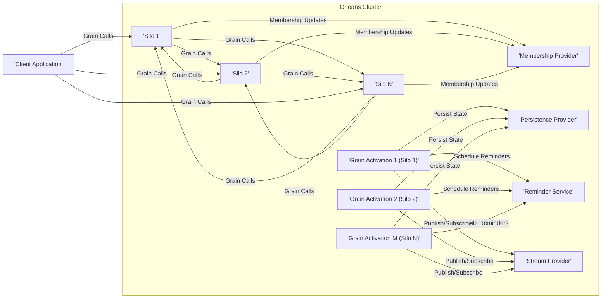
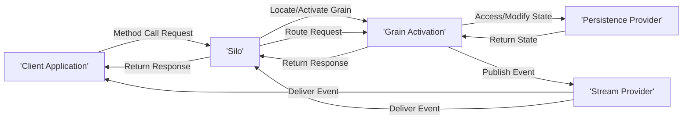

# Project Design Document: Orleans Distributed Virtual Actor Framework

**Version:** 1.1
**Date:** October 26, 2023
**Author:** AI Software Architect

## 1. Introduction

This document provides a detailed architectural design of the Orleans distributed virtual actor framework, based on the codebase available at [https://github.com/dotnet/orleans](https://github.com/dotnet/orleans). This document aims to offer a comprehensive understanding of the system's components, their interactions, and the underlying architecture, serving as a solid foundation for subsequent threat modeling activities. This revision expands on the initial design with more detail and clarifies certain aspects.

## 2. Goals

*   Provide a comprehensive and detailed overview of the Orleans architecture, including key concepts and mechanisms.
*   Clearly identify key components, their specific responsibilities, and their relationships within the system.
*   Describe the interactions and data flow between components with greater precision.
*   Establish a clear understanding of the system's boundaries, interfaces, and external dependencies.
*   Serve as a robust and informative basis for identifying potential security threats and vulnerabilities during threat modeling.

## 3. Target Audience

This document is intended for:

*   Security engineers and architects tasked with performing threat modeling and security assessments.
*   Developers actively working with, extending, or contributing to the Orleans project.
*   Operations and DevOps teams responsible for the deployment, configuration, and ongoing management of Orleans clusters.
*   Anyone seeking a deeper technical understanding of the Orleans architecture.

## 4. System Overview

Orleans is a powerful, cross-platform framework designed for building scalable and resilient distributed applications. Its core programming model is based on the "virtual actor" concept (referred to as "Grains" in Orleans), where actors are lightweight, isolated, and location-transparent units of computation and state. Orleans automatically manages the lifecycle, placement, activation, deactivation, and communication of these Grains across a cluster of servers (Silos). This abstraction simplifies the development of complex distributed systems.

## 5. Architectural Design

The fundamental structure of Orleans involves a cluster of interconnected server processes (Silos) that host and manage the virtual actors (Grains). Client applications interact with these Grains through a logical addressing scheme, without needing to know the physical location of the Grain.

### 5.1. Key Components

*   **Silo:** A server process instance that forms part of an Orleans cluster. Each Silo hosts and executes Grain activations. Silos collaborate to provide a unified platform for Grain management.
*   **Grain:** The fundamental building block of an Orleans application, representing a virtual actor. Each Grain has a unique identity, encapsulates its own state, and defines its behavior through an interface. Grains are activated on demand and deactivated when idle.
    *   **Grain Interface:** A .NET interface that defines the contract for interacting with a specific type of Grain. It specifies the methods that can be invoked on Grains of that type.
    *   **Grain Implementation:** The concrete .NET class that implements a Grain interface, containing the business logic and state management for that Grain type.
    *   **Grain Identity:** A unique identifier that logically addresses a Grain, independent of its physical location. This allows clients to interact with Grains without knowing which Silo is hosting them.
*   **Client:** An application (running outside the Silo cluster) that initiates interactions with Grains hosted within the Orleans cluster. Clients use a client-side library to connect to the cluster and obtain references to Grains.
*   **Membership Provider:** A component responsible for maintaining a consistent view of the active Silos within the cluster. It handles the discovery of new Silos, the detection of failed Silos, and the agreement on the current cluster topology. Examples include Azure Table Storage, SQL Server, and Consul.
*   **Activation:** The process of instantiating a Grain in memory on a specific Silo when a client or another Grain first attempts to interact with it. Orleans manages the activation and deactivation lifecycle automatically.
*   **Deactivation:** The process of removing an inactive Grain from memory to conserve resources. Orleans employs strategies to determine when a Grain is no longer needed and can be deactivated. The Grain's state is typically persisted before deactivation.
*   **Placement Strategy:** The algorithm used by Orleans to determine which Silo a new Grain activation should be placed on. Strategies can consider factors like load balancing, locality, and specialized hardware requirements.
*   **Persistence Provider:** A mechanism for storing and retrieving the state of Grains. Orleans supports various persistence providers, allowing developers to choose the most appropriate storage solution for their needs (e.g., Azure Blob Storage, SQL Server, Cosmos DB, in-memory).
*   **Reminder Service:** A distributed scheduling mechanism that allows Grains to register for future notifications, even if the Grain is deactivated and needs to be reactivated to handle the reminder.
*   **Stream Provider:** Enables asynchronous, near real-time delivery of ordered sequences of events (streams) to subscribers. This allows for building reactive and event-driven applications with Orleans.
*   **Networking Layer:** Handles the underlying communication between Silos within the cluster and between Clients and Silos. Orleans uses a pluggable networking layer, with TCP being the default transport.
*   **Management Tools:** Utilities and APIs for monitoring the health and performance of the Orleans cluster, managing Grain activations, and performing administrative tasks.

### 5.2. Component Interactions

*   **Client Interaction with Grains:**
    *   Clients obtain a reference to a Grain using its unique identity through the client-side library.
    *   The client library communicates with the cluster to locate or activate the target Grain.
    *   Method calls are marshaled and sent over the network to the Silo hosting the Grain activation.
    *   The Grain executes the method and returns a response, which is sent back to the client.
*   **Grain-to-Grain Communication:**
    *   Grains can obtain references to other Grains within the cluster using their identities.
    *   When a Grain invokes a method on another Grain, the Orleans runtime handles the location and routing of the call transparently.
*   **Silo Membership Management:**
    *   Silos register their presence with the Membership Provider upon startup.
    *   Silos periodically communicate with the Membership Provider to maintain their active status.
    *   The Membership Provider disseminates information about the active Silos to all members of the cluster.
    *   Failure detection mechanisms within the Membership Provider allow the cluster to react to Silo failures.
*   **Grain Persistence:**
    *   Grains interact with the configured Persistence Provider to save their state periodically or on demand.
    *   When a Grain is activated, its state is loaded from the Persistence Provider.
    *   Orleans provides mechanisms for managing concurrency and consistency when accessing and updating Grain state.
*   **Reminders and Scheduling:**
    *   Grains can register reminders with the Reminder Service, specifying a due time and a period for recurring reminders.
    *   The Reminder Service persists the reminder information and ensures that the target Grain is activated at the scheduled time to process the reminder.
*   **Streams and Event Delivery:**
    *   Grains and Clients can publish events to named streams.
    *   Subscribers (Grains or Clients) can subscribe to specific streams to receive events in near real-time.
    *   Stream Providers handle the reliable and ordered delivery of events to subscribers.

### 5.3. Data Flow

The primary data flow within an Orleans system involves the movement of requests, responses, state data, and event data between different components.

*   **Client-Initiated Requests:** Client applications send method call requests to interact with Grains. These requests contain the target Grain identity, the method to be invoked, and any necessary parameters.
*   **Grain State Management:** Grain state is read from the Persistence Provider when a Grain is activated and written back to the Persistence Provider when the state is modified or the Grain is deactivated.
*   **Inter-Grain Communication:** When one Grain calls a method on another Grain, messages containing the target Grain identity, method name, and parameters are exchanged between the Silos hosting the respective Grains.
*   **Stream Event Propagation:** Events published to streams are routed through the Stream Provider and delivered to all subscribed Grains and Clients.
*   **Membership Updates:** Information about the active Silos in the cluster is exchanged between Silos and the Membership Provider to maintain a consistent view of the cluster topology.

## 6. Deployment Model

Orleans offers flexibility in deployment options, catering to various infrastructure needs:

*   **Cloud Environments (e.g., Azure, AWS, GCP):** Leveraging cloud-managed services for scalability, resilience, and automated infrastructure management. Orleans integrates well with cloud-native technologies.
*   **On-Premise Data Centers:** Deployment on physical or virtual machines within an organization's own data center, providing greater control over the infrastructure.
*   **Containerized Environments (e.g., Docker, Kubernetes):** Orleans can be deployed within containers, enabling portability and scalability through container orchestration platforms.
*   **Hybrid Environments:** Combining cloud and on-premise deployments to meet specific requirements for data locality, compliance, or cost optimization.

Typical deployment steps involve:

*   Provisioning the necessary infrastructure (virtual machines, containers, etc.) to host the Silos.
*   Configuring the chosen Membership Provider, ensuring it is accessible to all Silos in the cluster.
*   Configuring the desired Persistence Providers for storing Grain state.
*   Deploying the compiled Orleans application code (including Grain interfaces and implementations) to the Silo instances.
*   Deploying client applications that will interact with the Orleans cluster.
*   Configuring networking rules to allow communication between Silos and between Clients and Silos.

## 7. Technology Stack

Orleans is built upon the robust and versatile .NET platform and utilizes a range of technologies:

*   **Programming Language:** Primarily C#.
*   **.NET Runtime:** Requires a compatible .NET runtime environment (e.g., .NET 6, .NET 7).
*   **Networking:**  Defaults to TCP for inter-Silo and Client-to-Silo communication, with a pluggable architecture allowing for alternative transports.
*   **Serialization:** Employs efficient serialization mechanisms (e.g., .NET's built-in serializers, third-party serializers) for marshaling messages between components.
*   **Membership:** Supports various membership providers, including Azure Table Storage, SQL Server, Apache ZooKeeper, and Consul.
*   **Persistence:** Offers a pluggable persistence abstraction with implementations for various storage solutions like Azure Blob Storage, SQL Server, Azure Cosmos DB, and in-memory storage.
*   **Streaming:** Provides a flexible streaming abstraction with different provider implementations, such as Azure Event Hubs, Kafka, and in-memory streams.

## 8. Security Considerations (Detailed)

This section expands on the initial security considerations, providing more specific examples of potential threats and areas to focus on during threat modeling.

*   **Authentication and Authorization:**
    *   **Client Authentication:** How are client applications authenticating their identity when connecting to the Orleans cluster?  Consider mechanisms like API keys, OAuth 2.0, or mutual TLS.
    *   **Grain Authorization:** How is access to Grain methods controlled?  Are there mechanisms to ensure that only authorized clients or Grains can invoke specific methods?  Consider attribute-based authorization or policy-based authorization.
    *   **Inter-Grain Authentication/Authorization:** If Grains need to interact securely, how is their identity verified, and how are permissions managed?
*   **Secure Communication:**
    *   **Inter-Silo Communication Encryption:** Is communication between Silos encrypted to protect sensitive data in transit within the cluster? Consider TLS encryption for network traffic.
    *   **Client-to-Silo Communication Encryption:** Is communication between client applications and the Orleans cluster encrypted?  TLS is essential for protecting data transmitted over the public internet.
*   **Data Protection:**
    *   **Encryption at Rest:** How is sensitive Grain state protected when stored in the Persistence Provider?  Consider using encryption features provided by the storage provider or implementing application-level encryption.
    *   **Encryption in Transit:**  As mentioned above, ensure communication channels are encrypted.
    *   **Data Validation and Sanitization:** Implement robust input validation and sanitization within Grain methods to prevent injection attacks (e.g., SQL injection, cross-site scripting if Grains expose web interfaces).
*   **Denial of Service (DoS) Protection:**
    *   **Rate Limiting:** Implement rate limiting on client requests to prevent malicious actors from overwhelming the cluster with excessive requests.
    *   **Resource Limits:** Configure appropriate resource limits (e.g., CPU, memory) for Silo processes to prevent resource exhaustion.
    *   **Network Security:** Employ network security measures (firewalls, intrusion detection systems) to protect the cluster infrastructure.
*   **Access Control:**
    *   **Silo Access:** Restrict access to the machines hosting Silo processes to authorized personnel.
    *   **Management Tools Access:** Secure access to Orleans management tools and APIs to prevent unauthorized configuration changes or monitoring.
*   **Vulnerability Management:**
    *   **Regular Updates:** Keep the Orleans framework and its dependencies up-to-date with the latest security patches.
    *   **Dependency Scanning:** Use tools to scan dependencies for known vulnerabilities.
*   **Auditing and Logging:**
    *   **Security Auditing:** Log security-related events, such as authentication attempts, authorization failures, and access to sensitive data.
    *   **Operational Logging:**  Maintain logs for troubleshooting and monitoring the health of the Orleans cluster.
*   **Secrets Management:**
    *   **Secure Storage of Credentials:** Avoid storing sensitive credentials (e.g., database connection strings, API keys) directly in configuration files. Use secure secrets management solutions (e.g., Azure Key Vault, HashiCorp Vault).

## 9. Diagrams

The diagrams included in sections 5.2 and 5.3 provide visual representations of the architecture and data flow.

## 10. Conclusion

This detailed design document provides a comprehensive overview of the Orleans distributed virtual actor framework's architecture. It outlines the key components, their interactions, data flow, deployment considerations, and a more in-depth look at security aspects. This information serves as a crucial foundation for conducting a thorough threat model to identify and mitigate potential security risks associated with the Orleans project. The subsequent threat modeling exercise will leverage this document to analyze specific attack vectors and vulnerabilities in a more informed manner.