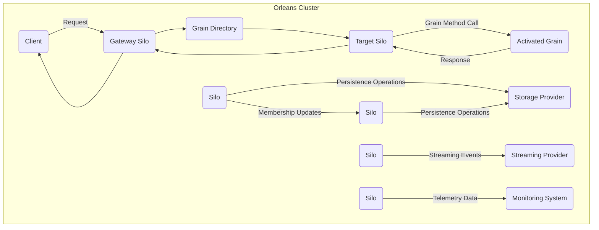

# Project Design Document: Orleans Distributed Actor Framework

**Version:** 1.1
**Date:** October 26, 2023
**Author:** AI Architecture Expert

## 1. Introduction

This document provides an enhanced architectural design of the Orleans distributed actor framework, based on the open-source project available at [https://github.com/dotnet/orleans](https://github.com/dotnet/orleans). Building upon the previous version, this document further clarifies the system's components, their interactions, and data flows, with a stronger emphasis on security considerations to facilitate comprehensive threat modeling activities.

Orleans simplifies the development of resilient and scalable distributed applications by providing an actor-based programming model. Grains, the fundamental building blocks, are virtual actors whose lifecycle, location, and communication are managed by the Orleans runtime.

## 2. Goals and Objectives

The primary goals of this enhanced design document are:

*   To provide a more detailed and refined overview of the Orleans architecture.
*   To elaborate on the responsibilities and potential security vulnerabilities of key components.
*   To provide a clearer illustration of the primary data flows within an Orleans application, highlighting security implications.
*   To offer more specific preliminary security considerations for each component, directly supporting future threat modeling.
*   To serve as a more robust and informative reference point for security assessments and the development of mitigation strategies.

## 3. System Architecture

An Orleans application operates within a cluster of **Silos**, which act as the execution environments for **Grains**. External **Clients** interact with this cluster to invoke methods on these grains.

### 3.1. Key Components

*   **Client:** An external entity (application, service) that initiates interactions with the Orleans cluster.
*   **Silo:** A runtime process that hosts and manages grain activations. A cluster comprises multiple interconnected silos.
*   **Grain:** The core unit of computation and state in Orleans, representing a virtual actor.
*   **Grain Directory:** A distributed service responsible for mapping grain identities to their active locations within the cluster.
*   **Activation:** The process of instantiating a grain in memory on a silo when it receives its first request.
*   **Deactivation:** The process of removing an inactive grain instance from memory to optimize resource utilization.
*   **Placement Strategy:** The algorithm used by Orleans to determine which silo should host a new grain activation.
*   **Membership Provider:** The component responsible for maintaining a consistent view of the active silos within the cluster.
*   **Persistence Provider:** Enables grains to durably store their state in external storage systems.
*   **Streaming Provider:** Facilitates asynchronous, push-based communication between grains and external systems.
*   **Networking Layer:** The underlying communication infrastructure enabling communication between clients and silos, and between silos themselves.
*   **Monitoring/Telemetry:** Components responsible for collecting and reporting operational metrics and logs.

## 4. Detailed Component Description

### 4.1. Client

*   **Role:** Initiates interactions with the Orleans cluster by sending requests to specific grains.
*   **Responsibilities:**
    *   Resolving grain references to locate the target grain.
    *   Serializing method call arguments and deserializing responses.
    *   Establishing and maintaining connections to the Orleans cluster (often through a gateway silo).
    *   Handling potential communication failures and retries.
*   **Security Considerations:**
    *   **Authentication:** Verifying the identity of the client making the request.
    *   **Authorization:** Ensuring the client has the necessary permissions to invoke the requested grain method.
    *   **Secure Communication:** Protecting the communication channel between the client and the cluster (e.g., using TLS).
    *   **Input Validation:** Preventing the client from sending malicious or malformed requests that could exploit vulnerabilities.
    *   **Rate Limiting:** Protecting the cluster from being overwhelmed by excessive requests from a single client.

### 4.2. Silo

*   **Role:** The runtime environment where grains are hosted, managed, and executed.
*   **Responsibilities:**
    *   Hosting and activating grain instances.
    *   Dispatching incoming method calls to the appropriate grain activation.
    *   Managing the lifecycle of grain activations (activation, deactivation, garbage collection).
    *   Participating in cluster membership and maintaining cluster state.
    *   Communicating with other silos for grain location, state transfer, and other coordination tasks.
    *   Interacting with persistence and streaming providers on behalf of hosted grains.
    *   Collecting and reporting telemetry data.
*   **Security Considerations:**
    *   **Inter-Silo Communication Security:** Encrypting communication between silos to prevent eavesdropping and tampering (e.g., using TLS).
    *   **Access Control:** Restricting access to silo resources and functionalities to authorized processes.
    *   **Grain Isolation:** Ensuring that grains running on the same silo are isolated from each other to prevent cross-contamination or information leakage.
    *   **Secure Configuration:** Properly configuring silo settings to minimize security risks.
    *   **Protection against Code Injection:** Preventing malicious code from being injected and executed within the silo process.
    *   **Resource Management:** Preventing resource exhaustion attacks that could impact the availability of the silo.

### 4.3. Grain

*   **Role:** The fundamental unit of computation and state in Orleans, representing a single-actor entity.
*   **Responsibilities:**
    *   Encapsulating application-specific logic and state.
    *   Processing incoming method calls sequentially.
    *   Maintaining its own internal state, which can be persisted.
    *   Communicating with other grains by sending requests.
    *   Participating in streams by publishing and subscribing to events.
*   **Security Considerations:**
    *   **Authorization:** Implementing fine-grained authorization to control which clients or grains can invoke specific methods.
    *   **State Protection:** Protecting the grain's internal state from unauthorized access or modification.
    *   **Secure Communication:** Ensuring secure communication when interacting with other grains.
    *   **Input Validation:** Validating all input received from method calls to prevent injection attacks and other vulnerabilities.
    *   **Data Sanitization:** Sanitizing output data to prevent cross-site scripting (XSS) or other injection vulnerabilities if the grain interacts with external systems.

### 4.4. Grain Directory

*   **Role:** Provides location transparency by maintaining a distributed mapping of grain identities to their currently active silos.
*   **Responsibilities:**
    *   Registering the location of newly activated grains.
    *   Resolving grain references to determine the silo hosting a specific grain.
    *   Handling updates to grain locations due to migrations or failures.
*   **Security Considerations:**
    *   **Integrity:** Protecting the grain directory data from unauthorized modification to prevent request redirection or denial of service.
    *   **Availability:** Ensuring the directory is highly available to prevent widespread service disruption.
    *   **Access Control:** Restricting access to the grain directory data and management operations.
    *   **Protection against Spoofing:** Preventing malicious actors from registering false grain locations.

### 4.5. Membership Provider

*   **Role:** Manages the cluster membership, ensuring all silos have a consistent view of the active members.
*   **Responsibilities:**
    *   Detecting silo failures and removing them from the cluster.
    *   Adding new silos to the cluster.
    *   Electing a leader silo for certain coordination tasks.
    *   Distributing membership information to all participating silos.
*   **Security Considerations:**
    *   **Secure Bootstrap:** Ensuring a secure process for the initial formation of the cluster.
    *   **Authentication and Authorization:** Verifying the identity of silos attempting to join the cluster and ensuring they are authorized.
    *   **Protection against Sybil Attacks:** Preventing malicious actors from introducing multiple fake silos into the cluster.
    *   **Integrity of Membership Information:** Protecting the membership data from unauthorized modification.

### 4.6. Persistence Provider

*   **Role:** Enables grains to durably store their state in external storage systems.
*   **Responsibilities:**
    *   Saving grain state to the configured storage medium.
    *   Loading grain state from storage when a grain is activated.
    *   Supporting various storage technologies (e.g., Azure Cosmos DB, SQL databases, Redis).
*   **Security Considerations:**
    *   **Secure Connection:** Establishing secure and authenticated connections to the underlying storage provider.
    *   **Encryption at Rest:** Encrypting sensitive grain state data stored in the persistence provider.
    *   **Access Control:** Properly configuring access controls to the storage resources to restrict access to authorized silos.
    *   **Data Integrity:** Ensuring the integrity of persisted data to prevent tampering.

### 4.7. Streaming Provider

*   **Role:** Facilitates asynchronous, push-based communication between grains and potentially external systems.
*   **Responsibilities:**
    *   Managing streams of events.
    *   Allowing grains to subscribe to and publish events on streams.
    *   Providing mechanisms for reliable or best-effort delivery of stream events.
*   **Security Considerations:**
    *   **Authorization:** Controlling which grains or clients can publish or subscribe to specific streams.
    *   **Data Confidentiality:** Protecting the data within stream events from unauthorized access (e.g., encryption).
    *   **Data Integrity:** Ensuring the integrity of stream events to prevent tampering.
    *   **Protection against Injection:** Preventing malicious actors from injecting harmful events into streams.

### 4.8. Networking Layer

*   **Role:** Provides the underlying communication infrastructure for all interactions within the Orleans system.
*   **Responsibilities:**
    *   Establishing and maintaining network connections between clients and silos, and between silos themselves.
    *   Serializing and deserializing messages exchanged between components.
    *   Ensuring reliable and ordered message delivery (depending on configuration).
*   **Security Considerations:**
    *   **Encryption in Transit:** Encrypting network traffic to protect against eavesdropping and man-in-the-middle attacks (e.g., using TLS).
    *   **Authentication:** Verifying the identity of communicating endpoints.
    *   **Protection against Network Attacks:** Implementing measures to mitigate network-based attacks such as SYN floods or DDoS.

### 4.9. Monitoring/Telemetry

*   **Role:** Collects and reports operational metrics, logs, and traces to provide insights into the health and performance of the Orleans cluster.
*   **Responsibilities:**
    *   Collecting metrics on silo resource utilization, grain activity, and other relevant data.
    *   Aggregating and storing collected data.
    *   Providing interfaces for querying and visualizing monitoring data.
*   **Security Considerations:**
    *   **Secure Access:** Restricting access to monitoring data to authorized personnel.
    *   **Data Integrity:** Ensuring the integrity of monitoring data to prevent tampering or falsification.
    *   **Protection of Sensitive Information:** Avoiding the logging of sensitive application data in telemetry.

## 5. Data Flow

The following outlines the typical data flow for a client interacting with a grain, highlighting potential security checkpoints:

1. **Client Request (Security Checkpoint: Authentication & Authorization):** The client sends a request to invoke a method on a specific grain. This request is typically routed to a **Gateway Silo**. The gateway silo should authenticate the client and authorize the request.
2. **Grain Location (Security Checkpoint: Grain Directory Integrity):** The Gateway Silo consults the **Grain Directory** to determine the location (silo) of the target grain. The integrity of the grain directory is crucial to prevent malicious redirection.
3. **Request Forwarding (Security Checkpoint: Inter-Silo Communication Security):** If the grain is not activated on the Gateway Silo, the request is forwarded to the silo hosting the activated grain. This communication channel should be secured (e.g., using TLS).
4. **Grain Activation (if needed) (Security Checkpoint: Persistence Security):** If the grain is not currently active on the target silo, it is activated. This may involve loading the grain's state from the **Persistence Provider**. Access to the persistence provider must be secured.
5. **Method Invocation (Security Checkpoint: Grain-Level Authorization & Input Validation):** The target grain's method is invoked with the provided parameters. The grain should perform authorization checks and validate the input.
6. **Response (Security Checkpoint: Secure Communication):** The grain executes the method and returns a response. The response should be transmitted securely back to the client.
7. **Response Routing:** The response is routed back to the client through the same path (or a direct path depending on configuration).
8. **State Persistence (optional) (Security Checkpoint: Persistence Security):** If the grain's state has changed, it may be persisted to the **Persistence Provider**. This operation must be performed securely.

**Other Data Flows and Security Considerations:**

*   **Grain-to-Grain Communication (Security Checkpoint: Inter-Grain Authorization & Communication Security):** Grains can directly communicate with each other. This communication should be authorized and secured.
*   **Membership Updates (Security Checkpoint: Membership Provider Security):** The **Membership Provider** distributes updates about the cluster membership. The integrity and security of this process are critical.
*   **Streaming Events (Security Checkpoint: Stream Authorization & Data Protection):** **Streaming Providers** push events to subscribed grains. Authorization and data protection are key concerns here.
*   **Telemetry Data Collection (Security Checkpoint: Secure Access to Monitoring Data):** Silos send telemetry data to the **Monitoring System**. Access to this data should be controlled.

## 6. Deployment

Orleans applications can be deployed in various environments, each with its own security implications:

*   **Cloud Environments (Azure, AWS, GCP):** Leverage cloud provider security features (e.g., network security groups, IAM roles).
*   **On-Premise Data Centers:** Requires careful configuration of network firewalls, access controls, and physical security.
*   **Containerized Environments (Docker, Kubernetes):** Secure container images, orchestrator configurations, and network policies are crucial.

## 7. Security Considerations (Detailed)

This section expands on the preliminary security considerations, providing more specific potential threats and mitigation strategies for each component. This will directly inform the subsequent threat modeling process. (Note: This is not an exhaustive list).

*   **Client:**
    *   **Threats:** Unauthorized access, data breaches, injection attacks, DoS attacks.
    *   **Mitigations:** Strong authentication mechanisms (e.g., OAuth 2.0), robust authorization policies, input validation, rate limiting, secure communication protocols (TLS).
*   **Silo:**
    *   **Threats:** Unauthorized access, code injection, resource exhaustion, inter-silo communication interception, data breaches.
    *   **Mitigations:** Mutual TLS for inter-silo communication, strong access controls, regular security patching, secure configuration practices, resource quotas.
*   **Grain:**
    *   **Threats:** Unauthorized access to state, injection attacks, cross-grain contamination (if not properly isolated), denial of service.
    *   **Mitigations:** Fine-grained authorization, input validation, secure coding practices, state encryption, appropriate grain lifecycle management.
*   **Grain Directory:**
    *   **Threats:** Manipulation of grain locations, denial of service, information disclosure.
    *   **Mitigations:** Access controls, data integrity checks, redundancy and failover mechanisms.
*   **Membership Provider:**
    *   **Threats:** Unauthorized silos joining the cluster, disruption of membership, denial of service.
    *   **Mitigations:** Secure bootstrapping processes, strong authentication for joining silos, integrity checks on membership data.
*   **Persistence Provider:**
    *   **Threats:** Data breaches, unauthorized modification of data, data corruption.
    *   **Mitigations:** Encryption at rest, secure connection strings, access control lists, regular backups.
*   **Streaming Provider:**
    *   **Threats:** Unauthorized access to stream data, injection of malicious events, data tampering.
    *   **Mitigations:** Authorization for publishing and subscribing, encryption of stream data, message signing.
*   **Networking Layer:**
    *   **Threats:** Eavesdropping, man-in-the-middle attacks, network-based denial of service.
    *   **Mitigations:** TLS encryption, network segmentation, firewalls, intrusion detection systems.
*   **Monitoring/Telemetry:**
    *   **Threats:** Unauthorized access to sensitive operational data, manipulation of monitoring data.
    *   **Mitigations:** Access controls, secure storage of monitoring data, data integrity checks.

## 8. Future Considerations

*   Conduct a comprehensive threat modeling exercise using frameworks like STRIDE based on this design document.
*   Develop detailed security best practices and guidelines for developing and deploying Orleans applications.
*   Investigate and implement advanced security features within Orleans, such as custom authorization providers and auditing mechanisms.
*   Perform regular security assessments and penetration testing of Orleans deployments.
*   Continuously monitor for and address emerging security vulnerabilities in the Orleans framework and its dependencies.

This enhanced design document provides a more detailed and security-focused overview of the Orleans distributed actor framework, serving as a solid foundation for in-depth threat modeling and the development of robust security measures.