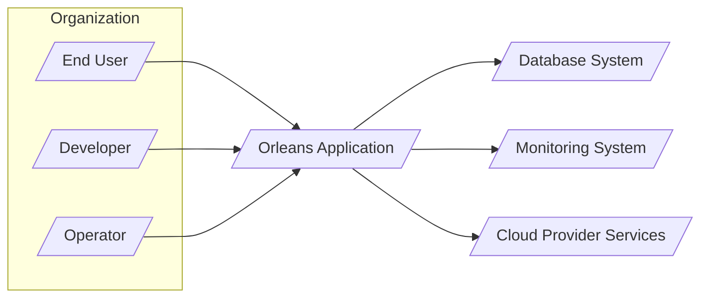
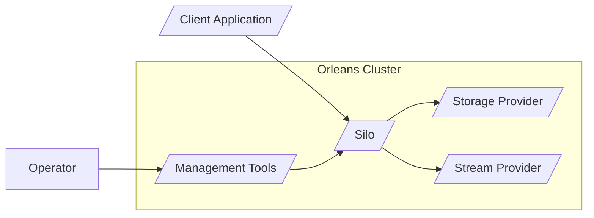
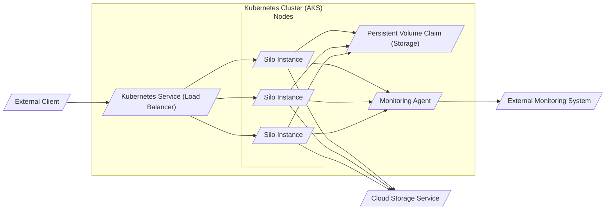
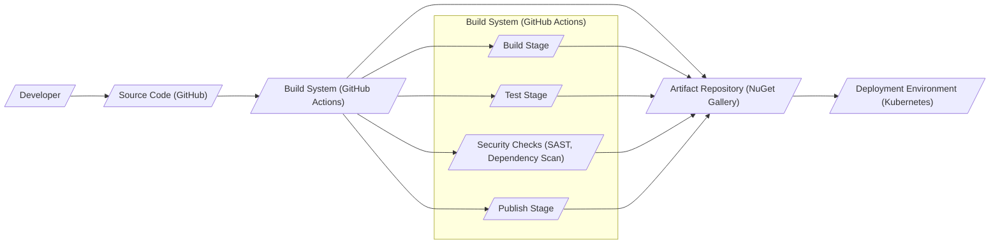

# BUSINESS POSTURE

Orleans is a cross-platform framework for building distributed applications with .NET. It provides a programming model based on actors, called grains, which simplifies the development of scalable and robust applications. Orleans is designed to handle the complexities of distributed systems, allowing developers to focus on business logic.

- Business Priorities and Goals:
  - Enable developers to build scalable and resilient distributed applications more easily.
  - Provide a robust and mature framework for building cloud-native and on-premises distributed systems.
  - Offer a programming model that simplifies concurrency and state management in distributed environments.
  - Support a wide range of application scenarios, from gaming and social media to financial services and IoT.
  - Foster an active community and ecosystem around the framework.

- Most Important Business Risks:
  - Complexity of distributed systems: Despite Orleans's simplification efforts, distributed systems inherently introduce complexities related to networking, concurrency, and failure handling. Misconfigurations or improper usage can lead to instability or data loss.
  - Security vulnerabilities in distributed applications: Distributed systems often expose more attack surfaces. Security flaws in Orleans itself or in applications built with Orleans can have wide-reaching consequences across the distributed environment.
  - Operational complexity: Deploying, managing, and monitoring distributed Orleans applications can be more complex than monolithic applications, requiring specialized skills and tooling.
  - Dependency on the Orleans framework: Organizations adopting Orleans become dependent on its continued development, support, and compatibility.
  - Performance bottlenecks in distributed environments:  Network latency, serialization overhead, and inefficient grain design can lead to performance bottlenecks in Orleans applications.

# SECURITY POSTURE

- Existing Security Controls:
  - security control: Code reviews - implemented as part of the open-source contribution process on GitHub.
  - security control: Static analysis security testing (SAST) - likely used internally by the .NET team and potentially integrated into GitHub workflows, although not explicitly documented in the repository.
  - security control: Dependency scanning - GitHub Dependabot is likely enabled to scan for vulnerabilities in dependencies.
  - security control: Secure development lifecycle (SDL) - Microsoft, as the creator of .NET and Orleans, likely follows a secure development lifecycle for its projects.
  - security control: Public vulnerability reporting - GitHub repository allows for issue reporting, including security vulnerabilities.
  - security control: Deployment model flexibility - Orleans can be deployed in various environments (cloud, on-premises, containers), allowing organizations to choose deployment models that align with their security policies.

- Accepted Risks:
  - accepted risk: Open-source nature - While open source allows for community scrutiny, it also means vulnerabilities might be publicly known before patches are available.
  - accepted risk: Third-party dependencies - Orleans relies on third-party libraries, which may introduce vulnerabilities.
  - accepted risk: Configuration complexity - Misconfigurations in Orleans deployments can lead to security vulnerabilities.

- Recommended Security Controls:
  - security control: Implement dynamic analysis security testing (DAST) in CI/CD pipelines to detect runtime vulnerabilities in Orleans applications.
  - security control: Conduct regular penetration testing of Orleans applications and deployments to identify and remediate security weaknesses.
  - security control: Provide security guidelines and best practices for developers using Orleans to build secure applications, including secure grain design, input validation, and secure communication patterns.
  - security control: Implement security monitoring and logging for Orleans clusters to detect and respond to security incidents.
  - security control: Offer and promote secure configuration templates and hardening guides for different deployment environments.

- Security Requirements:
  - Authentication:
    - requirement: Orleans itself does not enforce specific authentication mechanisms, but applications built with Orleans will need to implement authentication to verify the identity of clients and services interacting with the Orleans cluster.
    - requirement: Support for various authentication methods should be considered, such as API keys, OAuth 2.0, or mutual TLS, depending on the application requirements.
    - requirement: Securely manage and store authentication credentials.

  - Authorization:
    - requirement: Orleans applications must implement authorization mechanisms to control access to grains and grain methods based on user roles or permissions.
    - requirement: Authorization should be enforced at the grain level to ensure that only authorized actors can interact with specific grains and perform certain actions.
    - requirement: Consider attribute-based access control (ABAC) or role-based access control (RBAC) for authorization policies.

  - Input Validation:
    - requirement: All input to grains, whether from external clients or other grains, must be thoroughly validated to prevent injection attacks, data corruption, and unexpected behavior.
    - requirement: Input validation should be performed at the grain level before processing any data.
    - requirement: Use appropriate validation techniques for different input types, such as data type validation, range checks, and format validation.

  - Cryptography:
    - requirement: Sensitive data transmitted between Orleans clients and silos, or between silos, should be encrypted in transit using TLS.
    - requirement: Consider encrypting sensitive data at rest if stored within Orleans grains or in persistent storage used by Orleans.
    - requirement: Use strong cryptographic algorithms and libraries for encryption and hashing.
    - requirement: Securely manage cryptographic keys and certificates.

# DESIGN

## C4 Context

- Context Diagram Elements:
  - Element:
    - Name: End User
    - Type: Person
    - Description: Users who interact with applications built using Orleans.
    - Responsibilities: Consume applications built on Orleans to achieve their goals.
    - Security controls: Authentication and authorization mechanisms implemented within Orleans applications to control user access and actions.

  - Element:
    - Name: Developer
    - Type: Person
    - Description: Software developers who use the Orleans framework to build distributed applications.
    - Responsibilities: Develop, test, and deploy Orleans applications, adhering to security best practices.
    - Security controls: Secure coding practices, input validation, and adherence to security guidelines provided by the Orleans framework and organization.

  - Element:
    - Name: Operator
    - Type: Person
    - Description: Operations and infrastructure teams responsible for deploying, managing, and monitoring Orleans clusters and applications.
    - Responsibilities: Deploy, configure, monitor, and maintain Orleans clusters, ensuring security and availability.
    - Security controls: Secure infrastructure configuration, access control to Orleans clusters and infrastructure, security monitoring and incident response.

  - Element:
    - Name: Orleans Application
    - Type: System
    - Description: The distributed application built using the Orleans framework. This is the system being designed.
    - Responsibilities: Implement business logic, manage distributed state, handle concurrency, and provide services to end-users.
    - Security controls: Authentication, authorization, input validation, data encryption, secure communication, security logging and monitoring.

  - Element:
    - Name: Database System
    - Type: System
    - Description: Persistent storage system used by Orleans applications to store grain state and other data. Could be relational databases, NoSQL databases, or cloud storage services.
    - Responsibilities: Persistently store and retrieve data for Orleans applications. Ensure data integrity, availability, and security.
    - Security controls: Database access control, encryption at rest, encryption in transit, database auditing, vulnerability management.

  - Element:
    - Name: Monitoring System
    - Type: System
    - Description: System used to monitor the health, performance, and security of Orleans clusters and applications. Includes logging, metrics, and alerting.
    - Responsibilities: Collect and analyze logs and metrics from Orleans clusters and applications. Provide alerts and dashboards for monitoring and incident response.
    - Security controls: Secure access to monitoring data, secure storage of logs and metrics, integrity of monitoring data.

  - Element:
    - Name: Cloud Provider Services
    - Type: System
    - Description: Cloud infrastructure and services used to host Orleans clusters and applications when deployed in a cloud environment. Includes compute, networking, storage, and security services provided by cloud providers like Azure, AWS, or GCP.
    - Responsibilities: Provide infrastructure and services for deploying and running Orleans applications in the cloud. Ensure the security and availability of the underlying cloud infrastructure.
    - Security controls: Cloud provider security controls (identity and access management, network security, data encryption, compliance certifications), security configuration of cloud resources.

## C4 Container

- Container Diagram Elements:
  - Element:
    - Name: Client Application
    - Type: Container
    - Description: Applications that interact with the Orleans cluster. These can be web applications, mobile apps, backend services, or other Orleans clusters.
    - Responsibilities: Send requests to Orleans grains, receive responses, and handle user interactions.
    - Security controls: Authentication to Orleans cluster, authorization to access specific grains, input validation before sending requests to grains, secure storage of credentials.

  - Element:
    - Name: Silo
    - Type: Container
    - Description: The runtime host for Orleans grains. Silos form the Orleans cluster and manage grain activation, placement, and execution.
    - Responsibilities: Host and manage grains, handle grain requests, maintain grain state, participate in cluster membership and management.
    - Security controls: Authentication and authorization for inter-silo communication, secure grain activation and deactivation, resource management to prevent denial-of-service, security logging and monitoring.

  - Element:
    - Name: Storage Provider
    - Type: Container
    - Description: Component responsible for persisting grain state. Orleans supports various storage providers like Azure Table Storage, SQL Server, DynamoDB, etc.
    - Responsibilities: Persist and retrieve grain state from the underlying storage system. Ensure data consistency and durability.
    - Security controls: Secure connection to the storage system (e.g., using connection strings or managed identities), encryption of data at rest in storage, access control to storage resources.

  - Element:
    - Name: Stream Provider
    - Type: Container
    - Description: Component that enables stream processing within Orleans. Allows grains to produce and consume streams of events.
    - Responsibilities: Manage stream subscriptions, deliver stream events to subscribers, ensure stream ordering and reliability.
    - Security controls: Authorization for stream access (publish and subscribe), secure communication for stream events, data integrity for stream events.

  - Element:
    - Name: Management Tools
    - Type: Container
    - Description: Tools and interfaces for managing and monitoring the Orleans cluster. Can include command-line tools, dashboards, and APIs.
    - Responsibilities: Provide operators with capabilities to monitor cluster health, manage cluster configuration, deploy new applications, and troubleshoot issues.
    - Security controls: Authentication and authorization for access to management tools, audit logging of management actions, secure communication channels for management operations.

## DEPLOYMENT

Deployment Solution: Kubernetes Cluster in Cloud Environment (e.g., Azure Kubernetes Service - AKS)

- Deployment Diagram Elements:
  - Element:
    - Name: Kubernetes Cluster (AKS)
    - Type: Infrastructure
    - Description: Managed Kubernetes service in Azure (Azure Kubernetes Service). Provides the container orchestration platform for deploying and managing Orleans silos.
    - Responsibilities: Container orchestration, scaling, health management, networking, and resource management for Orleans silos.
    - Security controls: Kubernetes RBAC, network policies, pod security policies, security updates, integration with cloud provider security services.

  - Element:
    - Name: Nodes
    - Type: Infrastructure
    - Description: Worker nodes within the Kubernetes cluster where Orleans silo instances are deployed as containers.
    - Responsibilities: Run Orleans silo containers, provide compute resources, and network connectivity.
    - Security controls: Node security hardening, OS security updates, container runtime security, network segmentation.

  - Element:
    - Name: Silo Instance
    - Type: Software Instance
    - Description: Instance of the Orleans Silo container running on a Kubernetes node.
    - Responsibilities: Host and manage grains, participate in the Orleans cluster, and handle client requests.
    - Security controls: Security controls inherited from the Silo container definition, resource limits, network policies within Kubernetes.

  - Element:
    - Name: Kubernetes Service (Load Balancer)
    - Type: Infrastructure
    - Description: Kubernetes Service of type LoadBalancer, providing external access to the Orleans cluster. Distributes traffic to silo instances.
    - Responsibilities: Expose Orleans cluster to external clients, load balancing, and service discovery.
    - Security controls: Network security groups, load balancer security policies, TLS termination, DDoS protection.

  - Element:
    - Name: Persistent Volume Claim (Storage)
    - Type: Infrastructure
    - Description: Persistent storage provisioned within the Kubernetes cluster for stateful Orleans grains or cluster metadata.
    - Responsibilities: Provide persistent storage for Orleans applications, ensuring data durability and availability.
    - Security controls: Storage access control, encryption at rest, data backup and recovery, storage quotas.

  - Element:
    - Name: Monitoring Agent
    - Type: Software Instance
    - Description: Agent deployed on Kubernetes nodes to collect logs and metrics from Orleans silo instances and Kubernetes infrastructure.
    - Responsibilities: Collect and forward monitoring data to the external monitoring system.
    - Security controls: Secure communication with the monitoring system, access control to collected data, agent security hardening.

  - Element:
    - Name: External Client
    - Type: External System
    - Description: Clients outside the Kubernetes cluster that access the Orleans application through the Kubernetes Service.
    - Responsibilities: Interact with the Orleans application to consume services.
    - Security controls: Client-side authentication, secure communication channels (HTTPS).

  - Element:
    - Name: External Monitoring System
    - Type: External System
    - Description: External monitoring system (e.g., Azure Monitor, Prometheus) used to collect and analyze monitoring data from the Orleans cluster.
    - Responsibilities: Aggregate and analyze monitoring data, provide dashboards and alerts.
    - Security controls: Secure access to monitoring dashboards, secure storage of monitoring data, audit logging.

  - Element:
    - Name: Cloud Storage Service
    - Type: External System
    - Description: Cloud storage service (e.g., Azure Blob Storage, AWS S3) used as a storage provider for Orleans grains.
    - Responsibilities: Persistently store grain state and other data for Orleans applications.
    - Security controls: Cloud storage access control, encryption at rest, data backup and recovery, regional data residency.

## BUILD

- Build Process Elements:
  - Element:
    - Name: Developer
    - Type: Person
    - Description: Software developers who write and commit code to the Orleans GitHub repository.
    - Responsibilities: Write code, commit changes, create pull requests, and participate in code reviews.
    - Security controls: Secure development environment, code review process, secure coding practices.

  - Element:
    - Name: Source Code (GitHub)
    - Type: System
    - Description: GitHub repository hosting the Orleans source code.
    - Responsibilities: Version control, source code management, collaboration platform for development.
    - Security controls: GitHub access control, branch protection, commit signing, vulnerability scanning by GitHub Dependabot.

  - Element:
    - Name: Build System (GitHub Actions)
    - Type: System
    - Description: GitHub Actions workflows used for automated building, testing, security checks, and publishing of Orleans.
    - Responsibilities: Automate the build, test, security scanning, and publishing process. Ensure build reproducibility and integrity.
    - Security controls: Secure configuration of GitHub Actions workflows, secret management, access control to workflow execution, audit logging.

  - Element:
    - Name: Build Stage
    - Type: Process
    - Description: Stage in the build pipeline that compiles the source code and creates build artifacts.
    - Responsibilities: Compile code, generate binaries, and package build artifacts.
    - Security controls: Use of trusted build tools and environments, build process isolation, verification of build integrity.

  - Element:
    - Name: Test Stage
    - Type: Process
    - Description: Stage in the build pipeline that executes automated tests (unit tests, integration tests) to verify code functionality.
    - Responsibilities: Run automated tests, identify and report test failures, ensure code quality and functionality.
    - Security controls: Secure test environment, test data management, test result validation.

  - Element:
    - Name: Security Checks (SAST, Dependency Scan)
    - Type: Process
    - Description: Stage in the build pipeline that performs security checks, including static analysis security testing (SAST) and dependency scanning.
    - Responsibilities: Identify potential security vulnerabilities in the code and dependencies. Generate security reports and alerts.
    - Security controls: Integration of SAST tools and dependency scanners, vulnerability database updates, security policy enforcement.

  - Element:
    - Name: Publish Stage
    - Type: Process
    - Description: Stage in the build pipeline that publishes build artifacts to the artifact repository (NuGet Gallery).
    - Responsibilities: Package and publish build artifacts, ensure artifact integrity and authenticity.
    - Security controls: Secure publishing credentials, artifact signing, access control to artifact repository.

  - Element:
    - Name: Artifact Repository (NuGet Gallery)
    - Type: System
    - Description: NuGet Gallery repository where Orleans packages are published and stored.
    - Responsibilities: Host and distribute Orleans packages, version control of packages, package integrity verification.
    - Security controls: NuGet Gallery access control, package signing, vulnerability scanning of published packages.

  - Element:
    - Name: Deployment Environment (Kubernetes)
    - Type: System
    - Description: Target deployment environment (Kubernetes cluster) where Orleans applications are deployed using artifacts from the artifact repository.
    - Responsibilities: Deploy and run Orleans applications, consume packages from the artifact repository.
    - Security controls: Secure deployment pipelines, image scanning, runtime security monitoring.

# RISK ASSESSMENT

- Critical Business Processes:
  - Distributed computing and processing: Orleans enables building applications that require distributed processing of tasks and data. Disruption could impact application functionality and availability.
  - State management in distributed systems: Orleans manages the state of distributed actors (grains). Data loss or corruption in grain state could lead to application errors and data inconsistencies.
  - Real-time event streaming: Orleans Streams enable real-time event processing and distribution. Issues with stream processing could impact applications relying on real-time data.
  - Cluster management and coordination: Orleans clusters require coordination and management of silos. Failures in cluster management could lead to instability and unavailability.

- Data Sensitivity:
  - Application State Data: Sensitivity depends on the application built with Orleans. Grain state can contain sensitive user data, financial information, or confidential business data. Sensitivity level varies widely based on application domain.
  - Configuration Data: Orleans cluster configuration data, including connection strings, API keys, and security settings, is highly sensitive. Exposure could lead to unauthorized access and compromise of the cluster.
  - Logging and Monitoring Data: Logs and monitoring data may contain operational information and potentially some application data. Sensitivity depends on the level of detail and data included in logs.
  - Build Artifacts: Build artifacts themselves are generally not highly sensitive, but compromised artifacts could be used to deploy malicious code.

# QUESTIONS & ASSUMPTIONS

- Questions:
  - What are the specific compliance requirements for applications built with Orleans (e.g., GDPR, HIPAA, PCI DSS)?
  - What are the organization's specific security policies and standards that Orleans deployments must adhere to?
  - What is the expected scale and performance requirements for Orleans applications?
  - What are the specific use cases and application types that will be built using Orleans?
  - What is the organization's risk appetite for security vulnerabilities in open-source frameworks?

- Assumptions:
  - BUSINESS POSTURE:
    - The primary business goal is to enable the development of scalable and resilient distributed applications.
    - Availability and scalability are high priorities for applications built with Orleans.
    - Security is a significant concern, but balanced with the need for rapid development and deployment.

  - SECURITY POSTURE:
    - The organization values secure software development practices and aims to implement reasonable security controls.
    - Security is considered throughout the software development lifecycle, from design to deployment.
    - The organization is willing to invest in security tools and processes to mitigate risks.

  - DESIGN:
    - Orleans will be deployed in a cloud environment using Kubernetes for container orchestration.
    - Persistent storage will be used for stateful grains, likely using cloud-based storage services.
    - Monitoring and logging will be implemented to ensure operational visibility and security monitoring.
    - The build process will be automated using CI/CD pipelines with security checks integrated.