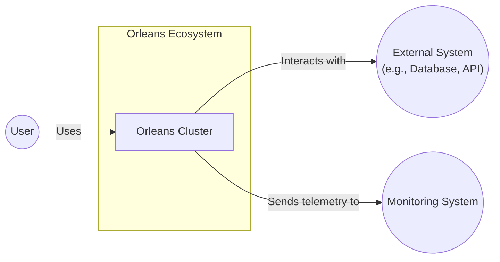
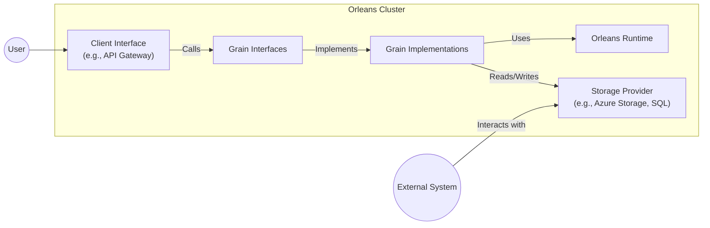
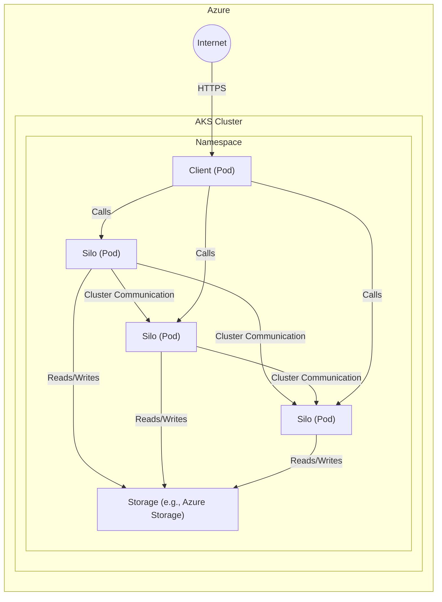
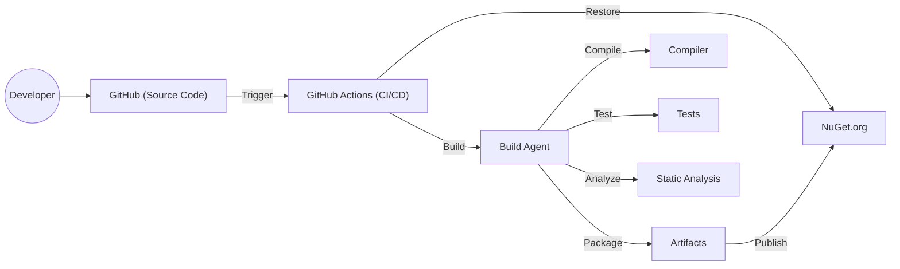

Okay, let's create a design document for the Orleans project, focusing on aspects relevant for threat modeling.

# BUSINESS POSTURE

Orleans is a framework for building distributed applications.  It simplifies the development of scalable and robust cloud-native applications, particularly those that require stateful interactions.  Given its nature as a foundational framework, several key business priorities and risks emerge:

Priorities:

*   Enable developers to build complex, distributed systems with relative ease.
*   Provide high availability and fault tolerance for applications built on the framework.
*   Ensure scalability to handle large numbers of concurrent users and operations.
*   Maintain performance and responsiveness under heavy load.
*   Offer a robust and reliable platform that minimizes operational overhead.
*   Foster a strong community and ecosystem around the framework.

Goals:

*   Become a leading framework for building distributed applications in the .NET ecosystem.
*   Attract a large and active community of developers and contributors.
*   Be adopted by a wide range of organizations for mission-critical applications.

Business Risks:

*   _Reliability Risk_: Failures in the Orleans framework itself could lead to widespread outages or data loss for applications built upon it. This is a critical risk, as Orleans is designed to *manage* application state.
*   _Scalability Risk_: If Orleans cannot scale as advertised, applications built on it will hit performance bottlenecks, impacting user experience and potentially causing business disruption.
*   _Complexity Risk_: While Orleans aims to simplify distributed systems development, it introduces its own concepts and abstractions.  If these are too complex or poorly documented, it could hinder adoption and lead to development errors.
*   _Security Risk_: Vulnerabilities in Orleans could be exploited to compromise applications built on the framework, leading to data breaches, denial of service, or other security incidents.
*   _Vendor Lock-in Risk_: Although open-source, reliance on Orleans could create a form of vendor lock-in, making it difficult to migrate applications to other platforms in the future.
*   _Community Risk_: A decline in community activity or the departure of key contributors could impact the long-term viability and support for the framework.

# SECURITY POSTURE

Orleans, being a framework, provides building blocks and mechanisms that developers *use* to build secure applications.  It's crucial to distinguish between security features *within* Orleans and security practices that developers *must implement* when using Orleans.

Existing Security Controls (as inferred from the repository and general knowledge of .NET):

*   _security control_: Transport Layer Security (TLS). Communication between silos (Orleans servers) and clients can be secured using TLS. (Implementation: Configurable in silo and client setup).
*   _security control_: Input Validation. Orleans itself doesn't inherently validate application-level data. This is the responsibility of the grain code (developer implementation).
*   _security control_: Exception Handling. Orleans provides mechanisms for handling exceptions within grains and across the cluster. (Implementation: Built-in to the Orleans runtime).
*   _security control_: .NET Security Features. Orleans benefits from the underlying security features of the .NET platform, such as code access security (CAS) and role-based security (although CAS is less relevant in modern .NET). (Implementation: Inherited from the .NET runtime).
*   _security control_: Auditing. Orleans provides logging capabilities that can be used for auditing purposes. (Implementation: Configurable logging providers).
*   _security control_: Serialization Security. Orleans uses a serializer to transmit data between grains and clients. The choice of serializer and its configuration impacts security. (Implementation: Configurable, with secure defaults recommended).
*   _security control_: Dependency Management. The project uses package managers (e.g., NuGet) to manage dependencies. (Implementation: Standard .NET project structure).

Accepted Risks:

*   _accepted risk_: Developer Error. Orleans cannot prevent developers from introducing security vulnerabilities in their grain code (e.g., SQL injection, cross-site scripting, insecure data handling). This is a fundamental risk when using *any* framework.
*   _accepted risk_: Configuration Errors. Misconfiguration of Orleans (e.g., disabling TLS, using weak credentials) can lead to security vulnerabilities.
*   _accepted risk_: Supply Chain Attacks. Vulnerabilities in third-party libraries used by Orleans or by applications built on Orleans could be exploited.
*   _accepted risk_: Zero-Day Exploits. Unknown vulnerabilities in Orleans itself or the underlying .NET runtime could be exploited.

Recommended Security Controls (High Priority):

*   _security control_: Implement robust input validation in all grain methods. This is the single most important security control that developers must implement.
*   _security control_: Follow secure coding practices within grain code. This includes avoiding common vulnerabilities like SQL injection, cross-site scripting, and insecure direct object references.
*   _security control_: Use a secure serializer (e.g., Protobuf, MessagePack) and configure it securely. Avoid using insecure serializers like BinaryFormatter.
*   _security control_: Enable TLS for all communication between silos and clients.
*   _security control_: Implement appropriate authorization checks within grain methods to control access to resources.
*   _security control_: Regularly update Orleans and all dependencies to the latest versions to patch known vulnerabilities.
*   _security control_: Configure detailed logging and monitoring to detect and respond to security incidents.
*   _security control_: Conduct regular security assessments, including code reviews and penetration testing, of applications built on Orleans.
*   _security control_: Implement a secure build process, including code signing and vulnerability scanning.

Security Requirements:

*   _Authentication_: Orleans itself does not provide a built-in authentication mechanism. Authentication is typically handled at the application layer, often using external identity providers (e.g., Azure Active Directory, IdentityServer). Orleans *can* integrate with these systems.
*   _Authorization_: Orleans does not have a built-in authorization system *beyond* basic .NET role-based security. Fine-grained authorization logic must be implemented within grain code, often using claims-based authorization.
*   _Input Validation_: As mentioned above, input validation is crucial and must be implemented by developers within grain methods. This includes validating data types, lengths, formats, and ranges.
*   _Cryptography_: Orleans does not provide specific cryptographic services *beyond* what's available in .NET. Developers should use the .NET cryptography libraries (System.Security.Cryptography) to encrypt sensitive data at rest and in transit. Key management is the responsibility of the application.

# DESIGN

## C4 CONTEXT

Element Descriptions:

*   Element:
    *   Name: User
    *   Type: Person
    *   Description: Represents a user interacting with an application built on Orleans.
    *   Responsibilities: Initiates requests, views data, interacts with the application's features.
    *   Security controls: Authentication and authorization are typically handled at the application layer, *before* interacting with Orleans grains.

*   Element:
    *   Name: Orleans Cluster
    *   Type: Software System
    *   Description: The Orleans runtime environment, consisting of multiple silos that host and manage grains.
    *   Responsibilities: Manages grain lifecycle, communication, persistence, and fault tolerance.
    *   Security controls: TLS for inter-silo communication, configurable logging, secure serializer.

*   Element:
    *   Name: External System
    *   Type: Software System
    *   Description: Represents any external system that the Orleans application interacts with, such as databases, message queues, or other APIs.
    *   Responsibilities: Provides data persistence, external services, or other functionality.
    *   Security controls: Depends on the specific external system. Should include authentication, authorization, and encryption.

*   Element:
    *   Name: Monitoring System
    *   Type: Software System
    *   Description: Collects telemetry and logs from the Orleans cluster for monitoring and diagnostics.
    *   Responsibilities: Provides insights into the health and performance of the Orleans cluster.
    *   Security controls: Secure communication with the Orleans cluster, access controls to prevent unauthorized access to monitoring data.

## C4 CONTAINER

Element Descriptions:

*   Element:
    *   Name: Client Interface
    *   Type: Container
    *   Description: The entry point for external clients to interact with the Orleans application. This could be an API gateway, a web application, or another type of client.
    *   Responsibilities: Handles client requests, performs authentication and authorization, and forwards requests to the appropriate grains.
    *   Security controls: Authentication, authorization, input validation, rate limiting, TLS.

*   Element:
    *   Name: Grain Interfaces
    *   Type: Container
    *   Description: Defines the contracts (interfaces) for the grains. These interfaces specify the methods that clients can call on grains.
    *   Responsibilities: Defines the public API of the grains.
    *   Security controls: Input validation (in the implementation).

*   Element:
    *   Name: Grain Implementations
    *   Type: Container
    *   Description: Contains the actual implementation of the grain logic.
    *   Responsibilities: Implements the business logic of the application.
    *   Security controls: Input validation, authorization, secure data handling, secure coding practices.

*   Element:
    *   Name: Orleans Runtime
    *   Type: Container
    *   Description: The core Orleans runtime environment, responsible for managing grain lifecycle, communication, and persistence.
    *   Responsibilities: Handles grain activation, deactivation, messaging, timers, reminders, and fault tolerance.
    *   Security controls: TLS for inter-silo communication, configurable logging, secure serializer.

*   Element:
    *   Name: Storage Provider
    *   Type: Container
    *   Description: Provides persistent storage for grain state. This could be a database (e.g., Azure Table Storage, SQL Server), a file system, or another storage mechanism.
    *   Responsibilities: Stores and retrieves grain state.
    *   Security controls: Depends on the specific storage provider. Should include encryption at rest, access controls, and auditing.

## DEPLOYMENT

Orleans applications can be deployed in various environments, including:

1.  **Cloud Platforms (Azure, AWS, GCP):** This is the most common deployment target. Orleans can be deployed to virtual machines, container services (e.g., Kubernetes, Azure Container Instances), or serverless platforms (e.g., Azure Functions).
2.  **On-Premises Servers:** Orleans can also be deployed to on-premises servers, either directly or within containers.
3.  **Hybrid Environments:** A combination of cloud and on-premises deployments.

We'll describe a deployment to **Azure Kubernetes Service (AKS)**, a common and recommended approach:

Element Descriptions:

*   Element:
    *   Name: Silo (Pod)
    *   Type: Deployment Unit
    *   Description: A Kubernetes Pod running an instance of the Orleans silo. Multiple silo pods form the Orleans cluster.
    *   Responsibilities: Hosts and manages grains, handles communication with other silos and clients.
    *   Security controls: Network policies to restrict traffic, container security best practices (e.g., minimal base image, least privilege), TLS for inter-silo communication.

*   Element:
    *   Name: Client (Pod)
    *   Type: Deployment Unit
    *   Description: A Kubernetes Pod running the client application that interacts with the Orleans cluster.
    *   Responsibilities: Sends requests to the Orleans cluster.
    *   Security controls: Network policies, container security best practices, TLS for communication with the silos.

*   Element:
    *   Name: Storage (e.g., Azure Storage)
    *   Type: External Service
    *   Description: An Azure Storage account (e.g., Table Storage, Blob Storage) used for grain persistence.
    *   Responsibilities: Provides persistent storage for grain state.
    *   Security controls: Azure Storage security features (e.g., access keys, shared access signatures, encryption at rest).

*   Element:
      * Name: Internet
      * Type: External
      * Description: Represents external network access to the client application.
      * Responsibilities: Provides connectivity for users to access the application.
      * Security controls: Firewall, Web Application Firewall (WAF), DDoS protection.

## BUILD

The Orleans build process leverages standard .NET tooling and CI/CD practices. A typical build pipeline would include:

1.  **Developer Workstation:** Developers write code and commit changes to a source code repository (e.g., Git).
2.  **Source Code Repository (GitHub):** The central repository for the Orleans codebase.
3.  **CI/CD System (GitHub Actions):** Orleans uses GitHub Actions for continuous integration and continuous delivery.
4.  **Build Agent:** A virtual machine or container that executes the build steps.
5.  **NuGet Restore:** Dependencies are restored from NuGet.org.
6.  **Compilation:** The .NET compiler builds the Orleans source code into assemblies.
7.  **Testing:** Unit tests and integration tests are executed.
8.  **Static Analysis:** Static analysis tools (e.g., Roslyn analyzers, SonarQube) are used to identify code quality issues and potential security vulnerabilities.
9.  **Packaging:** The build artifacts (assemblies, configuration files) are packaged for deployment.
10. **Artifact Repository (NuGet.org):** The packaged artifacts are published to NuGet.org.

Security Controls in the Build Process:

*   _security control_: Dependency Scanning: Tools like Dependabot (integrated with GitHub) scan for known vulnerabilities in dependencies.
*   _security control_: Static Analysis: Roslyn analyzers and other static analysis tools help identify potential security vulnerabilities in the code.
*   _security control_: Code Signing: Assemblies can be signed to ensure their integrity and authenticity.
*   _security control_: Build Automation: Using a CI/CD system like GitHub Actions ensures that builds are consistent and repeatable, reducing the risk of manual errors.
*   _security control_: Least Privilege: Build agents should run with minimal privileges to limit the impact of potential compromises.

# RISK ASSESSMENT

*   **Critical Business Processes:**
    *   Maintaining the availability and reliability of applications built on Orleans.
    *   Ensuring the scalability and performance of these applications.
    *   Protecting the integrity and confidentiality of data managed by Orleans grains.

*   **Data Sensitivity:**
    *   The sensitivity of data managed by Orleans grains depends entirely on the *application* using Orleans. Orleans itself is a framework and doesn't inherently handle sensitive data. However, applications built on Orleans *can* and often *do* handle highly sensitive data, including:
        *   Personally Identifiable Information (PII)
        *   Financial data
        *   Health information
        *   Proprietary business data
    *   Therefore, the data sensitivity is classified as **variable, ranging from low to high, depending on the specific application.**

# QUESTIONS & ASSUMPTIONS

*   **Questions:**
    *   What specific threat actors are considered most relevant to applications built on Orleans (e.g., script kiddies, organized crime, nation-states)? This influences the level of security required.
    *   What are the regulatory compliance requirements for applications built on Orleans (e.g., GDPR, HIPAA, PCI DSS)?
    *   What is the expected lifespan of applications built on Orleans? This impacts long-term security maintenance.
    *   What level of detail is required for the threat model? (e.g., high-level overview vs. detailed analysis of specific components)
    *   Are there any specific security concerns or incidents that have been identified in the past related to Orleans or similar frameworks?

*   **Assumptions:**
    *   _BUSINESS POSTURE_: We assume a moderate to high risk aversion, given that Orleans is used for building distributed, often mission-critical, applications.
    *   _SECURITY POSTURE_: We assume that developers using Orleans have a basic understanding of secure coding practices, but may not be security experts. We assume that TLS is enabled by default or strongly encouraged. We assume that a secure serializer is used by default or strongly encouraged.
    *   _DESIGN_: We assume a deployment to a cloud environment (specifically Azure Kubernetes Service) as the most common scenario. We assume that the build process uses GitHub Actions. We assume that basic security controls like dependency scanning and static analysis are in place.