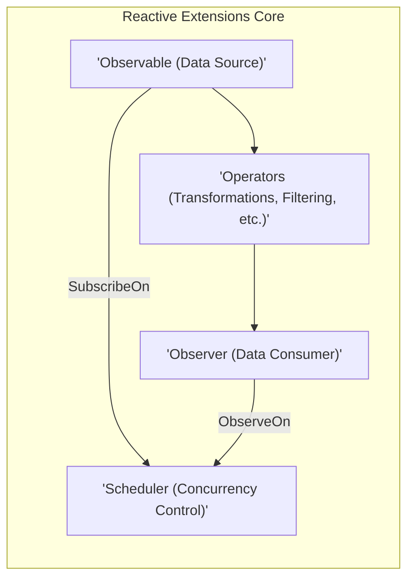
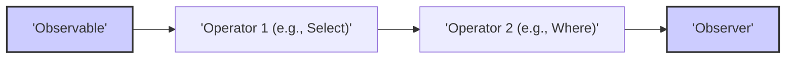

# Project Design Document: Reactive Extensions for .NET (System.Reactive)

**Version:** 1.1
**Date:** October 26, 2023
**Author:** AI Software Architect

## 1. Introduction

This document provides an enhanced design overview of the Reactive Extensions for .NET (Rx.NET), specifically focusing on the `System.Reactive` library as found in the provided GitHub repository: [https://github.com/dotnet/reactive](https://github.com/dotnet/reactive). This revised document aims to provide a more robust foundation for subsequent threat modeling activities by offering clearer explanations of the key components, data flows, and architectural considerations of the library.

## 2. Goals and Objectives

The primary goal of Rx.NET is to empower developers to construct asynchronous and event-driven programs with greater clarity and efficiency using observable sequences. This library endeavors to:

*   Represent asynchronous data streams and events as composable sequences, enabling querying with LINQ-like operators.
*   Simplify the orchestration of intricate asynchronous workflows.
*   Offer a consistent programming paradigm for managing diverse asynchronous data sources.
*   Provide a comprehensive suite of operators for manipulating, filtering, combining, and controlling asynchronous data streams.
*   Support various concurrency models and schedulers for fine-grained management of asynchronous operation execution.

## 3. High-Level Architecture

At its core, Rx.NET revolves around the interplay of Observables, Observers, and Operators. The following diagram illustrates this fundamental architecture:

*   **Observable (Data Source):**  The originator of asynchronous data or events, conceptualized as a stream over time.
*   **Observer (Data Consumer):** The entity that reacts to the data emitted by an Observable, defining actions for new values, errors, and completion signals.
*   **Operators (Transformations, Filtering, etc.):** Functions that act upon Observables, enabling transformations, filtering, combination, and control of the data stream.
*   **Scheduler (Concurrency Control):**  The mechanism that dictates how and when the work associated with an Observable is executed, offering control over threading and timing.

## 4. Detailed Design

The `System.Reactive` library is composed of several essential components and abstractions:

*   **`IObservable<T>` Interface:**
    *   The foundational interface representing a push-based data stream.
    *   Defines the crucial `Subscribe(IObserver<T> observer)` method, which establishes the link between the data producer (Observable) and the data consumer (Observer).

*   **`IObserver<T>` Interface:**
    *   Specifies the contract for receiving notifications from an Observable.
    *   Includes the core methods:
        *   `OnNext(T value)`: Receives a new data item from the stream.
        *   `OnError(Exception error)`: Receives an error notification, indicating a failure in the data stream.
        *   `OnCompleted()`: Receives a completion notification, signaling the end of the data stream.

*   **Observable Creation Mechanisms:**
    *   **Static Factory Methods (e.g., `Observable.Create`, `Observable.Return`, `Observable.Throw`):** Provide programmatic ways to construct Observables with custom logic or predefined behaviors.
    *   **Event Integration (e.g., `Observable.FromEvent`):** Allows wrapping existing .NET events as Observables.
    *   **Timer-Based Generation (e.g., `Observable.Interval`, `Observable.Timer`):** Creates Observables that emit values based on time intervals or delays.
    *   These mechanisms encapsulate the logic for producing data and managing the lifecycle of subscriptions.

*   **Operator Categories (Extension Methods on `IObservable<T>`):**
    *   **Transformation Operators (e.g., `Select`, `SelectMany`, `Cast`, `OfType`):** Modify the data emitted by the Observable.
    *   **Filtering Operators (e.g., `Where`, `Distinct`, `Take`, `Skip`):** Control which data items are passed through the stream.
    *   **Combination Operators (e.g., `Merge`, `CombineLatest`, `Zip`, `Concat`):**  Merge or combine multiple Observables into a single stream.
    *   **Error Handling Operators (e.g., `Catch`, `Retry`, `OnErrorResumeNext`):** Provide mechanisms for gracefully handling errors within the stream.
    *   **Utility Operators (e.g., `Do`, `SubscribeOn`, `ObserveOn`, `Timeout`):** Offer supplementary functionalities like side effects, concurrency control, and timeouts.
    *   These operators often return a new `IObservable<T>` representing the transformed or manipulated data stream.

*   **Subject Types:**
    *   Implement both `IObservable<T>` and `IObserver<T>`, acting as both a source and a sink.
    *   **`Subject<T>`:** A basic subject that multicasts notifications to all subscribed observers.
    *   **`BehaviorSubject<T>`:**  Emits the most recent item it has observed (or a default value) to any new subscriber.
    *   **`ReplaySubject<T>`:**  Buffers and replays a specified number of past notifications to new subscribers.
    *   These types are useful for scenarios requiring manual control over the data stream or multicasting.

*   **Scheduler Implementations:**
    *   Implement the `IScheduler` interface, defining strategies for executing tasks.
    *   **`ImmediateScheduler`:** Executes tasks synchronously on the current thread.
    *   **`CurrentThreadScheduler`:** Executes tasks on the current thread after the current operation completes.
    *   **`ThreadPoolScheduler`:** Queues tasks to the .NET ThreadPool.
    *   **`TaskPoolScheduler`:**  Queues tasks to the Task Parallel Library's task scheduler.
    *   **`SynchronizationContextScheduler`:** Executes tasks on a specific `SynchronizationContext`, often used for UI thread interaction.
    *   Schedulers are crucial for managing concurrency and ensuring thread safety.

*   **Subscription Management (`IDisposable`):**
    *   The `Subscribe` method returns an `IDisposable` object representing the active subscription.
    *   Calling `Dispose` on this object is essential for unsubscribing from the Observable and releasing any associated resources, preventing memory leaks and other issues.

## 5. Data Flow

The typical flow of data within Rx.NET follows these steps:

1. **Observable Instantiation:** An `IObservable<T>` is created, representing the origin of the data stream. This source can be events, timers, collections, or results of asynchronous operations.
2. **Observer Attachment:** An `IObserver<T>` is created to consume the data. The `Subscribe` method of the Observable is invoked, with the Observer instance as an argument.
3. **Subscription Setup:** The Observable establishes the subscription, potentially initiating listeners or timers to generate data. The `Subscribe` method often returns an `IDisposable`.
4. **Data Emission (`OnNext`):** The Observable emits new data items by calling the `OnNext` method on the subscribed Observer.
5. **Error Notification (`OnError` - Optional):** If an error occurs during data generation or processing, the Observable calls the `OnError` method of the Observer. This signals a failure and typically terminates the sequence.
6. **Completion Signal (`OnCompleted` - Optional):** When the Observable has finished emitting data, it calls the `OnCompleted` method of the Observer. This indicates the successful end of the data stream.
7. **Operator Intervention (Optional):** Operators inserted into the data pipeline intercept the flow between the Observable and the Observer, transforming, filtering, or otherwise manipulating the data.
8. **Subscription Termination (`Dispose`):** The Observer or an external entity can terminate the subscription by calling the `Dispose` method on the `IDisposable` returned during subscription. This stops further data emissions and releases resources.

## 6. Security Considerations (Pre-Threat Modeling)

When incorporating Rx.NET into an application, several security aspects warrant careful consideration, forming the basis for threat modeling:

*   **External Data Sources:**
    *   **Risk:** Observables sourced from external inputs (e.g., network streams, user input, file system) are susceptible to injection attacks or malformed data.
    *   **Mitigation:** Implement rigorous input validation and sanitization before processing data within the reactive pipeline.

*   **Error Handling Vulnerabilities:**
    *   **Risk:** Insufficient or incorrect error handling in Observable sequences can lead to unhandled exceptions, potentially exposing sensitive information or causing application crashes. Errors propagated through the stream might also be misinterpreted.
    *   **Mitigation:** Employ robust error handling operators (`Catch`, `Retry`) and ensure that `OnError` handlers do not introduce new vulnerabilities. Avoid leaking sensitive error details.

*   **Resource Exhaustion:**
    *   **Risk:** Long-lived subscriptions or improper disposal of subscriptions can lead to resource leaks (e.g., memory, file handles, network connections), potentially causing denial-of-service. Observables generating data at a faster rate than it can be consumed (backpressure issues) can also lead to resource exhaustion.
    *   **Mitigation:** Implement proper subscription management using `Dispose`. Consider using operators that handle backpressure (e.g., `Buffer`, `Throttle`, `Sample`).

*   **Concurrency and Threading Issues:**
    *   **Risk:** Incorrect usage of Schedulers can introduce race conditions, deadlocks, or data corruption, particularly when dealing with shared state. Operations not intended to be thread-safe might be executed concurrently.
    *   **Mitigation:** Carefully choose appropriate Schedulers based on the nature of the operations. Employ thread-safe data structures and synchronization mechanisms when necessary.

*   **Sensitive Data Exposure:**
    *   **Risk:** If Observables process sensitive data, inadequate protection during processing or storage (if the data is buffered or cached) can lead to unauthorized access.
    *   **Mitigation:** Implement appropriate encryption and access control mechanisms. Avoid storing sensitive data unnecessarily within the reactive pipeline.

*   **Third-Party Operator Security:**
    *   **Risk:** Custom or third-party operators might contain vulnerabilities or malicious code, as they have direct access to the data stream.
    *   **Mitigation:** Thoroughly review the code of custom operators and carefully evaluate the security of any third-party dependencies.

*   **Unintended Side Effects:**
    *   **Risk:** Operators with side effects (e.g., logging, external API calls within `Do`) might introduce unintended security implications if not carefully managed.
    *   **Mitigation:**  Minimize side effects within operators and ensure they are secure and auditable.

*   **Replay Attacks (with Subjects):**
    *   **Risk:**  With `ReplaySubject`, previously emitted data is replayed to new subscribers. If this data is sensitive and the subject's lifetime is not carefully managed, it could lead to unintended disclosure.
    *   **Mitigation:**  Use `ReplaySubject` judiciously and consider the implications of replaying past data. Limit the buffer size and lifetime if necessary.

## 7. Deployment Considerations

Rx.NET is typically deployed as a NuGet package integrated into .NET applications. Security considerations during deployment primarily relate to the overall application deployment security practices, including:

*   Ensuring the integrity of the NuGet package source.
*   Securely managing application configurations that might affect Rx.NET behavior (e.g., scheduler settings).
*   Deploying the application to a secure environment.

## 8. Assumptions and Constraints

*   This design document primarily focuses on the core functionalities of the `System.Reactive` library. Integrations with specific frameworks or external systems are not detailed.
*   It is assumed that developers utilizing Rx.NET possess a foundational understanding of asynchronous programming principles.
*   The security considerations outlined are preliminary and will be further investigated during dedicated threat modeling sessions.
*   The provided GitHub repository accurately reflects the current implementation of the `System.Reactive` library.

## 9. Future Considerations

*   Detailed threat modeling of specific operators and common usage patterns.
*   Analysis of potential vulnerabilities arising from interactions between different operators.
*   Investigation of security implications related to specific scheduler implementations and their configurations.
*   Exploration of security best practices for using Rx.NET in various application scenarios.

This refined design document offers a more detailed and structured understanding of the Reactive Extensions for .NET, providing a stronger foundation for effective threat modeling. The enhanced descriptions of components, data flows, and security considerations aim to facilitate the identification of potential vulnerabilities and the development of appropriate mitigation strategies.
