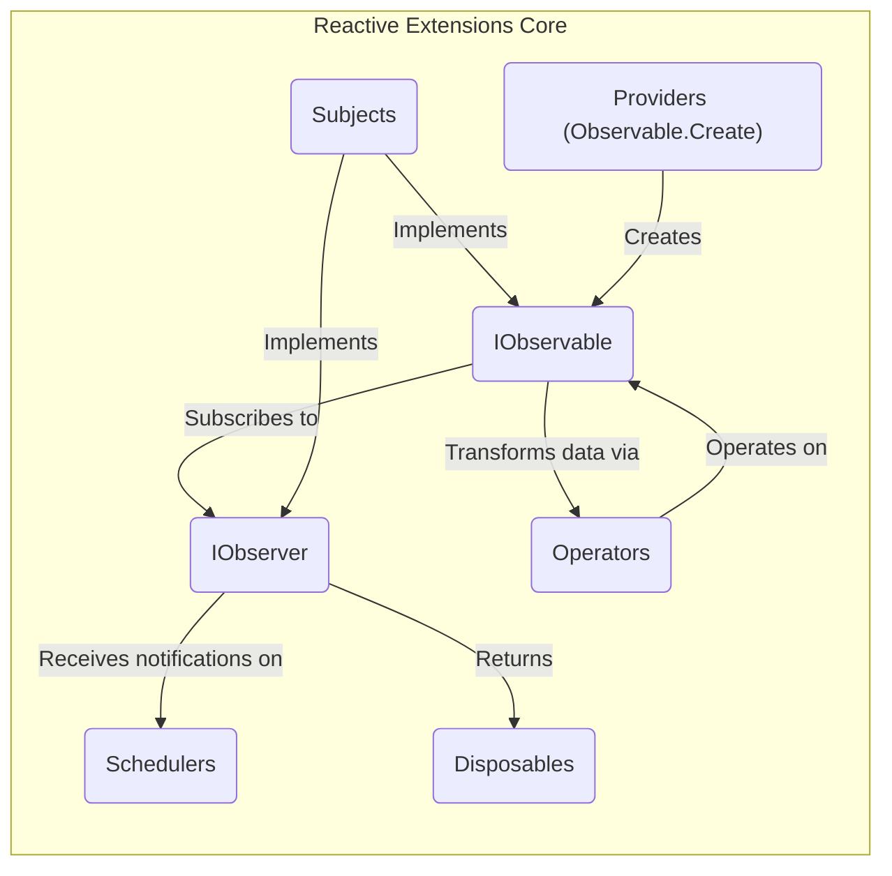
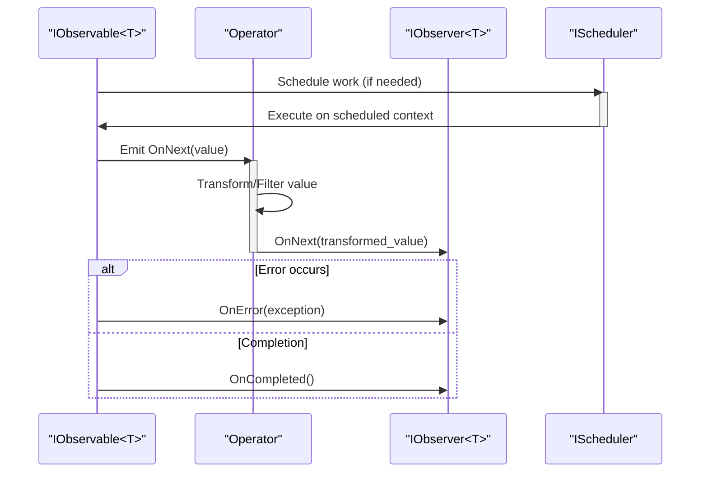

# Project Design Document: Reactive Extensions for .NET (`dotnet/reactive`)

**Version:** 1.1
**Date:** October 26, 2023
**Author:** AI Software Architect

## 1. Introduction

This document provides an enhanced design overview of the Reactive Extensions for .NET (`dotnet/reactive`) library, specifically tailored for threat modeling. It aims to provide a comprehensive and detailed understanding of the library's architecture, components, and data flow to facilitate the identification of potential security vulnerabilities.

### 1.1. Purpose

The primary purpose of this document is to furnish a detailed architectural blueprint of the `dotnet/reactive` library, enabling effective threat modeling. It focuses on elucidating the system's boundaries, data movement, and potential weak points from a security perspective.

### 1.2. Scope

This document concentrates on the fundamental architectural elements and data flow within the `dotnet/reactive` library itself. It does not delve into specific applications or services consuming this library, nor does it exhaustively detail every operator or extension method. The emphasis remains on the core building blocks and their interactions relevant to security considerations.

### 1.3. Goals

*   Clearly delineate the major components of the `dotnet/reactive` library and their responsibilities.
*   Illustrate the typical and critical data flow paths within a reactive stream, highlighting potential interception points.
*   Identify key interfaces and abstractions that define interaction boundaries and potential attack surfaces.
*   Provide a robust foundation for identifying potential threat vectors, attack surfaces, and vulnerabilities within the library's design.

## 2. Overview of Reactive Extensions

Reactive Extensions (Rx) is a powerful library for composing asynchronous and event-based programs using observable sequences. It extends the traditional observer pattern to handle sequences of data and/or events over time. A key aspect is the inclusion of query operators, enabling declarative composition of event streams, similar to querying collections. This paradigm shift towards treating asynchronous data streams as queryable sequences is central to understanding its security implications.

## 3. Architectural Design

The `dotnet/reactive` library is structured around several core concepts and interacting components:

*   **`IObservable<T>`:**  Represents a push-based stream of data or events occurring over time. It acts as the data producer in a reactive pipeline. Crucially, it defines the contract for emitting data.
*   **`IObserver<T>`:** Represents the consumer of data emitted by an `IObservable<T>`. It defines the contract for receiving data, error notifications, and completion signals. This is where the processed data ultimately arrives.
*   **Operators:** These are extension methods that operate on `IObservable<T>` sequences, enabling transformations, filtering, combination, and manipulation of the data stream. They form the core logic of reactive pipelines. Examples include `Where`, `Select`, `Merge`, `Throttle`, `Retry`, and many more.
*   **Schedulers:** Control the concurrency and timing aspects of operations within an observable sequence. They determine the thread or execution context on which notifications are delivered, introducing potential concurrency-related vulnerabilities.
*   **Subjects:** Objects that implement both `IObservable<T>` and `IObserver<T>`. They act as a bridge, allowing external code to push values into a stream and allowing multiple observers to subscribe. This dual nature introduces unique security considerations.
*   **Disposables:** Represent resources that need to be cleaned up when an observer unsubscribes or when a subscription is no longer needed. Improper disposal can lead to resource leaks.
*   **Providers (Observable.Create):** Mechanisms for creating custom `IObservable<T>` implementations, potentially introducing vulnerabilities if the creation logic is flawed or interacts with insecure external resources.

### 3.1. Component Diagram

### 3.2. Key Interfaces and Abstractions

*   **`System.IObservable<T>`:** The fundamental interface for representing a push-based data stream.
    *   `Subscribe(IObserver<T> observer)`: Allows an observer to register and begin receiving notifications. This method is a key point of interaction and potential vulnerability if not handled securely.
*   **`System.IObserver<T>`:** The fundamental interface for consuming data from an observable.
    *   `OnNext(T value)`: Called when the observable pushes a new value. Security checks on the `value` are crucial here.
    *   `OnError(Exception error)`: Called when the observable encounters an error. Information leakage through the `error` object is a concern.
    *   `OnCompleted()`: Called when the observable has finished emitting values.
*   **`System.IDisposable`:** Used for managing the lifecycle of subscriptions and other resources. The `Dispose` method must be called to prevent leaks.
*   **`System.Reactive.Concurrency.IScheduler`:** An abstraction for controlling the execution context of observable operations. Incorrect scheduler usage can lead to concurrency bugs and vulnerabilities.
*   **`System.Reactive.Subjects.ISubject<T>` (inherits from both `IObservable<T>` and `IObserver<T>`):**  Allows for both pushing values into and subscribing to a stream, creating potential for uncontrolled data flow.

## 4. Data Flow

The typical data flow in a reactive stream involves an `IObservable<T>` emitting values that are then potentially transformed by operators and ultimately consumed by one or more `IObserver<T>` instances. Understanding the path data takes is crucial for identifying potential interception or manipulation points.

**Detailed Data Flow Steps with Security Considerations:**

1. An `IObservable<T>` is created, representing a source of data or events. This source could originate from various locations, some potentially untrusted (e.g., user input, network streams). **Threat:** Insecure data sources could inject malicious data into the stream.
2. One or more `IObserver<T>` instances subscribe to the `IObservable<T>` using the `Subscribe` method. **Threat:**  Unrestricted subscription could lead to denial-of-service if a malicious actor subscribes many times.
3. As the `IObservable<T>` produces data, it calls the `OnNext(T value)` method on each subscribed `IObserver<T>`. **Threat:**  If the emitted `value` is not sanitized, it could lead to vulnerabilities in the observer.
4. Operators can be inserted into the stream. These operators intercept the emitted values and perform transformations, filtering, or other manipulations. **Threat:**  Vulnerabilities in operator implementations (e.g., buffer overflows, injection flaws) could compromise the data stream. Malicious operators could be inserted if the pipeline is not controlled.
5. If an error occurs, the `OnError(Exception error)` method is called. **Threat:**  Sensitive information might be leaked through the exception details. Unhandled exceptions could lead to application crashes.
6. When the `IObservable<T>` finishes emitting, `OnCompleted()` is called.
7. Subscriptions can be terminated by calling `Dispose()`. **Threat:** Failure to dispose of resources can lead to leaks. Malicious actors might try to prevent disposal to cause resource exhaustion.

## 5. Security Considerations (Detailed for Threat Modeling)

This section expands on the initial security considerations, providing more specific examples of potential threats and vulnerabilities related to the architecture and data flow.

*   **Resource Exhaustion:**
    *   **Threat:** An observable emitting an unbounded stream of data without proper backpressure handling can overwhelm observers, leading to memory exhaustion or CPU overload.
    *   **Threat:** A malicious actor could intentionally create an observable that emits data rapidly to cause a denial-of-service.
*   **Error Handling:**
    *   **Threat:**  Sensitive information (e.g., connection strings, internal paths) could be included in exception messages passed to `OnError`, leading to information disclosure.
    *   **Threat:**  Lack of proper error handling in operators could lead to unhandled exceptions, crashing the application or leaving it in an inconsistent state.
    *   **Threat:**  Error propagation logic might inadvertently mask critical errors, hindering debugging and security analysis.
*   **Concurrency Issues:**
    *   **Threat:**  Incorrect use of schedulers or shared state within operators can lead to race conditions, deadlocks, and other concurrency bugs, potentially causing unexpected behavior or security vulnerabilities.
    *   **Threat:**  Data corruption can occur if multiple threads access and modify shared state without proper synchronization.
*   **Data Integrity:**
    *   **Threat:**  Vulnerabilities in custom operators could allow for the injection of malicious data or the alteration of data in transit.
    *   **Threat:**  If operators rely on external data sources, the integrity of those sources becomes a critical security concern.
*   **Information Disclosure:**
    *   **Threat:**  Logging mechanisms might inadvertently capture sensitive data flowing through observable streams.
    *   **Threat:**  Error messages or debugging information could expose internal system details.
*   **External Integrations:**
    *   **Threat:**  If observables interact with external APIs or services, vulnerabilities in those external systems could be exploited through the reactive stream.
    *   **Threat:**  Data received from untrusted external sources should be carefully validated and sanitized before being processed by operators.
*   **Backpressure:**
    *   **Threat:**  Lack of backpressure handling can lead to dropped data or resource exhaustion if the observer cannot keep up with the observable. This could result in incomplete processing or denial-of-service.
*   **Subject Misuse:**
    *   **Threat:**  If a subject is exposed without proper access control, malicious actors could push arbitrary data into the stream, potentially bypassing intended data sources or injecting malicious commands.
    *   **Threat:**  Unintended side effects can occur if multiple observers react to the same data pushed through a subject in unpredictable ways.
*   **Provider Vulnerabilities (Observable.Create):**
    *   **Threat:**  Custom observable creation logic might have vulnerabilities, such as improper resource management, insecure access to external resources, or the introduction of malicious data.
    *   **Threat:**  If the creation logic relies on untrusted input, it could be exploited to create observables that exhibit malicious behavior.
*   **Operator Chain Complexity:**
    *   **Threat:**  Complex chains of operators can be difficult to reason about and audit for security vulnerabilities. Unexpected interactions between operators could introduce unforeseen risks.

## 6. Deployment Considerations

The `dotnet/reactive` library is typically deployed as a NuGet package integrated into .NET applications. It operates within the application's process and utilizes the underlying .NET runtime and operating system resources. Security considerations during deployment primarily revolve around ensuring the application itself is deployed securely.

*   **Dependency Management:** Ensure the `dotnet/reactive` NuGet package is obtained from a trusted source to avoid supply chain attacks.
*   **Application Security:** Standard application security practices (e.g., input validation, output encoding, secure configuration) are crucial when using Rx.

## 7. Future Considerations

*   **New Operators and Features:**  The continuous evolution of the library with new operators and features requires ongoing security review and threat modeling.
*   **Integration with Emerging Technologies:** As Rx is integrated with new technologies and platforms, the security implications of these integrations need to be assessed.
*   **Performance Optimizations:**  Security should be a key consideration during performance optimization efforts to avoid introducing vulnerabilities.

This enhanced document provides a more detailed and security-focused understanding of the `dotnet/reactive` library's architecture and data flow, serving as a solid foundation for conducting a comprehensive threat model.