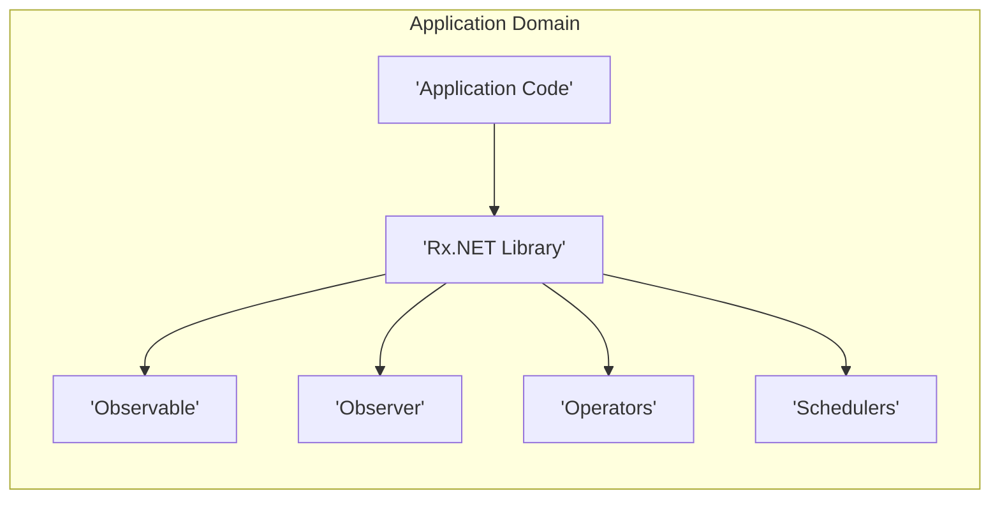
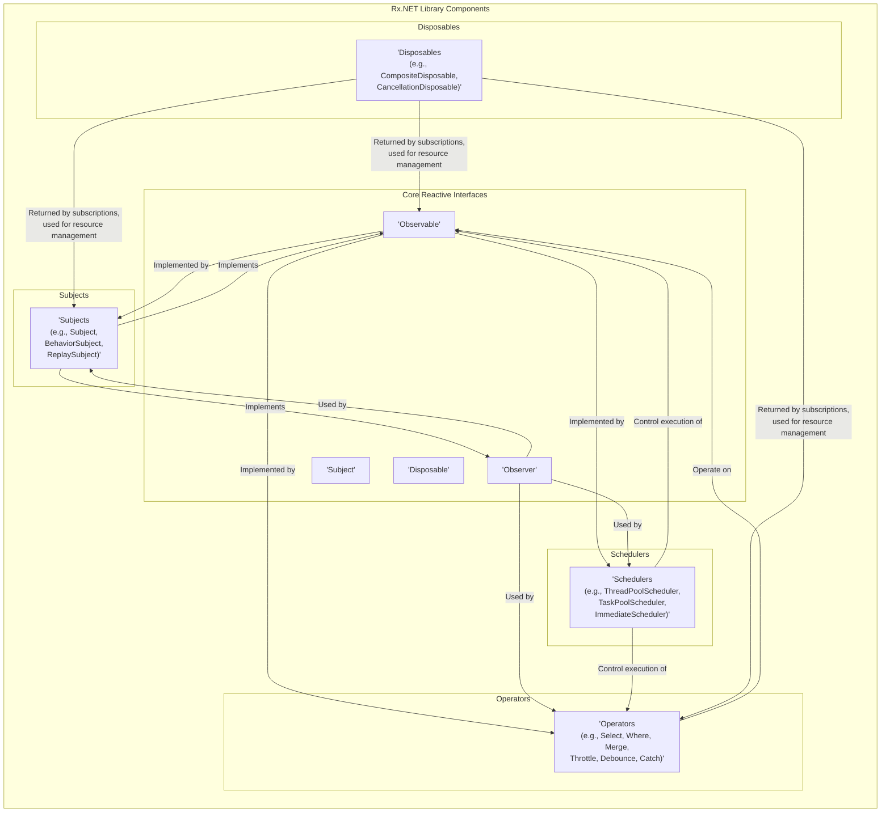
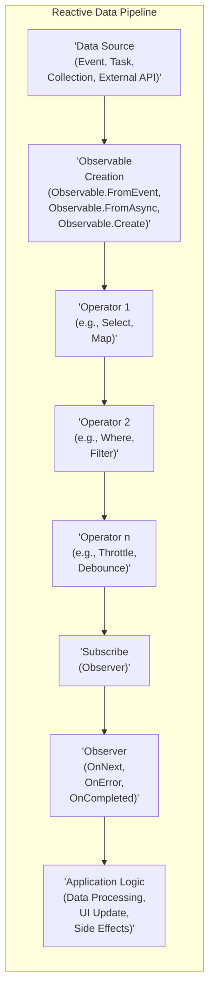

# Project Design Document: Reactive Extensions for .NET (Rx.NET)

**Version:** 1.1
**Date:** October 26, 2023
**Author:** AI Software Architect

## 1. Introduction

This document provides a design overview of the Reactive Extensions for .NET (Rx.NET) project, based on the repository: [https://github.com/dotnet/reactive](https://github.com/dotnet/reactive). This document is intended to serve as a foundation for threat modeling and security analysis of Rx.NET. It outlines the project's purpose, architecture, key components, and data flow, providing a comprehensive understanding of the system's design from a security perspective.

## 2. Project Overview

Reactive Extensions (Rx) is a programming paradigm for composing asynchronous and event-based programs by using observable sequences. Rx.NET is the .NET implementation of the Reactive Extensions specification. It provides a powerful library for handling streams of data over time, enabling developers to work with asynchronous operations, events, and data streams in a declarative and composable manner.  Common use cases include handling UI events, processing real-time data streams (like sensor data or stock tickers), managing background tasks, and orchestrating complex asynchronous workflows.

**Key Concepts:**

*   **Observable (`IObservable<T>`):** Represents a push-based data stream of type `T`. It is the source of data, emitting items over time to its observers.
*   **Observer (`IObserver<T>`):** Consumes the data emitted by an Observable. It implements methods to react to events: `OnNext` (data received), `OnError` (error occurred), and `OnCompleted` (stream finished).
*   **Operators (e.g., `Select`, `Where`, `Merge`):** Functions that extend `IObservable<T>` and transform, filter, combine, and manipulate observable sequences. They are the building blocks for creating complex reactive pipelines.
*   **Schedulers (`IScheduler`):** Control the concurrency and timing of operations within an observable sequence. They determine on which thread or context notifications are delivered, managing asynchrony and parallelism.
*   **Subjects (`ISubject<T>`):** Act as both an Observable and an Observer. They can be used to multicast events to multiple observers and to bridge imperative (synchronous) and reactive (asynchronous) code.
*   **Disposables (`IDisposable`):** Represent the lifetime of a subscription. Disposing of a subscription releases resources and stops the flow of data, preventing leaks.

**Project Goals:**

*   Provide a robust, performant, and secure implementation of Reactive Extensions for the .NET platform.
*   Empower developers to write clean, maintainable, and testable asynchronous and event-driven code.
*   Offer a comprehensive suite of operators for diverse data stream manipulation needs.
*   Provide flexible concurrency control through a variety of schedulers.
*   Adhere to the Reactive Extensions specification for cross-platform compatibility and consistency.
*   Maintain a high level of code quality, including security best practices and vulnerability mitigation.

## 3. System Architecture

Rx.NET is designed as a library to be integrated into .NET applications. It operates within the application's process and does not introduce new network services or external dependencies beyond standard .NET libraries. Its architecture is fundamentally based on the reactive programming model and its implementation within the .NET ecosystem.

### 3.1. High-Level Architecture

**Description:**

*   **"Application Code"**: Represents the .NET application that utilizes Rx.NET. This is where developers write their business logic, leveraging Rx.NET to manage asynchronous operations and data streams.
*   **"Rx.NET Library"**: The core Rx.NET library, providing the implementation of reactive interfaces, operators, schedulers, and related classes. It's the central component providing reactive programming capabilities.
*   **"Observable"**: The interface (`IObservable<T>`) representing the data stream. It's the source of data in the reactive pipeline.
*   **"Observer"**: The interface (`IObserver<T>`) that consumes data from Observables. It defines how the application reacts to data, errors, and completion signals.
*   **"Operators"**:  A collection of functions (primarily extension methods) that operate on Observables, enabling transformations, filtering, and combination of data streams. They form the logic of the reactive pipeline.
*   **"Schedulers"**: Components (`IScheduler` implementations) responsible for managing concurrency and timing. They control where and when operations within the Rx pipeline are executed.

### 3.2. Component-Level Architecture

**Description of Components (Detailed):**

*   **"Observable<T>"**: The core interface.  It represents a stream and provides the `Subscribe` method, which is the entry point for consumers to start receiving data. Observables are often created using factory methods or operators.
*   **"Observer<T>"**: Defines the contract for consuming data from an Observable.  Observers are passed to the `Subscribe` method of an Observable to begin receiving notifications.
*   **"Subject<T>"**: A versatile component that acts as both an Observable and an Observer. This allows for multicasting data to multiple observers and bridging different parts of an application. Different Subject types offer varied behaviors for event replay and initial values.
*   **"Disposable"**:  Crucial for resource management. Subscriptions to Observables return `IDisposable` instances. Disposing of these instances is essential to unsubscribe from the Observable, stop data flow, and release any associated resources (e.g., timers, event handlers).  `CompositeDisposable` helps manage multiple disposables, and `CancellationDisposable` integrates with .NET's cancellation mechanisms.
*   **"Operators"**: The workhorses of Rx.NET. They are implemented as extension methods on `IObservable<T>`. Operators transform, filter, combine, and control the flow of data within a stream. They are chained together to create complex reactive pipelines.  Examples include:
    *   **Transformation Operators**: `Select`, `SelectMany`, `Cast`, `OfType`
    *   **Filtering Operators**: `Where`, `Distinct`, `Take`, `Skip`, `Throttle`, `Debounce`
    *   **Combination Operators**: `Merge`, `CombineLatest`, `Zip`, `Concat`
    *   **Error Handling Operators**: `Catch`, `Retry`, `OnErrorResumeNext`
    *   **Utility Operators**: `Delay`, `Timeout`, `ObserveOn`, `SubscribeOn`
*   **"Schedulers"**:  Manage concurrency and execution context. Schedulers determine which thread or synchronization context operators and observers will execute on.  Key schedulers include:
    *   `ThreadPoolScheduler`: Executes operations on the .NET ThreadPool.
    *   `TaskPoolScheduler`: Executes operations using the Task Parallel Library's task pool.
    *   `ImmediateScheduler`: Executes operations immediately on the current thread.
    *   `CurrentThreadScheduler`: Executes operations on the current thread, but after the current operation completes.
    *   `SynchronizationContextScheduler`: Executes operations on a specific `SynchronizationContext`, useful for UI thread interactions.

## 4. Data Flow Diagram

This diagram illustrates a typical reactive data pipeline, showing how data flows from a source through operators to an observer.

**Data Flow Description:**

1.  **"Data Source (Event, Task, Collection, External API)"**: The origin of data. This can be diverse, including:
    *   UI Events (mouse clicks, button presses)
    *   Asynchronous Operations (Tasks, Promises)
    *   Collections (iterating over lists)
    *   External APIs (HTTP requests, web sockets)
    *   Timers, sensors, and other event sources.
2.  **"Observable Creation (Observable.FromEvent, Observable.FromAsync, Observable.Create)"**:  Data sources are converted into Observables using factory methods. This step lifts imperative or event-based sources into the reactive domain.
3.  **"Operator 1 (e.g., Select, Map)", "Operator 2 (e.g., Where, Filter)", ..., "Operator n (e.g., Throttle, Debounce)"**: A chain of operators is applied to the Observable. Each operator transforms, filters, or manipulates the data stream. Data flows sequentially through the operator chain.
4.  **"Subscribe (Observer)"**: The `Subscribe` method is called on the final Observable in the pipeline. This attaches an Observer to the Observable and initiates the data flow.  Subscription is the trigger that starts the reactive pipeline.
5.  **"Observer (OnNext, OnError, OnCompleted)"**: The Observer receives notifications from the Observable via its methods:
    *   `OnNext(T)`: Receives new data items (`T`) emitted by the Observable.
    *   `OnError(Exception)`: Receives error notifications if an error occurs in the Observable stream.
    *   `OnCompleted()`: Receives a completion notification when the Observable stream finishes successfully.
6.  **"Application Logic (Data Processing, UI Update, Side Effects)"**:  Within the Observer's methods (especially `OnNext`), the application's business logic is executed. This might involve:
    *   Processing the received data.
    *   Updating the user interface.
    *   Triggering side effects (e.g., logging, making API calls).

## 5. Key Components and Interactions (Security Perspective)

*   **Observable Creation & Untrusted Sources**: If Observables are created directly from untrusted external data sources (e.g., user input, network streams without validation), this can introduce vulnerabilities.  Operators should be used to sanitize and validate data early in the pipeline.
*   **Operator Implementation & Potential Bugs**:  While Rx.NET operators are generally robust, custom operators or misuse of existing operators could introduce bugs, including security vulnerabilities.  Careful testing and code review are important for custom operators.
*   **Scheduler Context & Shared State**:  Incorrect scheduler usage, especially when dealing with shared mutable state, can lead to race conditions and data corruption.  Proper synchronization mechanisms or immutable data structures should be used when sharing state across different schedulers.
*   **Subscription Management & Resource Leaks**: Failure to dispose of subscriptions (`IDisposable`) can lead to resource leaks (memory, threads, system handles). In long-running applications, this can lead to denial of service.  Robust disposal practices are crucial.
*   **Error Handling & Information Disclosure**:  Unhandled exceptions in reactive pipelines can propagate up and potentially expose sensitive information in error messages or logs.  Operators like `Catch` should be used to handle errors gracefully and prevent information disclosure.
*   **Subject Usage & Unintended Multicasting**: Subjects, especially `Subject<T>`, can multicast events to multiple observers. If not used carefully, this could lead to unintended information sharing or side effects if observers have different security contexts or permissions.
*   **Dependency Chain Security**: Rx.NET, while having minimal external dependencies, still relies on the .NET runtime and potentially other libraries in the application.  Vulnerabilities in these dependencies could indirectly impact Rx.NET applications. Regular dependency scanning and updates are important.

## 6. Technologies Used

*   **Programming Language:** C# (primarily)
*   **.NET Platform:** .NET Framework, .NET Core, and .NET (cross-platform compatibility)
*   **NuGet Package Manager:** Distribution and consumption of Rx.NET as NuGet packages.
*   **Reactive Extensions Specification (RxJS, RxJava, RxSwift):** Adherence to the Rx specification for interoperability and consistent reactive programming concepts across platforms.
*   **.NET Standard Library:** Targets .NET Standard to maximize compatibility across different .NET implementations.

## 7. Deployment Model

Rx.NET is deployed as a NuGet package that is integrated directly into .NET applications. It's a library component, not a standalone service.

**Deployment Steps (Conceptual - Security Focused):**

1.  **Secure NuGet Package Acquisition:** Ensure the Rx.NET NuGet package is downloaded from the official and trusted NuGet Gallery ([https://www.nuget.org/](https://www.nuget.org/)) to prevent supply chain attacks. Verify package integrity if possible.
2.  **Dependency Review:** Review the dependencies of Rx.NET (though minimal) and ensure they are also from trusted sources and are up-to-date with security patches.
3.  **Build Process Integration:** The Rx.NET library is compiled and linked with the application code during the application's build process. Ensure the build environment is secure and protected from tampering.
4.  **Application Deployment & Secure Configuration:** Deploy the application (including Rx.NET) to the target environment.  Configure the application securely, paying attention to any settings related to resource limits, logging, and error handling that might be relevant to Rx.NET usage.
5.  **Runtime Environment Security:** Ensure the runtime environment (.NET runtime, operating system) is secure and patched against known vulnerabilities.  Monitor application behavior for any anomalies related to Rx.NET usage, especially resource consumption or unexpected errors.

## 8. Security Considerations (Detailed)

This section expands on the initial security considerations, focusing on potential threats and vulnerabilities relevant to Rx.NET.

*   **Resource Exhaustion (DoS)**:
    *   **Unbounded Streams**: Observables created from unbounded data sources (e.g., infinite streams, external feeds without rate limiting) can lead to unbounded processing and memory consumption if not handled carefully with operators like `Take`, `Buffer`, `Window`, `Sample`, or `Throttle`.
    *   **Operator Complexity**:  Complex operator chains, especially those involving computationally intensive operators or blocking operations within operators, can consume excessive CPU and threads, leading to DoS.
    *   **Scheduler Misuse**:  Incorrectly using schedulers, such as scheduling long-running operations on the UI thread or creating excessive threads, can lead to performance degradation and DoS.
    *   **Mitigation**: Implement proper resource management using operators to control stream length and rate, carefully design operator logic, and choose appropriate schedulers for different types of operations. Implement monitoring for resource usage.

*   **Error Handling & Information Disclosure (Information Leakage)**:
    *   **Unhandled Exceptions**: Unhandled exceptions in Observable pipelines can propagate and potentially expose stack traces or sensitive data in error messages or logs.
    *   **Operator Errors**: Errors within custom operators or misuse of built-in operators can lead to unexpected exceptions and information leakage.
    *   **Mitigation**: Implement robust error handling using operators like `Catch`, `OnErrorResumeNext`, and `Retry`. Sanitize error messages and logs to prevent disclosure of sensitive information. Avoid logging excessive detail in production environments.

*   **Concurrency Issues (Data Integrity, Race Conditions)**:
    *   **Shared Mutable State**:  Accessing and modifying shared mutable state from within operators or observers, especially when using concurrent schedulers, can lead to race conditions and data corruption.
    *   **Non-Thread-Safe Operators**: While Rx.NET operators are generally thread-safe, custom operators might not be.
    *   **Mitigation**: Minimize shared mutable state. Use immutable data structures where possible. Implement proper synchronization mechanisms (locks, mutexes, concurrent collections) if shared mutable state is necessary. Thoroughly test custom operators for thread safety.

*   **Input Validation & Injection Vulnerabilities (Tampering, Information Disclosure, DoS)**:
    *   **Untrusted Data Sources**: If Rx.NET pipelines process data from untrusted sources (e.g., user input, external APIs), lack of input validation can lead to injection vulnerabilities. Malicious input could be crafted to exploit operators or application logic.
    *   **Operator Logic Flaws**:  Vulnerabilities might exist in the logic of custom operators or even in less common built-in operators if they are not thoroughly tested and validated against malicious inputs.
    *   **Mitigation**: Implement robust input validation and sanitization at the beginning of reactive pipelines, especially when dealing with external data. Use operators to filter and transform data to ensure it conforms to expected formats and constraints. Perform security testing on reactive pipelines with various types of input, including potentially malicious data.

*   **Dependency Vulnerabilities (All STRIDE categories, especially Spoofing, Tampering, DoS)**:
    *   **Transitive Dependencies**: Although Rx.NET has minimal direct dependencies, vulnerabilities in the .NET runtime or other libraries used by the application could indirectly affect Rx.NET applications.
    *   **Outdated Dependencies**: Using outdated versions of Rx.NET or its dependencies can expose applications to known vulnerabilities.
    *   **Mitigation**: Regularly scan dependencies for vulnerabilities using security scanning tools. Keep Rx.NET and its dependencies up-to-date with the latest security patches. Follow secure development practices for the entire application, not just the Rx.NET components.

## 9. Assumptions and Constraints

*   **.NET Runtime Environment**: Rx.NET is assumed to be running within a supported and secure .NET runtime environment.
*   **Developer Security Awareness**: It is assumed that developers using Rx.NET have a basic understanding of secure coding practices and are aware of potential security risks associated with asynchronous programming and data stream processing.
*   **Trusted Library Core**:  The core Rx.NET library itself is assumed to be developed and maintained with security in mind. However, ongoing security audits and community review are essential to maintain this trust.
*   **Application Context Security**: Rx.NET operates within the security context of the application it is embedded in.  It does not inherently introduce new security boundaries or isolation mechanisms. Application-level security measures are still necessary.

## 10. Future Considerations (Security Focused)

*   **Formal Security Audits**: Conduct regular formal security audits and penetration testing of Rx.NET to identify and address potential vulnerabilities proactively.
*   **Static Analysis Security Tools Integration**: Integrate static analysis security tools into the Rx.NET development and CI/CD pipelines to automatically detect potential security flaws in the code.
*   **Operator Security Review**:  Perform focused security reviews of complex or less frequently used operators to ensure they are robust against malicious inputs and edge cases.
*   **Security Best Practices Documentation**:  Develop and maintain comprehensive documentation and guidelines on secure usage of Rx.NET, including common security pitfalls and mitigation strategies.
*   **Community Security Engagement**:  Encourage community participation in security reviews and vulnerability reporting through responsible disclosure programs.
*   **Mitigation Operators/Patterns**: Explore and potentially develop new operators or patterns specifically designed to mitigate common security risks in reactive pipelines (e.g., operators for input sanitization, rate limiting, secure data transformation).
*   **Dependency Security Monitoring**: Implement automated dependency scanning and alerting to proactively address vulnerabilities in Rx.NET's dependencies.

This improved design document provides a more detailed and security-focused overview of Rx.NET, intended to be a solid foundation for threat modeling and security analysis. It highlights potential security considerations related to different components and data flow patterns within reactive applications built with Rx.NET.