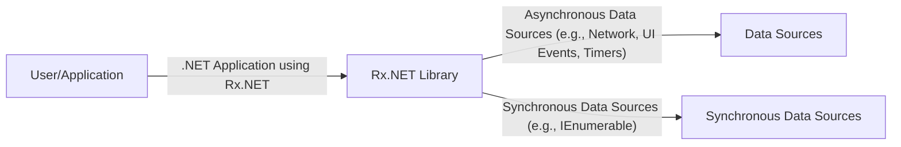
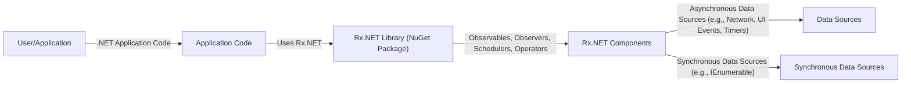
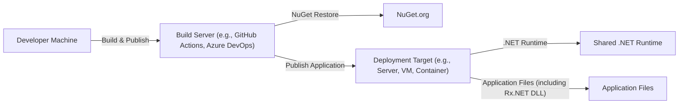
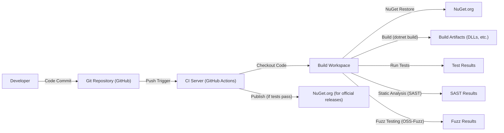

Okay, let's create a design document for the .NET Reactive Extensions (Rx.NET) library, focusing on aspects relevant to threat modeling.

# BUSINESS POSTURE

Business Priorities and Goals:

*   Provide a powerful and consistent library for handling asynchronous data streams and events across various .NET platforms.
*   Enable developers to write cleaner, more manageable, and less error-prone code when dealing with complex asynchronous operations.
*   Maintain high performance and efficiency to support demanding real-time applications.
*   Ensure broad compatibility and adoption within the .NET ecosystem.
*   Foster a strong community and ecosystem around the library.

Most Important Business Risks:

*   Vulnerabilities in the library could be exploited to compromise applications that rely on it, potentially leading to data breaches, denial of service, or other security incidents.
*   Performance issues or bugs could disrupt the operation of critical applications, causing financial losses or reputational damage.
*   Lack of adoption or community support could lead to the library becoming obsolete or unsupported, forcing dependent applications to migrate to alternatives.
*   Incompatibility with new .NET versions or platforms could limit the library's usefulness and adoption.

# SECURITY POSTURE

Existing Security Controls:

*   security control: Code Reviews: The project is open-source and subject to community scrutiny, with pull requests undergoing review before merging. (Described in contribution guidelines and visible in the GitHub repository's pull request history).
*   security control: Static Analysis: The project likely uses static analysis tools as part of its build process to identify potential code quality and security issues. (Implied by the use of .NET and common development practices).
*   security control: Fuzz Testing: The project uses OSS-Fuzz for continuous fuzzing. (Described in https://github.com/dotnet/reactive/tree/main/oss-fuzz)
*   security control: Signed Releases: Official releases of the library are digitally signed to ensure authenticity and integrity. (Standard practice for NuGet packages).
*   security control: Issue Tracking: Security vulnerabilities can be reported and tracked through the GitHub issue tracker. (Standard practice for GitHub projects).

Accepted Risks:

*   accepted risk: Asynchronous Complexity: The inherent complexity of asynchronous programming and the Rx.NET library itself introduces a risk of developers misusing the library, potentially leading to subtle bugs or vulnerabilities.
*   accepted risk: Third-Party Dependencies: The library may depend on other third-party libraries, which could introduce their own security risks.
*   accepted risk: Operator Misuse: The extensive set of operators in Rx.NET provides flexibility but also increases the risk of developers choosing inappropriate or insecure operators for a given task.

Recommended Security Controls:

*   security control: Security-Focused Documentation: Enhance documentation with specific security considerations and best practices for using Rx.NET securely.
*   security control: Threat Modeling: Conduct regular threat modeling exercises to identify and mitigate potential vulnerabilities in the library's design and implementation.
*   security control: Dependency Scanning: Implement automated dependency scanning to detect and address known vulnerabilities in third-party libraries.

Security Requirements:

*   Authentication: Not directly applicable to the library itself, as Rx.NET is a client-side library for handling data streams. Authentication is the responsibility of the application using Rx.NET.
*   Authorization: Not directly applicable to the library itself. Authorization is the responsibility of the application using Rx.NET.
*   Input Validation:
    *   The library should handle potentially malformed or unexpected input from data sources gracefully, without crashing or exposing vulnerabilities.
    *   Developers using Rx.NET should be aware of the need to validate data coming from external sources before processing it with Rx.NET operators.
*   Cryptography:
    *   The library itself does not handle cryptographic operations directly.
    *   If Rx.NET is used to process sensitive data, the application using it should implement appropriate encryption and decryption mechanisms.

# DESIGN

## C4 CONTEXT

C4 Context Element List:

*   User/Application:
    *   Name: User/Application
    *   Type: External Entity (User or another System)
    *   Description: Represents the user or application that utilizes the Rx.NET library to handle asynchronous data streams.
    *   Responsibilities: Consumes and processes data streams provided by Rx.NET, implements business logic.
    *   Security controls: Implements authentication, authorization, and input validation as needed for the specific application.
*   Rx.NET Library:
    *   Name: Rx.NET Library
    *   Type: System
    *   Description: The core library providing functionalities for reactive programming with observable sequences.
    *   Responsibilities: Provides operators for transforming, filtering, and combining asynchronous data streams, manages subscriptions and unsubscriptions, handles errors and completion signals.
    *   Security controls: Internal error handling, exception management.
*   Data Sources:
    *   Name: Data Sources
    *   Type: External Entity
    *   Description: Represents various sources of asynchronous data, such as network streams, UI events, timers, or other asynchronous APIs.
    *   Responsibilities: Provides raw data streams to Rx.NET.
    *   Security controls: Dependent on the specific data source (e.g., network security for network streams).
*   Synchronous Data Sources:
    *   Name: Synchronous Data Sources
    *   Type: External Entity
    *   Description: Represents sources of synchronous data, such as IEnumerable.
    *   Responsibilities: Provides data to Rx.NET.
    *   Security controls: Dependent on the specific data source.

## C4 CONTAINER

Since Rx.NET is a library, the container diagram is essentially an extension of the context diagram.  It doesn't have separate deployable units in the traditional sense.

C4 Container Element List:

*   User/Application:
    *   Name: User/Application
    *   Type: External Entity
    *   Description: Represents the user or application that utilizes the Rx.NET library.
    *   Responsibilities: Initiates interactions with the application.
    *   Security controls: Implements authentication, authorization as needed.
*   Application Code:
    *   Name: Application Code
    *   Type: Container
    *   Description: The code of the application that uses the Rx.NET library.
    *   Responsibilities: Implements business logic, uses Rx.NET to handle asynchronous data streams.
    *   Security controls: Input validation, output encoding, error handling, application-specific security logic.
*   Rx.NET Library (NuGet Package):
    *   Name: Rx.NET Library (NuGet Package)
    *   Type: Container
    *   Description: The packaged Rx.NET library, typically distributed as a NuGet package.
    *   Responsibilities: Provides the core functionality of Rx.NET.
    *   Security controls: Signed NuGet package.
*   Rx.NET Components:
    *   Name: Rx.NET Components
    *   Type: Component
    *   Description: Internal components of Rx.NET, including Observables, Observers, Schedulers, and Operators.
    *   Responsibilities: Implement the core logic of reactive programming.
    *   Security controls: Internal error handling, exception management.
*   Data Sources:
    *   Name: Data Sources
    *   Type: External Entity
    *   Description: Represents various sources of asynchronous data.
    *   Responsibilities: Provides raw data streams.
    *   Security controls: Dependent on the specific data source.
*   Synchronous Data Sources:
    *   Name: Synchronous Data Sources
    *   Type: External Entity
    *   Description: Represents sources of synchronous data, such as IEnumerable.
    *   Responsibilities: Provides data to Rx.NET.
    *   Security controls: Dependent on the specific data source.

## DEPLOYMENT

Rx.NET, as a library, is deployed as part of the application that uses it.  There isn't a separate Rx.NET deployment. The deployment model follows that of the consuming .NET application.

Possible Deployment Solutions:

1.  **Self-Contained Deployment:** The application and all its dependencies, including Rx.NET, are packaged together into a single executable or deployment unit.
2.  **Framework-Dependent Deployment:** The application relies on a shared .NET runtime being installed on the target machine. Rx.NET would be deployed as a NuGet package restored during the build or deployment process.
3.  **Cloud Deployment (e.g., Azure, AWS, GCP):** The application, including Rx.NET, can be deployed to various cloud platforms using platform-specific deployment mechanisms (e.g., Azure App Service, AWS Elastic Beanstalk, Google Cloud Run).

Chosen Deployment Solution (Example: Framework-Dependent Deployment):

Deployment Element List:

*   Developer Machine:
    *   Name: Developer Machine
    *   Type: Node
    *   Description: The machine where the application code is written and built.
    *   Responsibilities: Code development, testing, initiating the build process.
    *   Security controls: Developer workstation security (e.g., antivirus, firewall).
*   Build Server:
    *   Name: Build Server
    *   Type: Node
    *   Description: The server or service responsible for building the application.
    *   Responsibilities: Compiling code, restoring dependencies, running tests, publishing the application.
    *   Security controls: Secure build environment, access controls, build pipeline security.
*   NuGet.org:
    *   Name: NuGet.org
    *   Type: External System
    *   Description: The public NuGet repository where the Rx.NET package is hosted.
    *   Responsibilities: Provides the Rx.NET package.
    *   Security controls: NuGet package signing, vulnerability scanning.
*   Deployment Target:
    *   Name: Deployment Target
    *   Type: Node
    *   Description: The server, virtual machine, or container where the application is deployed.
    *   Responsibilities: Hosts the application and its dependencies.
    *   Security controls: Operating system security, network security, access controls.
*   Shared .NET Runtime:
    *   Name: Shared .NET Runtime
    *   Type: Node
    *   Description: The .NET runtime that is installed on the deployment target.
    *   Responsibilities: Executes the .NET application.
    *   Security controls: Regular updates and security patches.
*   Application Files:
    *   Name: Application Files
    *   Type: Node
    *   Description: The application's compiled code and dependencies, including the Rx.NET DLL.
    *   Responsibilities: Contains the application's logic and functionality.
    *   Security controls: File system permissions.

## BUILD

Build Process Description:

1.  **Code Commit:** Developers commit code changes to the Git repository (GitHub).
2.  **Push Trigger:** A push to the repository triggers the CI server (GitHub Actions).
3.  **Checkout Code:** The CI server checks out the code into a build workspace.
4.  **NuGet Restore:** The CI server restores NuGet packages, including Rx.NET's dependencies.
5.  **Build:** The .NET build process compiles the code, producing build artifacts (DLLs).
6.  **Run Tests:** Unit tests and integration tests are executed.
7.  **Static Analysis (SAST):** Static analysis tools scan the code for potential vulnerabilities and code quality issues.
8.  **Fuzz Testing (OSS-Fuzz):** Continuous fuzzing is performed by OSS-Fuzz.
9.  **Publish:** If all tests and checks pass, the build artifacts are published. For official releases, this typically involves publishing to NuGet.org.

Security Controls in Build Process:

*   security control: **CI/CD Pipeline:** Automated build and deployment process ensures consistency and reduces manual errors.
*   security control: **NuGet Restore:** Fetches dependencies from a trusted source (NuGet.org).
*   security control: **Static Analysis (SAST):** Identifies potential vulnerabilities in the code.
*   security control: **Unit and Integration Tests:** Verify the correctness of the code and help prevent regressions.
*   security control: **Fuzz Testing (OSS-Fuzz):** Continuous fuzzing helps discover edge-case vulnerabilities.
*   security control: **Signed NuGet Packages:** Ensures the integrity and authenticity of published packages.

# RISK ASSESSMENT

Critical Business Processes:

*   Reliable and efficient handling of asynchronous data streams in applications.
*   Maintaining the stability and performance of applications that depend on Rx.NET.

Data to Protect and Sensitivity:

*   Rx.NET itself does not directly handle or store sensitive data. The sensitivity of the data depends on the application using Rx.NET.
*   However, vulnerabilities in Rx.NET could potentially be exploited to access or manipulate data handled by the consuming application. Therefore, the data sensitivity is indirectly related to the application's data.

# QUESTIONS & ASSUMPTIONS

Questions:

*   Are there any specific compliance requirements (e.g., HIPAA, PCI DSS) that applications using Rx.NET typically need to adhere to?
*   What are the most common security threats faced by applications that use Rx.NET?
*   What level of security assurance is expected from the Rx.NET library (e.g., formal verification, penetration testing)?

Assumptions:

*   BUSINESS POSTURE: The primary goal is to provide a robust and reliable library for asynchronous programming, with security being a critical consideration but not necessarily the absolute top priority.
*   SECURITY POSTURE: The project follows standard secure development practices, but there may be room for improvement in areas like security documentation and threat modeling.
*   DESIGN: The library is primarily used as a client-side component within .NET applications, and its deployment follows the application's deployment model. The build process is automated and includes security checks.