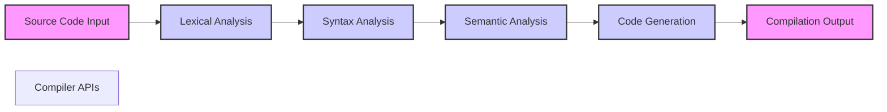
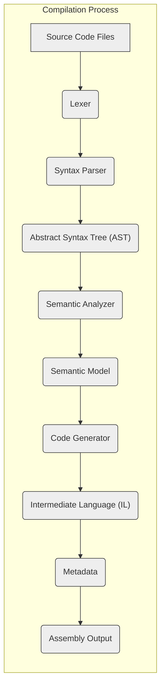

# Project Design Document: Roslyn (.NET Compiler Platform)

**Version:** 1.1
**Date:** October 26, 2023
**Author:** AI Software Architect

## 1. Introduction

This document provides a detailed architectural overview of the Roslyn project, the .NET Compiler Platform. Its primary purpose is to serve as a foundation for threat modeling activities by clearly outlining the system's components, data flows, and interactions.

## 2. Goals and Objectives

The core goals driving the Roslyn project include:

*   Providing open-source C# and Visual Basic compilers equipped with rich code analysis APIs.
*   Empowering developers to create sophisticated code-centric tools, such as IDE extensions, refactoring utilities, and static analysis engines.
*   Establishing a platform conducive to language innovation and experimentation within the .NET ecosystem.
*   Enhancing the performance and reliability of the .NET compilation process.

## 3. High-Level Architecture

Roslyn's architecture is structured into several distinct layers, each with specific responsibilities:

*   **Source Code Input:** The entry point for source code into the compilation pipeline.
*   **Lexical Analysis (Scanning):**  Transforms raw source code into a stream of meaningful tokens.
*   **Syntax Analysis (Parsing):**  Organizes tokens into a hierarchical Abstract Syntax Tree (AST).
*   **Semantic Analysis:**  Performs in-depth analysis to understand the meaning and validity of the code.
*   **Code Generation:**  Translates the semantically correct code into executable instructions.
*   **Compilation Output:**  The final stage, producing compiled artifacts.
*   **Compiler APIs:**  A set of interfaces enabling programmatic interaction with the compiler.

## 4. Detailed Component Design

This section details the individual components within the Roslyn architecture, elaborating on their functions and interactions.

### 4.1. Source Code Input

*   **Description:** This component is responsible for the initial ingestion of source code. It handles reading source files from various locations and formats.
*   **Key Functions:**
    *   Loading source code from the file system, in-memory strings, or other input streams.
    *   Detecting and handling different text encodings to correctly interpret the source code.
    *   Managing the source text, including tracking line and character positions for error reporting.
    *   Processing compiler directives and preprocessor symbols that influence the compilation process.

### 4.2. Lexical Analysis (Scanner)

*   **Description:** The lexer breaks down the continuous stream of characters in the source code into a sequence of individual tokens. These tokens represent the basic lexical elements of the programming language.
*   **Key Functions:**
    *   Identifying keywords (e.g., `class`, `int`, `if`).
    *   Recognizing identifiers (variable names, function names).
    *   Extracting operators (e.g., `+`, `-`, `=`).
    *   Parsing literals (e.g., numbers, strings).
    *   Identifying punctuation (e.g., `;`, `{`, `}`).
    *   Skipping whitespace and comments, although they might be preserved for certain analyses.
    *   Reporting lexical errors, such as invalid characters or malformed tokens.

### 4.3. Syntax Analysis (Parser)

*   **Description:** The parser takes the stream of tokens produced by the lexer and constructs an Abstract Syntax Tree (AST). The AST represents the hierarchical grammatical structure of the code, reflecting the relationships between different code elements.
*   **Key Functions:**
    *   Enforcing the grammar rules of the C# or Visual Basic language.
    *   Building a tree-like structure where nodes represent syntactic constructs (e.g., statements, expressions, declarations).
    *   Identifying and reporting syntax errors, such as misplaced semicolons or incorrect grammar.
    *   Creating a structured representation that is easier for subsequent analysis than the linear sequence of tokens.

### 4.4. Semantic Analysis

*   **Description:** This is a crucial stage where the compiler understands the meaning of the code. It analyzes the AST to perform type checking, resolve symbols, and validate the code's semantics.
*   **Key Functions:**
    *   Resolving symbols: Determining the meaning of identifiers by linking them to their declarations (e.g., finding the declaration of a variable).
    *   Performing type checking: Ensuring that operations are performed on compatible types and that type conversions are valid.
    *   Checking for semantic errors: Identifying issues like using an undeclared variable, calling a method with incorrect arguments, or violating access modifiers.
    *   Building semantic models: Creating rich data structures that provide detailed information about the code's meaning, including type information, symbol information, and control flow.

### 4.5. Code Generation

*   **Description:** The code generator translates the semantically analyzed code into executable instructions. For .NET, this typically involves generating Common Intermediate Language (CIL), also known as MSIL.
*   **Key Functions:**
    *   Emitting CIL instructions based on the semantic model of the code.
    *   Performing optimizations to improve the performance of the generated code.
    *   Generating metadata that describes the types, members, and other elements of the compiled code.
    *   Handling platform-specific considerations if targeting native code compilation scenarios.

### 4.6. Compilation Output

*   **Description:** This component is responsible for producing the final output of the compilation process. This is typically a .NET assembly (a DLL or EXE file) containing the compiled code and metadata.
*   **Key Functions:**
    *   Writing the generated CIL and metadata to the output assembly file.
    *   Creating Program Database (PDB) files, which contain debugging information that maps the compiled code back to the source code.
    *   Potentially generating other output artifacts, such as XML documentation files.

### 4.7. Compiler APIs

*   **Description:** Roslyn exposes a comprehensive set of APIs that allow developers to programmatically access and interact with the compiler's functionality. This enables the creation of various code analysis and manipulation tools.
*   **Key Components:**
    *   **Syntax API:** Provides access to the syntax tree, allowing inspection and manipulation of the code's structure.
    *   **Semantic API:** Offers access to the semantic model, providing information about types, symbols, and the meaning of the code.
    *   **Compilation API:** Enables control over the compilation process, including setting compiler options and managing compilation units.
    *   **Workspace API:** Allows working with projects and solutions, providing a higher-level abstraction for code analysis.
    *   **Diagnostic API:**  Provides access to compiler errors, warnings, and other diagnostic information.

## 5. Data Flow Diagram

The following diagram illustrates the primary flow of data through the Roslyn compilation pipeline:

## 6. Security Considerations

Understanding potential security implications is crucial for threat modeling. Here are key areas to consider within the Roslyn project:

*   **Input Validation and Malicious Code Handling:**
    *   The compiler must be resilient against maliciously crafted or malformed source code that could exploit vulnerabilities, leading to crashes, denial-of-service, or unexpected behavior.
    *   Consider scenarios where specially crafted code could trigger excessive resource consumption or expose internal compiler state.
*   **Compiler API Security and Access Control:**
    *   The powerful Compiler APIs offer extensive capabilities. It's essential to consider how these APIs are used by external tools and extensions.
    *   Unauthorized or malicious use of these APIs could potentially lead to code injection, information disclosure, or manipulation of the compilation process.
    *   Mechanisms for sandboxing or restricting the capabilities of external tools using the APIs might be necessary.
*   **Security of Generated Code:**
    *   The generated IL code should be secure and not introduce vulnerabilities in the compiled application.
    *   Consider potential vulnerabilities that could arise from incorrect code generation, leading to buffer overflows, type confusion, or other memory safety issues in the output.
*   **Dependency Management and Supply Chain Security:**
    *   Roslyn relies on external libraries and components. Vulnerabilities in these dependencies could indirectly affect Roslyn's security.
    *   The process of managing and updating dependencies needs to be secure to prevent the introduction of compromised components.
*   **Open Source Contribution Security:**
    *   As an open-source project, contributions from the community are vital. However, this also introduces potential risks.
    *   Measures to review and validate contributed code are necessary to prevent the introduction of malicious code or vulnerabilities by contributors.
    *   Secure development practices and code review processes are essential.
*   **Build Process Integrity:**
    *   The build and release process for Roslyn itself must be secure to prevent the injection of malicious code into the official releases.
    *   Compromised build infrastructure or processes could lead to the distribution of backdoored or vulnerable compiler versions.
*   **Information Disclosure through Diagnostics:**
    *   Compiler diagnostics and error messages should be carefully crafted to avoid inadvertently revealing sensitive information about the source code, the compilation environment, or internal compiler workings.
    *   Detailed error messages, while helpful for debugging, could potentially be exploited by attackers to gain insights into the application's logic or infrastructure.

## 7. Deployment and Usage

Roslyn is a fundamental component in various development workflows and is utilized in several key areas:

*   **Integrated Development Environments (IDEs):**  IDEs like Visual Studio deeply integrate Roslyn to provide features such as IntelliSense (code completion and suggestions), real-time error highlighting, refactoring tools, and code analysis capabilities.
*   **Command-Line Compilers:** The standard C# (`csc.exe`) and Visual Basic (`vbc.exe`) command-line compilers are built upon the Roslyn platform, providing the core compilation functionality for .NET projects.
*   **Static Analysis Tools:** Numerous static analysis tools, including SonarQube and Roslyn Analyzers, leverage the Roslyn APIs to perform in-depth code analysis, identify potential bugs, security vulnerabilities, and style violations.
*   **Code Generation and Transformation Tools:** Developers can utilize the Roslyn APIs to build custom code generation tools, source code transformations, and other utilities that programmatically manipulate code.
*   **Scripting and Interactive Environments:** Roslyn powers C# scripting capabilities and interactive environments like .NET Interactive Notebooks, allowing for dynamic code execution and exploration.

## 8. Technologies Used

The Roslyn project relies on the following key technologies:

*   **Programming Languages:** Primarily C# for the compiler implementation, with some components potentially utilizing C++.
*   **.NET Framework / .NET:** The underlying platform upon which Roslyn is built and operates.
*   **Git:** The distributed version control system used for managing the Roslyn codebase.
*   **GitHub:** The platform hosting the Roslyn source code repository, facilitating collaboration and issue tracking.

## 9. Future Considerations

The Roslyn project is continuously evolving, with ongoing efforts focused on:

*   **Performance Optimization:**  Continuously improving the speed and efficiency of the compilation process.
*   **Language Feature Development:** Implementing new features and enhancements to the C# and Visual Basic languages.
*   **API Expansion and Refinement:** Further developing the Compiler APIs to support a wider range of use cases and provide more granular control.
*   **Improved Error Reporting and Diagnostics:** Enhancing the clarity and usefulness of compiler error messages and warnings.
*   **Cross-Platform Capabilities:** Ensuring robust and consistent behavior across different operating systems and architectures.
