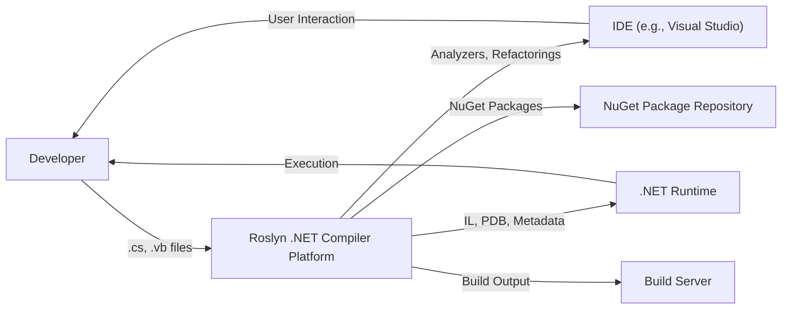
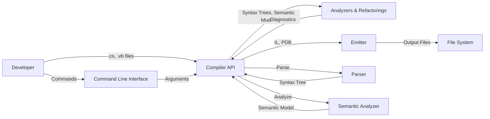
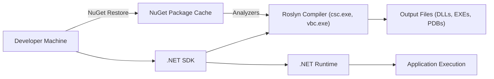
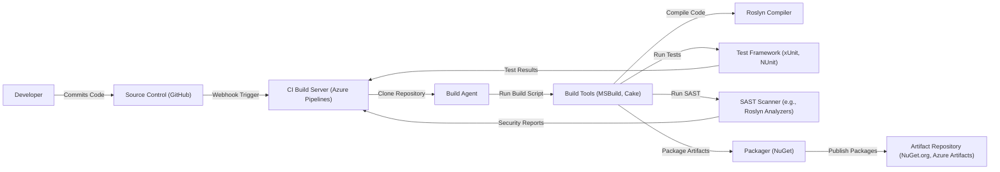

# Project Design Document: Roslyn (.NET Compiler Platform)

## BUSINESS POSTURE

*   Priorities and Goals:
    *   Provide a robust, performant, and extensible compiler platform for C# and Visual Basic .NET.
    *   Enable developers to build rich code analysis tools, refactorings, and diagnostics.
    *   Support the evolution of the C# and VB.NET languages.
    *   Offer a modern, open-source compiler infrastructure.
    *   Maintain backward compatibility where feasible, while allowing for language innovation.
    *   Provide high-fidelity parsing and semantic analysis.
    *   Enable cross-platform development.

*   Business Risks:
    *   Security vulnerabilities in the compiler itself could lead to the generation of insecure code or compromise build environments.
    *   Performance regressions in the compiler could significantly impact developer productivity.
    *   Inability to keep pace with the evolving .NET ecosystem and language features.
    *   Lack of adoption by the developer community due to complexity or usability issues.
    *   Compatibility issues with existing codebases or tools.
    *   Inadequate support for new platforms or architectures.

## SECURITY POSTURE

*   Existing Security Controls:
    *   security control: Code signing of official builds (described in release documentation and build scripts).
    *   security control: Regular security reviews and penetration testing (implied by Microsoft's security practices).
    *   security control: Use of static analysis tools during development (evident in build configurations and CI pipelines).
    *   security control: Fuzz testing to identify potential vulnerabilities (mentioned in documentation and issue discussions).
    *   security control: Secure development lifecycle (SDL) practices followed by Microsoft (publicly documented).
    *   security control: Input validation within the compiler to prevent injection attacks (inherent in compiler design).
    *   security control: Handling of untrusted input (e.g., source code) in a secure manner (fundamental to compiler operation).
    *   security control: Strong name signing of assemblies.

*   Accepted Risks:
    *   accepted risk: Reliance on the security of the underlying .NET runtime and operating system.
    *   accepted risk: Potential for denial-of-service attacks against the compiler (e.g., through extremely large or complex input files). This is mitigated but not entirely eliminated.
    *   accepted risk: The possibility of undiscovered vulnerabilities, despite rigorous testing.

*   Recommended Security Controls:
    *   security control: Implement a comprehensive Software Bill of Materials (SBOM) for all compiler components and dependencies.
    *   security control: Integrate dynamic analysis (e.g., runtime instrumentation) to detect vulnerabilities during testing.
    *   security control: Establish a clear vulnerability disclosure and response process.
    *   security control: Regularly audit and update dependencies to address known vulnerabilities.

*   Security Requirements:

    *   Authentication: Not directly applicable to the compiler itself, but relevant to build and deployment environments. Build servers and package repositories should use strong authentication mechanisms.
    *   Authorization: Not directly applicable to the compiler itself. Access control to build servers and source code repositories should be enforced.
    *   Input Validation: The compiler must rigorously validate all input, including source code, configuration files, and command-line arguments. This is crucial to prevent injection attacks and ensure the integrity of the compilation process.
    *   Cryptography: The compiler should use strong cryptographic algorithms for code signing and other security-sensitive operations.  It should adhere to current best practices for key management and algorithm selection.

## DESIGN

### C4 CONTEXT

*   Elements:

    *   Element:
        *   Name: Developer
        *   Type: Person
        *   Description: A software developer writing C# or VB.NET code.
        *   Responsibilities: Writes code, uses the compiler, interacts with the IDE, and consumes compiler output.
        *   Security controls: Uses a secure development environment, follows secure coding practices.

    *   Element:
        *   Name: Roslyn .NET Compiler Platform
        *   Type: Software System
        *   Description: The open-source compiler platform for C# and VB.NET.
        *   Responsibilities: Parses source code, performs semantic analysis, generates IL code and PDB files, provides APIs for code analysis.
        *   Security controls: Input validation, secure coding practices, regular security reviews, fuzz testing.

    *   Element:
        *   Name: IDE (e.g., Visual Studio)
        *   Type: Software System
        *   Description: An integrated development environment used by developers.
        *   Responsibilities: Provides a user interface for code editing, debugging, and project management. Integrates with Roslyn for code analysis and refactoring.
        *   Security controls: Secure communication with Roslyn, secure handling of user input, regular security updates.

    *   Element:
        *   Name: .NET Runtime
        *   Type: Software System
        *   Description: The runtime environment for executing .NET applications.
        *   Responsibilities: Executes compiled IL code, provides core libraries and services.
        *   Security controls: Secure execution environment, sandboxing, regular security updates.

    *   Element:
        *   Name: NuGet Package Repository
        *   Type: Software System
        *   Description: A repository for hosting and distributing NuGet packages.
        *   Responsibilities: Stores and serves NuGet packages, including Roslyn analyzers and components.
        *   Security controls: Package signing, access control, vulnerability scanning.

    *   Element:
        *   Name: Build Server
        *   Type: Software System
        *   Description: A server that automates the build process.
        *   Responsibilities: Retrieves source code, invokes the compiler, runs tests, and produces build artifacts.
        *   Security controls: Secure access control, secure build environment, secure handling of build artifacts.

### C4 CONTAINER

*   Elements:

    *   Element:
        *   Name: Developer
        *   Type: Person
        *   Description: A software developer writing C# or VB.NET code.
        *   Responsibilities: Writes code, uses the compiler, interacts with the IDE, and consumes compiler output.
        *   Security controls: Uses a secure development environment, follows secure coding practices.

    *   Element:
        *   Name: Compiler API
        *   Type: API
        *   Description: The public API surface of the Roslyn compiler.
        *   Responsibilities: Provides access to compiler functionality, including parsing, semantic analysis, and code generation.
        *   Security controls: Input validation, secure coding practices, API access control (where applicable).

    *   Element:
        *   Name: Analyzers & Refactorings
        *   Type: Component
        *   Description: Components that use the Compiler API to perform code analysis and refactoring.
        *   Responsibilities: Analyze code for potential issues, provide code fixes and refactorings.
        *   Security controls: Secure coding practices, sandboxing (for third-party analyzers).

    *   Element:
        *   Name: Emitter
        *   Type: Component
        *   Description: The component responsible for generating IL code and PDB files.
        *   Responsibilities: Translates the semantic model into executable code.
        *   Security controls: Secure coding practices, adherence to IL specifications.

    *   Element:
        *   Name: Parser
        *   Type: Component
        *   Description: The component responsible for parsing source code into syntax trees.
        *   Responsibilities: Lexical analysis, syntax analysis, error recovery.
        *   Security controls: Input validation, robust error handling, fuzz testing.

    *   Element:
        *   Name: Semantic Analyzer
        *   Type: Component
        *   Description: The component responsible for performing semantic analysis.
        *   Responsibilities: Type checking, binding, flow analysis, error reporting.
        *   Security controls: Secure coding practices, adherence to language specifications.

    *   Element:
        *   Name: File System
        *   Type: System
        *   Description: The underlying file system.
        *   Responsibilities: Stores source code and output files.
        *   Security controls: File system permissions, access control.

    *   Element:
        *   Name: Command Line Interface
        *   Type: Interface
        *   Description: Command line interface to invoke compiler.
        *   Responsibilities: Accepts command line arguments and passes them to Compiler API.
        *   Security controls: Input validation.

### DEPLOYMENT

*   Possible Deployment Solutions:
    *   As part of the .NET SDK.
    *   As NuGet packages.
    *   Integrated into Visual Studio and other IDEs.
    *   Standalone command-line compiler.

*   Chosen Solution: As part of the .NET SDK (and NuGet packages for analyzers/extensions).

*   Elements:

    *   Element:
        *   Name: Developer Machine
        *   Type: Device
        *   Description: The machine where the developer writes and builds code.
        *   Responsibilities: Hosts the .NET SDK, IDE, and source code.
        *   Security controls: Operating system security, secure development environment.

    *   Element:
        *   Name: .NET SDK
        *   Type: Software
        *   Description: The .NET Software Development Kit.
        *   Responsibilities: Provides tools for building, testing, and deploying .NET applications. Includes the Roslyn compiler.
        *   Security controls: Code signing, regular security updates.

    *   Element:
        *   Name: Roslyn Compiler (csc.exe, vbc.exe)
        *   Type: Executable
        *   Description: The command-line compilers for C# and VB.NET.
        *   Responsibilities: Compiles source code into IL code and PDB files.
        *   Security controls: Input validation, secure coding practices, regular security reviews.

    *   Element:
        *   Name: .NET Runtime
        *   Type: Software
        *   Description: The runtime environment for executing .NET applications.
        *   Responsibilities: Executes compiled IL code.
        *   Security controls: Secure execution environment, sandboxing, regular security updates.

    *   Element:
        *   Name: Output Files (DLLs, EXEs, PDBs)
        *   Type: Files
        *   Description: The output files generated by the compiler.
        *   Responsibilities: Contain the compiled code and debugging information.
        *   Security controls: Code signing (optional), file system permissions.

    *   Element:
        *   Name: Application Execution
        *   Type: Process
        *   Description: The execution of the compiled application.
        *   Responsibilities: Runs the application logic.
        *   Security controls: Operating system security, application-level security.

    *   Element:
        *   Name: NuGet Package Cache
        *   Type: Software
        *   Description: Local cache for downloaded NuGet packages.
        *   Responsibilities: Stores downloaded NuGet packages.
        *   Security controls: File system permissions.

### BUILD

*   Build Process Description:

    1.  Developers commit code to the source control repository (GitHub).
    2.  A webhook triggers the CI build server (Azure Pipelines).
    3.  The build server spawns a build agent.
    4.  The build agent clones the repository.
    5.  The build agent runs a build script (using MSBuild or Cake).
    6.  The build script invokes the Roslyn compiler to compile the code.
    7.  The build script runs unit tests using a test framework (xUnit, NUnit).
    8.  The build script runs static analysis tools (SAST scanners, including Roslyn analyzers) to identify potential security vulnerabilities.
    9.  The build script packages the build artifacts (NuGet packages).
    10. The packager publishes the packages to an artifact repository (NuGet.org, Azure Artifacts).
    11. SAST scanner and test framework reports are sent to CI build server.

    *   Security Controls:
        *   Source Control: Access control, branch protection rules, code review policies.
        *   CI Build Server: Secure access control, secure build environment, build pipeline as code.
        *   Build Agent: Ephemeral build agents, minimal permissions.
        *   Build Tools: Secure configuration, dependency management.
        *   Compiler: Input validation, secure coding practices.
        *   Test Framework: Comprehensive test coverage.
        *   SAST Scanner: Regular updates to vulnerability definitions, integration with the build pipeline.
        *   Packager: Secure packaging process, package signing.
        *   Artifact Repository: Access control, vulnerability scanning, package integrity checks.

## RISK ASSESSMENT

*   Critical Business Processes:
    *   Compiling C# and VB.NET code accurately and efficiently.
    *   Providing a reliable and extensible platform for code analysis.
    *   Supporting the development and evolution of the .NET ecosystem.

*   Data:
    *   Source Code (Sensitivity: Varies - from public open-source to highly confidential proprietary code). The compiler processes source code, but does not store it persistently. The primary concern is ensuring that the compiler does not introduce vulnerabilities into the compiled code.
    *   Intermediate Language (IL) Code (Sensitivity: Lower than source code, but still represents the application's logic). The compiler generates IL code, which is then executed by the .NET runtime.
    *   Metadata (Sensitivity: Lower than source code, but can reveal information about the application's structure). The compiler generates metadata, which describes the types and members in the compiled code.
    *   PDB Files (Sensitivity: Contains debugging information, including source code paths and line numbers. Should be protected to prevent reverse engineering). The compiler generates PDB files to enable debugging.
    *   Build Artifacts (Sensitivity: Varies depending on the application). The compiler produces build artifacts, which are then deployed and executed.
    *   Compiler Configuration Files (Sensitivity: Can contain sensitive information, such as build settings and paths). The compiler uses configuration files to control its behavior.
    *   Compiler Diagnostics (Sensitivity: Can reveal information about potential vulnerabilities or errors in the code). The compiler generates diagnostics to report errors, warnings, and other information.

## QUESTIONS & ASSUMPTIONS

*   Questions:
    *   What specific threat models have been used for Roslyn in the past?
    *   What are the current performance benchmarks and targets for the compiler?
    *   What is the process for handling security vulnerabilities reported by external researchers?
    *   Are there any specific compliance requirements (e.g., FIPS) that need to be considered?
    *   What level of support is provided for older versions of the .NET Framework?

*   Assumptions:
    *   BUSINESS POSTURE: Microsoft prioritizes the security and reliability of the .NET ecosystem.
    *   SECURITY POSTURE: Microsoft follows its internal Secure Development Lifecycle (SDL) practices.
    *   DESIGN: The design of the compiler is modular and extensible, allowing for future enhancements and security improvements. The build process is automated and secure. The deployment process is well-defined and reliable.