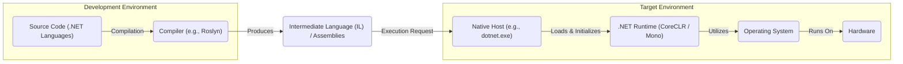
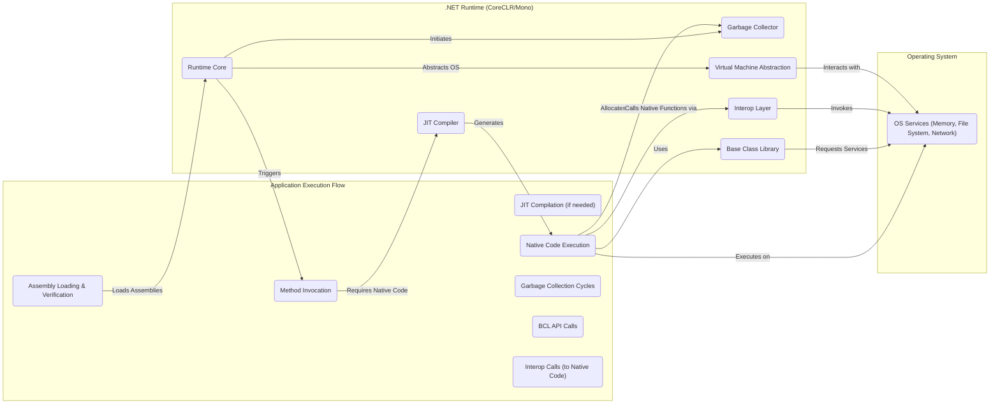

## Project Design Document: .NET Runtime (Improved)

**1. Introduction**

This document provides an enhanced architectural design overview of the .NET Runtime project, based on the codebase at [https://github.com/dotnet/runtime](https://github.com/dotnet/runtime). This detailed design serves as a crucial foundation for subsequent threat modeling activities, offering a comprehensive understanding of the runtime's components, interactions, and overall structure. The focus is on providing sufficient detail to identify potential attack surfaces and security vulnerabilities.

**2. Goals and Objectives**

The core objective of the .NET Runtime is to provide a robust and secure cross-platform execution environment for applications developed using .NET languages. Key objectives include:

* **Secure Execution of Managed Code:**  Loading, verifying, and executing code written in .NET languages (C#, F#, VB.NET) while enforcing security policies.
* **Automated Memory Management:**  Providing automatic memory management through a secure and efficient garbage collection mechanism to prevent memory-related vulnerabilities.
* **Dynamic Compilation and Optimization:**  Performing Just-In-Time (JIT) compilation of intermediate language (IL) to native code, optimizing for performance and security on the target architecture.
* **Comprehensive Base Class Library (BCL):**  Offering a rich and secure set of APIs for common programming tasks, minimizing the need for developers to write potentially vulnerable low-level code.
* **Seamless Interoperability:**  Enabling secure and controlled interaction between managed code and native code, operating system functionalities, and external libraries.
* **Broad Cross-Platform Compatibility:**  Supporting execution on various operating systems (Windows, Linux, macOS) and processor architectures while maintaining security standards.
* **Robust Security Framework:**  Implementing security features such as code access security (CAS - though largely superseded), type safety, and verification to protect against malicious code.

**3. High-Level Architecture**

**Description:**

* **Development Environment:** Developers create applications using .NET languages. The compiler (e.g., Roslyn for C#) translates this human-readable code into platform-agnostic Intermediate Language (IL) and packages it into assemblies (DLLs or EXEs).
* **Intermediate Language (IL) / Assemblies:** This is the compiled form of the .NET code, containing metadata and instructions that the runtime can understand and execute. Assemblies are the fundamental units of deployment and versioning.
* **Target Environment:**
    * **Native Host:** The platform-specific executable (e.g., `dotnet.exe` on Windows, `dotnet` on Linux/macOS) acts as the entry point for .NET applications. It's responsible for bootstrapping the .NET Runtime.
    * **.NET Runtime (CoreCLR / Mono):** This is the heart of the execution environment. CoreCLR is the primary runtime for Windows, Linux, and macOS, known for its performance. Mono is an alternative implementation, often chosen for its broader platform support, including mobile and embedded systems. Both provide the necessary services to run .NET applications.
    * **Operating System:** The underlying operating system provides essential services like memory management, file system access, networking, and security features that the .NET Runtime relies upon.
    * **Hardware:** The physical hardware on which the operating system and the .NET Runtime execute.

**4. Key Components of the .NET Runtime**

* **CoreCLR (Common Language Runtime):**
    * The foundational runtime environment responsible for executing .NET code on Windows, Linux, and macOS.
    * **Just-In-Time (JIT) Compiler (RyuJIT):** Translates IL code into native machine code just before execution. This allows for platform-specific optimizations. Security considerations include ensuring the JIT compiler doesn't introduce vulnerabilities during code generation.
    * **Garbage Collector (GC):**  Manages memory allocation and deallocation automatically. Different GC algorithms are employed based on workload and configuration. Security is paramount to prevent memory corruption and denial-of-service attacks.
    * **Type System:** Enforces type safety, ensuring that operations are performed on compatible data types. This is a fundamental security mechanism to prevent many common programming errors that can lead to vulnerabilities.
    * **Thread Management:** Manages the execution of multiple threads within an application. Proper synchronization and resource management are crucial for security and stability.
    * **Security Manager (Largely Superseded by OS Features):** Historically responsible for enforcing code access security (CAS). While largely superseded, understanding its historical role is important. Modern security relies more on OS-level features and permissions.
* **Mono:**
    * An alternative, cross-platform implementation of the .NET runtime.
    * Shares many of the same core functionalities as CoreCLR, including a JIT compiler, garbage collector, and BCL implementation.
    * Its architecture may differ slightly from CoreCLR in implementation details.
* **Base Class Library (BCL):**
    * A vast collection of pre-built classes, interfaces, and value types that provide essential functionalities for .NET developers.
    * Includes namespaces for:
        * **System:** Core types, attributes, exceptions.
        * **System.IO:** File and stream operations. Security vulnerabilities can arise from improper handling of file paths and permissions.
        * **System.Net:** Networking functionalities. Careful handling of network inputs and outputs is crucial to prevent attacks.
        * **System.Security:** Classes for cryptography, authentication, and authorization. Correct implementation of security features is vital.
        * **System.Reflection:** Allows inspection of metadata and dynamic invocation. Can be misused if not properly controlled.
* **Just-In-Time (JIT) Compiler (RyuJIT in CoreCLR, others in Mono):**
    * Translates platform-agnostic IL code into platform-specific native machine code at runtime.
    * Key stages include:
        * **Loading and Verification:** Ensures the IL code is valid and doesn't violate type safety rules. This is a critical security step.
        * **Optimization:** Applies various optimizations to improve performance. Security considerations involve ensuring optimizations don't introduce vulnerabilities.
        * **Code Generation:** Generates the final native machine code.
* **Garbage Collector (GC):**
    * Automatically reclaims memory occupied by objects that are no longer in use.
    * Different generations (Gen 0, Gen 1, Gen 2) and algorithms are used to optimize performance.
    * Security implications include preventing memory leaks and ensuring that sensitive data is properly erased from memory.
* **Type System:**
    * Defines the rules for data types, object layout, and type safety within the .NET environment.
    * Enforces strong typing, preventing operations that would violate type constraints.
    * Supports reflection, allowing runtime inspection of types and members.
* **Interop Layer:**
    * Enables .NET code to interact with native code (e.g., C/C++) and operating system APIs.
    * **Platform Invoke (P/Invoke):** Allows calling functions in unmanaged DLLs. This is a potential attack surface if native libraries have vulnerabilities or if data is not marshaled correctly.
    * **COM Interop:** Enables interaction with COM objects. Security considerations involve the security of the COM objects being accessed.
* **Native Host:**
    * The platform-specific executable that initiates the .NET runtime.
    * Responsible for:
        * Loading the appropriate version of the .NET Runtime.
        * Setting up the initial execution environment.
        * Invoking the application's entry point.

**5. Data Flow and Interactions**

**Description:**

1. **Assembly Loading & Verification:** When a .NET application starts, the Native Host loads the necessary assemblies. The runtime verifies the integrity and security of these assemblies, checking for valid metadata and potentially strong names.
2. **Method Invocation:** When a method is called for the first time, the runtime checks if native code for that method exists.
3. **JIT Compilation (if needed):** If native code doesn't exist, the JIT compiler translates the method's IL code into native machine code optimized for the target platform. This process includes security checks to prevent the generation of exploitable code.
4. **Native Code Execution:** The CPU executes the generated native code.
5. **Garbage Collection Cycles:** Periodically, the garbage collector identifies and reclaims memory occupied by objects that are no longer referenced. This process is crucial for preventing memory leaks and ensuring application stability and security.
6. **BCL API Calls:** Application code frequently interacts with the Base Class Library to perform common tasks. These calls are generally considered safe, but vulnerabilities can exist within the BCL itself.
7. **Interop Calls (to Native Code):** When the application needs to interact with native libraries or operating system APIs, it uses the Interop Layer. This is a significant potential attack surface, as vulnerabilities in native code or incorrect marshaling of data can lead to security issues.

**6. Security Considerations (Detailed)**

This section expands on the initial security considerations, providing more specific examples and potential attack vectors.

* **JIT Compiler Vulnerabilities:**
    * **Code Injection:** Bugs in the JIT compiler could allow attackers to inject malicious code during the compilation process.
    * **Type Confusion:** Errors in type handling within the JIT could lead to type confusion vulnerabilities, allowing attackers to bypass type safety.
    * **Speculative Execution Vulnerabilities (e.g., Spectre, Meltdown):** The JIT compiler needs to be designed to mitigate these hardware-level vulnerabilities.
* **Garbage Collector Vulnerabilities:**
    * **Use-After-Free:** Flaws in the GC could lead to objects being freed prematurely and then accessed, potentially leading to crashes or exploitable conditions.
    * **Memory Corruption:** Bugs in the GC's memory management logic could corrupt memory, potentially allowing attackers to overwrite critical data.
    * **Denial of Service:**  Exploiting GC behavior could lead to excessive memory consumption or long pauses, causing denial of service.
* **Base Class Library Vulnerabilities:**
    * **Input Validation Issues:** Vulnerabilities in BCL APIs that don't properly validate input (e.g., SQL injection in database access classes, cross-site scripting vulnerabilities in web-related classes).
    * **Cryptographic Weaknesses:** Improper implementation or use of cryptographic APIs in the BCL.
    * **Deserialization Vulnerabilities:** Unsafe deserialization of data can allow attackers to execute arbitrary code.
* **Interop Layer Risks:**
    * **Incorrect Marshaling:** Errors in converting data between managed and unmanaged code can lead to buffer overflows or other memory corruption issues.
    * **Vulnerabilities in Native Libraries:** If the .NET application interacts with vulnerable native libraries, those vulnerabilities can be exploited.
    * **DLL Hijacking:** Attackers could place malicious DLLs in locations where the application might load them instead of the intended ones.
* **Supply Chain Security:**
    * **Compromised Dependencies:**  Vulnerabilities in third-party libraries used by the .NET Runtime.
    * **Build System Compromise:**  Attackers could inject malicious code into the build process of the runtime itself.
* **Host Process Security:**
    * **Insufficient Permissions:** If the host process runs with excessive privileges, vulnerabilities in the .NET application could be more easily exploited.
    * **Process Isolation Issues:** Lack of proper isolation between .NET applications running on the same system could allow for cross-application attacks.
* **Code Signing and Verification:**
    * **Weak Signing Keys:** Compromised signing keys could allow attackers to sign malicious assemblies.
    * **Bypassable Verification:**  Flaws in the assembly verification process could allow unsigned or tampered assemblies to be loaded.
* **Reflection Abuse:**
    * Attackers could use reflection to bypass security restrictions or access private members.
* **Type Safety Violations:**
    * Although the type system provides strong safety, vulnerabilities in the runtime or JIT compiler could potentially lead to type safety violations.

**7. Assumptions and Constraints**

* This document focuses primarily on the CoreCLR and Mono implementations of the .NET Runtime. Specific details of other .NET implementations might differ.
* The security considerations are based on current knowledge of common vulnerabilities and attack patterns. New vulnerabilities may emerge over time.
* The level of detail provided is intended to be sufficient for initial threat modeling. More granular analysis may be required for specific components or features.

**8. Future Considerations**

* Detailed threat modeling sessions for each key component (JIT, GC, BCL, Interop).
* Analysis of specific security features and mitigations implemented within the .NET Runtime (e.g., Address Space Layout Randomization (ASLR), Data Execution Prevention (DEP)).
* Examination of the security implications of new features and ongoing development efforts.
* Regular review and updates to this design document to reflect changes in the architecture and security landscape.
* Investigation of fuzzing and static analysis tools used to identify potential vulnerabilities in the .NET Runtime.

This improved design document provides a more detailed and security-focused overview of the .NET Runtime architecture, serving as a robust foundation for comprehensive threat modeling activities.