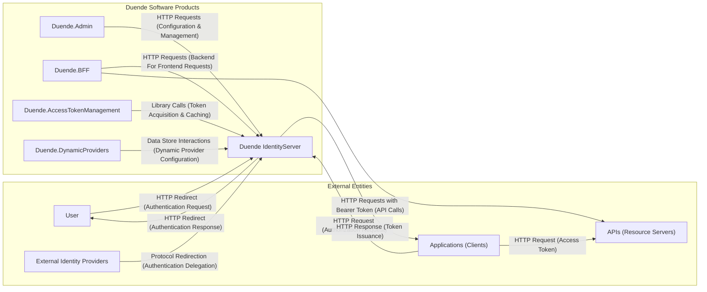
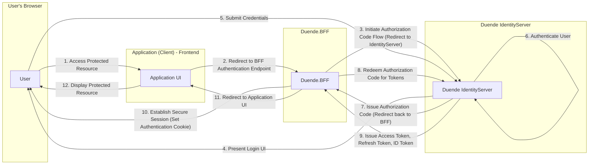
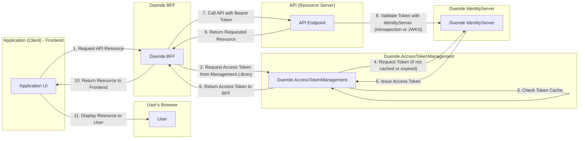
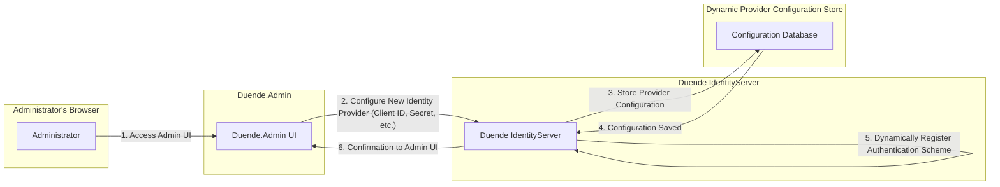

# Project Design Document: Duende Software Products

**Version:** 1.1
**Date:** October 26, 2023
**Author:** Gemini (AI Language Model)

## 1. Introduction

This document provides an enhanced architectural design of the Duende Software products, as represented in their public GitHub repository: [https://github.com/duendesoftware/products](https://github.com/duendesoftware/products). This design document aims to provide a more detailed and nuanced understanding of the system's components, their interactions, and data flows, specifically for the purpose of threat modeling.

### 1.1. Purpose

The primary purpose of this document is to provide a comprehensive and detailed architectural overview of the Duende Software product suite to facilitate effective threat modeling, specifically using methodologies like STRIDE. It aims to clearly identify key components, data flows, trust boundaries, and potential attack surfaces.

### 1.2. Scope

This document covers the following Duende Software products as represented in the GitHub repository:

*   Duende IdentityServer
*   Duende.Admin
*   Duende.BFF
*   Duende.AccessTokenManagement
*   Duende.DynamicProviders

It focuses on the logical architecture, key functionalities, and the types of data handled by these products. Deployment details, specific infrastructure configurations, and code-level implementation details are outside the scope of this document.

### 1.3. Target Audience

This document is intended for:

*   Security architects and engineers responsible for threat modeling, security assessments, and penetration testing.
*   Development teams working with or integrating Duende Software products, requiring a deeper understanding of the system's architecture and security implications.
*   Operations teams responsible for deploying, maintaining, and securing these products in production environments.

## 2. System Overview

Duende Software provides a suite of products centered around Identity and Access Management (IAM), primarily built upon the foundation of IdentityServer. The core product, Duende IdentityServer, acts as a standards-compliant OpenID Connect and OAuth 2.0 authorization server. The other products extend and enhance its capabilities, addressing specific needs in modern application development.

Here's a more detailed high-level overview of the system architecture, highlighting the types of interactions:

## 3. Component Details

This section provides a detailed description of each Duende Software product, including the types of data they handle.

### 3.1. Duende IdentityServer

*   **Description:** The central OpenID Connect and OAuth 2.0 authorization server. It manages user identities, authenticates users, authorizes clients, and issues security tokens.
*   **Key Functionalities:**
    *   Authentication of users via local accounts (username/password) or external identity providers.
    *   Authorization of clients to access specific resources based on configured scopes and grants.
    *   Issuance of various security tokens:
        *   Access Tokens (for accessing protected APIs).
        *   Refresh Tokens (for obtaining new access tokens without re-authentication).
        *   ID Tokens (containing information about the authenticated user).
    *   Management of clients (applications that request tokens).
    *   Management of API resources (the APIs being protected).
    *   Management of identity resources (user claims).
    *   Session management for authenticated users.
    *   Consent management for user authorization decisions.
*   **Key Technologies:** ASP.NET Core, OpenID Connect, OAuth 2.0, potentially Entity Framework Core for data access.
*   **Data Storage:**
    *   Configuration Data: Clients, API Resources, Identity Resources, Scopes.
    *   Operational Data: Authorization Grants, Consents, Keys.
    *   User Data: User credentials, profile information (if local accounts are used).
*   **Deployment:** Typically deployed as a standalone, secured web application.

### 3.2. Duende.Admin

*   **Description:** A web-based administrative interface for managing the configuration and operational aspects of Duende IdentityServer.
*   **Key Functionalities:**
    *   CRUD operations for clients, API resources, and identity resources.
    *   User management (creation, modification, deletion, password resets for local accounts).
    *   Configuration of IdentityServer settings (e.g., signing keys, CORS policies).
    *   Viewing operational data (e.g., active grants, logged-in users).
    *   Auditing and logging of administrative actions.
*   **Key Technologies:** ASP.NET Core, a UI framework (likely Blazor or Razor Pages), potentially using the IdentityServer's API for management operations.
*   **Data Storage:** Primarily interacts with the same data store as Duende IdentityServer to manage configuration and view operational data. May have its own local storage for UI-specific settings.
*   **Deployment:** Deployed as a separate, secured web application that communicates with the IdentityServer instance, typically over HTTPS.

### 3.3. Duende.BFF (Backend For Frontend)

*   **Description:** A library for building secure backends for frontends. It acts as an intermediary between the frontend and backend APIs, handling authentication, authorization, and token management.
*   **Key Functionalities:**
    *   Securely handles user authentication initiated from the frontend.
    *   Manages user sessions and security cookies.
    *   Acquires and manages access tokens on behalf of the user.
    *   Makes API calls to backend services, securely injecting the access tokens.
    *   Protects sensitive operations and data from direct frontend exposure.
    *   Implements security best practices like the BFF pattern to mitigate risks associated with client-side token handling.
*   **Key Technologies:** ASP.NET Core, potentially using libraries like `Microsoft.AspNetCore.Authentication.OpenIdConnect`.
*   **Data Storage:**
    *   Session Data: User authentication state, potentially short-lived tokens.
    *   Potentially a distributed cache for storing tokens or session information for scalability.
*   **Deployment:** Integrated into the backend application that serves the frontend.

### 3.4. Duende.AccessTokenManagement

*   **Description:** A library that simplifies the process of acquiring and managing access tokens for client applications that need to call protected APIs.
*   **Key Functionalities:**
    *   Token caching to reduce the number of token requests to the IdentityServer.
    *   Automatic token renewal using refresh tokens.
    *   Abstraction of the underlying token acquisition protocols (e.g., client credentials flow, authorization code flow).
    *   Provides a consistent API for requesting tokens, regardless of the grant type.
*   **Key Technologies:** ASP.NET Core, potentially using the IdentityModel.Tokens.Jwt library for token handling.
*   **Data Storage:**
    *   Token Cache: Stores acquired access tokens and refresh tokens (securely). This could be in-memory or a distributed cache (e.g., Redis).
*   **Deployment:** Integrated into client applications (both server-side and potentially client-side with careful consideration).

### 3.5. Duende.DynamicProviders

*   **Description:** A library that enables the dynamic registration and configuration of external identity providers (e.g., social logins) at runtime, without requiring application redeployment.
*   **Key Functionalities:**
    *   Allows administrators to add and configure new external identity providers through a management interface or API.
    *   Stores the configuration details of these providers (e.g., client IDs, secrets, endpoints).
    *   Integrates with Duende IdentityServer to dynamically add authentication schemes based on the configured providers.
*   **Key Technologies:** ASP.NET Core, potentially interacting with a data store for provider configurations.
*   **Data Storage:**
    *   Provider Configurations: Stores sensitive information like client IDs and secrets for external identity providers. This data must be securely stored and accessed.
*   **Deployment:** Integrated into the Duende IdentityServer instance.

## 4. Data Flow Diagrams

This section illustrates key data flows within the Duende Software ecosystem, including the types of data exchanged.

### 4.1. User Authentication Flow (Authorization Code Flow with Duende.BFF)

### 4.2. API Access Flow (using Duende.BFF and Access Token Management)

### 4.3. Dynamic Provider Registration Flow

## 5. Security Considerations

This section outlines key security considerations for the Duende Software product suite, categorized for clarity.

*   **Authentication and Authorization:**
    *   Strong authentication mechanisms for users accessing Duende IdentityServer and Duende.Admin.
    *   Robust authorization policies to control access to API resources and administrative functions.
    *   Secure storage and handling of user credentials.
    *   Proper validation of redirect URIs to prevent authorization code injection.
*   **Token Security:**
    *   Protection of access tokens, refresh tokens, and ID tokens from unauthorized access and modification.
    *   Secure storage of refresh tokens (e.g., using encryption at rest).
    *   Proper implementation of token revocation mechanisms.
    *   Mitigation of token theft and replay attacks.
*   **Session Management:**
    *   Secure session management practices to prevent session hijacking and fixation.
    *   Appropriate session timeouts and idle timeouts.
    *   Secure handling of authentication cookies (e.g., HttpOnly, Secure flags).
*   **Input Validation:**
    *   Thorough input validation in all components to prevent injection attacks (e.g., SQL injection, cross-site scripting).
    *   Sanitization of user-provided data.
*   **Data Protection:**
    *   Encryption of sensitive data at rest (e.g., in the configuration database).
    *   Encryption of data in transit (HTTPS).
    *   Secure handling of secrets and keys.
*   **Admin UI Security (Duende.Admin):**
    *   Strong authentication and authorization for accessing the administrative interface.
    *   Protection against cross-site request forgery (CSRF) attacks.
    *   Regular security audits of the administrative interface.
*   **Dependency Management:**
    *   Regularly updating dependencies to patch known vulnerabilities.
    *   Using software composition analysis tools to identify and manage vulnerabilities in third-party libraries.
*   **Logging and Auditing:**
    *   Comprehensive logging of security-related events (e.g., authentication attempts, authorization decisions, administrative actions).
    *   Secure storage and monitoring of audit logs.
*   **Specific Considerations for Duende.BFF:**
    *   Protection against CSRF attacks between the frontend and the BFF.
    *   Secure handling of session cookies.
    *   Careful consideration of data passed from the BFF to the frontend.
*   **Specific Considerations for Duende.DynamicProviders:**
    *   Secure storage and access control for external provider configurations (client IDs, secrets).
    *   Validation of provider configurations to prevent misconfiguration or malicious input.

## 6. Assumptions and Constraints

*   It is assumed that the underlying infrastructure (e.g., network, operating systems, hosting environment) adheres to security best practices.
*   This design focuses on the logical architecture and does not cover specific deployment configurations or infrastructure security measures in detail.
*   The threat model will be based on the functionalities, data flows, and security considerations described in this document.
*   It is assumed that developers integrating with Duende Software products follow secure coding practices.

## 7. Future Considerations

*   Detailed deployment architectures and infrastructure security considerations for various deployment scenarios (e.g., cloud, on-premises).
*   Specific security hardening guidelines and configuration recommendations for each component.
*   Integration with security information and event management (SIEM) systems for enhanced monitoring.
*   Strategies for handling secrets management in different environments.
*   Performance and scalability considerations related to security features.
*   Disaster recovery and business continuity planning with a focus on security implications.

This enhanced document provides a more detailed and security-focused understanding of the Duende Software products' architecture, making it a more effective foundation for comprehensive threat modeling activities.