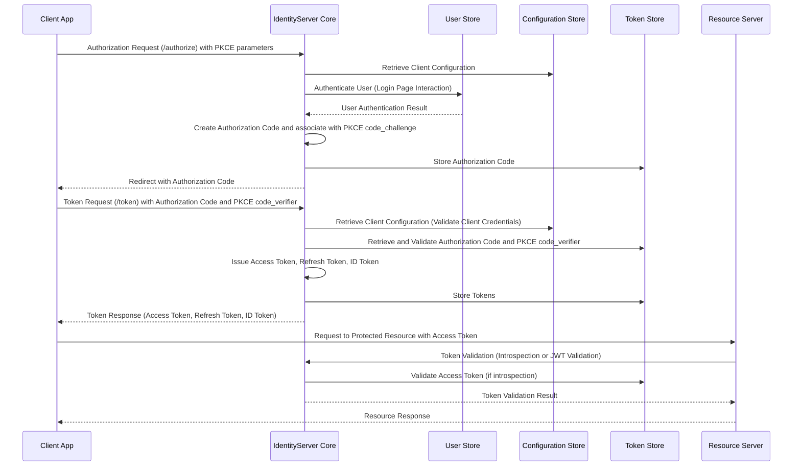

# Project Design Document: Duende IdentityServer

**Project Name:** Duende IdentityServer

**Project Repository:** [https://github.com/duendesoftware/products](https://github.com/duendesoftware/products)

**Document Version:** 1.1
**Date:** October 26, 2023
**Author:** AI Software Architect

## 1. Introduction

This document provides a detailed design overview of Duende IdentityServer, a leading OpenID Connect and OAuth 2.0 framework for ASP.NET Core. This document is intended to be used as a foundation for threat modeling and security assessments. It comprehensively outlines the system's architecture, components, data flow, technology stack, deployment considerations, and key security aspects.

Duende IdentityServer is engineered to deliver centralized authentication and authorization services for a wide spectrum of modern applications, including web applications, mobile applications, and APIs. It empowers developers to delegate the complexities of identity management to a dedicated, robust, secure, and standards-compliant service, thereby simplifying application development and enhancing security posture.

## 2. Goals and Objectives

The primary goals of Duende IdentityServer are:

* **Centralized Authentication and Authorization:**  To act as a single, authoritative source for authentication and authorization decisions across multiple applications and APIs within an organization or ecosystem.
* **Standards Compliance:**  To strictly adhere to OpenID Connect and OAuth 2.0 specifications, ensuring seamless interoperability, leveraging established security best practices, and facilitating integration with compliant clients and services.
* **Flexibility and Customization:** To offer a highly flexible and extensible architecture that can be tailored to accommodate diverse and evolving identity management requirements, supporting various authentication methods, user stores, and integration scenarios.
* **Security:** To prioritize security at every stage of design and implementation, employing robust security mechanisms to protect user identities, sensitive data, and application resources from unauthorized access and threats.
* **Scalability and Performance:** To enable IdentityServer to efficiently handle a large volume of users, requests, and concurrent operations, ensuring optimal performance and responsiveness even under heavy load.
* **Ease of Integration and Developer Experience:** To simplify the integration process for client applications and APIs, providing clear documentation, SDKs, and tools that enhance developer productivity and reduce integration complexity.
* **Operational Efficiency:** To be easily deployable, manageable, and monitorable in various environments, minimizing operational overhead and ensuring smooth and reliable service operation.

## 3. Target Audience

This document is intended for the following audiences:

* **Security Architects and Engineers:** To gain a deep understanding of the system's architecture for conducting thorough threat modeling, security assessments, and penetration testing.
* **Development Teams:** To understand how to effectively integrate with and utilize IdentityServer in their applications, leveraging its features for authentication and authorization.
* **Operations Teams:** To understand the deployment architecture, operational requirements, monitoring aspects, and maintenance procedures for IdentityServer.
* **Project Stakeholders and Management:** To gain a high-level understanding of the system's design, capabilities, security posture, and strategic value within the overall IT landscape.

## 4. System Architecture

Duende IdentityServer adopts a modular and component-based architecture. The core components and their interactions are detailed below and visually represented in the architecture diagram.

### 4.1. Components

* **IdentityServer Core:** The central processing engine of IdentityServer. It is responsible for:
    * Processing authentication and authorization requests.
    * Implementing OAuth 2.0 and OpenID Connect flows.
    * Managing tokens (issuance, validation, revocation).
    * Session management.
    * Interacting with configuration and data stores.
    * Event handling and extensibility points.
* **User Store:** A persistent storage mechanism for user credentials (usernames, passwords, multi-factor authentication settings, etc.) and profile information (claims). IdentityServer is designed to be user store agnostic, supporting integration with various identity providers and databases, including:
    * Relational databases (SQL Server, PostgreSQL, MySQL, etc.)
    * LDAP/Active Directory
    * Azure Active Directory, AWS Cognito, Google Identity Platform
    * Custom user stores via extension points.
* **Configuration Store:** A persistent storage mechanism for IdentityServer's configuration data, which defines the behavior and scope of the service. This includes:
    * **Clients:** Definitions of applications authorized to interact with IdentityServer. Client configurations include: `ClientId`, `ClientSecrets`, `AllowedGrantTypes`, `RedirectUris`, `PostLogoutRedirectUris`, `AllowedScopes`, `ClientAuthenticationMethods`, and more.
    * **Identity Resources:** Declarations of user identity information (claims) that clients can request (e.g., `profile`, `email`, `address`, `phone`). These are user-centric scopes.
    * **API Resources:** Definitions of APIs protected by IdentityServer. API resource configurations include: `Scopes`, `ApiSecrets`, and associated user claims to be included in access tokens. These are resource-centric scopes.
* **Token Store:** A storage mechanism for issued tokens (access tokens, refresh tokens, authorization codes, consent grants). Token storage can be configured for:
    * Persistence (database-backed for scalability and resilience).
    * In-memory (for development or non-production environments).
    * Distributed caching (Redis, Memcached) for improved performance in clustered deployments.
* **Operational Store:** A persistent store for operational data, such as:
    * Consent decisions made by users.
    * Persisted grants (refresh tokens, authorization codes, reference tokens).
    * Server-side sessions.
    * Events and audit logs.
* **Admin UI (Optional, External):**  While Duende IdentityServer core does not include a built-in Admin UI, it is common to integrate with external Admin UIs (often community-developed or custom-built) for managing:
    * Client registrations and configurations.
    * Identity and API resource definitions.
    * User management (if the User Store is integrated with the Admin UI).
    * Operational data monitoring.
* **External Identity Providers (Optional):** Integration points for federating authentication to external identity providers (e.g., social logins like Google, Facebook, Twitter, enterprise providers like Azure AD, Okta, PingFederate). IdentityServer acts as a federation gateway, allowing users to authenticate using their existing accounts.
* **Operational Monitoring (Optional):** Integration with monitoring and logging systems for:
    * Performance monitoring (metrics, tracing).
    * Error logging and exception tracking.
    * Security auditing and event logging.
    * Health checks and alerting.

### 4.2. Architecture Diagram

```mermaid
flowchart LR
    subgraph "Client Application"
        A["'Client App (Web, Mobile, API)'"]
    end
    subgraph "Duende IdentityServer"
        subgraph "Core Components"
            B["'IdentityServer Core'"]
            C["'User Store'"]
            D["'Configuration Store'"]
            E["'Token Store'"]
            I["'Operational Store'"]
        end
        subgraph "Optional Components"
            F["'Admin UI'"]
            G["'External Identity Providers'"]
            J["'Operational Monitoring'"]
        end
    end
    subgraph "API Resource"
        H["'API Resource'"]
    end

    A -->|'Authentication/Authorization Request'| B
    B --> C|'User Authentication/Validation'|
    B --> D|'Configuration Retrieval (Clients, Resources)'|
    B --> E|'Token Issuance/Validation/Storage'|
    B --> I|'Consent & Grant Persistence, Audit Logs'|
    B --> G|'External Authentication (Federation)'|
    B <--|'Authentication/Authorization Response (Tokens, Codes)'| A
    A -->|'Access Token'| H
    H -->|'Token Validation'| B
    H <--|'Resource Access Response'| A
    F --> D|'Configuration Management'|
    F --> C|'User Management (Optional)'|
    J --> B|'Metrics, Logs, Events'|

    classDef componentFill fill:#cfc,stroke:#333,stroke-width:2px
    classDef storeFill fill:#eee,stroke:#333,stroke-width:1px
    class A,H componentFill
    class B componentFill
    class C,D,E,I,F,G,J storeFill
```

**Diagram Explanation:**

1. **Client Application (A):** Represents any application (web, mobile, SPA, backend service) that needs to authenticate users or access protected resources.
2. **IdentityServer Core (B):** The central engine responsible for processing requests, enforcing policies, and coordinating with other components.
3. **User Store (C):** Manages user identities and credentials. IdentityServer Core interacts with the User Store for authentication and user profile retrieval.
4. **Configuration Store (D):** Holds the configuration for IdentityServer, including clients, identity resources, and API resources. IdentityServer Core retrieves configuration from this store.
5. **Token Store (E):** Stores and retrieves tokens (access tokens, refresh tokens, authorization codes). IdentityServer Core interacts with the Token Store for token issuance, validation, and revocation.
6. **Operational Store (I):** Persists operational data like consent, grants, and audit logs. IdentityServer Core interacts with this store for managing user consent and tracking operational events.
7. **Admin UI (F):** (Optional) Provides an interface for administrators to manage IdentityServer configuration and potentially user accounts.
8. **External Identity Providers (G):** (Optional) Enables federation with external authentication systems. IdentityServer Core redirects authentication requests to and processes responses from these providers.
9. **API Resource (H):** Represents an API that is protected by IdentityServer. It validates access tokens presented by client applications by communicating with IdentityServer Core.
10. **Operational Monitoring (J):** (Optional) Collects and exposes metrics, logs, and events from IdentityServer Core for monitoring and analysis.

## 5. Data Flow

The following describes the typical data flow for common OAuth 2.0 and OpenID Connect flows within Duende IdentityServer.

### 5.1. Authorization Code Flow with PKCE (Recommended for Web Applications)

This is the most secure and recommended flow for web applications. PKCE (Proof Key for Code Exchange) mitigates the risk of authorization code interception.



**Data Flow Steps (Authorization Code Flow with PKCE):**

1. **Authorization Request with PKCE:** The Client Application redirects the user to IdentityServer's `/authorize` endpoint, including PKCE parameters (`code_challenge`, `code_challenge_method`).
2. **Client Configuration Retrieval:** IdentityServer retrieves the client's configuration from the Configuration Store.
3. **User Authentication:** IdentityServer authenticates the user, typically via a login page interacting with the User Store.
4. **Authorization Code and PKCE Association:** Upon successful authentication and user consent, IdentityServer creates an authorization code and securely associates it with the `code_challenge` received in the authorization request.
5. **Authorization Code Storage:** The authorization code is stored in the Token Store.
6. **Authorization Code Redirect:** IdentityServer redirects the user back to the Client Application with the authorization code.
7. **Token Request with PKCE:** The Client Application sends a token request to IdentityServer's `/token` endpoint, including the authorization code, client credentials (if applicable), and the `code_verifier` (corresponding to the `code_challenge`).
8. **Client Configuration Validation:** IdentityServer validates the client's configuration and credentials.
9. **Authorization Code and PKCE Validation:** IdentityServer retrieves and validates the authorization code from the Token Store and verifies the `code_verifier` against the stored `code_challenge`.
10. **Token Issuance:** IdentityServer issues access tokens, refresh tokens, and ID tokens.
11. **Token Storage:** Tokens are stored in the Token Store.
12. **Token Response:** IdentityServer returns the tokens to the Client Application.
13. **Resource Request:** The Client Application uses the access token to request protected resources from the Resource Server.
14. **Token Validation at Resource Server:** The Resource Server validates the access token. This can be done in two primary ways:
    * **Introspection:** The Resource Server calls IdentityServer's `/introspection` endpoint to verify the token's validity.
    * **JWT Validation:** If access tokens are issued as JWTs (JSON Web Tokens), the Resource Server can validate the token locally by verifying its signature against IdentityServer's public key and checking claims.
15. **Resource Response:** The Resource Server responds to the Client Application with the requested resource.

### 5.2. Other OAuth 2.0 and OpenID Connect Flows

Duende IdentityServer supports a range of flows to accommodate different application types and security requirements:

* **Client Credentials Flow:** For service-to-service authentication where no user context is required. Clients authenticate using their own credentials (client ID and secret) to obtain access tokens.
* **Resource Owner Password Credentials Flow (Generally Discouraged):** Allows clients to directly use user credentials (username and password) to obtain tokens. This flow is generally discouraged due to security concerns and is less suitable for modern applications.
* **Implicit Flow (Discouraged):**  Used primarily for browser-based applications in the past, but now largely superseded by Authorization Code Flow with PKCE due to security vulnerabilities. It directly returns tokens in the authorization response.
* **Hybrid Flow:** Combines aspects of Authorization Code and Implicit flows, offering more flexibility but also increased complexity.
* **Refresh Token Flow:** Enables clients to obtain new access tokens without requiring user interaction by using a refresh token previously obtained during an authorization flow.

## 6. Technology Stack

Duende IdentityServer is built upon a robust and modern technology stack:

* **ASP.NET Core (.NET 7 or later recommended):** The foundational framework providing performance, cross-platform compatibility, and a rich ecosystem.
* **C#:** The primary programming language, offering type safety, performance, and a large developer community.
* **OpenID Connect and OAuth 2.0 Libraries:**  Leverages industry-standard libraries for implementing the core protocols, ensuring compliance and security.
* **Database Support (for Persistence):**  Offers flexible database options for Configuration Store, User Store, Operational Store, and Token Store, including:
    * **Relational Databases:**
        * SQL Server (Microsoft SQL Server)
        * PostgreSQL (Open-source, widely used)
        * MySQL (Open-source, popular choice)
        * SQLite (File-based, suitable for development or embedded scenarios)
    * **Other Options:**  Custom database integrations are possible through extension points. Entity Framework Core (EF Core) is commonly used for database interactions, providing ORM capabilities and database provider abstraction.
* **Caching (Optional):**  For performance optimization, distributed caching mechanisms are recommended in production environments, such as:
    * Redis (In-memory data store, highly performant)
    * Memcached (Distributed caching system)
    * In-memory caching (Suitable for single-instance deployments or development)
* **Logging:**  Utilizes standard .NET logging abstractions (`ILogger`) allowing integration with various logging providers (e.g., Serilog, NLog, Application Insights, Azure Monitor, AWS CloudWatch, Google Cloud Logging).
* **Deployment Environment:**  Designed for flexible deployment across diverse environments:
    * **Cloud Platforms:** Azure App Service, AWS Elastic Beanstalk, AWS ECS/EKS, Google Cloud Run, Google Kubernetes Engine (GKE), etc.
    * **On-premises Servers:** Windows Server, Linux servers.
    * **Containers:** Docker, Kubernetes, container orchestration platforms.

## 7. Deployment Architecture

Duende IdentityServer's deployment architecture can be tailored to meet specific scalability, availability, and security needs. Common deployment scenarios include:

* **Single Instance Deployment:**  A single instance of IdentityServer, suitable for development, testing, or small-scale, non-critical environments. This is the simplest deployment but lacks high availability and scalability.
* **Load-Balanced Deployment:** Multiple instances of IdentityServer deployed behind a load balancer (e.g., Azure Load Balancer, AWS ELB/ALB, Nginx, HAProxy). This is the recommended approach for production environments, providing:
    * **High Availability:** If one instance fails, others can continue to serve requests.
    * **Scalability:**  Increased capacity to handle higher loads by adding more instances.
    * **Improved Performance:** Load distribution across instances.
    * **Statelessness is Key:**  IdentityServer instances should be stateless. All persistent data (configuration, user data, tokens, operational data) must be stored in shared, external stores (databases, caches).
* **Clustered Deployment (Database Clustering):**  Extending load-balanced deployment with database clustering for the Configuration Store, User Store, Token Store, and Operational Store. This provides high availability and scalability for the persistent data layer, crucial for large-scale deployments.
* **Containerized Deployment (Docker & Kubernetes):** Deploying IdentityServer as Docker containers orchestrated by Kubernetes or similar platforms (e.g., Docker Swarm, AWS ECS). This offers:
    * **Scalability and Resilience:** Kubernetes handles scaling, rolling updates, and self-healing.
    * **Portability:** Consistent deployment across different environments.
    * **Resource Efficiency:** Optimized resource utilization.
* **Cloud-Native Deployment:** Leveraging cloud-specific services and features for deployment and management on platforms like Azure, AWS, or GCP. This can include:
    * Managed Kubernetes services (AKS, EKS, GKE).
    * Serverless container platforms (Azure Container Apps, AWS Fargate, Google Cloud Run).
    * Managed database services (Azure SQL Database, AWS RDS, Google Cloud SQL).
    * Cloud-based monitoring and logging services.

**Deployment Considerations:**

* **Statelessness:** Ensure IdentityServer instances are truly stateless. Session state and all persistent data must reside in external, shared stores.
* **Database Scalability and HA:** The database infrastructure supporting the Configuration, User, Token, and Operational Stores is a critical factor for overall system scalability and availability. Choose database solutions that can scale and provide high availability (e.g., database clustering, replication, managed database services).
* **Load Balancing Strategy:** Configure load balancers appropriately (e.g., sticky sessions if required for specific scenarios, health probes).
* **Security Hardening:** Implement comprehensive security hardening measures at all layers:
    * Network Security: Firewalls, Network Segmentation, Web Application Firewalls (WAFs).
    * Operating System Security: Patching, secure configurations.
    * Application Security: Secure coding practices, vulnerability scanning, penetration testing.
    * Identity and Access Management for infrastructure components.
* **Monitoring and Logging:** Implement robust monitoring and logging to track performance, detect errors, and audit security-related events. Integrate with centralized logging and monitoring systems.
* **Disaster Recovery and Backup:** Plan for disaster recovery and implement regular backups of all persistent stores (databases, configuration).

## 8. Security Considerations (Detailed)

Security is the cornerstone of Duende IdentityServer.  Key security considerations are categorized below:

**8.1. Configuration Security:**

* **Secure Client Configuration:**
    * **Principle of Least Privilege:** Grant clients only the necessary scopes and permissions.
    * **Strong Client Secrets:** Use strong, randomly generated client secrets and rotate them regularly. Store secrets securely (e.g., in vault systems, encrypted configuration).
    * **Restrict Redirect URIs:**  Strictly define and validate redirect URIs to prevent authorization code injection and redirection attacks.
    * **Appropriate Grant Types:**  Enable only the necessary grant types for each client. Disable insecure or unnecessary grant types (e.g., Resource Owner Password Credentials Flow unless absolutely required and with strong justification).
    * **Client Authentication Methods:** Use secure client authentication methods (e.g., `client_secret_post`, `client_secret_jwt`, `private_key_jwt`). Avoid `none` unless for public clients where secrets are not applicable.
* **Resource Configuration:**
    * **Scope Management:** Define scopes granularly and align them with specific API resources and user identity information.
    * **API Secrets:** Protect API resources with strong secrets if client authentication is required for accessing them.

**8.2. Authentication Security:**

* **Strong Password Policies:** Enforce strong password policies (complexity, length, expiration) in the User Store.
* **Multi-Factor Authentication (MFA):** Implement and encourage MFA for user accounts to add an extra layer of security beyond passwords. Support various MFA methods (e.g., TOTP, SMS, email, hardware tokens, push notifications).
* **Account Lockout and Rate Limiting:** Implement account lockout policies to prevent brute-force password guessing attacks. Apply rate limiting to authentication endpoints to mitigate denial-of-service attempts.
* **Secure Credential Storage:** Store user credentials (passwords) using strong, salted, one-way hashing algorithms (e.g., Argon2, bcrypt, scrypt). Never store passwords in plain text.
* **Session Management:** Implement secure session management practices:
    * **Session Expiration:** Set appropriate session timeouts.
    * **Session Invalidation:** Provide mechanisms for session invalidation (logout).
    * **Secure Session Cookies:** Use secure, HttpOnly cookies for session management.
* **Protection against Credential Stuffing:** Implement measures to detect and mitigate credential stuffing attacks (e.g., CAPTCHA, anomaly detection).

**8.3. Authorization Security:**

* **Role-Based Access Control (RBAC) or Attribute-Based Access Control (ABAC):** Implement appropriate authorization models to control access to resources based on user roles, attributes, or policies.
* **Consent Management:** Implement user consent mechanisms for granting clients access to user data (identity resources) and API resources. Ensure consent decisions are securely stored and enforced.
* **Authorization Policy Enforcement:**  Enforce authorization policies consistently across all protected resources.

**8.4. Token Security:**

* **Token Types:** Use appropriate token types (JWT for access tokens, reference tokens for refresh tokens if needed).
* **Token Signing and Encryption:**
    * **JWT Signing:** Sign JWTs using strong cryptographic algorithms (e.g., RS256, ES256). Protect private keys used for signing.
    * **Token Encryption (Optional but Recommended for Sensitive Data):** Encrypt tokens, especially ID tokens and access tokens containing sensitive claims, using algorithms like AES-GCM.
* **Token Lifetimes:** Configure appropriate token lifetimes (short-lived access tokens, longer-lived refresh tokens with revocation mechanisms).
* **Token Revocation:** Implement token revocation mechanisms to invalidate tokens before their natural expiration (e.g., user logout, security events).
* **Token Storage Security:** Protect token storage (Token Store) to prevent unauthorized access to issued tokens.
* **Cross-Site Scripting (XSS) Prevention:** Implement robust XSS prevention measures to protect tokens from being stolen via client-side vulnerabilities.

**8.5. Operational Security:**

* **Transport Layer Security (TLS/HTTPS):** Enforce HTTPS for all communication with IdentityServer to protect data in transit. Use valid TLS certificates.
* **Input Validation and Output Encoding:**  Thoroughly validate all inputs to prevent injection attacks (SQL injection, command injection, LDAP injection, etc.). Encode outputs to prevent XSS vulnerabilities.
* **Regular Security Updates and Patching:** Keep IdentityServer, its dependencies, and the underlying infrastructure up-to-date with the latest security patches.
* **Security Auditing and Logging:** Enable comprehensive auditing and logging of security-relevant events (authentication attempts, authorization decisions, configuration changes, token issuance, revocation, errors). Regularly review audit logs for security monitoring and incident response.
* **Penetration Testing and Security Assessments:** Conduct regular penetration testing and security assessments by qualified security professionals to identify and address potential vulnerabilities.
* **Incident Response Plan:** Develop and maintain an incident response plan to handle security incidents effectively.

## 9. Assumptions and Constraints

* **Standards Compliance:**  It is assumed that Duende IdentityServer correctly and securely implements OpenID Connect and OAuth 2.0 specifications as intended.
* **Secure Infrastructure:**  It is assumed that the underlying infrastructure (servers, networks, databases, cloud platforms) is configured and maintained according to security best practices.
* **Competent Administration and Development:**  It is assumed that IdentityServer will be administered by trained and competent personnel who understand identity management and security principles. Similarly, developers integrating with IdentityServer are expected to follow secure coding practices.
* **Customization Security:** While IdentityServer offers extensive customization options, it is assumed that any custom extensions or modifications are developed and reviewed with security in mind. Improper customizations can introduce vulnerabilities.
* **Third-Party Component Security:**  The security of integrations with external identity providers, databases, caching systems, and other third-party components depends on the security posture of those components. It is assumed that these components are also adequately secured.
* **Regular Security Reviews:** It is assumed that the deployed IdentityServer instance and its configuration will undergo regular security reviews and assessments to adapt to evolving threats and vulnerabilities.

## 10. Future Considerations

* **Enhanced Admin UI:** Develop or integrate a more feature-rich and user-friendly Admin UI directly within Duende IdentityServer for simplified configuration, monitoring, and operational tasks.
* **Federated Identity Management Enhancements:**  Explore and implement advanced federation capabilities, such as dynamic federation, identity brokering, and improved support for complex federation scenarios.
* **Passwordless Authentication Methods:**  Further explore and integrate passwordless authentication methods (e.g., WebAuthn, FIDO2) to enhance security and user experience.
* **Dynamic Client Registration Improvements:** Enhance dynamic client registration capabilities to support more flexible and automated client onboarding processes while maintaining security.
* **Advanced Threat Detection and Mitigation:** Integrate with advanced threat detection systems, security information and event management (SIEM) platforms, and anomaly detection mechanisms to proactively identify and respond to security threats.
* **Enhanced Monitoring and Observability:**  Improve monitoring and observability features, providing richer metrics, tracing, and logging capabilities for better operational insights and troubleshooting.
* **Continuous Security Improvement:**  Maintain a continuous security improvement program, including regular security audits, penetration testing, vulnerability scanning, and proactive threat modeling to adapt to the evolving security landscape.

This design document provides a comprehensive and detailed overview of Duende IdentityServer's architecture, security considerations, and deployment aspects. It serves as a solid foundation for threat modeling, security assessments, and the secure implementation and operation of Duende IdentityServer. Subsequent threat modeling activities will build upon this document to identify specific threats and develop targeted mitigation strategies.