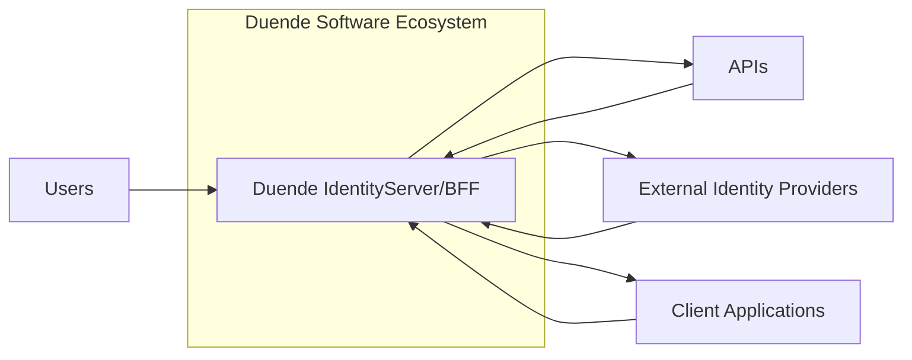
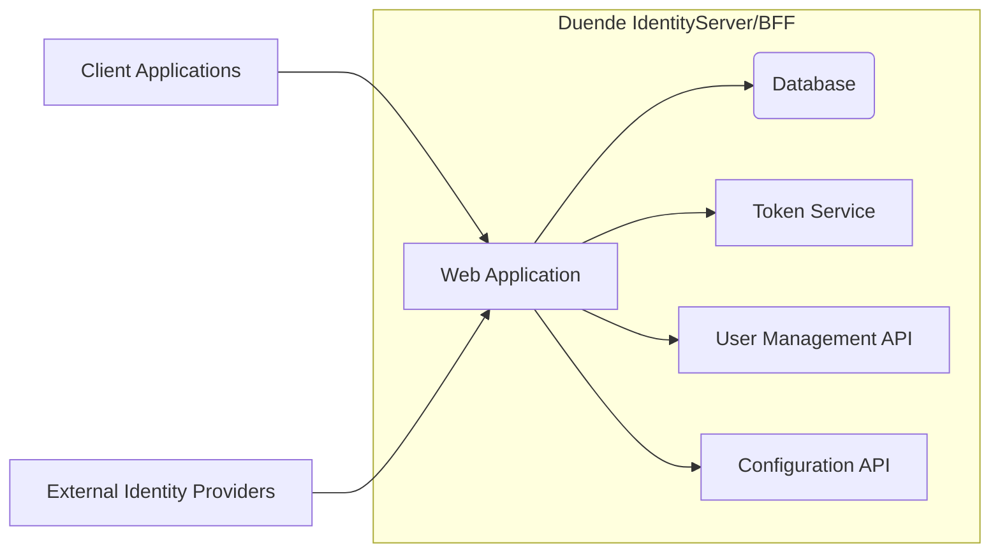
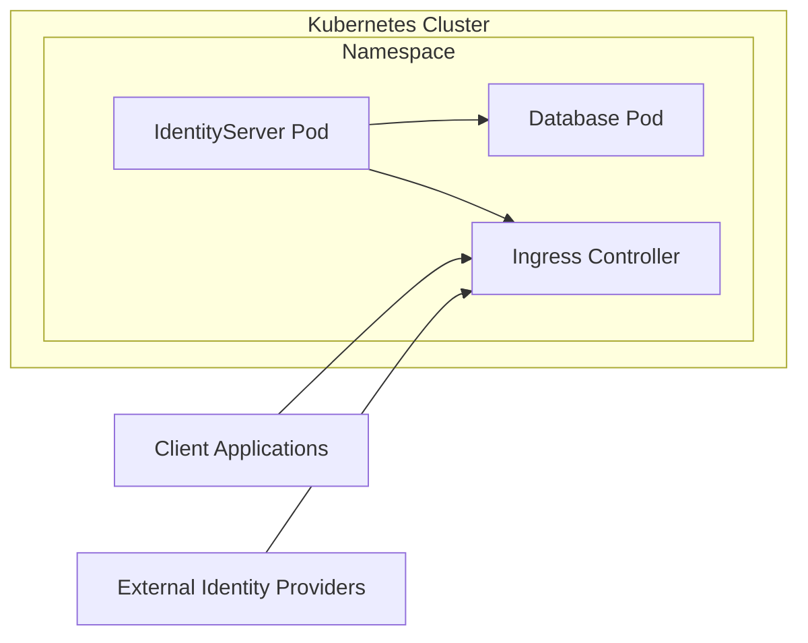

Okay, let's create a design document for the Duende Software repository, focusing on aspects relevant to threat modeling. I'll follow the structure you've outlined.

# BUSINESS POSTURE

Duende Software provides commercial and open-source software, primarily focused on identity and access management (IAM).  Their products, IdentityServer and BFF, are central to many organizations' authentication and authorization infrastructure.

Priorities and Goals:

*   Provide robust and secure IAM solutions.
*   Maintain a strong reputation for security and reliability.
*   Support a wide range of industry standards (OAuth, OpenID Connect, etc.).
*   Offer commercial products with support and additional features.
*   Foster an active open-source community.
*   Provide easy integration with .NET ecosystem.

Business Risks:

*   Vulnerabilities in their software could lead to widespread security breaches in their customers' systems.  This is the *most critical risk*.
*   Reputational damage due to security incidents or perceived lack of security.
*   Loss of customer trust and potential legal liabilities.
*   Competition from other IAM providers.
*   Failure to keep up with evolving security standards and threats.
*   Supply chain attacks targeting their development or distribution processes.

# SECURITY POSTURE

Existing Security Controls (based on the GitHub repository and general knowledge of Duende's products):

*   security control: Secure Development Practices: The repository structure, presence of documentation, and Duende's public statements suggest a commitment to secure development practices. This likely includes code reviews, security testing, and vulnerability management. Where: Described in public documentation and implied by the repository's content.
*   security control: Adherence to Standards: Duende's products implement industry-standard protocols like OAuth 2.0 and OpenID Connect. This ensures interoperability and leverages the security reviews and scrutiny these standards receive. Where: Core functionality of IdentityServer and BFF.
*   security control: Regular Updates: Duende provides regular updates and patches to address vulnerabilities and improve security. Where: Evidenced by release history and versioning.
*   security control: Documentation: Comprehensive documentation helps users configure and deploy the software securely. Where: GitHub repository and Duende's website.
*   security control: Community Engagement: An active open-source community can help identify and report security issues. Where: GitHub issues and discussions.
*   security control: Use of HTTPS: The nature of the product implies that all communication should be secured using HTTPS. Where: Expected in all deployments.
*   security control: Input Validation: Given the nature of the software, robust input validation is crucial to prevent injection attacks and other vulnerabilities. Where: Expected within the codebase of IdentityServer and BFF.
*   security control: Authentication and Authorization: The core purpose of the software is to provide secure authentication and authorization mechanisms. Where: Core functionality of IdentityServer and BFF.
*   security control: Cryptography: Secure use of cryptography for storing secrets, signing tokens, and encrypting communication. Where: Expected throughout the codebase.
*   security control: Dependency Management: The project uses package managers (likely NuGet) to manage dependencies, which helps in tracking and updating third-party libraries. Where: Project files within the repository.

Accepted Risks:

*   accepted risk: Complexity: IAM systems are inherently complex, increasing the risk of configuration errors and unforeseen vulnerabilities.
*   accepted risk: Reliance on Third-Party Libraries: Like all software, Duende's products rely on third-party libraries, which may contain vulnerabilities.
*   accepted risk: User Misconfiguration: The security of a deployment ultimately depends on the user configuring it correctly.

Recommended Security Controls:

*   Implement a comprehensive Software Bill of Materials (SBOM) management system to track all dependencies and their vulnerabilities.
*   Conduct regular penetration testing by independent security experts.
*   Implement a bug bounty program to incentivize external security researchers to find and report vulnerabilities.
*   Provide security hardening guides and checklists for users.
*   Offer security training for developers and users.

Security Requirements:

*   Authentication:
    *   Support for multi-factor authentication (MFA).
    *   Secure password storage using strong hashing algorithms.
    *   Protection against brute-force attacks.
    *   Account lockout mechanisms.
    *   Secure session management.
*   Authorization:
    *   Fine-grained access control using roles and permissions.
    *   Support for standard authorization protocols (OAuth 2.0, OpenID Connect).
    *   Protection against privilege escalation attacks.
*   Input Validation:
    *   Strict validation of all user inputs to prevent injection attacks (e.g., SQL injection, cross-site scripting).
    *   Use of allowlists rather than blocklists where possible.
*   Cryptography:
    *   Use of strong, industry-standard cryptographic algorithms.
    *   Secure key management practices.
    *   Protection of sensitive data at rest and in transit.
    *   Regular review of cryptographic implementations.

# DESIGN

## C4 CONTEXT



Element Descriptions:

*   1.  Name: Duende IdentityServer/BFF
    2.  Type: Software System
    3.  Description: The core software system providing identity and access management services.
    4.  Responsibilities:
        *   Authenticating users.
        *   Issuing and validating security tokens.
        *   Managing user sessions.
        *   Providing an API for client applications.
        *   Integrating with external identity providers.
    5.  Security Controls: Authentication, Authorization, Input Validation, Cryptography, Secure Development Practices, Adherence to Standards, Regular Updates.

*   1.  Name: Users
    2.  Type: Person
    3.  Description: Individuals who interact with the system to access protected resources.
    4.  Responsibilities:
        *   Providing credentials for authentication.
        *   Managing their accounts.
        *   Adhering to security policies.
    5.  Security Controls: Strong passwords, Multi-Factor Authentication (MFA).

*   1.  Name: External Identity Providers
    2.  Type: Software System
    3.  Description: Third-party systems (e.g., Google, Facebook) that can be used for authentication.
    4.  Responsibilities:
        *   Authenticating users.
        *   Providing user information to IdentityServer.
    5.  Security Controls: Implemented by the external provider; IdentityServer should validate responses securely.

*   1.  Name: Client Applications
    2.  Type: Software System
    3.  Description: Applications that use IdentityServer/BFF to authenticate users and access protected resources.
    4.  Responsibilities:
        *   Initiating authentication flows.
        *   Handling security tokens.
        *   Accessing APIs securely.
    5.  Security Controls: Secure handling of tokens, HTTPS communication, Input Validation.

*   1.  Name: APIs
    2.  Type: Software System
    3.  Description: Protected resources that client applications access after authentication.
    4.  Responsibilities:
        *   Providing data and services to authorized clients.
        *   Validating access tokens.
    5.  Security Controls: Authorization, Input Validation, HTTPS communication.

## C4 CONTAINER



Element Descriptions:

*   1.  Name: Web Application
    2.  Type: Web Application
    3.  Description: The main application that handles user requests and interacts with other components.
    4.  Responsibilities:
        *   Handling user authentication requests.
        *   Rendering user interfaces.
        *   Managing user sessions.
        *   Communicating with other internal services.
    5.  Security Controls: Input Validation, Authentication, Session Management, HTTPS.

*   1.  Name: Database
    2.  Type: Database
    3.  Description: Stores user data, client configuration, and other persistent information.
    4.  Responsibilities:
        *   Storing and retrieving data securely.
        *   Enforcing data integrity.
    5.  Security Controls: Access Control, Encryption at Rest, Auditing.

*   1.  Name: Token Service
    2.  Type: Service
    3.  Description: Responsible for issuing and validating security tokens.
    4.  Responsibilities:
        *   Generating tokens based on successful authentication.
        *   Validating tokens presented by client applications.
        *   Managing token signing keys.
    5.  Security Controls: Cryptography, Secure Key Management.

*   1.  Name: User Management API
    2.  Type: API
    3.  Description: Provides an interface for managing user accounts.
    4.  Responsibilities:
        *   Creating, updating, and deleting user accounts.
        *   Managing user roles and permissions.
    5.  Security Controls: Authentication, Authorization, Input Validation.

*   1.  Name: Configuration API
    2.  Type: API
    3.  Description: Provides an interface for configuring IdentityServer/BFF.
    4.  Responsibilities:
        *   Managing client configurations.
        *   Configuring identity providers.
        *   Setting security policies.
    5.  Security Controls: Authentication, Authorization, Input Validation.

*   1.  Name: Client Applications
    2.  Type: Software System
    3.  Description: Applications that use IdentityServer/BFF to authenticate users and access protected resources.
    4.  Responsibilities:
        *   Initiating authentication flows.
        *   Handling security tokens.
        *   Accessing APIs securely.
    5.  Security Controls: Secure handling of tokens, HTTPS communication, Input Validation.

*   1.  Name: External Identity Providers
    2.  Type: Software System
    3.  Description: Third-party systems (e.g., Google, Facebook) that can be used for authentication.
    4.  Responsibilities:
        *   Authenticating users.
        *   Providing user information to IdentityServer.
    5.  Security Controls: Implemented by the external provider; IdentityServer should validate responses securely.

## DEPLOYMENT

Possible Deployment Solutions:

1.  Cloud-based (Azure, AWS, GCP): Using managed services like Azure App Service, AWS Elastic Beanstalk, or Google App Engine.
2.  Containerized (Docker, Kubernetes): Deploying the application as a container within a container orchestration platform.
3.  On-premises: Deploying directly to a Windows Server using IIS.

Chosen Solution (for detailed description): Containerized (Kubernetes)



Element Descriptions:

*   1.  Name: IdentityServer Pod
    2.  Type: Container
    3.  Description: A Kubernetes pod running the IdentityServer/BFF application.
    4.  Responsibilities:
        *   Running the IdentityServer/BFF application.
        *   Handling incoming requests.
    5.  Security Controls: Network Policies, Resource Limits, Security Context.

*   1.  Name: Database Pod
    2.  Type: Container
    3.  Description: A Kubernetes pod running the database (e.g., SQL Server, PostgreSQL).
    4.  Responsibilities:
        *   Storing and retrieving data.
    5.  Security Controls: Network Policies, Persistent Volume Claims with Encryption, Database-level Security.

*   1.  Name: Ingress Controller
    2.  Type: Load Balancer
    3.  Description: A Kubernetes Ingress controller that manages external access to the IdentityServer service.
    4.  Responsibilities:
        *   Routing traffic to the IdentityServer pod.
        *   Terminating TLS connections.
    5.  Security Controls: TLS Certificates, Network Policies.

*   1.  Name: Client Applications
    2.  Type: External System
    3.  Description: Applications accessing IdentityServer from outside the cluster.
    4.  Responsibilities: N/A (external)
    5.  Security Controls: N/A (external)

*   1.  Name: External Identity Providers
    2.  Type: External System
    3.  Description: External identity providers accessed by IdentityServer.
    4.  Responsibilities: N/A (external)
    5.  Security Controls: N/A (external)

## BUILD

The build process likely involves the following steps:

1.  Developer commits code to the GitHub repository.
2.  A Continuous Integration (CI) system (e.g., GitHub Actions, Azure DevOps) triggers a build.
3.  The CI system restores dependencies (using NuGet).
4.  The code is compiled.
5.  Static analysis tools (SAST) are run to identify potential security vulnerabilities.
6.  Unit and integration tests are executed.
7.  If all checks pass, a build artifact (e.g., a Docker image) is created.
8.  The artifact is pushed to a container registry (e.g., Docker Hub, Azure Container Registry).

```mermaid
graph LR
    A[Developer] --> B[GitHub Repository]
    B --> C[CI System (GitHub Actions)]
    C --> D[Restore Dependencies (NuGet)]
    D --> E[Compile Code]
    E --> F[Static Analysis (SAST)]
    F --> G[Run Tests]
    G --> H[Create Artifact (Docker Image)]
    H --> I[Container Registry]
```
Security Controls in Build Process:

*   security control: CI/CD Pipeline: Automates the build and testing process, ensuring consistency and reducing the risk of manual errors.
*   security control: SAST: Identifies potential vulnerabilities in the code before deployment.
*   security control: Dependency Scanning: Checks for known vulnerabilities in third-party libraries.
*   security control: Code Signing: Ensures the integrity and authenticity of the build artifacts.
*   security control: Least Privilege: The CI/CD system should have only the necessary permissions to perform its tasks.

# RISK ASSESSMENT

Critical Business Processes:

*   User Authentication and Authorization: This is the core function of the system and must be protected at all costs.
*   Token Issuance and Validation: The security of the entire system relies on the secure generation and validation of tokens.
*   User Data Management: Protecting user data from unauthorized access and modification is crucial.
*   System Configuration: Preventing unauthorized changes to the system's configuration is essential.

Data Sensitivity:

*   User Credentials (passwords, MFA secrets): Highly sensitive.
*   Personally Identifiable Information (PII): Sensitive, subject to privacy regulations (e.g., GDPR, CCPA).
*   Security Tokens: Highly sensitive, as they grant access to protected resources.
*   Client Configuration Data: Sensitive, as it could be used to impersonate clients.
*   Audit Logs: Potentially sensitive, as they may contain information about user activity.

# QUESTIONS & ASSUMPTIONS

Questions:

*   What specific SAST and DAST tools are used in the development process?
*   What is the process for handling security vulnerabilities reported by external researchers?
*   What are the specific procedures for key management and rotation?
*   Are there any specific compliance requirements (e.g., FedRAMP, HIPAA) that need to be considered?
*   What is the disaster recovery plan for the system?
*   What kind of penetration tests are performed and how often?

Assumptions:

*   BUSINESS POSTURE: Assumes that Duende Software prioritizes security and has a strong commitment to addressing vulnerabilities.
*   SECURITY POSTURE: Assumes that secure coding practices are followed, even if not explicitly documented in the repository. Assumes regular security audits are conducted.
*   DESIGN: Assumes a standard deployment model using Kubernetes, although other options are possible. Assumes the use of a CI/CD system for building and deploying the software.