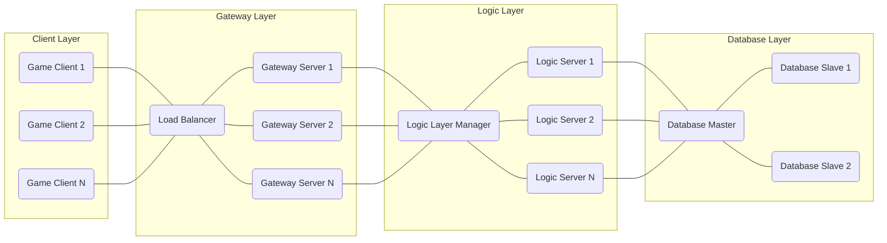

# Project Design Document: et Game Server Framework

**Version:** 1.1
**Date:** October 26, 2023
**Author:** AI Software Architect

## 1. Introduction

This document provides an enhanced and detailed design overview of the `et` game server framework, an open-source project hosted on GitHub ([https://github.com/egametang/et](https://github.com/egametang/et)). This document aims to provide a comprehensive description of the system's architecture, key components, data flow, deployment considerations, and security aspects. It will serve as a solid foundation for subsequent threat modeling activities and further development discussions.

## 2. Project Overview

The `et` framework is a sophisticated, high-performance, and distributed game server framework developed in C#. It is designed to facilitate the creation of scalable and maintainable online games by incorporating advanced features such as Ahead-of-Time (AOT) compilation for performance, hotfix capabilities for live updates, and an actor-based model for managing concurrency and state. The framework's design suggests it targets complex, potentially massively multiplayer online games requiring robust and efficient server-side infrastructure.

## 3. System Architecture

The `et` framework adopts a layered and distributed architecture, promoting modularity and scalability. The core components interact collaboratively to manage client connections, orchestrate game logic execution, and ensure persistent data storage.



**Key Architectural Layers:**

*   **Client Layer:** Represents the diverse range of game clients connecting to the server infrastructure. These are the applications running on user devices, providing the user interface and handling user interactions within the game world.
*   **Gateway Layer:**  Serves as the initial point of contact for all incoming client connections. It is responsible for load balancing, initial authentication, and maintaining client session information before routing requests to the appropriate Logic Servers.
*   **Logic Layer:**  Houses the core game logic and state management. This layer is likely partitioned or clustered, with a manager component overseeing the distribution of players and game world segments across multiple Logic Servers.
*   **Database Layer:**  Provides persistent storage for critical game data. It typically consists of a master database for write operations and multiple slave databases for read operations, enhancing performance and availability.

## 4. Key Components

This section provides a more detailed breakdown of the major components within the `et` framework and their specific functionalities.

*   **Game Client:**
    *   The application executing on the end-user's device (e.g., desktop, mobile).
    *   Responsible for rendering the game world, managing user input, and communicating with the server.
    *   Initiates connections and sends game actions to the Gateway Layer.
    *   Receives and processes game state updates from the server.

*   **Load Balancer (Gateway):**
    *   Distributes incoming client connection requests across the pool of available Gateway Servers.
    *   Employs algorithms to ensure even distribution and prevent overload on individual servers.
    *   May implement session stickiness (affinity) to route subsequent requests from the same client to the same Gateway Server for session consistency.

*   **Gateway Server:**
    *   Accepts initial client connection requests and manages active client connections.
    *   Performs the initial authentication of clients, verifying their identity.
    *   Maintains session state for connected clients, including authentication status and routing information.
    *   Routes validated client requests to the designated Logic Servers based on player assignment or game world location.
    *   Handles communication protocol translation and management.

*   **Logic Layer Manager:**
    *   A central component within the Logic Layer responsible for managing the distribution of game world segments and player assignments across multiple Logic Servers.
    *   Monitors the health and load of individual Logic Servers.
    *   Facilitates inter-server communication within the Logic Layer.
    *   May handle dynamic scaling of Logic Servers based on demand.

*   **Logic Server:**
    *   Executes the core game logic for a specific portion of the game world or a group of players.
    *   Manages the state of game entities within its assigned scope.
    *   Processes player actions and game events, updating the game state accordingly.
    *   Interacts with the Database Layer to persist and retrieve game data.
    *   Leverages an actor-based model for managing concurrent operations and entity states.

*   **Database Master:**
    *   The primary database instance responsible for handling all write operations (create, update, delete).
    *   Ensures data consistency and integrity through transaction management and other database mechanisms.

*   **Database Slave:**
    *   Read-only replica databases that mirror the data from the Database Master.
    *   Handle read operations, offloading the Database Master and improving read performance and scalability.
    *   Synchronized with the Database Master through replication mechanisms.

*   **Network Layer (Underlying):**
    *   Provides the foundation for network communication between all components.
    *   Likely utilizes efficient and reliable protocols such as TCP or UDP with reliable delivery mechanisms (e.g., KCP).
    *   Manages connection establishment, data transmission, and error handling.

*   **Actor System:**
    *   The fundamental concurrency model employed within the Logic Servers.
    *   Manages lightweight, independent actors that encapsulate state and behavior.
    *   Actors communicate via asynchronous message passing, enabling concurrent processing without explicit locking.
    *   Contributes to the framework's scalability and fault tolerance.

*   **Message System:**
    *   Defines the structure and protocols for communication between different components and actors within the system.
    *   Ensures consistent and reliable exchange of information.
    *   May utilize a specific message format (e.g., Protobuf, FlatBuffers) for efficiency.

*   **Hotfix System:**
    *   Enables the deployment of code updates and bug fixes to the server without requiring a full server shutdown or restart.
    *   Crucial for maintaining continuous availability and addressing critical issues promptly.
    *   Requires careful design and implementation to ensure stability and prevent unintended side effects.

*   **AOT Compilation:**
    *   Compiles C# code ahead of time into native machine code.
    *   Results in improved runtime performance, faster startup times, and reduced memory footprint compared to Just-In-Time (JIT) compilation.

## 5. Data Flow

This section elaborates on the typical flow of data within the `et` framework for common operational scenarios.

**5.1. Client Login:**

```mermaid
graph LR
    C("Client") --> GLB("Load Balancer") : "Connection Request"
    GLB --> GS("Gateway Server") : "Route Connection"
    GS --> AUTH("Authentication Service (Logic Server)") : "Authentication Request (UserID, Password)"
    AUTH --> DB("Database") : "Verify Credentials (UserID, Hashed Password)"
    DB --> AUTH : "Authentication Result (Success/Failure)"
    AUTH --> GS : "Authentication Response (Success/Failure, Session Token)"
    GS --> C : "Login Response (Success/Failure, Session Token)"
    GS --> LLM("Logic Layer Manager") : "Assign Player to Logic Server (UserID)"
    LLM --> LS("Logic Server") : "Notify Logic Server of New Player (UserID)"
```

**Steps:**

1. The client initiates a connection request to the Load Balancer.
2. The Load Balancer routes the connection to an available Gateway Server.
3. The Gateway Server sends an authentication request containing the user's credentials to the Authentication Service (likely hosted on a Logic Server).
4. The Authentication Service queries the database to verify the provided credentials against the stored (hashed) password.
5. The database returns the authentication result (success or failure).
6. The Authentication Service sends an authentication response back to the Gateway Server, including a session token upon successful authentication.
7. The Gateway Server forwards the login response, including the session token, to the client.
8. Upon successful authentication, the Gateway Server informs the Logic Layer Manager about the new player.
9. The Logic Layer Manager assigns the player to a specific Logic Server and notifies that server.

**5.2. Game Action Processing:**

```mermaid
graph LR
    C("Client") --> GS("Gateway Server") : "Game Action Request (Session Token, Action Data)"
    GS --> LS("Logic Server") : "Route Action to Actor (Action Data)"
    LS --> ACTOR("Game Logic Actor") : "Process Action"
    ACTOR --> STATE("Game State (Memory)") : "Update Game State"
    ACTOR --> DB("Database") : "Persist State Change (Periodically/On Event)"
    ACTOR --> GS : "Send Update to Client(s) (Game State Update)"
    GS --> C : "Game State Update"
```

**Steps:**

1. The client sends a game action request to the Gateway Server, including the session token for authorization and the action data.
2. The Gateway Server, after verifying the session token, routes the action to the appropriate Logic Server based on the player's current location or assigned server.
3. The Logic Server routes the action to the relevant Game Logic Actor responsible for handling that specific type of action or entity.
4. The Actor processes the action, updating the in-memory game state.
5. The Actor may persist the changes to the database periodically or based on specific game events.
6. The Actor sends updates regarding the outcome of the action and relevant game state changes to the Gateway Server.
7. The Gateway Server forwards the game state updates to the appropriate client(s).

## 6. Deployment Architecture

The `et` framework is inherently designed for distributed deployment, making it well-suited for cloud environments or dedicated server infrastructure.

**Deployment Considerations:**

*   **Cloud Providers:**  Likely deployed on major cloud platforms such as AWS (using services like EC2, ECS, ELB), Azure (using Virtual Machines, Azure Kubernetes Service, Azure Load Balancer), or GCP (using Compute Engine, Google Kubernetes Engine, Cloud Load Balancing).
*   **Containerization:**  Strongly suggests the use of Docker containers for packaging and deploying individual server components, ensuring consistency across different environments.
*   **Orchestration:**  Highly probable to leverage container orchestration platforms like Kubernetes for automated deployment, scaling, and management of containerized services. This includes features like service discovery, load balancing within the cluster, and self-healing.
*   **Load Balancing:**  External load balancers provided by cloud providers or dedicated hardware load balancers distribute incoming client traffic across the Gateway Server instances.
*   **Database Cluster:**  The Database Layer would typically be implemented as a clustered database system with a master-slave or multi-master configuration to ensure high availability, data redundancy, and scalability.
*   **Networking:**  Requires a well-defined network infrastructure with appropriate firewall rules, security groups, and network segmentation to control traffic flow and isolate different components for security. Virtual Private Clouds (VPCs) or similar technologies would likely be used.
*   **Monitoring and Logging:**  Integration with monitoring and logging systems is crucial for tracking server performance, identifying issues, and ensuring the health of the application.

## 7. Security Considerations

This section provides a more detailed overview of security considerations relevant to the `et` framework. A dedicated threat model will further analyze these and other potential vulnerabilities.

**Security Domains:**

*   **Authentication and Authorization:**
    *   Secure password storage using strong hashing algorithms (e.g., Argon2, bcrypt).
    *   Implementation of robust authentication protocols to verify client identities.
    *   Role-based access control (RBAC) or attribute-based access control (ABAC) to manage player permissions.
    *   Protection against brute-force attacks and credential stuffing.
    *   Secure session management with appropriately sized and randomly generated session tokens.
    *   Consideration of multi-factor authentication (MFA).

*   **Data Security:**
    *   Encryption of sensitive data at rest in the database.
    *   Encryption of data in transit using TLS/SSL for web-based protocols and potentially custom encryption for other network communication.
    *   Input validation and sanitization on both client and server sides to prevent injection attacks (e.g., SQL injection, command injection).
    *   Regular data backups and disaster recovery plans.

*   **Network Security:**
    *   Firewall rules and security groups to restrict network access to necessary ports and protocols.
    *   Network segmentation to isolate different tiers of the application.
    *   Protection against Distributed Denial of Service (DDoS) attacks at the Gateway Layer.
    *   Regular security audits of network configurations.

*   **Code Security:**
    *   Secure coding practices to prevent common vulnerabilities (e.g., buffer overflows, cross-site scripting).
    *   Regular code reviews and static analysis to identify potential security flaws.
    *   Secure implementation of the hotfix system to prevent malicious code injection.
    *   Dependency management and vulnerability scanning of third-party libraries.

*   **Operational Security:**
    *   Secure server configuration and hardening.
    *   Principle of least privilege for user accounts and service accounts.
    *   Regular security patching of operating systems and other software.
    *   Intrusion detection and prevention systems (IDS/IPS).
    *   Comprehensive logging and monitoring of security events.

## 8. Technologies Used (Likely)

Based on the project description and common practices for such frameworks, the following technologies are likely utilized:

*   **Programming Language:** C# (.NET Core or later)
*   **Networking Libraries:**  `System.Net.Sockets`, potentially custom implementations for specific protocols, or libraries like KCP for reliable UDP.
*   **Database:**  Potentially MySQL, PostgreSQL, SQL Server, or NoSQL databases depending on the specific data requirements.
*   **Serialization:**  Likely Protobuf (Protocol Buffers) or FlatBuffers for efficient binary serialization of network messages. JSON.NET might be used for configuration or other text-based data.
*   **Concurrency Model:**  Custom actor model implementation within the `et` framework.
*   **Containerization:** Docker
*   **Orchestration:** Kubernetes
*   **Load Balancing:**  Cloud provider load balancers (e.g., AWS ELB, Azure Load Balancer, GCP Cloud Load Balancing) or software load balancers like HAProxy or Nginx.
*   **Caching:**  Potentially Redis or Memcached for caching frequently accessed data.

## 9. Quality Attributes

The `et` framework likely aims to achieve the following quality attributes:

*   **Performance:** High throughput and low latency for handling a large number of concurrent players and real-time game interactions, achieved through AOT compilation and efficient networking.
*   **Scalability:** Ability to handle increasing player loads by adding more server instances to the Gateway and Logic Layers, facilitated by the distributed architecture and container orchestration.
*   **Availability:** High uptime and fault tolerance through redundant components, load balancing, and database replication. The hotfix system contributes to maintaining availability during updates.
*   **Security:** Robust security measures to protect player data, prevent cheating, and ensure the integrity of the game environment.
*   **Maintainability:** Modular design and clear separation of concerns to facilitate easier code maintenance, updates, and bug fixes.
*   **Testability:**  Design that allows for unit, integration, and end-to-end testing of different components.

## 10. Future Considerations

*   **Geographic Distribution:**  Optimizations for deploying server instances across multiple geographic regions to reduce latency for players worldwide.
*   **Advanced Anti-Cheat Measures:**  Integration of more sophisticated anti-cheat systems to detect and prevent unfair gameplay.
*   **LiveOps Tools:**  Development of tools for managing the live game environment, such as in-game event management and player support features.
*   **Integration with Game Engines:**  Improved integration and tooling for popular game engines like Unity and Unreal Engine.

This enhanced design document provides a more comprehensive and detailed overview of the `et` game server framework. It offers a strong foundation for understanding the system's architecture, components, and security considerations, making it a valuable resource for threat modeling and further development efforts.