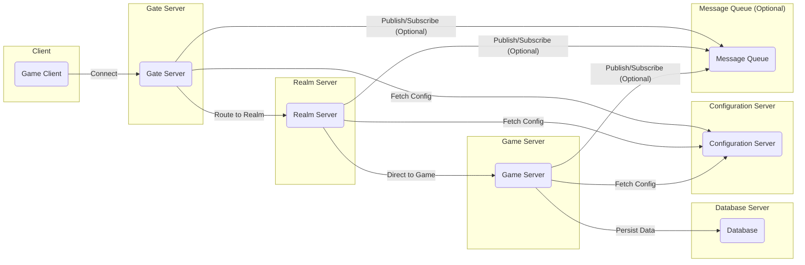
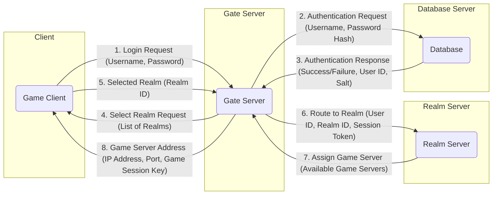
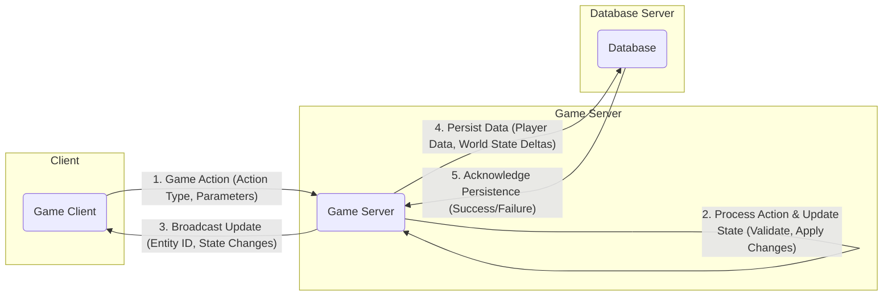

# Project Design Document: ET Distributed Game Server Framework

**Version:** 1.1
**Date:** October 26, 2023
**Author:** AI Software Architect

## 1. Introduction

This document provides an enhanced design overview of the ET distributed game server framework, as found in the GitHub repository [https://github.com/egametang/et](https://github.com/egametang/et). This document aims to clearly articulate the system's architecture, components, and data flow to facilitate subsequent threat modeling activities. This revision includes more detail on technologies and potential security considerations.

### 1.1. Project Overview

ET is a high-performance, scalable, and reliable distributed game server framework written in C#. It leverages asynchronous programming (primarily using `async`/`await`), a component-entity-system (CES) architecture for managing game logic and interactions, and a message-passing architecture for inter-service communication. The framework is designed to support large-scale multiplayer online games with demanding performance requirements.

### 1.2. Goals

* Provide a clear and comprehensive description of the ET framework's architecture, including underlying technologies.
* Identify key components and their responsibilities, with a focus on their internal workings.
* Illustrate the data flow within the system with more granular detail.
* Serve as a robust foundation for threat modeling and security analysis, highlighting potential vulnerabilities.

### 1.3. Scope

This document focuses on the core architectural design of the ET framework's server-side components. It covers the major components, their interactions, and the underlying technologies they utilize. While client interaction is considered, the internal workings of the Unity client are outside the scope of this document.

## 2. System Architecture

The ET framework employs a distributed architecture with several key server types working in concert, communicating primarily through network messages.

### 2.1. High-Level Architecture Diagram

### 2.2. Component Descriptions

*   **Game Client:** The application running on the player's device (e.g., a Unity game built with the ET client libraries). It initiates connections, sends game actions, and receives game state updates.
*   **Gate Server:** The first point of contact for incoming client connections. It handles initial connection establishment, authentication, session management, and load balancing across Realm Servers.
*   **Realm Server:** Manages logical groupings of Game Servers, often representing geographical regions or game modes. It handles player login within a realm and directs players to appropriate Game Servers.
*   **Game Server:** The core component responsible for running the game logic, managing the game world state, handling player interactions, and enforcing game rules within a specific game instance or shard.
*   **Database:**  A persistent storage layer for game data, including player accounts, character information, game world state (if necessary), and configuration data.
*   **Configuration Server:** A centralized repository for configuration parameters used by various server components, allowing for dynamic adjustments and centralized management.
*   **Message Queue (Optional):** An optional component for asynchronous communication between server components, enabling decoupling and improved scalability for certain tasks (e.g., event broadcasting, offline processing).

## 3. Component Details

This section provides a more detailed look at the key components, their functionalities, and likely underlying technologies.

### 3.1. Gate Server

*   **Responsibilities:**
    *   Accepts and manages a large number of concurrent client connections.
    *   Performs initial authentication of clients, potentially against the Database or an authentication service.
    *   Maintains client session state, including connection details and authentication tokens.
    *   Implements load balancing algorithms to distribute clients across available Realm Servers.
    *   May enforce basic rate limiting and anti-DDoS measures.
    *   Potentially handles protocol translation or adaptation.
*   **Key Technologies:**
    *   Network communication likely based on KCP (a reliable UDP protocol) or TCP.
    *   Asynchronous I/O operations using `async`/`await`.
    *   Session management using in-memory stores or distributed caches.
    *   Potentially utilizes a message broker for inter-service communication.

### 3.2. Realm Server

*   **Responsibilities:**
    *   Manages a pool of available Game Servers.
    *   Handles player login requests within its designated realm.
    *   Authenticates players (potentially re-validating tokens from the Gate Server).
    *   Matches players to appropriate Game Servers based on load, game type, or other criteria.
    *   May facilitate communication between Game Servers within the same realm.
    *   Tracks the status and availability of its managed Game Servers.
*   **Key Technologies:**
    *   Inter-process communication (IPC) or network communication (e.g., gRPC, TCP) for interacting with Gate and Game Servers.
    *   Service discovery mechanisms to locate available Game Servers.
    *   Potentially utilizes a distributed lock mechanism for managing Game Server assignments.

### 3.3. Game Server

*   **Responsibilities:**
    *   Hosts and manages the active game world or instance.
    *   Executes the core game logic and rules using the ET framework's CES architecture.
    *   Manages game entities and their components, handling interactions and state updates.
    *   Receives and processes client game actions.
    *   Broadcasts real-time game state updates to connected clients.
    *   Persists relevant game data to the Database.
    *   May implement authoritative game logic to prevent cheating.
*   **Key Technologies:**
    *   ET framework's core libraries, including the CES implementation and asynchronous task management.
    *   Network communication (KCP or TCP) for client interaction.
    *   Data serialization formats like Protobuf or MessagePack for efficient data transfer.
    *   Potentially utilizes in-memory data structures for managing the game world state.

### 3.4. Database

*   **Responsibilities:**
    *   Provides persistent storage for critical game data.
    *   Manages player accounts, including credentials and profile information.
    *   Stores character data, inventory, and progression.
    *   May store persistent game world state or historical data.
    *   Ensures data integrity, consistency, and durability.
*   **Key Technologies:**
    *   Likely a relational database (e.g., MySQL, PostgreSQL) for structured data.
    *   Potentially a NoSQL database (e.g., MongoDB, Redis) for specific data types or caching.
    *   Object-Relational Mapping (ORM) frameworks for easier data access.

### 3.5. Configuration Server

*   **Responsibilities:**
    *   Provides a centralized source of truth for configuration settings.
    *   Allows for dynamic updates to configuration parameters without requiring server restarts.
    *   May support versioning and rollback of configurations.
    *   Provides an API for other server components to retrieve configuration data.
*   **Key Technologies:**
    *   Could be a simple file-based system (e.g., JSON, YAML).
    *   Potentially a key-value store (e.g., Consul, etcd).
    *   May involve a database for more complex configurations.

### 3.6. Message Queue (Optional)

*   **Responsibilities:**
    *   Facilitates asynchronous communication between server components.
    *   Enables decoupling of services and improves scalability for certain tasks.
    *   Supports publish/subscribe patterns for event broadcasting.
    *   Can be used for tasks like logging, analytics, or offline processing.
*   **Key Technologies:**
    *   Message brokers like RabbitMQ, Kafka, or Redis Streams.

## 4. Data Flow

This section describes the typical flow of data within the ET framework for common scenarios, with more detail on the data exchanged.

### 4.1. Client Login Flow

*   **Step 1:** The client sends a login request to the Gate Server, including username and password.
*   **Step 2:** The Gate Server sends an authentication request to the Database, potentially hashing the password.
*   **Step 3:** The Database responds with the authentication result, user ID, and potentially a salt for future logins.
*   **Step 4:** The Gate Server may retrieve a list of available realms and present it to the client.
*   **Step 5:** The client selects a realm.
*   **Step 6:** The Gate Server forwards the request to the appropriate Realm Server, including a session token for authorization.
*   **Step 7:** The Realm Server selects and assigns a suitable Game Server.
*   **Step 8:** The Realm Server (or Gate Server) provides the Game Server's connection details to the client.

### 4.2. In-Game Data Flow

*   **Step 1:** The client sends a game action to the Game Server, specifying the action type and relevant parameters.
*   **Step 2:** The Game Server validates the action, updates the game world state in memory, and applies game rules.
*   **Step 3:** The Game Server broadcasts relevant game state updates to other connected clients, typically including entity IDs and their changed properties.
*   **Step 4:** The Game Server periodically or on specific events persists critical game data to the Database, potentially including player data and deltas of the game world state.
*   **Step 5:** The Database acknowledges the successful persistence of the data.

## 5. Deployment Architecture

The ET framework is designed for flexible and scalable deployment, often leveraging containerization and cloud infrastructure.

*   **Gate Servers:** Deployed behind a load balancer (e.g., cloud load balancer, Nginx) to distribute incoming client connections. Multiple instances are essential for high availability and handling peak loads. Containerization (e.g., Docker) and orchestration (e.g., Kubernetes) are common.
*   **Realm Servers:** Multiple instances are deployed to manage different logical game regions or to handle a large number of concurrent players. Deployment strategies are similar to Gate Servers, often utilizing containers and orchestration.
*   **Game Servers:** Numerous instances are deployed to host individual game instances or shards. Scaling is achieved by dynamically provisioning and de-provisioning Game Servers based on demand. Container orchestration is highly beneficial for managing the lifecycle of Game Server instances.
*   **Database:** Deployed on dedicated, high-performance servers or managed database services (e.g., AWS RDS, Azure SQL Database, Google Cloud SQL). Replication (master-slave or multi-master) and regular backups are crucial for data durability and availability.
*   **Configuration Server:** Can be deployed as a single, highly available instance or a cluster using technologies like Consul or etcd. Cloud-based configuration services are also an option.
*   **Message Queue:** Deployed as a cluster for fault tolerance and scalability. Managed message queue services offered by cloud providers are frequently used.

## 6. Security Considerations (Enhanced)

This section provides a more detailed overview of potential security considerations for each component.

*   **Game Client:**
    *   **Threats:** Code injection, memory manipulation, reverse engineering, man-in-the-middle attacks.
    *   **Mitigations:** Code obfuscation, anti-tampering measures, secure communication protocols (TLS/SSL), input validation on the server-side.
*   **Gate Server:**
    *   **Threats:** DDoS attacks, brute-force login attempts, session hijacking, authentication bypass.
    *   **Mitigations:** Rate limiting, connection throttling, strong authentication mechanisms, secure session management (e.g., short-lived tokens), input validation, firewall rules.
*   **Realm Server:**
    *   **Threats:** Unauthorized access to Game Servers, manipulation of Game Server assignments, denial of service.
    *   **Mitigations:** Secure inter-service communication (e.g., mutual TLS), authorization checks, input validation, monitoring for suspicious activity.
*   **Game Server:**
    *   **Threats:** Cheating (e.g., speed hacks, aimbots), exploiting game logic vulnerabilities, unauthorized data access, denial of service.
    *   **Mitigations:** Authoritative game logic, server-side validation of actions, anti-cheat systems, input validation, regular security audits.
*   **Database:**
    *   **Threats:** SQL injection, unauthorized data access, data breaches, data corruption.
    *   **Mitigations:** Secure database configurations, parameterized queries, principle of least privilege for database access, encryption at rest and in transit, regular backups.
*   **Configuration Server:**
    *   **Threats:** Unauthorized access to sensitive configuration data, manipulation of configurations leading to service disruption.
    *   **Mitigations:** Access controls, authentication for configuration updates, secure storage of configuration data, audit logging.
*   **Message Queue:**
    *   **Threats:** Message tampering, unauthorized access to messages, message flooding.
    *   **Mitigations:** Secure queue configurations, authentication and authorization for message producers and consumers, message encryption.

## 7. Future Considerations

*   **Enhanced Observability:** Implementing more comprehensive monitoring, logging, and tracing capabilities for better insights into system behavior and performance.
*   **Automated Scaling:** Implementing more sophisticated auto-scaling mechanisms based on real-time metrics and predictive analysis.
*   **Geographic Distribution:** Optimizing the architecture for deployment across multiple geographic regions to reduce latency for players worldwide.
*   **Service Mesh Integration:** Exploring the use of a service mesh for managing inter-service communication, security, and observability.
*   **Advanced Anti-Cheat Measures:** Integrating more advanced anti-cheat technologies and techniques.

This enhanced document provides a more detailed and comprehensive understanding of the ET distributed game server framework's architecture, underlying technologies, and security considerations. It serves as a valuable resource for threat modeling and further development efforts.