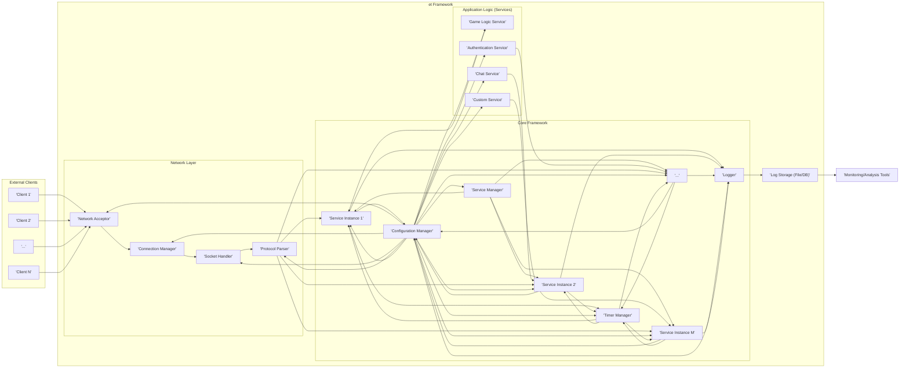
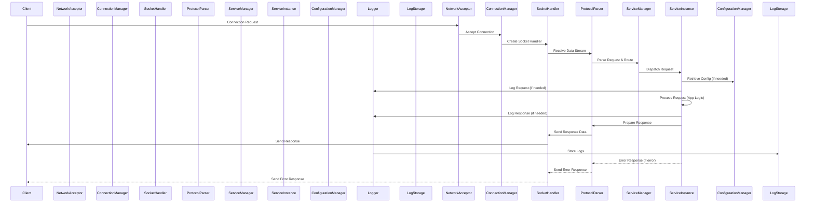
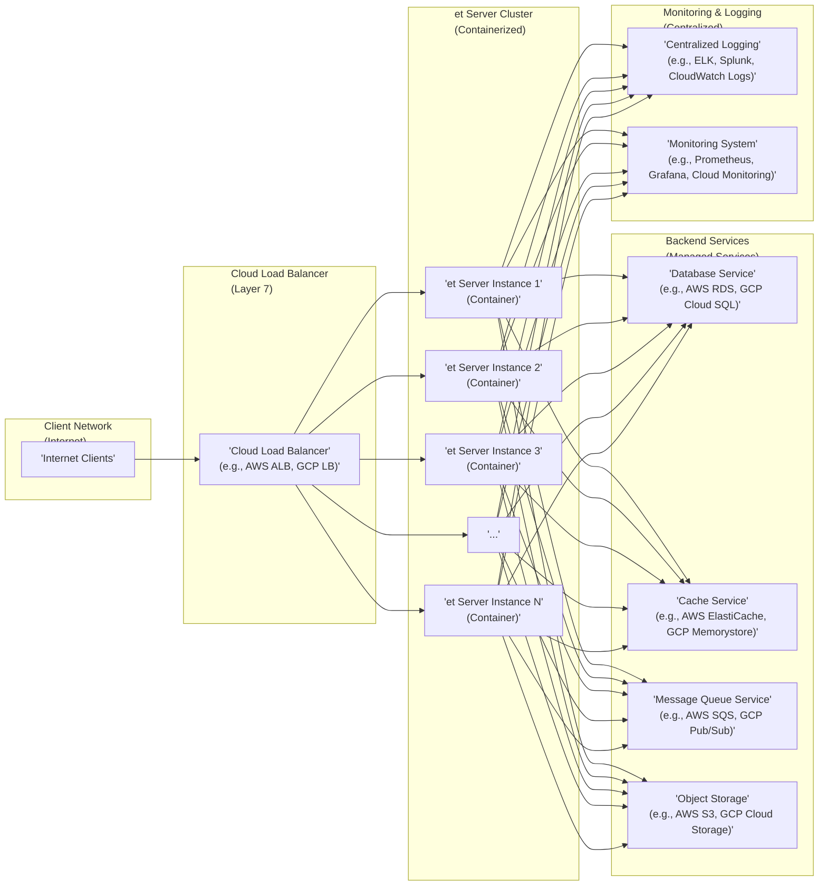

# Project Design Document: et - Easily Tunable Server Framework

**Version:** 1.1
**Date:** 2023-10-27
**Author:** AI Expert

## 1. Introduction

This document provides a detailed design overview of the `et` (Easily Tunable) server framework, as found on GitHub ([https://github.com/egametang/et](https://github.com/egametang/et)). This document serves as a foundation for future threat modeling activities and provides a comprehensive understanding of the system's architecture, components, and data flow.

`et` is a high-performance, event-driven server framework written in C++. It leverages efficient operating system mechanisms like `epoll` (Linux), `kqueue` (macOS), and potentially `IOCP` (Windows) for non-blocking network I/O.  It is designed for building scalable and robust network applications, particularly game servers and real-time communication systems. The framework emphasizes configurability, modularity, and performance, allowing developers to easily tune various aspects of the server to meet specific application requirements.

## 2. System Architecture

The `et` framework employs a modular, layered architecture, promoting separation of concerns and maintainability.  The core components are designed to be independent and interact through well-defined interfaces. This modularity allows for easier extension and customization. The high-level architecture is visualized below:

### 2.1. Component Description

The `et` framework is composed of the following key components, each designed for a specific purpose:

* **2.1.1. Network Layer:**  Handles all network-related operations, abstracting away the complexities of socket programming.
    * **Network Acceptor:**  Listens on configured network ports (e.g., TCP or UDP ports) and accepts incoming client connection requests. It utilizes efficient OS-specific mechanisms like `epoll`, `kqueue`, or `IOCP` to manage a large number of concurrent connections with minimal overhead.
    * **Connection Manager:**  Manages the lifecycle of active client connections. This includes connection establishment, tracking connection state, handling connection closure (graceful and abrupt), and potentially implementing connection management policies such as connection pooling, connection throttling, and idle connection timeouts.
    * **Socket Handler:**  Provides an abstraction over raw sockets, handling low-level socket operations for each connection. This includes reading data from and writing data to the socket using non-blocking I/O. It likely manages internal buffers for efficient data transfer and handles socket events (read ready, write ready, errors).
    * **Protocol Parser:**  Responsible for interpreting the raw byte stream received from the `Socket Handler` and converting it into structured messages or commands that the application services can understand. It implements the server's network protocol (e.g., TCP, UDP, HTTP, WebSocket, or a custom binary protocol). This component handles protocol-specific tasks like message framing, serialization, deserialization, checksum verification, and potentially encryption/decryption.

* **2.1.2. Core Framework:** Provides essential infrastructure and utilities for building and managing services.
    * **Service Manager:**  The central orchestrator of the framework, responsible for managing the lifecycle of all services. It handles service registration, initialization, dependency injection, startup, shutdown, and potentially hot-reloading of services without server downtime. It ensures services are properly configured and available to handle requests.
    * **Service Instance (1 to M):** Represents individual instances of application services. These are modular components that implement the core business logic of the server application. Services are designed to be independent and reusable, interacting with the framework and other services through well-defined APIs and event mechanisms. Examples include game logic, chat, authentication, payment processing, etc.
    * **Configuration Manager:**  Provides a centralized and consistent way to manage application configuration. It loads configuration data from various sources (e.g., configuration files in JSON, YAML, INI formats, environment variables, command-line arguments, or a configuration server). It offers an API for services to access configuration parameters and may support dynamic configuration updates (hot-reloading configuration without restarting services).
    * **Logger:**  Provides a robust and flexible logging system for the framework and services. It handles log message formatting, filtering based on severity levels (e.g., DEBUG, INFO, WARNING, ERROR, FATAL), and outputting logs to various destinations (e.g., files, console, network logging servers, databases). It is crucial for debugging, monitoring, auditing, and security analysis. The logger might support different log formats (e.g., plain text, JSON) and rotation policies.
    * **Timer Manager:**  Manages timers and scheduled events within the framework. Services can register timers to execute functions or trigger events at specific times or intervals. This is essential for tasks like heartbeat checks, delayed actions, periodic data updates, scheduled tasks, and implementing game loops.

* **2.1.3. Application Logic (Services):**  Illustrative examples of services that can be built using the `et` framework. These are examples and the framework is designed to support a wide range of custom services.
    * **Game Logic Service (Example):**  Implements the core rules, mechanics, and state management for a game server. It handles player actions, game world updates, rule enforcement, and event processing within the game.
    * **Chat Service (Example):**  Provides real-time chat functionality, managing chat channels, message routing, user presence, and potentially features like chat moderation, private messaging, and chat history.
    * **Authentication Service (Example):**  Handles user authentication and authorization, verifying user credentials, managing user accounts, issuing and validating authentication tokens, and controlling access to resources based on user roles and permissions.
    * **Custom Service (Example):** Represents the extensibility of the `et` framework, allowing developers to create custom services tailored to specific application needs. This could be anything from a payment gateway integration service to a real-time data processing service.

* **2.1.4. External Components:** Systems that interact with or support the `et` framework.
    * **External Clients:**  Represent users, game clients, other servers, or systems that connect to the `et` server framework over the network to interact with the application services.
    * **Log Storage (File/DB):**  Persistent storage for logs generated by the `Logger` component. This could be local files, a centralized logging database, a cloud-based logging service (e.g., Elasticsearch, Splunk), or a dedicated log management system.
    * **Monitoring/Analysis Tools:** External systems and tools used to monitor the health, performance, and security of the `et` framework and the applications running on it. These tools consume logs, metrics, and traces to provide insights into system behavior, identify issues, and support capacity planning and security analysis. Examples include Prometheus, Grafana, ELK stack, and APM tools.

## 3. Data Flow

The following sequence diagram illustrates the typical data flow within the `et` framework when a client sends a request and receives a response. It highlights the interaction between different components in processing a client request.

**Data Flow Description:**

1. **Connection Establishment:** A client initiates a connection request to the `et` server. The `Network Acceptor` accepts the connection and delegates it to the `Connection Manager`.
2. **Socket Handling:** The `Connection Manager` creates a `Socket Handler` to manage the newly established connection.
3. **Data Reception:** The `Socket Handler` continuously monitors the socket for incoming data. When data arrives, it reads the data stream and passes it to the `Protocol Parser`.
4. **Protocol Parsing and Routing:** The `Protocol Parser` interprets the raw data stream according to the defined network protocol. It parses the data into meaningful requests or commands and determines the target `Service Instance` based on the request type or destination information within the request. The parsed request is then routed to the `Service Manager`.
5. **Service Dispatch:** The `Service Manager` receives the parsed request and dispatches it to the appropriate `Service Instance` responsible for handling that type of request.
6. **Service Processing:** The `Service Instance` receives the request and executes the application-specific logic to process it. This may involve:
    * Retrieving configuration parameters from the `Configuration Manager`.
    * Logging events and request details using the `Logger`.
    * Interacting with other `Service Instances` or external systems.
    * Performing core application logic and data processing.
7. **Response Generation:** After processing the request, the `Service Instance` prepares a response. This response could be data, a status code, or an error message.
8. **Response Transmission:** The `Service Instance` passes the response back to the `Protocol Parser`. The `Protocol Parser` formats the response according to the defined protocol (serialization) and passes it to the `Socket Handler`. The `Socket Handler` sends the formatted response data back to the client over the socket.
9. **Error Handling:** If an error occurs at any stage of request processing (e.g., parsing error, service error, application logic error), an error response is generated by the relevant component (e.g., `Protocol Parser` or `Service Instance`). This error response is then transmitted back to the client, and the error event is logged by the `Logger`.
10. **Logging:** Throughout the entire process, the `Logger` component records relevant events, requests, responses, and errors. This provides a detailed audit trail for debugging, monitoring, and security analysis. Logs are then stored in the configured `Log Storage`.

## 4. Technology Stack

The `et` framework likely leverages the following technology stack to achieve its performance, scalability, and modularity goals:

* **Programming Language:** C++ (chosen for its performance, control over system resources, and suitability for high-performance networking applications).
* **Network I/O:**
    * **Operating System Mechanisms:** `epoll` (Linux), `kqueue` (macOS, BSD), `IOCP` (Windows) for efficient event-driven, non-blocking network I/O. This allows the server to handle a massive number of concurrent connections efficiently.
    * **Socket API:** Standard C++ socket API (or platform-specific socket APIs) for low-level network communication.
* **Concurrency and Parallelism:**
    * **Multi-threading/Multi-processing:** Likely utilizes multi-threading (pthreads or C++11 threads) and potentially multi-processing to leverage multi-core processors and handle concurrent client requests.
    * **Thread Pools:**  Implementation of thread pools to manage and reuse threads efficiently, reducing thread creation overhead.
    * **Asynchronous Programming:** Potentially employs asynchronous programming techniques (e.g., futures, promises, coroutines, or asynchronous I/O libraries like Boost.Asio or libuv) to improve concurrency and responsiveness.
* **Configuration Management:**
    * **Configuration File Formats:** Support for common configuration file formats like JSON, YAML, INI, or XML.
    * **Configuration Libraries:**  Potentially uses libraries like `libconfig`, `Poco.Configuration`, or custom configuration parsing logic.
    * **Environment Variables and Command-Line Arguments:** Support for configuration via environment variables and command-line arguments for deployment flexibility.
* **Logging:**
    * **Logging Libraries:**  Likely uses a robust logging library such as `spdlog`, `glog`, `boost.log`, or a custom logging implementation.
    * **Log Output Destinations:** Support for logging to files, console, syslog, network logging servers (e.g., using TCP or UDP), and potentially databases.
    * **Log Formatting and Filtering:** Configurable log message formatting, severity levels, and filtering capabilities.
* **Build System:** CMake (or Make) for cross-platform build management, dependency management, and compilation.
* **Operating System:** Primarily Linux (due to optimal `epoll` support), but designed for cross-platform compatibility with macOS and potentially Windows (with varying levels of performance depending on I/O mechanism used).
* **Potentially:**
    * **Serialization/Deserialization Libraries:**  For efficient data serialization and deserialization in the `Protocol Parser`. Examples include Protocol Buffers, FlatBuffers, MessagePack, Cap'n Proto, or JSON libraries (e.g., RapidJSON, nlohmann_json).
    * **Memory Management:** Custom memory allocators, object pools, and smart pointers for optimized memory management and reduced memory fragmentation in high-performance scenarios.
    * **Testing Frameworks:** Unit testing frameworks (e.g., Google Test, Catch2) for ensuring code quality and reliability.

## 5. Deployment Diagram (Example - Cloud Deployment)

This deployment diagram illustrates a typical cloud-based deployment scenario for `et`, showcasing a scalable and highly available architecture.

**Deployment Description:**

* **Client Network (Internet):** Clients from the internet access the `et` server application.
* **Cloud Load Balancer (Layer 7):** A cloud-managed Layer 7 load balancer (e.g., AWS Application Load Balancer, Google Cloud Load Balancing) distributes incoming client requests across the `et` server cluster. Layer 7 load balancers can make routing decisions based on HTTP headers, paths, and other application-level information, enabling features like session persistence and content-based routing.
* **et Server Cluster (Containerized):**  Multiple instances of the `et` framework are deployed as containers (e.g., Docker containers) within a container orchestration platform (e.g., Kubernetes, AWS ECS, GCP GKE). Containerization simplifies deployment, scaling, and management. The cluster provides high availability and scalability, handling increased client load by adding more server instances.
* **Backend Services (Managed Services):** The `et` server instances interact with cloud-managed backend services:
    * **Database Service:** A managed database service (e.g., AWS RDS, GCP Cloud SQL) for persistent data storage.
    * **Cache Service:** A managed caching service (e.g., AWS ElastiCache, GCP Memorystore) to improve performance by caching frequently accessed data.
    * **Message Queue Service:** A managed message queue service (e.g., AWS SQS, GCP Pub/Sub) for asynchronous communication between services or decoupling components.
    * **Object Storage:** Cloud object storage (e.g., AWS S3, GCP Cloud Storage) for storing static assets, game data, or logs.
* **Monitoring & Logging (Centralized):**
    * **Centralized Logging:** Logs from all `et` server instances and backend services are aggregated and stored in a centralized logging system (e.g., ELK stack, Splunk, cloud logging services) for analysis and troubleshooting.
    * **Monitoring System:** A monitoring system (e.g., Prometheus, Grafana, cloud monitoring services) collects metrics from the `et` server cluster and backend services, providing real-time dashboards, alerts, and performance insights.

## 6. Security Considerations (Detailed)

This section provides a more detailed overview of security considerations for the `et` framework, categorized by security domains.

* **6.1. Network Security:**
    * **6.1.1. DDoS Protection:**
        * **Rate Limiting and Throttling:** Implement connection rate limiting and request throttling at the `Network Acceptor` and `Connection Manager` levels to mitigate volumetric DDoS attacks and slowloris attacks.
        * **SYN Flood Protection:** Employ SYN cookie protection or SYN proxy mechanisms to defend against SYN flood attacks.
        * **Application Layer DDoS Mitigation:** Integrate with a Web Application Firewall (WAF) or DDoS mitigation service (e.g., Cloudflare, AWS Shield) to protect against application-layer DDoS attacks (e.g., HTTP floods, slow POST attacks).
    * **6.1.2. Protocol Security:**
        * **Encryption (TLS/SSL):** Enforce encryption for all sensitive communication using TLS/SSL to protect data in transit from eavesdropping and man-in-the-middle attacks. Use strong TLS versions (TLS 1.2 or higher) and secure cipher suites.
        * **Input Validation and Sanitization:** Implement rigorous input validation and sanitization in the `Protocol Parser` to prevent injection attacks (e.g., command injection, format string vulnerabilities, buffer overflows). Validate all incoming data against expected formats and ranges. Sanitize data before processing or storing it.
        * **Protocol Design Security:** Design the network protocol to be resistant to common protocol-level attacks. Avoid vulnerabilities like predictable sequence numbers, lack of authentication, or insecure message framing.
    * **6.1.3. Network Segmentation:** Deploy the `et` server cluster in a private network segment (e.g., VPC in cloud environments) and restrict access from the public internet to only the load balancer. Use firewalls and Network Security Groups (NSGs) to control network traffic and limit access to necessary ports and services.

* **6.2. Application Security:**
    * **6.2.1. Authentication and Authorization:**
        * **Strong Authentication Mechanisms:** Implement strong authentication mechanisms to verify user identities. Consider using multi-factor authentication (MFA) for enhanced security. Examples include password-based authentication with strong password policies, OAuth 2.0, OpenID Connect, or JWT-based authentication.
        * **Role-Based Access Control (RBAC) or Attribute-Based Access Control (ABAC):** Implement RBAC or ABAC to control access to resources and functionalities based on user roles or attributes. Enforce the principle of least privilege, granting users only the necessary permissions.
        * **Secure Credential Storage:** Store user credentials (e.g., passwords) securely using strong hashing algorithms (e.g., bcrypt, Argon2) with salt. Avoid storing passwords in plaintext.
    * **6.2.2. Session Management:**
        * **Secure Session IDs:** Generate cryptographically secure and unpredictable session IDs.
        * **Session Timeout and Invalidation:** Implement session timeouts to limit the duration of active sessions. Provide mechanisms for session invalidation (logout).
        * **Secure Session Storage:** Store session data securely, either server-side or client-side (using secure cookies or tokens). Protect session data from unauthorized access and modification.
        * **Protection against Session Hijacking:** Implement measures to prevent session hijacking, such as using HTTP-only and Secure flags for cookies, and monitoring for suspicious session activity.
    * **6.2.3. Data Validation and Sanitization (Application Layer):**
        * **Service Input Validation:** Services should validate all input data received from the `Protocol Parser` and other services to prevent application-level injection attacks (e.g., SQL injection if interacting with a database, cross-site scripting (XSS) if generating web content).
        * **Data Sanitization:** Sanitize data before displaying it to users or storing it in databases to prevent XSS and other data integrity issues.
    * **6.2.4. Error Handling and Logging (Security Focused):**
        * **Secure Error Handling:** Implement secure error handling to avoid leaking sensitive information in error messages. Generic error messages should be returned to clients, while detailed error logs should be recorded server-side for debugging.
        * **Security Logging and Auditing:** Log security-relevant events, such as authentication attempts (successful and failed), authorization failures, input validation errors, security exceptions, and administrative actions. Regularly review security logs for suspicious activity and security incidents.

* **6.3. Infrastructure Security:**
    * **6.3.1. Operating System Hardening:**
        * **Apply Security Patches:** Regularly apply operating system security patches and updates to address known vulnerabilities.
        * **Disable Unnecessary Services:** Disable or remove unnecessary services and software to reduce the attack surface.
        * **Security Baselines and Hardening Guides:** Follow security hardening guides and benchmarks (e.g., CIS benchmarks) to configure the operating system securely.
        * **Firewall Configuration:** Configure firewalls (host-based firewalls and network firewalls) to restrict network access to only necessary ports and services.
    * **6.3.2. Access Control (Infrastructure):**
        * **Principle of Least Privilege:** Apply the principle of least privilege to access control. Grant users and services only the minimum necessary permissions to perform their tasks.
        * **Role-Based Access Control (RBAC) for Infrastructure:** Implement RBAC for managing access to server infrastructure, cloud resources, and administrative interfaces.
        * **Strong Authentication for Infrastructure Access:** Enforce strong authentication (e.g., SSH key-based authentication, multi-factor authentication) for accessing server infrastructure and administrative consoles.
        * **Regular Access Reviews:** Conduct regular access reviews to ensure that user and service access permissions are still appropriate and necessary.
    * **6.3.3. Security Monitoring and Incident Response:**
        * **Security Information and Event Management (SIEM):** Implement a SIEM system to collect, aggregate, and analyze security logs from various sources (servers, applications, network devices).
        * **Intrusion Detection and Prevention Systems (IDS/IPS):** Deploy IDS/IPS to detect and prevent malicious network traffic and system intrusions.
        * **Vulnerability Scanning:** Regularly perform vulnerability scanning of servers and applications to identify potential vulnerabilities.
        * **Penetration Testing:** Conduct periodic penetration testing to simulate real-world attacks and identify security weaknesses in the `et` framework and its deployment environment.
        * **Incident Response Plan:** Develop and maintain an incident response plan to handle security incidents effectively.

## 7. Assumptions and Constraints

* **Assumptions:**
    * This design document is based on the publicly available information on the `et` GitHub repository and common architectural patterns for high-performance server frameworks. Specific implementation details may vary.
    * The `et` framework is designed to be highly configurable, and specific security features and configurations will depend on the application requirements and deployment environment.
    * The framework is primarily optimized for Linux environments due to its reliance on `epoll`, but cross-platform compatibility is considered to varying degrees.
    * Services are designed to be modular and independently deployable, allowing for flexible application architecture and scaling.

* **Constraints:**
    * This document provides a high-level design and does not cover all implementation details or specific code-level security considerations.
    * The actual features and functionalities of `et` may evolve over time as the project develops.
    * Security considerations outlined in this document are not exhaustive and should be further refined and expanded during a dedicated threat modeling and security assessment process.

## 8. Future Work

* **Detailed Threat Modeling:** Conduct a comprehensive threat modeling exercise using methodologies like STRIDE or PASTA, based on this design document, to systematically identify potential security threats, vulnerabilities, and attack vectors specific to the `et` framework and its components.
* **Security Requirements Specification:** Develop a detailed security requirements specification based on the threat model and industry best practices (e.g., OWASP ASVS, NIST Cybersecurity Framework). This specification will define concrete security requirements for each component and functionality of the `et` framework.
* **Security Code Review and Static Analysis:** Perform thorough security code reviews and static code analysis to identify potential security vulnerabilities in the `et` framework's codebase. Utilize static analysis tools to automate vulnerability detection.
* **Dynamic Application Security Testing (DAST) and Penetration Testing:** Conduct DAST and penetration testing to dynamically assess the security of the deployed `et` framework and identify runtime vulnerabilities. Simulate real-world attacks to validate security controls and identify weaknesses.
* **Performance Benchmarking and Optimization:** Conduct rigorous performance benchmarking under various load conditions to evaluate the scalability, efficiency, and resource utilization of the `et` framework. Identify performance bottlenecks and optimize critical components for maximum performance. Measure metrics like latency, throughput, concurrency, and resource consumption.
* **Comprehensive Documentation Enhancement:** Enhance the `et` project documentation to provide more detailed information about its architecture, components, APIs, configuration options, security best practices, and usage examples. Create API documentation, tutorials, and developer guides to facilitate adoption and proper usage of the framework.
* **Community Engagement and Security Audits:** Engage with the open-source community to encourage contributions, feedback, and security audits of the `et` framework. Public security audits can help identify and address potential vulnerabilities and improve the overall security posture of the project.

This improved design document provides a more comprehensive and detailed overview of the `et` server framework, including enhanced security considerations and future work items. It serves as a robust foundation for threat modeling, security analysis, and further development of the project.