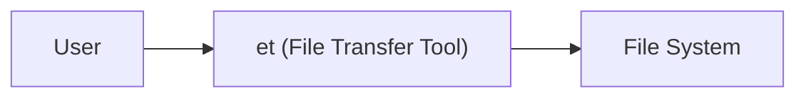
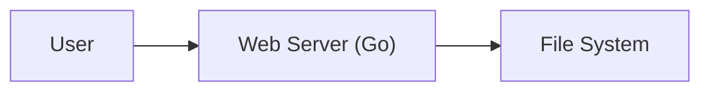
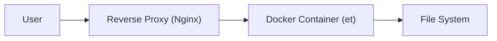
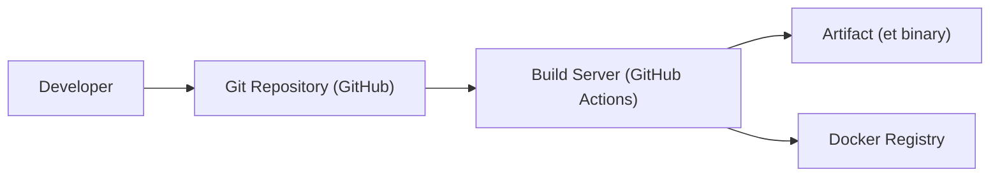

Okay, let's create a design document for the `et` project based on the provided GitHub repository.

# BUSINESS POSTURE

Business Priorities and Goals:

The `et` project aims to provide a simple, efficient, and secure way to transfer files between hosts using HTTP. It prioritizes ease of use, minimal dependencies, and secure-by-default configurations. The project appears to be targeted towards individual users or small teams who need an ad-hoc file-sharing solution without the complexity of setting up larger, more permanent file-sharing infrastructure. It can be used for quick prototyping, testing, and development workflows.

Most Important Business Risks:

*   Unauthorized data access: Sensitive files could be accessed by unauthorized parties if the transfer process is not properly secured.
*   Data modification in transit: Files could be tampered with during transfer, leading to integrity issues.
*   Denial of service: The service could be overwhelmed by malicious requests, making it unavailable to legitimate users.
*   Reputation damage: Security vulnerabilities or data breaches could damage the reputation of the project and its maintainers.
*   Compliance violations: Depending on the type of data being transferred, there might be compliance requirements (e.g., GDPR, HIPAA) that need to be considered.

# SECURITY POSTURE

Existing Security Controls:

*   security control: HTTPS support: The project supports HTTPS, which provides encryption in transit, protecting against eavesdropping and man-in-the-middle attacks. (Implemented in the Go code using standard libraries).
*   security control: Basic Authentication: The project supports basic authentication, providing a simple mechanism to restrict access to authorized users. (Implemented in the Go code).
*   security control: Limited file system access: The project serves files only from a specified directory, preventing access to other parts of the file system. (Implemented in the Go code).
*   security control: Simple codebase: The project has a relatively small and simple codebase, which reduces the attack surface and makes it easier to audit.

Accepted Risks:

*   accepted risk: Basic Authentication limitations: Basic authentication transmits credentials in a Base64-encoded format, which is not encryption. While HTTPS mitigates this, using Basic Auth over plain HTTP is inherently insecure.
*   accepted risk: Denial of Service (DoS) vulnerability: While the project is simple, it may still be vulnerable to DoS attacks if flooded with requests. No specific rate limiting or DoS protection is mentioned.
*   accepted risk: Lack of advanced access control: The project uses a single username/password combination for all users. There are no role-based access controls or granular permissions.
*   accepted risk: No input sanitization for file uploads: The project does not appear to perform any specific input sanitization or validation on uploaded filenames or content, which could potentially lead to vulnerabilities if the uploaded files are later processed by other systems.
*   accepted risk: No audit logging: The project does not implement audit logging.

Recommended Security Controls:

*   security control: Implement rate limiting: Add rate limiting to mitigate DoS attacks. This could be done at the application level or using a reverse proxy.
*   security control: Consider stronger authentication: Explore alternatives to Basic Authentication, such as API keys or token-based authentication, especially if used over plain HTTP.
*   security control: Implement input validation: Sanitize filenames and potentially file content to prevent attacks like path traversal or cross-site scripting (if applicable).
*   security control: Add audit logging: Implement logging to track access attempts, successful and failed logins, and file transfers.
*   security control: Consider CORS configuration: If the tool is intended to be accessed from web browsers, configure Cross-Origin Resource Sharing (CORS) appropriately to prevent unauthorized access from other domains.

Security Requirements:

*   Authentication:
    *   The system MUST provide a mechanism to authenticate users before granting access to files.
    *   The system SHOULD support secure authentication mechanisms, such as API keys or token-based authentication.
    *   The system MUST protect credentials in transit and at rest.
*   Authorization:
    *   The system MUST restrict access to files based on the authenticated user's permissions.
    *   The system SHOULD provide a mechanism to manage user permissions (even if it's just a single user/password).
*   Input Validation:
    *   The system MUST validate all user inputs, including filenames and paths.
    *   The system MUST sanitize filenames to prevent path traversal attacks.
*   Cryptography:
    *   The system MUST use HTTPS to encrypt all communication between the client and server.
    *   The system MUST use strong, industry-standard cryptographic algorithms and protocols.

# DESIGN

## C4 CONTEXT

Element Descriptions:

*   Element: User
    *   Name: User
    *   Type: Person
    *   Description: A person who wants to transfer files.
    *   Responsibilities: Initiates file uploads and downloads. Provides authentication credentials (if required).
    *   Security controls: Uses a web browser or command-line tool that supports HTTPS. Provides correct authentication credentials.

*   Element: et (File Transfer Tool)
    *   Name: et (File Transfer Tool)
    *   Type: Software System
    *   Description: The file transfer tool itself.
    *   Responsibilities: Handles HTTP requests. Serves files from the specified directory. Enforces authentication (if configured).
    *   Security controls: HTTPS support. Basic Authentication. Limited file system access.

*   Element: File System
    *   Name: File System
    *   Type: External System
    *   Description: The local file system where the files to be transferred are stored.
    *   Responsibilities: Stores and retrieves files.
    *   Security controls: Operating system file permissions.

## C4 CONTAINER

Element Descriptions:

*   Element: User
    *   Name: User
    *   Type: Person
    *   Description: A person who wants to transfer files.
    *   Responsibilities: Initiates file uploads and downloads. Provides authentication credentials (if required).
    *   Security controls: Uses a web browser or command-line tool that supports HTTPS. Provides correct authentication credentials.

*   Element: Web Server (Go)
    *   Name: Web Server (Go)
    *   Type: Container (Application)
    *   Description: The Go application that handles HTTP requests and serves files.
    *   Responsibilities: Parses HTTP requests. Handles authentication. Reads and writes files to the file system.
    *   Security controls: HTTPS support (using Go's `net/http` library). Basic Authentication (using Go's `net/http` library). Limited file system access (serving files only from a specified directory).

*   Element: File System
    *   Name: File System
    *   Type: External System
    *   Description: The local file system where the files to be transferred are stored.
    *   Responsibilities: Stores and retrieves files.
    *   Security controls: Operating system file permissions.

## DEPLOYMENT

Possible Deployment Solutions:

1.  Standalone Binary: The Go application can be compiled into a single, standalone binary and executed directly on a server.
2.  Docker Container: The application can be packaged into a Docker container for easier deployment and management.
3.  Systemd Service: The application can be run as a systemd service on Linux systems.
4.  Reverse Proxy: A reverse proxy (e.g., Nginx, Apache) can be placed in front of the application to handle HTTPS termination, rate limiting, and other security features.

Chosen Deployment Solution (Docker Container with Reverse Proxy):

Element Descriptions:

*   Element: User
    *   Name: User
    *   Type: Person
    *   Description: A person who wants to transfer files.
    *   Responsibilities: Initiates file uploads and downloads. Provides authentication credentials (if required).
    *   Security controls: Uses a web browser or command-line tool that supports HTTPS. Provides correct authentication credentials.

*   Element: Reverse Proxy (Nginx)
    *   Name: Reverse Proxy (Nginx)
    *   Type: Container (Application)
    *   Description: An Nginx server that acts as a reverse proxy for the `et` application.
    *   Responsibilities: Handles HTTPS termination. Forwards requests to the `et` Docker container. Provides rate limiting and other security features.
    *   Security controls: HTTPS termination (using Let's Encrypt or other certificate authority). Rate limiting. Web Application Firewall (WAF) rules (optional).

*   Element: Docker Container (et)
    *   Name: Docker Container (et)
    *   Type: Container (Application)
    *   Description: A Docker container running the `et` application.
    *   Responsibilities: Handles HTTP requests. Serves files from the specified directory. Enforces authentication (if configured).
    *   Security controls: Runs as a non-root user inside the container. Limited file system access (using Docker volume mounts).

*   Element: File System
    *   Name: File System
    *   Type: External System
    *   Description: The local file system where the files to be transferred are stored. This is mounted as volume into docker container.
    *   Responsibilities: Stores and retrieves files.
    *   Security controls: Operating system file permissions.

## BUILD

The build process for `et` is relatively simple, given that it's a Go application.

Build process description:

1.  Developer: The developer writes code and pushes it to the Git repository (GitHub).
2.  Git Repository (GitHub): The code is stored in the GitHub repository.
3.  Build Server (GitHub Actions): GitHub Actions is used as the CI/CD system. A workflow is triggered on each push to the repository.
    *   Checkout Code: The workflow checks out the code from the repository.
    *   Setup Go: The workflow sets up the Go environment.
    *   Run Tests: The workflow runs unit tests (`go test`).
    *   Build Binary: The workflow builds the Go application into a standalone binary (`go build`).
    *   Build Docker Image: The workflow builds a Docker image containing the binary.
    *   SAST Scanning: Static Application Security Testing (SAST) tools like `gosec` are run to identify potential security vulnerabilities in the code.
    *   Push to Docker Registry: If all checks pass, the Docker image is pushed to a Docker registry (e.g., Docker Hub, GitHub Container Registry).
4.  Artifact (et binary): The compiled Go binary is produced as an artifact.
5.  Docker Registry: The Docker image is stored in the Docker registry.

Security Controls in Build Process:

*   security control: Automated Build: The build process is automated using GitHub Actions, ensuring consistency and reproducibility.
*   security control: Version Control: The code is stored in a version control system (Git), allowing for tracking changes and reverting to previous versions.
*   security control: Testing: Unit tests are run as part of the build process to ensure code quality and prevent regressions.
*   security control: SAST Scanning: SAST tools are used to identify potential security vulnerabilities in the code.
*   security control: Dependency Management: Go modules are used to manage dependencies, ensuring that the project uses known and trusted versions of libraries.
*   security control: Docker Image Security: The Docker image is built using a minimal base image and runs as a non-root user, reducing the attack surface.

# RISK ASSESSMENT

Critical Business Processes:

*   File transfer: The primary business process is the secure and reliable transfer of files between users and the server.

Data Sensitivity:

*   The sensitivity of the data being transferred is unknown and depends on the user's use case. The system should be designed to handle potentially sensitive data, assuming the worst-case scenario. Data classifications could range from public (low sensitivity) to confidential (high sensitivity).

# QUESTIONS & ASSUMPTIONS

Questions:

*   What is the expected scale of the system (number of users, file sizes, transfer frequency)?
*   Are there any specific compliance requirements (e.g., GDPR, HIPAA) that need to be considered?
*   What is the threat model for the system (who are the potential attackers, what are their motivations)?
*   What level of logging and monitoring is required?
*   Is there a need for more granular access control (e.g., role-based access control)?
*   What is the expected deployment environment (cloud, on-premise, etc.)?
*   Are there any existing security policies or guidelines that need to be followed?

Assumptions:

*   BUSINESS POSTURE: The project is intended for small-scale, ad-hoc file transfers. The primary concern is ease of use and basic security.
*   SECURITY POSTURE: The users are somewhat technically savvy and understand the risks of using a simple file transfer tool. HTTPS will be used for all transfers. Basic authentication is sufficient for the intended use case.
*   DESIGN: The system will be deployed as a Docker container behind a reverse proxy. The reverse proxy will handle HTTPS termination and rate limiting. The file system being served is appropriately secured with operating system permissions.