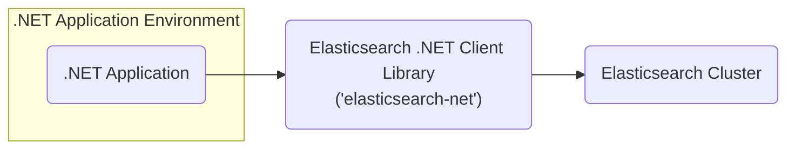
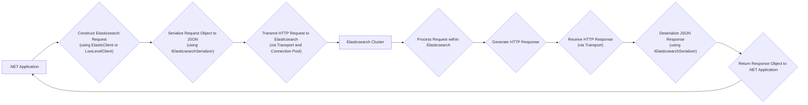

# Project Design Document: Elasticsearch .NET Client (`elasticsearch-net`) - Improved

**Version:** 1.1
**Date:** October 26, 2023
**Author:** AI Software Architect

## 1. Introduction

This document provides an enhanced design overview of the `elasticsearch-net` client library, the official .NET client for Elasticsearch. This refined document is specifically tailored to facilitate subsequent threat modeling activities. It details the core components, architectural structure, data flow pathways, and critical security considerations of the library.

## 2. Project Overview

* **Project Name:** Elasticsearch .NET Client (`elasticsearch-net`)
* **Project Repository:** [https://github.com/elastic/elasticsearch-net](https://github.com/elastic/elasticsearch-net)
* **Project Goal:** To offer a robust and comprehensive low-level client for .NET applications to interact with Elasticsearch clusters. The client is designed to closely mirror the Elasticsearch REST API, providing developers with significant flexibility and granular control over their interactions.
* **Target Audience:** .NET developers building applications requiring integration with Elasticsearch for diverse functionalities, including search capabilities, data analytics, and persistent data storage.

## 3. Architecture Overview

The `elasticsearch-net` library serves as a crucial intermediary, bridging the gap between a .NET application and an Elasticsearch cluster. It abstracts away the complexities of underlying HTTP communication, manages request serialization into the appropriate format, handles response deserialization back into .NET objects, and presents a strongly-typed API for seamless interaction with Elasticsearch.

* **.NET Application Environment:** Represents the environment where the .NET application resides and utilizes the `elasticsearch-net` library.
* **Elasticsearch .NET Client Library (`elasticsearch-net`):** This is the central component, responsible for constructing and dispatching requests to the Elasticsearch cluster and subsequently processing the received responses.
* **Elasticsearch Cluster:** The backend system providing data storage, indexing, and search functionalities.

## 4. Key Components

* **`ElasticClient`:** The primary interface for interacting with Elasticsearch. It exposes methods corresponding to virtually all Elasticsearch APIs, offering a high-level, type-safe way to interact with the cluster.
* **Connection Pool:**  A critical component managing connections to individual nodes within the Elasticsearch cluster. Different implementations cater to varying needs:
    * **`SingleNodeConnectionPool`:**  Connects to a single, specified node.
    * **`StaticConnectionPool`:** Maintains a static list of known nodes.
    * **`SniffingConnectionPool`:** Dynamically discovers and monitors cluster nodes.
    * **`CloudConnectionPool`:** Specifically designed for connecting to Elasticsearch Service on Elastic Cloud.
* **Transport:** The underlying mechanism for HTTP communication with the Elasticsearch cluster. It leverages `System.Net.Http.HttpClient` by default, handling the low-level details of sending and receiving HTTP requests and responses.
* **Serializer (`IElasticsearchSerializer`):** Responsible for the crucial task of converting .NET objects into JSON format before sending them to Elasticsearch and, conversely, deserializing JSON responses received from Elasticsearch back into .NET objects. The default implementation utilizes `System.Text.Json`.
* **Request/Response Objects:** A comprehensive set of strongly-typed C# classes mirroring the structure of Elasticsearch requests and responses as defined by the Elasticsearch REST API. This provides type safety and improves developer experience.
* **Query DSL (Domain Specific Language) Helpers:** A fluent and intuitive API enabling developers to construct complex Elasticsearch queries programmatically in a type-safe manner, reducing the risk of syntax errors.
* **Low-Level API (`LowLevelClient`):** Provides direct, un-opinionated access to Elasticsearch API endpoints. This offers maximum control but requires developers to manually handle request and response serialization and deserialization.
* **Diagnostics and Monitoring:** Features designed to provide insights into the health and performance of both the client library and the connected Elasticsearch cluster. This includes request/response tracing, performance metrics, and logging capabilities.
* **Security Features:**  A range of mechanisms for securely authenticating with the Elasticsearch cluster:
    * **Basic Authentication:** Utilizes a username and password for authentication.
    * **API Key Authentication:** Employs API keys for authentication, offering more granular control.
    * **Certificate Authentication:** Leverages client-side certificates for mutual TLS authentication.
    * **Bearer Token Authentication:** Supports authentication using OAuth 2.0 bearer tokens.

## 5. Data Flow

The typical sequence of actions when a .NET application interacts with Elasticsearch using `elasticsearch-net` is as follows:

1. **Construct Elasticsearch Request:** The .NET application initiates the process by using either the `ElasticClient` (for a type-safe approach) or the `LowLevelClient` (for direct API access) to define the desired operation on the Elasticsearch cluster. This involves specifying the target API endpoint, the appropriate HTTP method (e.g., GET, POST, PUT, DELETE), and the request body if required.
2. **Serialize Request Object to JSON:** The `IElasticsearchSerializer` takes the structured .NET request object and transforms it into a JSON payload, the standard data-interchange format for Elasticsearch.
3. **Transmit HTTP Request to Elasticsearch:** The `Transport` component, utilizing the configured `ConnectionPool` to select an appropriate node, sends the serialized HTTP request to the Elasticsearch cluster.
4. **Process Request within Elasticsearch:** The Elasticsearch cluster receives the request, validates it, executes the requested operation (e.g., indexing a document, performing a search), and prepares a response.
5. **Generate HTTP Response:** Elasticsearch generates an HTTP response containing the result of the processed request, typically in JSON format.
6. **Receive HTTP Response:** The `Transport` component receives the HTTP response from the Elasticsearch cluster.
7. **Deserialize JSON Response:** The `IElasticsearchSerializer` takes the JSON payload from the HTTP response and converts it back into a strongly-typed .NET response object.
8. **Return Response Object to .NET Application:** The `ElasticClient` or `LowLevelClient` returns the deserialized response object to the originating .NET application, allowing it to access the results of the Elasticsearch operation.

## 6. Security Considerations

This section provides a more detailed examination of security considerations pertinent to the `elasticsearch-net` library, forming a basis for comprehensive threat modeling.

* **Authentication and Authorization:**
    * **Credential Management:** How are authentication credentials (usernames, passwords, API keys, certificates, bearer tokens) securely managed within the .NET application's lifecycle and passed to the `elasticsearch-net` client? Consider risks associated with hardcoding, insecure storage, and transmission.
    * **Configuration Security:**  Are there secure methods for configuring authentication mechanisms, preventing the exposure of sensitive information in configuration files or environment variables?
    * **Authentication Failure Handling:** How does the client handle authentication failures? Are error messages sufficiently generic to avoid revealing sensitive information about the authentication process? How are retry mechanisms implemented to prevent brute-force attacks?
* **Data Transmission (Confidentiality and Integrity):**
    * **TLS/SSL Encryption:** Is communication between the client and the Elasticsearch cluster consistently encrypted using TLS/SSL to protect data in transit from eavesdropping and tampering?
    * **TLS Configuration and Enforcement:** How is TLS configured within the client? Are best practices for certificate validation (e.g., hostname verification) enforced to prevent man-in-the-middle attacks? Are outdated or insecure TLS versions avoided?
* **Input Validation and Sanitization:**
    * **Response Deserialization Security:** While the client primarily sends data, how does it handle potentially malicious or unexpected data returned by the Elasticsearch cluster in responses? Are there vulnerabilities related to deserialization of untrusted data that could lead to code execution or other issues?
* **Dependency Management:**
    * **Third-Party Vulnerabilities:** What are the external dependencies of the `elasticsearch-net` library? Is there a process for regularly monitoring and updating dependencies to address known security vulnerabilities?
* **Configuration Management:**
    * **Secure Storage of Connection Details:** How are connection details (cluster URLs, authentication information) configured and stored? Are secrets management solutions (e.g., Azure Key Vault, HashiCorp Vault) utilized to protect sensitive configuration data?
* **Logging and Auditing:**
    * **Sensitive Data in Logs:** What information does the client log? Is there a risk of inadvertently logging sensitive data (e.g., query parameters containing personal information, authentication details)? Are log files appropriately secured?
    * **Auditing Capabilities:** Does the client provide mechanisms for auditing its activities, which can be crucial for security monitoring and incident response?
* **Error Handling:**
    * **Information Disclosure in Errors:** How does the client handle errors returned by Elasticsearch? Are error messages sanitized to prevent the disclosure of potentially sensitive information about the cluster's internal state or data?
* **Connection Pool Security:**
    * **Node Discovery and Trust:** How does the connection pool handle the discovery of new nodes in the Elasticsearch cluster? Are there security implications associated with connecting to potentially compromised or rogue nodes? Is mutual authentication considered for node connections?
* **API Key Management (Specific to API Key Authentication):**
    * **Key Generation, Rotation, and Revocation:** If API keys are used for authentication, how are these keys generated securely? Is there a process for regular key rotation and timely revocation when necessary? How are keys securely distributed to the applications?

## 7. Deployment Considerations

The `elasticsearch-net` library is typically integrated into .NET applications as a NuGet package. Key deployment considerations from a security perspective include:

* **Application Environment Security Posture:** The overall security of the environment where the .NET application is deployed significantly impacts the security of the `elasticsearch-net` client. This includes considerations for on-premises servers, cloud environments, and containerized deployments.
* **Network Segmentation and Firewall Rules:** Network security controls, including segmentation and firewall rules, are crucial for restricting communication between the application and the Elasticsearch cluster to authorized networks and ports.
* **Elasticsearch Cluster Security Configuration:** The security configuration of the Elasticsearch cluster itself (e.g., authentication enforcement, authorization rules, network access controls, TLS configuration) is paramount. The client's security is dependent on the security of the server it connects to.
* **Secrets Management in Deployment:** Securely managing and injecting connection strings and authentication credentials during deployment is essential. Avoid embedding secrets directly in deployment scripts or container images.

## 8. Technology Stack

* **Primary Programming Language:** C#
* **Target Frameworks:** .NET Framework, .NET Core, .NET Standard (and newer .NET versions)
* **Underlying HTTP Client:** `System.Net.Http.HttpClient`
* **Default JSON Serialization Library:** `System.Text.Json` (with options to use alternative libraries like Newtonsoft.Json)
* **Distribution Mechanism:** NuGet package manager

## 9. Future Considerations

* **Ongoing Performance Optimizations:** Continuous efforts to enhance the performance and efficiency of the client library.
* **Maintaining Feature Parity with Elasticsearch API:**  A commitment to ensuring the client library supports the latest features and functionalities introduced in the Elasticsearch API.
* **Enhancements to Security Features:**  Potential additions or improvements to existing authentication and authorization mechanisms, as well as exploring new security best practices.
* **Improved Diagnostics and Observability Capabilities:** Further development of features to enhance monitoring, logging, and tracing capabilities for better insights into client behavior and potential issues.

This improved design document provides a more detailed and security-focused overview of the `elasticsearch-net` client library. This enhanced information will be invaluable for conducting a more thorough and effective threat model, leading to the identification of potential security vulnerabilities and the implementation of appropriate mitigation strategies.