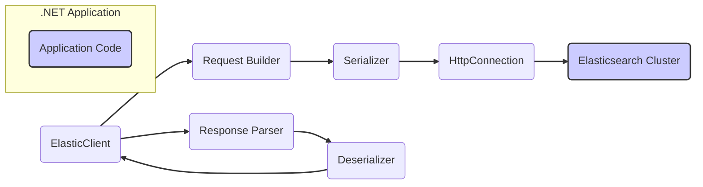
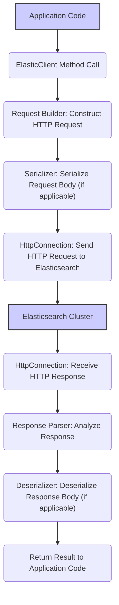

# Project Design Document: Elasticsearch.Net Client Library

**Version:** 1.1
**Date:** October 26, 2023
**Author:** AI Software Architect

## 1. Introduction

This document provides an enhanced design overview of the `elasticsearch-net` client library. This library enables seamless communication between .NET applications and Elasticsearch clusters. The purpose of this document is to offer a clear and detailed understanding of the library's architecture, its constituent components, and the flow of data within it. This detailed design serves as a crucial foundation for subsequent threat modeling activities, allowing for a comprehensive assessment of potential security vulnerabilities.

## 2. Goals and Objectives

The core objectives of the `elasticsearch-net` library are:

*   To offer a strongly-typed and idiomatic .NET interface for interacting with the Elasticsearch REST API.
*   To abstract away the complexities of direct HTTP communication, simplifying common Elasticsearch operations for developers.
*   To provide comprehensive support for a wide range of Elasticsearch features and versions, ensuring compatibility and access to the latest functionalities.
*   To maintain high performance and efficiency in its communication with Elasticsearch clusters, minimizing latency and resource consumption.
*   To offer extensibility and customization options, allowing developers to tailor the library's behavior for advanced and specific use cases.
*   To ensure thread safety, enabling robust and reliable concurrent usage within multi-threaded .NET applications.

## 3. Architectural Overview

The `elasticsearch-net` library is structured using a layered architecture. This design effectively abstracts the underlying HTTP communication required to interact with the Elasticsearch REST API. The key components within this architecture collaborate to construct and transmit requests, process incoming responses, and manage potential errors.

**Description of Key Architectural Components:**

*   **`.NET Application`**: This represents the consuming .NET application that leverages the `elasticsearch-net` library to interact with an Elasticsearch cluster.
*   **`ElasticClient`**: This serves as the primary entry point for all interactions with Elasticsearch. It exposes methods corresponding to various Elasticsearch operations, such as indexing, searching, and managing the cluster. It also manages the underlying connection pool and the lifecycle of requests.
*   **`Request Builder`**: This component is responsible for constructing the HTTP requests that will be sent to Elasticsearch. It translates high-level operations initiated through the `ElasticClient` into specific Elasticsearch API endpoints and formulates the corresponding request bodies.
*   **`Response Parser`**: Upon receiving raw HTTP responses from Elasticsearch, this component analyzes them to determine the success or failure of the request. It also prepares the response data for subsequent deserialization.
*   **`Serializer`**: This component handles the conversion of .NET objects into the JSON format required for sending data within request bodies to Elasticsearch. It manages the mapping between .NET data types and the structure of Elasticsearch documents.
*   **`Deserializer`**: Conversely, this component converts JSON responses received from Elasticsearch back into strongly-typed .NET objects. It handles the mapping from Elasticsearch document structures to corresponding .NET types.
*   **`HttpConnection`**: This component is responsible for managing the underlying HTTP communication with the Elasticsearch cluster. This includes managing a pool of connections, executing requests, and retrieving responses. It typically utilizes the `System.Net.Http.HttpClient` or similar mechanisms.
*   **`Elasticsearch Cluster`**: This represents the target Elasticsearch cluster that receives and processes the requests originating from the client library.

## 4. Component Details

This section provides a more in-depth examination of the key components within the `elasticsearch-net` library, detailing their specific responsibilities and functionalities.

*   **`ElasticClient`:**
    *   Manages and stores the connection settings required to communicate with the Elasticsearch cluster, including URLs and authentication details.
    *   Provides a comprehensive set of methods that directly correspond to the various endpoints exposed by the Elasticsearch API (e.g., `Index()`, `Search()`, `Get()`, `Update()`, `Delete()`).
    *   Implements connection pooling to efficiently manage and reuse connections to the Elasticsearch cluster, improving performance.
    *   Incorporates retry mechanisms to handle transient network issues or temporary unavailability of Elasticsearch nodes, enhancing resilience.
    *   Offers a range of configuration options, allowing developers to customize the library's behavior, such as setting a default index or configuring serialization settings.
    *   Often designed to integrate seamlessly with dependency injection frameworks, promoting loose coupling and testability.

*   **`Request Builder`:**
    *   Translates high-level method calls on the `ElasticClient` into specific HTTP methods (e.g., GET, POST, PUT, DELETE) and their corresponding Elasticsearch API endpoint URLs.
    *   Constructs the complete request URI, incorporating necessary parameters and identifiers based on the operation being performed.
    *   Populates the body of the HTTP request with serialized data, utilizing the `Serializer` component to convert .NET objects into JSON.
    *   Adds essential HTTP headers to the request, such as `Content-Type` to specify the format of the request body and `Authorization` headers for authentication.

*   **`Response Parser`:**
    *   Examines the HTTP status code returned in the response to determine whether the request was processed successfully or encountered an error.
    *   Handles various error scenarios, potentially throwing exceptions that provide information about the failure.
    *   Extracts the body of the response, which typically contains the data returned by Elasticsearch, for subsequent deserialization.
    *   May implement specific logic to handle and interpret Elasticsearch-specific error responses, providing more context to the application.

*   **`Serializer` / `Deserializer`:**
    *   Typically leverages a robust JSON serialization library, such as `System.Text.Json` or `Newtonsoft.Json`, to perform the conversion between .NET objects and JSON.
    *   Provides options for customizing the serialization process, such as defining property naming conventions (e.g., camel case, snake case) or instructing the serializer to ignore null values.
    *   Handles the mapping between .NET data types (e.g., `string`, `int`, `DateTime`) and their corresponding representations in Elasticsearch documents.
    *   May support the implementation of custom converters to handle serialization and deserialization of more complex or specialized data types.

*   **`HttpConnection`:**
    *   Manages a pool of persistent HTTP connections to the Elasticsearch cluster, reducing the overhead of establishing new connections for each request.
    *   Handles the actual transmission of HTTP requests to the Elasticsearch server and the reception of the corresponding responses.
    *   Implements retry logic with configurable backoff strategies to automatically retry failed requests due to transient network issues or server-side problems.
    *   Allows for the configuration of various HTTP-related settings, such as request timeouts and connection timeouts.
    *   Manages the establishment of secure connections using TLS/SSL encryption, ensuring the confidentiality and integrity of data transmitted between the client and the Elasticsearch cluster. This includes options for certificate validation.
    *   May support the configuration and utilization of HTTP proxies for routing traffic through intermediary servers.

## 5. Data Flow

The typical sequence of events and data transformations involved in an operation using the `elasticsearch-net` library is as follows:

**Detailed Steps in the Data Flow:**

1. The `.NET Application` initiates an interaction with Elasticsearch by invoking a specific method on the `ElasticClient` instance.
2. The `Request Builder` receives the method call and its associated parameters. It then constructs the appropriate HTTP request, including the correct HTTP method, target API endpoint URL, and necessary headers.
3. If the operation requires sending data to Elasticsearch (e.g., indexing a document, executing a search query), the `Serializer` component is invoked to convert the relevant .NET objects into a JSON formatted request body.
4. The `HttpConnection` component takes the fully constructed HTTP request and transmits it to the configured endpoint of the Elasticsearch cluster.
5. The `Elasticsearch Cluster` receives the request, processes it according to the specified operation, and generates an HTTP response.
6. The `HttpConnection` component receives the HTTP response transmitted back from the Elasticsearch cluster.
7. The `Response Parser` analyzes the received HTTP response, examining the status code and headers to determine the outcome of the request (success or failure).
8. If the response contains a body (e.g., the results of a search query, details of an indexed document), the `Deserializer` component is used to convert the JSON formatted response body back into strongly-typed .NET objects.
9. Finally, the `ElasticClient` returns the result of the operation, which may include data objects or an indication of success or failure, back to the calling `.NET Application`.

## 6. Security Considerations

Security is paramount when interacting with Elasticsearch. The `elasticsearch-net` library incorporates several features and requires careful consideration of various aspects to ensure secure communication and data handling:

*   **Authentication Mechanisms:**
    *   Supports various methods for authenticating with the Elasticsearch cluster, including:
        *   Basic Authentication: Using usernames and passwords for authentication.
        *   API Keys: Utilizing API keys for authentication, offering a more granular and auditable approach.
        *   Bearer Tokens: Supporting token-based authentication schemes like OAuth 2.0.
        *   Integration with Cloud Provider IAM: Allowing authentication using credentials from cloud platforms like AWS or Azure.
    *   It is crucial that authentication credentials are managed securely, preferably using environment variables, configuration files with restricted access, or dedicated secrets management solutions, and never hardcoded directly in the application code.

*   **Transport Layer Security (TLS/SSL):**
    *   Enforces and supports secure communication with Elasticsearch over HTTPS, ensuring that all data transmitted between the client and the cluster is encrypted, protecting it from eavesdropping and tampering.
    *   Provides configuration options for verifying the server's SSL/TLS certificate, preventing man-in-the-middle attacks. This includes options for specifying trusted certificate authorities or disabling certificate validation in development environments (with extreme caution).

*   **Input Validation and Sanitization (Application Responsibility):**
    *   While `elasticsearch-net` facilitates communication, it does not inherently perform extensive validation or sanitization of user-provided data.
    *   The primary responsibility for validating and sanitizing all data before sending it to Elasticsearch rests with the consuming application. This is crucial to prevent various injection attacks, such as NoSQL injection, by ensuring that user input is properly escaped and does not contain malicious code or commands.

*   **Error Handling and Information Disclosure:**
    *   The library is designed to handle errors gracefully. However, developers must be cautious about the level of detail included in error messages and logs. Avoid exposing sensitive information, such as internal server details or data structures, in error responses that could be exploited by attackers.
    *   Implement proper exception handling mechanisms to prevent the leakage of sensitive information through unhandled exceptions.

*   **Dependency Management and Vulnerability Scanning:**
    *   `elasticsearch-net` relies on other NuGet packages. Regularly updating these dependencies is essential to patch known security vulnerabilities in those libraries.
    *   Employing dependency scanning tools as part of the development process can help identify and address potential vulnerabilities in the library's dependencies.

*   **Secure Configuration Management:**
    *   Securely storing and managing connection strings, authentication credentials, and other sensitive configuration data is paramount. Avoid storing these directly in code. Utilize secure configuration providers or secrets management services.

*   **Authorization (Elasticsearch Cluster Responsibility):**
    *   While `elasticsearch-net` handles authentication (verifying the identity of the client), the authorization of operations (determining what actions the authenticated user is permitted to perform) is managed entirely within the Elasticsearch cluster itself. This is based on the roles and permissions assigned to the authenticated user. Ensure that Elasticsearch is configured with appropriate role-based access control (RBAC) to restrict access to sensitive data and operations.

## 7. Deployment

The `elasticsearch-net` library is distributed as a NuGet package. Developers can easily integrate it into their .NET projects by adding the package dependency using the .NET CLI (e.g., `dotnet add package Elasticsearch.Net` or `NEST`) or through the NuGet Package Manager within Visual Studio.

## 8. Technologies Used

*   **.NET Standard / .NET Framework / .NET**: The primary target platform for the library, ensuring cross-platform compatibility.
*   **System.Net.Http.HttpClient**: The core component used for making HTTP requests to the Elasticsearch cluster (or potentially other HTTP client implementations).
*   **JSON Serialization Library**: Typically either `System.Text.Json` (the built-in .NET library) or `Newtonsoft.Json` (a popular third-party library) for serializing and deserializing JSON data.
*   **NuGet**: The package manager for .NET, used for packaging and distributing the library.

## 9. Future Considerations

*   Further enhancements to support the latest features and APIs introduced in newer versions of Elasticsearch.
*   Improvements to diagnostic capabilities, providing more detailed logging and tracing information for troubleshooting.
*   Offering more granular control over HTTP connection settings and customization options.
*   Potential integrations with observability platforms for enhanced monitoring and performance analysis.
*   Ongoing efforts to optimize performance and efficiency in communication with Elasticsearch.

This revised document provides an enhanced and more detailed design overview of the `elasticsearch-net` client library, with a stronger emphasis on security considerations relevant for threat modeling. This information will be invaluable for identifying potential security risks and implementing appropriate mitigation strategies.