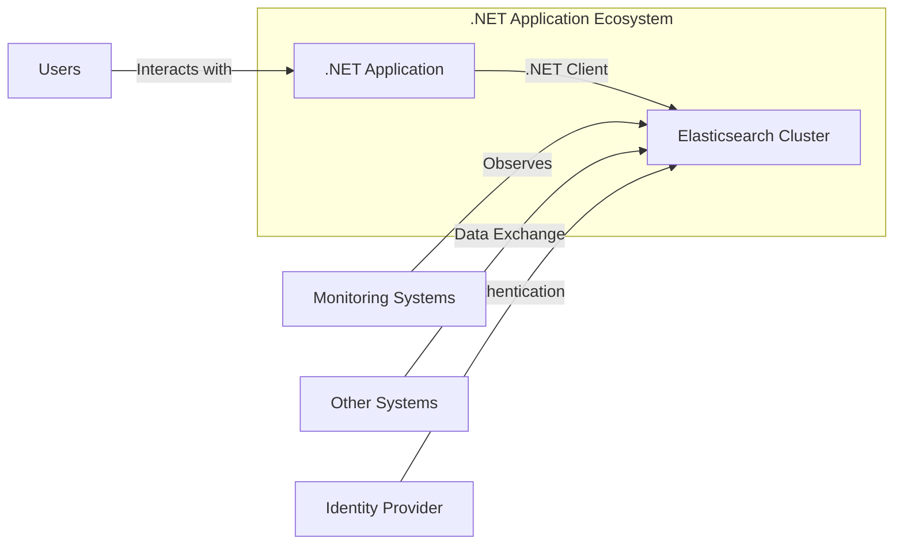
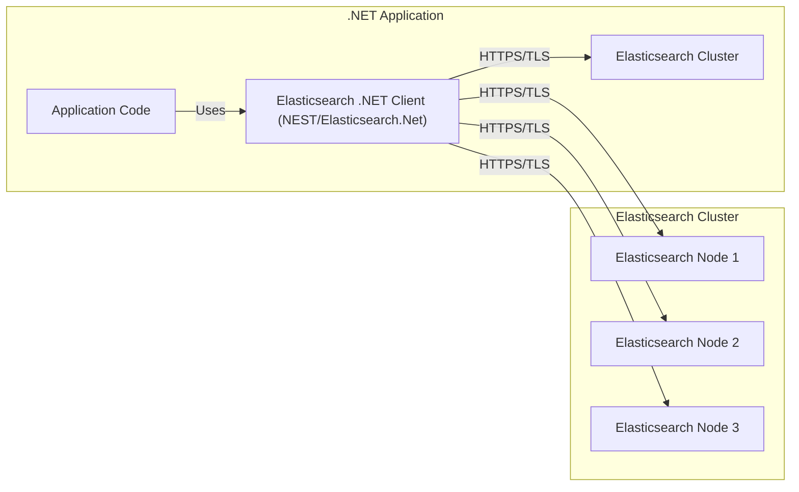
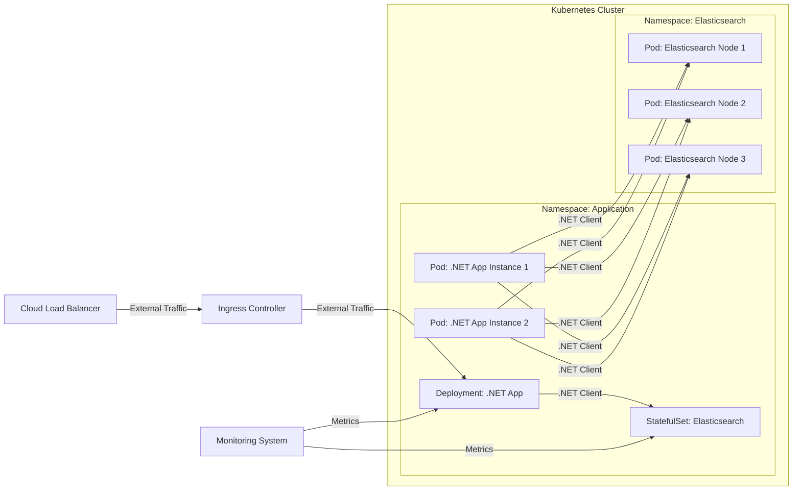
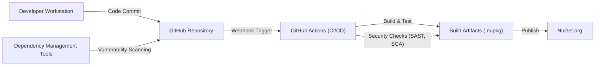

# Project Design Document: Elasticsearch .NET Client

## BUSINESS POSTURE

_Priorities and Goals:_

The Elasticsearch .NET client (NEST/Elasticsearch.Net) aims to provide a robust, efficient, and user-friendly way for .NET applications to interact with Elasticsearch clusters. The primary goals are:

*   Provide a high-performance, low-overhead communication layer with Elasticsearch.
*   Offer a strongly-typed, fluent API that simplifies complex Elasticsearch queries and operations.
*   Maintain compatibility with various Elasticsearch versions.
*   Ensure the security and integrity of data transmitted between the .NET application and the Elasticsearch cluster.
*   Provide comprehensive documentation and support to .NET developers.

_Business Risks:_

*   _Data Breaches:_ Unauthorized access to sensitive data stored in Elasticsearch due to vulnerabilities in the client or its configuration.
*   _Data Corruption:_ Accidental or malicious modification/deletion of data in Elasticsearch due to client bugs or misuse.
*   _Denial of Service:_ Overwhelming the Elasticsearch cluster with excessive or malformed requests from the client, leading to service disruption.
*   _Compatibility Issues:_ Inability to use the client with newer or older Elasticsearch versions, hindering upgrades or causing application failures.
*   _Performance Bottlenecks:_ Inefficient client code leading to slow response times and increased resource consumption.
*   _Supply Chain Attacks:_ Compromised dependencies or build processes introducing vulnerabilities into the client library.

## SECURITY POSTURE

_Existing Security Controls:_

*   security control: HTTPS/TLS Encryption: The client supports encrypted communication with Elasticsearch using HTTPS/TLS, protecting data in transit. (Described in documentation and client configuration options).
*   security control: Authentication: The client supports various authentication mechanisms, including API keys, basic authentication, and token-based authentication, to verify the identity of the client application. (Described in documentation and client configuration options).
*   security control: Client Certificate Authentication: Support for mutual TLS authentication using client certificates. (Described in documentation and client configuration options).
*   security control: Error Handling and Retry Mechanisms: The client includes robust error handling and configurable retry policies to handle transient network issues and Elasticsearch server errors gracefully. (Described in documentation and client code).
*   security control: Connection Pooling: The client utilizes connection pooling to optimize resource usage and improve performance. (Described in documentation and client code).
*   security control: Request/Response Serialization: The client uses a secure serializer to prevent injection vulnerabilities during data serialization and deserialization. (Described in client code).
*   security control: Regular Security Audits and Penetration Testing: The Elasticsearch project (including the .NET client) undergoes regular security audits and penetration testing. (Assumed based on Elastic's general security practices).
*   security control: Dependency Management: The project uses dependency management tools to track and update third-party libraries, reducing the risk of known vulnerabilities. (Visible in project files).
*   security control: Code Reviews: All code changes undergo mandatory code reviews to identify potential security flaws. (Visible in GitHub pull requests).
*   security control: Static Analysis: The project likely uses static analysis tools to detect potential security vulnerabilities in the codebase. (Assumed based on best practices).

_Accepted Risks:_

*   accepted risk: Reliance on User Configuration: The security of the client heavily relies on proper configuration by the user, including setting up secure connections, authentication, and authorization. Misconfiguration can lead to security vulnerabilities.
*   accepted risk: Potential for Zero-Day Vulnerabilities: Like any software, the client may contain unknown vulnerabilities (zero-days) that could be exploited by attackers.
*   accepted risk: Limited Control over Elasticsearch Server Security: The client's security depends on the security of the Elasticsearch cluster it connects to. Vulnerabilities or misconfigurations on the server-side can impact the client's security.

_Recommended Security Controls:_

*   security control: Implement comprehensive input validation on all data sent to Elasticsearch to prevent injection attacks (e.g., query injection).
*   security control: Enforce the principle of least privilege by granting the client application only the necessary permissions in Elasticsearch.
*   security control: Regularly monitor client logs and Elasticsearch audit logs for suspicious activity.
*   security control: Implement a robust secrets management solution for storing and managing API keys, passwords, and other sensitive credentials.
*   security control: Consider using a web application firewall (WAF) to protect the Elasticsearch cluster from common web attacks.

_Security Requirements:_

*   _Authentication:_
    *   The client MUST support secure authentication mechanisms (API keys, basic authentication, token-based authentication, client certificate authentication).
    *   The client MUST securely store and manage credentials.
    *   The client SHOULD support integration with external identity providers (e.g., Active Directory, LDAP).

*   _Authorization:_
    *   The client MUST interact with Elasticsearch using the principle of least privilege.
    *   The client SHOULD support role-based access control (RBAC) to restrict access to specific indices and operations.

*   _Input Validation:_
    *   The client MUST validate all user-supplied input before sending it to Elasticsearch to prevent injection attacks.
    *   The client SHOULD use a whitelist approach to input validation, allowing only known-good characters and patterns.

*   _Cryptography:_
    *   The client MUST use strong encryption algorithms (e.g., TLS 1.2 or higher) for all communication with Elasticsearch.
    *   The client MUST securely generate and manage cryptographic keys.
    *   The client SHOULD support data encryption at rest within Elasticsearch.

## DESIGN

### C4 CONTEXT

_Context Diagram Elements:_

*   Element:
    *   Name: .NET Application
    *   Type: Software System
    *   Description: The application utilizing the Elasticsearch .NET client to interact with Elasticsearch.
    *   Responsibilities: Sending requests to Elasticsearch, processing responses, handling data, and presenting information to users.
    *   Security controls: Input validation, authentication, authorization, secure configuration management.

*   Element:
    *   Name: Elasticsearch Cluster
    *   Type: Software System
    *   Description: The Elasticsearch cluster storing and managing data.
    *   Responsibilities: Storing data, indexing data, searching data, providing APIs for data access.
    *   Security controls: Access control, encryption at rest, auditing, network security.

*   Element:
    *   Name: Users
    *   Type: Person
    *   Description: Users interacting with the .NET application.
    *   Responsibilities: Providing input, viewing results.
    *   Security controls: Authentication, authorization (within the .NET application).

*   Element:
    *   Name: Monitoring Systems
    *   Type: Software System
    *   Description: Systems monitoring the health and performance of the Elasticsearch cluster.
    *   Responsibilities: Collecting metrics, generating alerts, providing dashboards.
    *   Security controls: Access control, secure communication.

*   Element:
    *   Name: Other Systems
    *   Type: Software System
    *   Description: Other systems exchanging data with the Elasticsearch cluster (e.g., Logstash, Kibana).
    *   Responsibilities: Data ingestion, data visualization, data analysis.
    *   Security controls: Varies depending on the specific system.

*   Element:
    *   Name: Identity Provider
    *   Type: Software System
    *   Description: System responsible for authenticating users and providing identity information.
    *   Responsibilities: User authentication, authorization, identity management.
    *   Security controls: Secure authentication protocols, strong password policies, multi-factor authentication.

### C4 CONTAINER

_Container Diagram Elements:_

*   Element:
    *   Name: Application Code
    *   Type: Container
    *   Description: The code of the .NET application using the Elasticsearch .NET client.
    *   Responsibilities: Handling business logic, interacting with the client, processing data.
    *   Security controls: Input validation, secure coding practices.

*   Element:
    *   Name: Elasticsearch .NET Client (NEST/Elasticsearch.Net)
    *   Type: Container
    *   Description: The .NET client library for interacting with Elasticsearch.
    *   Responsibilities: Providing an API for interacting with Elasticsearch, handling communication, serializing/deserializing data.
    *   Security controls: HTTPS/TLS encryption, authentication, connection pooling, secure serialization.

*   Element:
    *   Name: Elasticsearch Cluster
    *   Type: Container
    *   Description: The Elasticsearch cluster.
    *   Responsibilities: Storing, indexing, and searching data.
    *   Security controls: Access control, encryption at rest, auditing, network security.

*   Element:
    *   Name: Elasticsearch Node 1, 2, 3
    *   Type: Container
    *   Description: Individual nodes within the Elasticsearch cluster.
    *   Responsibilities: Data storage, indexing, search execution.
    *   Security controls: Inherited from the Elasticsearch Cluster.

### DEPLOYMENT

_Possible Deployment Solutions:_

1.  _Bare Metal/Virtual Machines:_ Deploying the .NET application and Elasticsearch on dedicated servers or virtual machines.
2.  _Containers (Docker):_ Containerizing the .NET application and Elasticsearch using Docker.
3.  _Kubernetes:_ Orchestrating the deployment and management of the .NET application and Elasticsearch containers using Kubernetes.
4.  _Cloud Provider (AWS, Azure, GCP):_ Utilizing managed services from cloud providers (e.g., AWS Elasticsearch Service, Azure Elasticsearch, Google Cloud Elasticsearch).

_Chosen Solution (Example: Kubernetes):_

_Deployment Diagram Elements:_

*   Element:
    *   Name: Deployment: .NET App
    *   Type: Deployment
    *   Description: Kubernetes Deployment managing the .NET application pods.
    *   Responsibilities: Ensuring the desired number of .NET application instances are running.
    *   Security controls: Resource limits, security context.

*   Element:
    *   Name: Pod: .NET App Instance 1, 2
    *   Type: Pod
    *   Description: Individual instances of the .NET application running within Kubernetes pods.
    *   Responsibilities: Running the .NET application code.
    *   Security controls: Network policies, container security context.

*   Element:
    *   Name: StatefulSet: Elasticsearch
    *   Type: StatefulSet
    *   Description: Kubernetes StatefulSet managing the Elasticsearch pods.
    *   Responsibilities: Ensuring the ordered deployment and scaling of Elasticsearch nodes.
    *   Security controls: Persistent volumes, security context.

*   Element:
    *   Name: Pod: Elasticsearch Node 1, 2, 3
    *   Type: Pod
    *   Description: Individual Elasticsearch nodes running within Kubernetes pods.
    *   Responsibilities: Running the Elasticsearch process.
    *   Security controls: Network policies, container security context.

*   Element:
    *   Name: Ingress Controller
    *   Type: Ingress Controller
    *   Description: Kubernetes Ingress controller managing external access to the .NET application.
    *   Responsibilities: Routing external traffic to the appropriate services.
    *   Security controls: TLS termination, access control.

*   Element:
    *   Name: Cloud Load Balancer
    *   Type: Load Balancer
    *   Description: Cloud provider's load balancer distributing traffic to the Ingress controller.
    *   Responsibilities: Distributing external traffic across multiple instances of the Ingress controller.
    *   Security controls: DDoS protection, health checks.

*   Element:
    *   Name: Monitoring System
    *   Type: Software System/Deployment
    *   Description: System for monitoring application and cluster.
    *   Responsibilities: Collect and display metrics.
    *   Security controls: Access control to monitoring data.

### BUILD

The Elasticsearch .NET client build process involves several steps, from code compilation to package creation and distribution.  Security is a key consideration throughout the process.

_Build Process Description:_

1.  _Code Commit:_ Developers commit code changes to the GitHub repository.
2.  _Webhook Trigger:_ A webhook triggers the GitHub Actions CI/CD pipeline.
3.  _GitHub Actions (CI/CD):_
    *   _Build & Test:_ The code is compiled, and unit and integration tests are executed.
    *   _Security Checks:_
        *   _SAST (Static Application Security Testing):_ Static analysis tools (e.g., SonarQube) scan the codebase for potential security vulnerabilities.
        *   _SCA (Software Composition Analysis):_ Dependency management tools (e.g., Dependabot) identify and report known vulnerabilities in third-party libraries.
4.  _Build Artifacts:_ If the build and tests are successful, build artifacts (NuGet packages) are created.
5.  _Publish:_ The NuGet packages are published to NuGet.org, the official package repository for .NET.
6.  _Dependency Management:_ Dependency management tools continuously scan for vulnerabilities in project dependencies.

_Security Controls in Build Process:_

*   security control: Code Reviews: Mandatory code reviews before merging changes into the main branch.
*   security control: SAST: Static analysis tools to identify potential code vulnerabilities.
*   security control: SCA: Dependency scanning to detect known vulnerabilities in third-party libraries.
*   security control: Build Automation: Automated build process using GitHub Actions to ensure consistency and repeatability.
*   security control: Signed Packages: NuGet packages are digitally signed to ensure their integrity and authenticity.
*   security control: Least Privilege: Build agents run with minimal necessary permissions.

## RISK ASSESSMENT

_Critical Business Processes:_

*   _Data Ingestion:_ The process of collecting and storing data in Elasticsearch.
*   _Data Search and Retrieval:_ The process of querying and retrieving data from Elasticsearch.
*   _Data Analysis and Reporting:_ The process of analyzing data and generating reports using Elasticsearch.

_Data Sensitivity:_

*   The data stored in Elasticsearch can vary in sensitivity, ranging from publicly available information to highly confidential data (e.g., PII, financial data, intellectual property). The .NET client itself does not inherently know the sensitivity of the data; this is determined by the application using the client and the data stored in the Elasticsearch cluster.  Therefore, a conservative approach assuming high data sensitivity is recommended.

## QUESTIONS & ASSUMPTIONS

_Questions:_

*   What specific types of data will be stored in Elasticsearch using this client? (This is crucial for determining the appropriate security controls.)
*   What are the specific compliance requirements (e.g., GDPR, HIPAA, PCI DSS) that apply to the data and the system?
*   What is the expected load and performance requirements for the system?
*   What is the existing security infrastructure and tooling in place?
*   What level of access will the .NET application have to the Elasticsearch cluster (e.g., read-only, read-write, administrative)?
*   Are there any specific security concerns or threats that have been identified previously?
*   What is the process for handling security incidents and vulnerabilities?

_Assumptions:_

*   _BUSINESS POSTURE:_ The organization has a moderate to high risk aversion, prioritizing data security and compliance.
*   _SECURITY POSTURE:_ The Elasticsearch cluster is configured securely, with appropriate access controls, encryption, and auditing enabled. The development team follows secure coding practices.
*   _DESIGN:_ The .NET application will be deployed in a secure environment (e.g., a private network, a cloud environment with appropriate security controls). The application will use the Elasticsearch .NET client correctly and securely.