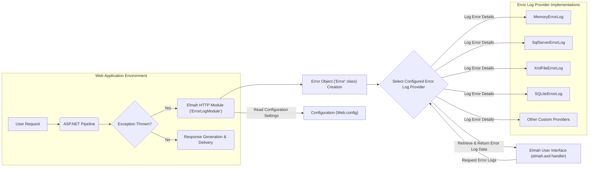

# Project Design Document: Elmah (Error Logging Modules and Handlers)

**1. Introduction**

This document provides an enhanced and detailed design overview of the Elmah (Error Logging Modules and Handlers) project, an open-source error logging library for ASP.NET web applications. This document aims to clearly articulate the system's architecture, components, data flow, and key considerations for its operation. This design will serve as the foundation for subsequent threat modeling activities, providing a comprehensive understanding of the system's inner workings.

**2. Project Overview**

Elmah is a lightweight yet powerful and extensible library designed to provide comprehensive error logging capabilities for ASP.NET web applications. It seamlessly intercepts unhandled exceptions occurring within the application, meticulously logs detailed information about these errors, and offers various configurable mechanisms for viewing, managing, and even being notified of these logs. The core objective of Elmah is to empower developers with an easily integrated and highly customizable solution for capturing and analyzing runtime errors within their web applications. This facilitates efficient debugging, proactive identification of potential issues, and ultimately contributes to improved application stability and a better user experience.

**3. System Architecture**

The fundamental architecture of Elmah centers around an HTTP module that strategically intercepts exceptions as they propagate through the ASP.NET pipeline. This module then interacts with a diverse set of error log provider implementations, responsible for the persistent storage and subsequent retrieval of detailed error information.

**4. Data Flow - The Lifecycle of an Error**

The journey of an error within the Elmah framework follows a well-defined path:

*   A user initiates a request to the web application.
*   The request is processed through the various stages of the ASP.NET pipeline.
*   If an unhandled exception arises during the processing of this request:
    *   The Elmah HTTP module (`ErrorLogModule`), registered within the `web.config`, is notified of the exception.
    *   The module captures the exception and proceeds to create an `Error` object. This object encapsulates comprehensive details about the error, including the exception message, stack trace, the time of occurrence, the hostname, the type and source of the exception, the authenticated user (if applicable), the HTTP status code, and detailed information about the originating HTTP request (URL, headers, form data, cookies, server variables).
    *   Based on the error logging provider configured in the `web.config` (e.g., in-memory, SQL Server, XML file, SQLite, or a custom implementation), the `Error` object is serialized and persistently stored using the chosen provider's specific mechanism.
*   Optionally, authorized users can access the Elmah user interface, typically exposed through the `elmah.axd` handler.
    *   Upon accessing the UI, a request is made to the configured error log provider to retrieve the stored error logs.
    *   The provider fetches the requested error information from its underlying storage.
    *   The Elmah UI then renders this error data in a user-friendly web page, allowing for browsing, filtering, and detailed examination of individual errors.

**5. Key Components - A Deeper Dive**

*   **Elmah HTTP Module (`ErrorLogModule`):**
    *   This is the core interceptor within the ASP.NET pipeline, acting as the primary entry point for Elmah's error handling.
    *   Its registration occurs within the `<httpModules>` or `<system.webServer><modules>` section of the `web.config` file.
    *   The module subscribes to the `Error` event of the `HttpApplication`, allowing it to be notified of unhandled exceptions.
    *   Upon receiving an error notification, it instantiates an `Error` object, meticulously capturing all relevant details of the exception and the associated HTTP context.
    *   The responsibility of persisting the error details is then delegated to the error log provider specified in the configuration.
    *   The module also plays a role in reading and interpreting Elmah's configuration settings from the `web.config`.

*   **Error Object (`Error` class):**
    *   This class serves as the data transfer object, encapsulating all the pertinent information about a logged error.
    *   Key properties include:
        *   `Message`: The textual description of the exception.
        *   `StackTrace`: A string representing the call stack at the point where the exception was thrown.
        *   `Time`: A timestamp indicating when the error occurred.
        *   `HostName`: The name of the server hosting the application.
        *   `Type`: The fully qualified name of the exception type.
        *   `Source`: The application or object that caused the error.
        *   `User`: The identity of the authenticated user associated with the request, if any.
        *   `StatusCode`: The HTTP status code associated with the request that resulted in the error.
        *   `WebRequestInfo`: A collection of details about the HTTP request, including the URL, HTTP headers, form data, cookies, and server variables.

*   **Error Log Providers (`ErrorLog` abstract class and Implementations):**
    *   These components are responsible for the crucial tasks of persistently storing error information and retrieving it when needed.
    *   Elmah provides a set of built-in providers, offering flexibility in choosing the storage mechanism:
        *   **`MemoryErrorLog`:** Stores error details in the application's memory. This is a volatile storage mechanism, meaning the logs are lost upon application restart. Primarily useful for development or low-traffic environments.
        *   **`XmlFileErrorLog`:** Persists errors to an XML file located on the server's file system. The location and naming of the file are configurable.
        *   **`SqlServerErrorLog`:** Stores error information in a dedicated table within a Microsoft SQL Server database. Requires a connection string to be configured.
        *   **`SQLiteErrorLog`:** Utilizes an SQLite database file for storing error logs. This is a file-based database, simplifying deployment in some scenarios.
        *   **`NullErrorLog`:** A provider that effectively disables logging by discarding all error information. Useful for specific environments or scenarios where logging is not desired.
    *   Elmah's extensible design allows developers to create custom error log providers by implementing the `ErrorLog` abstract class. This enables integration with various other storage systems or logging platforms.

*   **Elmah User Interface (Handlers - `elmah.axd`):**
    *   This component provides a web-based interface for interacting with the logged errors.
    *   It is implemented as an HTTP handler, typically accessed via a URL like `your-application/elmah.axd`.
    *   Configuration within the `<httpHandlers>` or `<system.webServer><handlers>` section of `web.config` is necessary to enable access.
    *   The UI offers functionalities such as:
        *   A summary view displaying a list of logged errors, including timestamps, error types, and brief messages.
        *   The ability to drill down into the details of a specific error, showing the full stack trace, HTTP context information, and other relevant data.
        *   Options for downloading the error logs in various formats, such as XML, for offline analysis or archival.
        *   Depending on the configuration, the UI may also provide features for deleting error logs or performing other management tasks.

*   **Configuration (Web.config):**
    *   The `web.config` file serves as the central configuration point for Elmah's behavior.
    *   Key configuration elements include:
        *   Enabling or disabling the `ErrorLogModule` HTTP module.
        *   Specifying the active error log provider to be used.
        *   Configuring provider-specific settings, such as the connection string for `SqlServerErrorLog` or the log file path for `XmlFileErrorLog`.
        *   Defining authorization rules to control access to the `elmah.axd` user interface, ensuring that sensitive error information is protected.
        *   Implementing error filtering rules to selectively log errors based on criteria like HTTP status code or exception type.
        *   Configuring email notifications to alert administrators or developers when errors occur (often achieved through separate Elmah modules or integrations).

**6. Deployment Considerations - Putting Elmah into Action**

*   The most common deployment method for Elmah involves adding the Elmah NuGet package to the ASP.NET web application project. This simplifies the process of including the necessary libraries and configuration files.
*   Post-installation, the `web.config` file needs to be modified to register the `ErrorLogModule` HTTP module and the `elmah.axd` HTTP handler.
*   Selecting an appropriate error log provider is crucial, especially for production environments. Factors to consider include reliability, scalability, storage capacity, and security implications. For instance, `MemoryErrorLog` is generally unsuitable for production due to its volatility.
*   Securing the Elmah UI (`elmah.axd`) is of paramount importance in production deployments. Access should be restricted to authorized personnel only, typically through authentication and authorization rules defined in the `web.config`. Failure to do so could expose sensitive error information to unauthorized individuals.

**7. Security Considerations (Detailed)**

This section expands upon the initial security considerations, providing a more in-depth look at potential vulnerabilities and security best practices related to Elmah:

*   **Exposure of Sensitive Information in Logs:** Error logs inherently contain detailed information about exceptions, which can inadvertently include sensitive data such as database connection strings, API keys, user credentials passed in requests (e.g., through form data or query parameters), internal application paths, and other confidential details. Robust access control mechanisms for the error logs are essential to prevent unauthorized disclosure.
*   **Unauthorized Access to Elmah UI (`elmah.axd`):** If the Elmah UI is not properly secured through authentication and authorization rules in the `web.config`, attackers could gain access to the error logs. This could reveal valuable information about application vulnerabilities, internal workings, and potentially sensitive data, facilitating further attacks.
*   **Information Disclosure through Verbose Error Details:** While detailed error messages and stack traces are beneficial for debugging, they can also provide attackers with insights into the application's internal structure, code logic, and potential weaknesses. This information can be leveraged to craft more targeted and effective attacks. Consider implementing custom error handling to prevent overly verbose error details from being logged in production environments.
*   **Denial of Service (DoS) through Error Flooding:** An attacker could intentionally trigger a large number of errors within the application, potentially overwhelming the error logging mechanism or the underlying storage backend. This could lead to performance degradation, resource exhaustion, or even a complete denial of service. Implementing rate limiting or error filtering mechanisms can help mitigate this risk.
*   **Injection Vulnerabilities in Error Log Providers:** The security of the chosen error log provider is critical. If error data is not properly sanitized or parameterized before being stored, vulnerabilities like SQL injection (in `SqlServerErrorLog` if custom queries are used without parameterization) or command injection could arise. Always use parameterized queries or ORM frameworks to interact with databases. Ensure that file paths are properly validated to prevent path traversal vulnerabilities in providers like `XmlFileErrorLog`.
*   **Path Traversal Vulnerabilities (`XmlFileErrorLog`):** If the log file path for the `XmlFileErrorLog` provider is configurable and not rigorously validated, an attacker might be able to manipulate the path to write error logs to arbitrary locations on the server's file system, potentially overwriting critical files or gaining unauthorized access.
*   **Configuration Management Security:** The `web.config` file, which contains Elmah's configuration, is a sensitive resource. If this file is not properly secured with appropriate file system permissions, attackers could potentially modify Elmah's configuration, disabling logging, redirecting logs to malicious locations, or even gaining access to sensitive connection strings.
*   **Cross-Site Scripting (XSS) in Elmah UI:** If user-provided data (e.g., as part of the request that caused the error) is not properly encoded when displayed in the Elmah UI, it could be susceptible to XSS vulnerabilities. Attackers could inject malicious scripts that are executed in the context of other users accessing the Elmah UI.

**8. Future Considerations - Evolving Elmah**

*   **Enhanced Integration with Cloud Logging Services:** Explore deeper integration with popular cloud-based logging and monitoring services like Azure Monitor, AWS CloudWatch, and Google Cloud Logging, allowing for centralized log management and analysis in cloud environments.
*   **Advanced Filtering and Searching Capabilities in the UI:** Implement more sophisticated filtering and searching options within the Elmah UI, enabling users to quickly locate specific errors based on various criteria (e.g., date range, error type, specific keywords).
*   **Strengthened Security Features for the UI:** Consider adding more robust security features to the Elmah UI, such as two-factor authentication (2FA) or integration with existing identity providers, to further enhance access control.
*   **Improved Support for Asynchronous Logging:** Enhance support for asynchronous logging operations to minimize the performance impact of error logging on the main application request thread, particularly in high-traffic scenarios.
*   **Standardized Logging Formats:** Explore options for outputting logs in standardized formats like JSON to facilitate easier integration with log aggregation and analysis tools.

This enhanced design document provides a more comprehensive and detailed understanding of the Elmah project, offering a solid foundation for thorough threat modeling activities. The detailed descriptions of components, data flow, and security considerations will be invaluable in identifying potential vulnerabilities and developing effective mitigation strategies to ensure the security and stability of applications utilizing Elmah.
