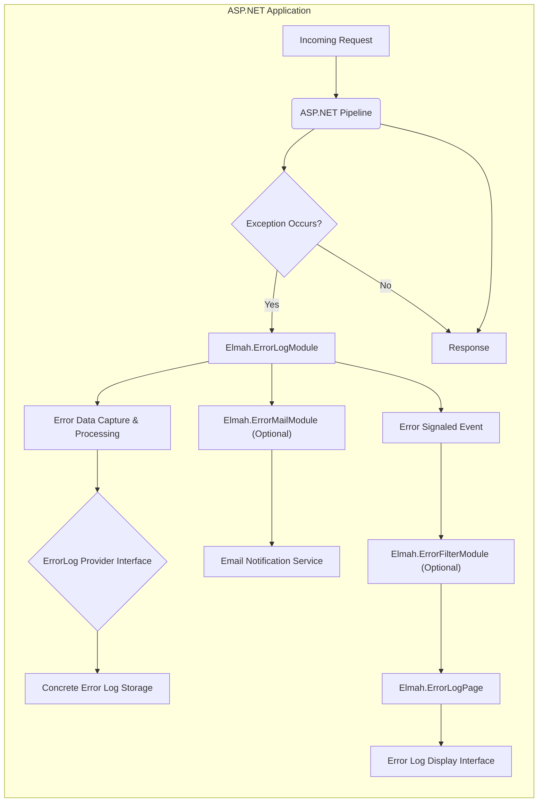
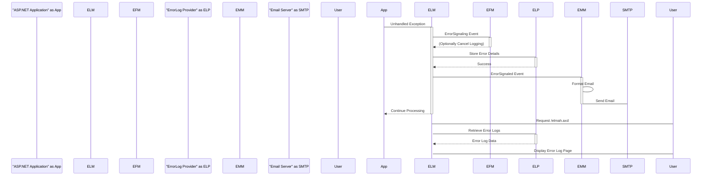
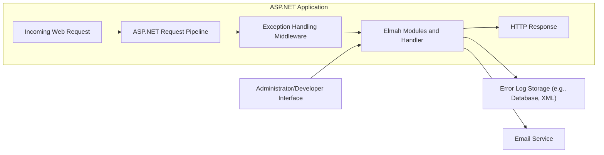
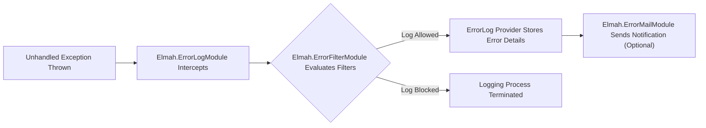

# Project Design Document: Elmah (Error Logging Modules and Handlers)

**Version:** 1.1
**Date:** October 26, 2023
**Author:** AI Software Architect

## 1. Introduction

This document provides an enhanced design overview of Elmah (Error Logging Modules and Handlers), an open-source library for error logging in ASP.NET web applications. This document aims to deliver a clear and comprehensive understanding of Elmah's architecture, components, and data flow, serving as a solid foundation for subsequent threat modeling.

## 2. Goals and Objectives

The core objectives of Elmah are:

*   Automatic capture and logging of unhandled exceptions within ASP.NET applications.
*   Providing a mechanism for manual exception logging by developers.
*   Offering diverse and configurable storage options for error logs.
*   Presenting error logs through a secure and user-friendly web interface.
*   Enabling customization and integration through well-defined extensibility points.

## 3. Architectural Overview

Elmah functions as a collection of HTTP Modules and an HTTP Handler integrated into the ASP.NET request pipeline. Upon encountering an unhandled exception, Elmah intercepts it, records the relevant details, and can optionally notify administrators. The high-level architecture is depicted below:



## 4. Component Details

### 4.1. `Elmah.ErrorLogModule` (HTTP Module)

*   **Responsibility:** Intercepting unhandled exceptions within the ASP.NET application lifecycle.
*   **Functionality:** Hooks into the `HttpApplication.Error` event.
*   **Configuration:** Defined in the `<httpModules>` section of `web.config`.
    ```xml
    <httpModules>
      <add name="ErrorLog" type="Elmah.ErrorLogModule, Elmah"/>
    </httpModules>
    ```
*   **Key Actions:**
    *   Detects unhandled exceptions bubbling up the ASP.NET pipeline.
    *   Extracts comprehensive exception details and HTTP context information.
    *   Delegates error storage to the configured `ErrorLog` provider.
    *   Raises the `ErrorSignaled` event for other modules.

### 4.2. `Elmah.ErrorLogPage` (HTTP Handler)

*   **Responsibility:** Providing a web-based interface for viewing and managing logged errors.
*   **Functionality:** Handles requests to a specific URL (default: `elmah.axd`).
*   **Configuration:** Configured in the `<httpHandlers>` section of `web.config`.
    ```xml
    <httpHandlers>
      <add verb="GET,HEAD,POST" path="elmah.axd" type="Elmah.ErrorLogPage, Elmah" />
    </httpHandlers>
    ```
*   **Key Actions:**
    *   Authenticates and authorizes access based on configuration.
    *   Retrieves error entries from the configured `ErrorLog` provider.
    *   Renders error logs with options for filtering, sorting, and detailed views.

### 4.3. `Elmah.ErrorMailModule` (HTTP Module)

*   **Responsibility:** Sending email notifications when errors are logged.
*   **Functionality:** Listens for the `ErrorSignaled` event.
*   **Configuration:** Configured in the `<httpModules>` section of `web.config` and requires SMTP settings within the `<elmah>` section.
    ```xml
    <elmah>
      <errorMail from="errors@example.com" to="admin@example.com" subject="Application Error"/>
    </elmah>
    ```
*   **Key Actions:**
    *   Subscribes to the `ErrorSignaled` event.
    *   Formats error details into an email message.
    *   Utilizes configured SMTP settings to send notifications.

### 4.4. `Elmah.ErrorFilterModule` (HTTP Module)

*   **Responsibility:** Allowing filtering of errors before they are logged.
*   **Functionality:** Evaluates configured filter rules against exception details.
*   **Configuration:** Defined in the `<httpModules>` section of `web.config` with filter rules in the `<elmah>` section.
    ```xml
    <elmah>
      <errorFilter>
        <test>
          <equal binding="HttpStatusCode" value="404" />
        </test>
      </errorFilter>
    </elmah>
    ```
*   **Key Actions:**
    *   Subscribes to the `ErrorSignaling` event (occurs before `ErrorSignaled`).
    *   Applies configured filter rules to the exception.
    *   Cancels the error logging process if a filter matches.

### 4.5. `ErrorLog` Providers

*   **Responsibility:** Abstracting the storage mechanism for error logs.
*   **Functionality:** Provides interfaces for storing and retrieving error information.
*   **Built-in Implementations:**
    *   `MemoryErrorLog`: Stores errors in application memory (volatile).
    *   `XmlFileErrorLog`: Stores errors in XML files on the file system.
    *   `SqlServerErrorLog`: Stores errors in a Microsoft SQL Server database.
    *   `SqlLiteErrorLog`: Stores errors in an SQLite database.
    *   `OracleErrorLog`: Stores errors in an Oracle database.
    *   `MySqlErrorLog`: Stores errors in a MySQL database.
*   **Configuration:** The active provider is specified in the `<elmah>` section of `web.config`.
    ```xml
    <elmah>
      <errorLog type="Elmah.SqlServerErrorLog, Elmah" connectionStringName="MyConnectionString"/>
    </elmah>
    ```
*   **Key Actions:**
    *   Receives error details from `ErrorLogModule`.
    *   Persists error information to the configured storage.
    *   Retrieves error entries for display in `ErrorLogPage`.

### 4.6. Configuration (`web.config`)

*   **Responsibility:** Centralized configuration of Elmah's behavior.
*   **Functionality:** Uses XML-based configuration within the `web.config` file.
*   **Key Configuration Sections:**
    *   `<configSections>`: Declares the `elmah` configuration section.
    *   `<elmah>`: Contains settings for:
        *   `errorLog`: Specifies the `ErrorLog` provider and its settings.
        *   `security`: Configures access restrictions to `ErrorLogPage`. Example: `<security allowRemoteAccess="0" />`
        *   `errorMail`: Settings for email notifications (sender, recipient, SMTP).
        *   `errorFilter`: Defines rules for filtering errors.

## 5. Data Flow

The sequence of events during an unhandled exception and its logging by Elmah is as follows:

1. An unhandled exception is thrown within the ASP.NET application.
2. The ASP.NET runtime triggers the `HttpApplication.Error` event.
3. The `Elmah.ErrorLogModule` intercepts this event.
4. `ErrorLogModule` gathers detailed information about the exception and the HTTP context.
5. `ErrorLogModule` raises the `ErrorSignaling` event.
6. If configured, `Elmah.ErrorFilterModule` evaluates filter rules and may prevent logging.
7. `ErrorLogModule` invokes the configured `ErrorLog` provider to store the error details.
8. `ErrorLogModule` raises the `ErrorSignaled` event.
9. If configured, `Elmah.ErrorMailModule` sends an email notification.
10. Users can access the `Elmah.ErrorLogPage` to view and manage the stored error logs, which retrieves data from the `ErrorLog` provider.



## 6. Deployment Considerations

*   Elmah is typically integrated into ASP.NET projects using the `Elmah` NuGet package.
*   Configuration is primarily managed through the `web.config` file.
*   Database-backed `ErrorLog` providers require the creation of the necessary database schema. Elmah often provides scripts for this.
*   Securing the `elmah.axd` handler path is crucial in production to prevent unauthorized access.

## 7. Extensibility

Elmah offers several points for customization and extension:

*   **Custom `ErrorLog` Providers:** Developers can create custom providers by implementing the `Elmah.ErrorLog` abstract class, allowing integration with various storage mechanisms.
*   **Custom Error Filters:**  New filter rules can be implemented by creating classes that implement the `Elmah.IErrorFilter` interface, providing fine-grained control over which errors are logged.
*   **Custom Error Presentation:** While the default `ErrorLogPage` is functional, developers can create custom user interfaces by interacting directly with the `ErrorLog` provider.

## 8. Security Considerations

This section outlines key security considerations for Elmah deployments:

*   **Information Disclosure:** Error logs can contain sensitive data.
    *   **Mitigation:** Restrict access to `elmah.axd` using authentication and authorization (e.g., `<authorization>` rules in `web.config`). Ensure `allowRemoteAccess` is set to `0` in production. Secure the underlying storage mechanism.
*   **Unauthorized Access to Error Logs:**  Unprotected access to `elmah.axd` can expose sensitive information.
    *   **Mitigation:** Implement strong authentication (e.g., Forms Authentication, Windows Authentication) and authorization rules for the `elmah.axd` path.
*   **Denial of Service (DoS):**  Repeated requests to `elmah.axd` or excessive logging could strain resources.
    *   **Mitigation:** Implement rate limiting on access to `elmah.axd`. Consider configuring filters to prevent logging of non-critical or repetitive errors.
*   **Cross-Site Scripting (XSS):** If error details are not properly encoded when displayed on the `ErrorLogPage`, they could be vulnerable to XSS.
    *   **Mitigation:** Elmah generally encodes output, but ensure any custom extensions or modifications adhere to secure coding practices. Regularly update Elmah to benefit from security patches.
*   **Data Integrity:** Unauthorized modification or deletion of error logs could hinder debugging and auditing.
    *   **Mitigation:**  Secure the underlying storage mechanism with appropriate permissions. For database-backed providers, use database roles and permissions.
*   **Email Security:** Email notifications might expose sensitive information if not handled securely.
    *   **Mitigation:** Use secure SMTP connections (TLS/SSL). Avoid including highly sensitive information directly in email bodies.
*   **Path Traversal (for `XmlFileErrorLog`):** If the log path is not carefully managed, attackers might be able to write or read files outside the intended directory.
    *   **Mitigation:** Ensure the log path is fixed and not influenced by user input. Use appropriate file system permissions.

## 9. Error Handling within Elmah

Elmah itself includes some basic error handling. For instance, if the configured `ErrorLog` provider fails to store an error, Elmah will attempt to log this internal error to the ASP.NET event log. However, robust error handling within Elmah's own modules is limited to prevent infinite loops and cascading failures. Developers should ensure their custom extensions include appropriate error handling.

## 10. Diagrams

### 10.1. High-Level Architecture



### 10.2. Detailed Error Logging Process Flow



## 11. Conclusion

This enhanced design document provides a comprehensive understanding of Elmah's architecture and functionality. By detailing its components, data flow, extensibility points, and security considerations, this document serves as a valuable resource for development, deployment, and crucially, for informed threat modeling activities.
