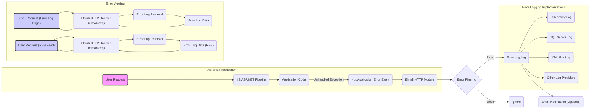

# Project Design Document: Elmah (Error Logging Modules and Handlers)

**Version:** 1.1
**Date:** October 26, 2023
**Author:** AI Software Architect

## 1. Introduction

This document provides a detailed design overview of the Elmah (Error Logging Modules and Handlers) project. It aims to capture the key architectural components, data flow, and deployment considerations necessary for understanding the system and subsequently performing a thorough threat model. This document will serve as the foundation for identifying potential security vulnerabilities and designing appropriate mitigations.

### 1.1. Purpose

The primary purpose of this document is to provide a comprehensive design description of Elmah for use in threat modeling activities. It outlines the system's architecture, components, and interactions to facilitate the identification of potential security risks.

### 1.2. Scope

This document covers the core functionality of Elmah as a library integrated into ASP.NET applications. It focuses on the error capture, logging, and viewing aspects of the system. Specific implementations of error loggers (e.g., SQL Server, XML file) are discussed at a high level, with details deferred to specific implementation documentation.

### 1.3. Target Audience

This document is intended for:

*   Security engineers and architects responsible for threat modeling and security assessments.
*   Developers working on or integrating with Elmah.
*   Operations teams responsible for deploying and maintaining applications using Elmah.

### 1.4. Assumptions and Constraints

*   It is assumed that Elmah is integrated into a standard ASP.NET web application running on IIS.
*   Configuration is primarily done through the `web.config` file.
*   The focus is on the core Elmah library and its built-in providers. Custom providers are considered out of scope for this initial design document.

## 2. System Overview

Elmah is an application-wide error logging facility that is pluggable. It can be dynamically added to running ASP.NET web applications, and even to ASP.NET applications compiled with the retail deployment option of Visual Studio .NET. Once Elmah has been dropped into a running web application and enabled, you gain the following capabilities without modifying application code:

*   Automatic logging of unhandled exceptions.
*   A web page for remote viewing of the complete error log.
*   An RSS feed providing the latest 15 errors.
*   Optional email notification for each error occurrence.

Elmah functions by intercepting unhandled exceptions within the ASP.NET pipeline through its `HttpModule`. It also provides `HttpHandler` implementations to present the error log via a web interface and an RSS feed.

## 3. Architectural Design

The following diagram illustrates the high-level architecture of Elmah:

### 3.1. Key Components

*   **HTTP Module (`Elmah.ErrorLogModule`):** This is the central component that subscribes to the ASP.NET pipeline's `HttpApplication.Error` event. Upon an unhandled exception, this module captures the exception details.
*   **Error Filtering:** Elmah allows for the configuration of filters to exclude specific errors based on type, source, or other criteria. This configuration is typically managed within the `web.config` file.
*   **Error Logging (`Elmah.ErrorLog` abstract class and implementations):** This component handles the persistence of error information. Elmah provides several built-in implementations:
    *   `MemoryErrorLog`: Stores errors in the application's memory, making them volatile.
    *   `SqlErrorLog`: Persists errors in a SQL Server database. Requires a database connection string.
    *   `XmlFileErrorLog`: Saves errors to an XML file on the server's file system. Requires a file path.
    *   Developers can create custom logging providers by implementing the `Elmah.ErrorLog` abstract class.
*   **HTTP Handlers (`Elmah.ErrorLogPage` and `Elmah.ErrorRssHandler`):** These components serve the error log data through web interfaces:
    *   `Elmah.ErrorLogPage`: Renders the full error log in an HTML format when accessed via the `elmah.axd` endpoint.
    *   `Elmah.ErrorRssHandler`: Generates an RSS feed of recent errors, also accessible through the `elmah.axd` endpoint with specific parameters.
*   **Configuration:** Elmah's behavior is primarily configured through the `<elmah>` section in the `web.config` file. This includes settings for error filtering, the chosen error log provider, and other options.
*   **Email Notification (`Elmah.ErrorMailModule`):** An optional module that, when configured, sends email notifications containing error details upon their occurrence. Requires SMTP settings in the `web.config`.

### 3.2. Data Flow

1. **User Request and Exception:** A user request enters the ASP.NET application, and during processing, an unhandled exception occurs within the application code.
2. **`HttpApplication.Error` Event Triggered:** The ASP.NET pipeline raises the `HttpApplication.Error` event, signaling the unhandled exception.
3. **`Elmah.ErrorLogModule` Interception:** The registered `Elmah.ErrorLogModule` intercepts this event, gaining access to the exception details.
4. **Error Filtering Evaluation:** The module applies the configured error filters. If the error matches a filter rule to be ignored, the process stops.
5. **Error Logging via Provider:** If the error passes the filters, the module utilizes the configured `ErrorLog` implementation (e.g., `SqlErrorLog`, `XmlFileErrorLog`) to persist the error details. This includes:
    *   Timestamp of the error.
    *   User information (if available).
    *   HTTP context details (request URL, headers, etc.).
    *   Full exception details (type, message, stack trace).
6. **Optional Email Notification:** If the `ErrorMailModule` is configured, it sends an email containing the error details to the specified recipients.
7. **Error Log Viewing (Web Interface):**
    *   An authenticated (ideally) user requests the `elmah.axd` endpoint in their web browser.
    *   IIS routes this request to the `Elmah.ErrorLogPage` HTTP handler.
    *   The handler retrieves error data from the configured `ErrorLog` implementation.
    *   The handler formats the retrieved error data into an HTML page and sends it back to the user's browser.
8. **Error Log Viewing (RSS Feed):**
    *   A user or an application requests the `elmah.axd` endpoint with specific query parameters indicating a request for the RSS feed.
    *   IIS routes this request to the `Elmah.ErrorRssHandler` HTTP handler.
    *   The handler retrieves the latest error entries from the configured `ErrorLog`.
    *   The handler generates an RSS feed containing the error details and sends it to the requester.

## 4. Security Considerations (Detailed for Threat Modeling)

This section expands on potential security vulnerabilities and threats associated with Elmah.

*   **Exposure of Sensitive Information in Error Logs:**
    *   **Threat:** Unauthorized access to error logs could reveal sensitive data.
    *   **Vulnerability:** Error logs often contain detailed exception messages, request parameters (including potentially sensitive data like passwords or API keys), server paths, and internal application details.
    *   **Examples:**
        *   A SQL injection vulnerability might be evident in the error log due to a failed database query containing malicious input.
        *   Credentials passed in a URL might be logged.
        *   Internal file paths could be exposed, aiding attackers in reconnaissance.
*   **Unauthorized Access to `elmah.axd` Endpoint:**
    *   **Threat:** Attackers could gain access to the error logs, leading to information disclosure.
    *   **Vulnerability:** If the `elmah.axd` endpoint is not properly secured with authentication and authorization, it can be accessed by anyone.
    *   **Examples:**
        *   Anonymous users browsing to `elmah.axd` and viewing all error details.
        *   Automated scripts scraping error logs for sensitive information.
*   **Information Disclosure via RSS Feed:**
    *   **Threat:** Recent errors could be exposed to unauthorized parties.
    *   **Vulnerability:** If the RSS feed is publicly accessible, even without direct access to `elmah.axd`, recent error details are exposed.
    *   **Examples:**
        *   Search engines indexing the RSS feed.
        *   Attackers monitoring the feed for newly discovered vulnerabilities or sensitive information.
*   **Denial of Service (DoS) Attacks:**
    *   **Threat:** Attackers could flood the error logging mechanism or the `elmah.axd` endpoint, impacting application performance or availability.
    *   **Vulnerabilities:**
        *   Triggering numerous artificial errors to fill up the error log storage (especially if using a limited storage like `MemoryErrorLog`).
        *   Repeatedly requesting the `elmah.axd` endpoint to consume server resources.
    *   **Examples:**
        *   A botnet sending requests that intentionally cause exceptions.
        *   An attacker repeatedly refreshing the `elmah.axd` page.
*   **Injection Vulnerabilities in Error Logging:**
    *   **Threat:** Malicious data within error messages could lead to vulnerabilities when the logs are viewed.
    *   **Vulnerability:** If error data (especially exception messages or request parameters containing user input) is not properly sanitized or encoded before being stored or displayed, it could lead to:
        *   **Cross-Site Scripting (XSS):** Malicious JavaScript injected into error messages could execute in the browser of someone viewing the error log.
        *   **Log Injection:** Attackers might manipulate error messages to inject false log entries or overwrite existing ones.
    *   **Examples:**
        *   An error message containing `` being displayed on the `elmah.axd` page.
        *   Manipulating input to create log entries that hide malicious activity.
*   **Configuration Security:**
    *   **Threat:** Compromise of the `web.config` file could expose sensitive Elmah configuration.
    *   **Vulnerability:** The `web.config` file contains sensitive information like database connection strings for `SqlErrorLog` or SMTP credentials for email notifications.
    *   **Examples:**
        *   An attacker gaining access to the `web.config` file and obtaining database credentials.
        *   Modifying the `web.config` to redirect error logs to a malicious server.
*   **Path Traversal Vulnerability (XML File Logging):**
    *   **Threat:** Attackers could potentially write error logs to arbitrary locations on the server.
    *   **Vulnerability:** If the path for `XmlFileErrorLog` is not properly validated or if there are vulnerabilities in how the path is handled, attackers might be able to write files outside the intended directory.
    *   **Example:**  Configuring a path like `..\..\malicious.xml`.
*   **Dependency Vulnerabilities:**
    *   **Threat:** Vulnerabilities in Elmah's dependencies could be exploited.
    *   **Vulnerability:** Elmah relies on the .NET framework and potentially other NuGet packages. Vulnerabilities in these dependencies could indirectly affect Elmah's security.
    *   **Example:** A vulnerability in a logging library used internally by Elmah.

## 5. Deployment Considerations (Security Focused)

*   **Restrict Access to `elmah.axd`:**
    *   **Recommendation:** Implement strong authentication and authorization for the `elmah.axd` endpoint. This can be achieved using ASP.NET's built-in authorization features, such as requiring specific roles or authenticated users.
    *   **Implementation:** Configure `<authorization>` rules within the `<system.web>` section of the `web.config`.
*   **Secure Storage of Error Logs:**
    *   **Recommendation:** Choose the error log implementation carefully based on security requirements.
        *   For `SqlErrorLog`, ensure the database connection string is stored securely (e.g., using Azure Key Vault or Windows Credential Manager) and the database server is properly secured. Use least privilege for the database user.
        *   For `XmlFileErrorLog`, ensure the directory where logs are stored has appropriate file system permissions, restricting access to only the necessary accounts. Avoid storing logs in publicly accessible directories.
    *   **Implementation:** Configure connection strings and file paths carefully in the `web.config` and manage access control lists on the file system or database.
*   **HTTPS Enforcement:**
    *   **Recommendation:** Ensure the entire application, including the `elmah.axd` endpoint, is served over HTTPS to protect sensitive information transmitted in error details.
    *   **Implementation:** Configure HTTPS bindings in IIS and enforce HTTPS redirection.
*   **Input Validation and Output Encoding:**
    *   **Recommendation:** While Elmah primarily logs exceptions, ensure that any user-provided data that might end up in error messages is properly validated and that error details are encoded before being displayed on the `elmah.axd` page to prevent XSS.
    *   **Implementation:** Implement input validation in the application code and use appropriate encoding techniques (e.g., HTML encoding) when rendering error details.
*   **Regular Security Audits and Updates:**
    *   **Recommendation:** Regularly review Elmah's configuration and access controls. Keep Elmah and its dependencies updated to patch any known vulnerabilities.
    *   **Implementation:** Include Elmah in regular security scanning and vulnerability management processes.
*   **Consider Disabling RSS Feed if Not Needed:**
    *   **Recommendation:** If the RSS feed functionality is not required, consider disabling it to reduce the attack surface.
    *   **Implementation:** Remove or comment out the `Elmah.ErrorRssHandler` registration in the `web.config`.
*   **Rate Limiting and Throttling:**
    *   **Recommendation:** Implement rate limiting or throttling on the `elmah.axd` endpoint to mitigate potential DoS attacks.
    *   **Implementation:** This can be done using IIS features or middleware components.
*   **Secure Email Configuration (if enabled):**
    *   **Recommendation:** If email notifications are enabled, ensure the SMTP server connection is secure (e.g., using TLS) and that credentials are managed securely.
    *   **Implementation:** Configure SMTP settings carefully in the `web.config` and consider using an authenticated SMTP service.

## 6. Future Considerations (Potential Extensions and Security Impacts)

*   **Integration with Centralized Logging Systems:** Integrating with systems like Azure Monitor or ELK stack could improve log management and analysis but introduces new security considerations related to those platforms.
*   **Advanced Filtering and Redaction:** Implementing more sophisticated filtering and data redaction capabilities could help prevent the logging of sensitive information.
*   **API Access to Error Logs:** Providing an API for accessing error logs could be useful but requires careful consideration of authentication and authorization.
*   **Security Hardening Options:**  Exploring options for further hardening Elmah itself against potential vulnerabilities.

## 7. Conclusion

This document provides an enhanced design overview of the Elmah project, with a strong focus on security considerations relevant for threat modeling. By understanding the architecture, data flow, and potential vulnerabilities, along with implementing the recommended security measures during deployment, organizations can effectively leverage Elmah for error logging while minimizing security risks. This document serves as a valuable resource for security assessments and the development of appropriate security controls.