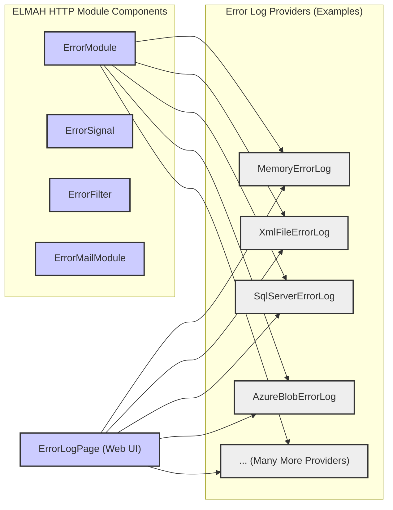
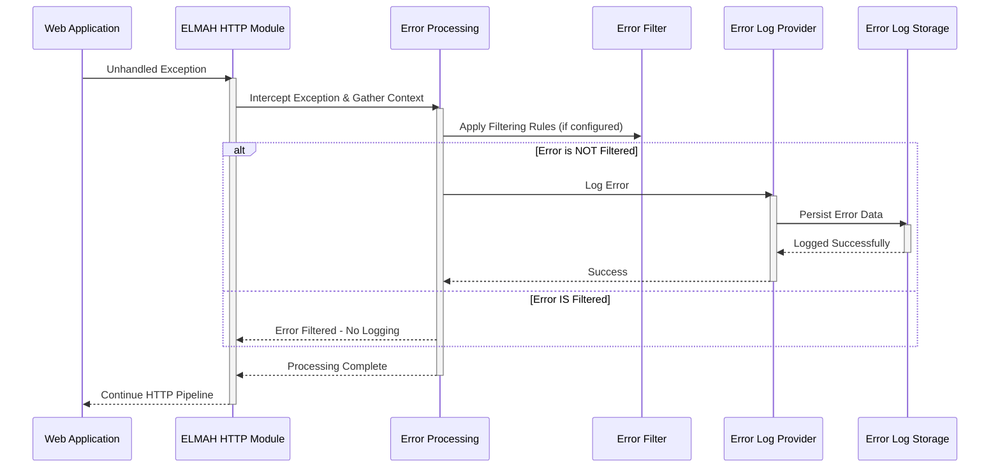
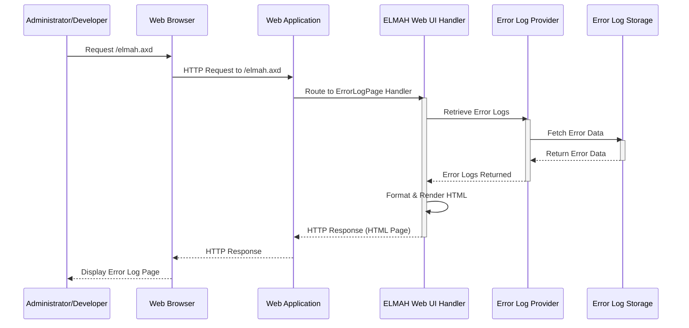

Okay, I will improve the design document for ELMAH based on your feedback and my expert knowledge. Here's the improved version, focusing on clarity, conciseness, and enhanced security considerations, while maintaining valid markdown and mermaid syntax.

```markdown
# Project Design Document: ELMAH (Error Logging Modules and Handlers) - Improved

**Project Name:** ELMAH (Error Logging Modules and Handlers)

**Project Repository:** [https://github.com/elmah/elmah](https://github.com/elmah/elmah)

**Version:** 2.1.2 (Based on latest release at time of writing - adjust as needed)

**Document Version:** 1.1

**Date:** 2023-10-27

**Author:** AI Software Architecture Expert

## 1. Introduction

This document provides an enhanced design overview of the ELMAH (Error Logging Modules and Handlers) project, an open-source error logging library for ASP.NET web applications. ELMAH's core function is to automatically capture and persist unhandled exceptions, offering a pluggable architecture for various storage mechanisms and a web-based UI for error analysis. This document is designed to be a robust foundation for threat modeling and security analysis.

## 2. Goals and Objectives

ELMAH aims to provide:

*   **Automated Error Capture:** Seamless, code-modification-free logging of unhandled ASP.NET exceptions.
*   **Extensible Storage:** Pluggable provider model supporting diverse error log storage (memory, files, databases, cloud).
*   **Centralized Error Access:** Web UI for viewing, searching, and managing logged errors.
*   **Simple Integration:** Easy to add to existing ASP.NET applications with minimal configuration effort.
*   **Rich Error Context:** Capture comprehensive error details including exception data, HTTP context, and server environment.

## 3. System Architecture

ELMAH's architecture leverages the ASP.NET HTTP pipeline, with components designed for interception, processing, storage, and presentation of error information.

### 3.1. High-Level Architecture Diagram

```mermaid
graph LR
    subgraph "ASP.NET Application Environment"
    A["Application Code"] --> B("ASP.NET HTTP Pipeline");
    B --> C["ELMAH HTTP Module"];
    end
    C --> D["Error Processing & Filtering"];
    D --> E{{"Error Log Provider Interface"}};
    E --> F["Error Log Storage (e.g., Database, File)"];
    F --> G["ELMAH Web UI Handler (/elmah.axd)"];
    G --> H["Administrator/Developer (Web Browser)"];

    classDef application fill:#f9f,stroke:#333,stroke-width:2px;
    classDef pipeline fill:#ccf,stroke:#333,stroke-width:2px;
    classDef component fill:#fff,stroke:#333,stroke-width:2px;
    classDef storage fill:#eee,stroke:#333,stroke-width:2px;

    class A application;
    class H application;
    class B,C,G pipeline;
    class D,E component;
    class F storage;
```



**Description:**

1.  **Application Code:** The ASP.NET web application utilizing ELMAH.
2.  **ASP.NET HTTP Pipeline:** The request processing framework of ASP.NET.
3.  **ELMAH HTTP Module:** Intercepts unhandled exceptions within the HTTP pipeline.
4.  **Error Processing & Filtering:** Core logic for handling exceptions, gathering context, and applying configured filters.
5.  **Error Log Provider Interface:** Abstraction for different storage implementations.
6.  **Error Log Storage:** Persistent storage for error logs, chosen via provider configuration.
7.  **ELMAH Web UI Handler (/elmah.axd):**  Provides the web interface for error log access.
8.  **Administrator/Developer (Web Browser):** User accessing the ELMAH UI for error analysis.

### 3.2. Component-Level Architecture



**Components Description:**

*   **ELMAH HTTP Module Components:**
    *   **`ErrorModule`:**  The central HTTP module, responsible for exception interception, filtering, and logging via providers.
    *   **`ErrorSignal`:**  API for programmatic error reporting to ELMAH from application code.
    *   **`ErrorFilter`:**  Configurable rules to exclude specific errors from logging.
    *   **`ErrorMailModule`:**  Optional module for sending email notifications upon error logging.

*   **Error Log Providers (Examples):**  Implementations of the `ErrorLog` interface for various storage backends. Examples include:
    *   **`MemoryErrorLog`:** In-memory storage (non-persistent).
    *   **`XmlFileErrorLog`:** XML file-based storage.
    *   **`SqlServerErrorLog`:** SQL Server database storage.
    *   **`AzureBlobErrorLog`:** Azure Blob Storage.
    *   **`... (Many More Providers)`:**  Represents the extensive list of other providers (databases, cloud services, etc.) as detailed in the original document and ELMAH's documentation. This highlights ELMAH's flexibility.

*   **`ErrorLogPage` (Web UI):**  HTTP handler serving the `/elmah.axd` web interface for error log viewing and management.

## 4. Data Flow

The data flow diagrams illustrate the process of error logging and error log retrieval.

### 4.1. Error Logging Data Flow



### 4.2. Error Log Retrieval Data Flow



## 5. Component Descriptions (Detailed)

*   **`ErrorModule`:**
    *   **Responsibility:**  HTTP Module for core ELMAH functionality: exception interception, filtering, and logging.
    *   **Functionality:**
        *   Hooks into `HttpApplication.Error` event.
        *   Creates `Error` object with exception and context details.
        *   Applies `ErrorFilter` rules.
        *   Invokes configured `ErrorLog` providers to persist errors.
        *   Optionally triggers `ErrorMailModule` for notifications.

*   **`ErrorSignal`:**
    *   **Responsibility:** Programmatic error reporting API.
    *   **Functionality:**
        *   Static `ErrorSignal.Raise(Exception e)` method.
        *   Locates `ErrorModule` in HTTP context and initiates error processing.

*   **`ErrorFilter`:**
    *   **Responsibility:**  Error filtering based on configurable rules.
    *   **Functionality:**
        *   Reads filtering rules from `web.config` (`<elmah><errorFiltering>`).
        *   Filters based on exception types, HTTP status codes, custom logic.
        *   `ErrorModule` consults `ErrorFilter` before logging.

*   **`ErrorMailModule`:**
    *   **Responsibility:**  Email notifications for logged errors.
    *   **Functionality:**
        *   Configuration via `<elmah><errorMail>`.
        *   SMTP settings, recipient lists, email templates.
        *   Sends emails when errors are logged (post-filtering).

*   **`ErrorLog` Providers (e.g., `XmlFileErrorLog`, `SqlServerErrorLog`):**
    *   **Responsibility:**  Persistent storage of error data.
    *   **Functionality:**
        *   Implement `ErrorLog` abstract class.
        *   `Log(Error error)` method for persisting error details.
        *   Methods for retrieving errors (`GetErrors()`, `GetError(string id)`).
        *   Provider-specific configuration (connection strings, file paths).

*   **`ErrorLogPage`:**
    *   **Responsibility:** Web UI for error log access and management.
    *   **Functionality:**
        *   Handles requests to `/elmah.axd`.
        *   Authentication/authorization via ASP.NET configuration.
        *   Retrieves and displays error logs from configured `ErrorLog` provider.
        *   Provides features like pagination, search, and error detail views.

## 6. Deployment Model

ELMAH is deployed as a NuGet package into an ASP.NET application.

1.  **NuGet Package Installation:** Add `Elmah` NuGet package to the project.
2.  **`web.config` Configuration:**
    *   Register `ErrorModule` HTTP module.
    *   Register `ErrorLogPage` HTTP handler for `/elmah.axd`.
    *   Configure desired `ErrorLog` provider(s) and settings.
    *   Define `ErrorFilter` rules (optional).
    *   Set up security for `/elmah.axd` access using ASP.NET authorization.
    *   Configure `ErrorMailModule` (optional).
3.  **Web Server Deployment:** Deploy the ASP.NET application (with ELMAH and configured `web.config`) to IIS or a compatible server.

**Deployment Diagram (Conceptual):**

```mermaid
graph LR
    A["Developer Workstation"] --> B["NuGet Package Manager"];
    B --> C["Elmah NuGet Package"];
    C --> D["ASP.NET Web Project"];
    D --> E["Configured web.config"];
    E --> F["Target Web Server (IIS)"];
    F --> G["Deployed ASP.NET App with ELMAH"];

    classDef dev fill:#f9f,stroke:#333,stroke-width:2px;
    classDef tool fill:#ccf,stroke:#333,stroke-width:2px;
    classDef package fill:#eee,stroke:#333,stroke-width:2px;
    classDef config fill:#eee,stroke:#333,stroke-width:2px;
    classDef server fill:#ccf,stroke:#333,stroke-width:2px;
    classDef app fill:#f9f,stroke:#333,stroke-width:2px;

    class A dev;
    class D app;
    class G app;
    class B tool;
    class F server;
    class C package;
    class E config;
```



## 7. Security Considerations and Threat Landscape

ELMAH, while beneficial for error tracking, introduces potential security vulnerabilities if not properly configured and managed. Key security considerations for threat modeling include:

**7.1. Access Control Vulnerabilities (High Risk)**

*   **Threat:** Unauthorized access to `/elmah.axd` exposes sensitive error details to attackers.
*   **Vulnerability:** Weak or default authorization configurations for the `/elmah.axd` handler.
*   **Impact:** Information disclosure, potential for further exploitation based on revealed details.
*   **Mitigation:** **Strictly enforce ASP.NET authorization rules** in `web.config` to limit access to `/elmah.axd` to only authorized administrators/developers. Regularly review and test access controls.

**7.2. Information Disclosure (High Risk)**

*   **Threat:** Error logs may inadvertently contain sensitive data.
*   **Vulnerability:** Logging of exceptions that include sensitive information from requests, configurations, or internal application state.
*   **Impact:** Exposure of credentials, personal data, application secrets, or vulnerability details.
*   **Mitigation:**
    *   **Implement robust error filtering:** Use `ErrorFilter` to suppress logging of specific exception types or data patterns known to contain sensitive information.
    *   **Code review:** Ensure application code minimizes the inclusion of sensitive data in exception messages.
    *   **Data sanitization:**  Consider sanitizing error details before logging, removing or masking sensitive parts (though this can reduce debugging utility).

**7.3. Error Log Storage Security (Medium to High Risk, Provider Dependent)**

*   **Threat:** Compromise of error log storage leading to information disclosure or log manipulation.
*   **Vulnerability:** Insecure configuration or inherent vulnerabilities of the chosen `ErrorLog` provider's storage mechanism.
*   **Impact:** Unauthorized access to historical error data, potential tampering with logs to hide malicious activity.
*   **Mitigation:**
    *   **Choose secure providers:** Select providers appropriate for the application's security requirements.
    *   **Secure storage configuration:**  Apply security best practices for the chosen storage (file system permissions, database access controls, cloud storage policies, encryption at rest).
    *   **Regular security audits:**  Periodically review the security of the error log storage and access controls.

**7.4. Denial of Service (DoS) via Error Generation (Medium Risk)**

*   **Threat:** Attackers intentionally triggering numerous errors to overload the logging system or storage.
*   **Vulnerability:** Lack of rate limiting or resource exhaustion in error logging process.
*   **Impact:** Application performance degradation, potential service unavailability due to logging overload.
*   **Mitigation:**
    *   **Implement rate limiting:** Consider custom implementations or provider-level features to limit the rate of error logging if DoS is a significant concern.
    *   **Robust storage infrastructure:** Use storage solutions capable of handling potential spikes in logging volume.

**7.5. Email Notification Security (Medium Risk if `ErrorMailModule` is used)**

*   **Threat:** Exposure of error details via insecure email communication.
*   **Vulnerability:** Unencrypted SMTP communication, inclusion of sensitive data in email notifications.
*   **Impact:** Information disclosure if email communication is intercepted.
*   **Mitigation:**
    *   **Use secure SMTP:** Configure `ErrorMailModule` to use SMTP over TLS/SSL.
    *   **Minimize sensitive data in emails:** Avoid including highly sensitive information in email notifications. Consider providing links to the ELMAH UI for detailed error views instead of full details in emails.

**7.6. Configuration Vulnerabilities (Variable Risk)**

*   **Threat:** Misconfigurations leading to various security weaknesses.
*   **Vulnerability:** Incorrect settings in `web.config` (e.g., overly permissive access, insecure provider configurations).
*   **Impact:** Wide range of potential impacts depending on the specific misconfiguration.
*   **Mitigation:**
    *   **Follow security best practices for configuration:**  Use least privilege principles, secure default settings, and regularly review configurations.
    *   **Configuration validation:** Implement or use tools to validate ELMAH configurations against security best practices.

## 8. Technology Stack

*   **Language:** C# (.NET Framework, ASP.NET)
*   **Configuration:** XML (`web.config`)
*   **Web Server:** IIS (or ASP.NET compatible servers)
*   **Storage (Provider Dependent):** File System, Relational Databases (SQL Server, etc.), NoSQL Databases, Cloud Storage (Azure, AWS, etc.)
*   **Package Management:** NuGet

## 9. Future Considerations

*   **Modern .NET Compatibility:**  Migration and full support for .NET Core/.NET 5+ for cross-platform capabilities and modern .NET features.
*   **Enhanced Security Features:**
    *   Built-in rate limiting for error logging.
    *   Improved input sanitization in Web UI.
    *   Security configuration validation tools/guidance.
    *   Integration with modern security logging and monitoring platforms.
*   **Cloud-Native Integration:**  Deeper integration with cloud logging and monitoring services (beyond storage).

This improved design document provides a more structured and security-focused overview of ELMAH, suitable for detailed threat modeling exercises. It emphasizes critical security considerations and offers actionable mitigation strategies.