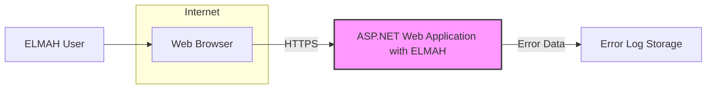
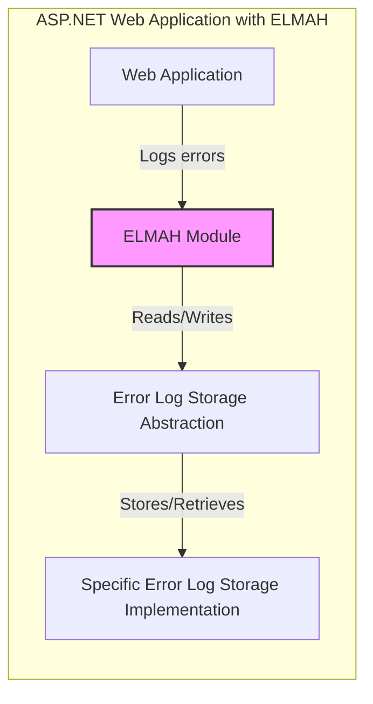
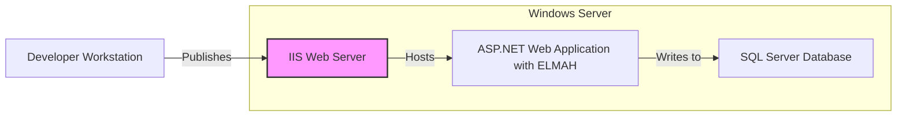
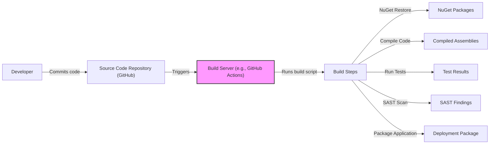

# BUSINESS POSTURE

Business Priorities and Goals:

*   Provide a simple, easily deployable error logging and monitoring solution for ASP.NET web applications.
*   Minimize the overhead and complexity of integrating error logging into existing applications.
*   Offer a user-friendly interface for viewing and managing logged errors.
*   Support various storage options for error logs.
*   Be an open-source project, fostering community contributions and transparency.

Most Important Business Risks:

*   Data breaches: Unauthorized access to sensitive error data, potentially exposing vulnerabilities or confidential information.
*   Data loss: Loss of error logs due to storage failures or misconfiguration.
*   Performance degradation: Excessive overhead from the error logging process impacting application performance.
*   Integration issues: Compatibility problems with different ASP.NET versions or configurations.
*   Lack of adoption: Insufficient community interest or usage, hindering project sustainability.

# SECURITY POSTURE

Existing Security Controls:

*   security control: Error filtering: ELMAH provides mechanisms to filter sensitive data from error logs (e.g., passwords, connection strings). Described in documentation and configuration examples.
*   security control: Access control: ELMAH's web interface can be secured using ASP.NET's built-in authentication and authorization mechanisms (e.g., Forms Authentication, Windows Authentication). Described in documentation.
*   security control: Request validation: ASP.NET's built-in request validation helps prevent common web attacks like cross-site scripting (XSS). Enabled by default in ASP.NET.
*   security control: Exception handling: ELMAH itself handles exceptions gracefully to prevent its own failure from crashing the application. Implemented in the codebase.

Accepted Risks:

*   accepted risk: Limited protection against sophisticated attacks: ELMAH primarily focuses on error logging, not comprehensive security. It relies on the underlying ASP.NET framework and application-level security measures for robust protection.
*   accepted risk: Potential for data exposure if misconfigured: If access control is not properly configured, the ELMAH interface and error logs could be exposed to unauthorized users.
*   accepted risk: Dependence on underlying storage security: The security of error logs ultimately depends on the security of the chosen storage mechanism (e.g., database, file system).

Recommended Security Controls:

*   security control: Implement robust input validation: Ensure that all user inputs to the ELMAH interface are properly validated to prevent injection attacks.
*   security control: Use HTTPS: Enforce HTTPS for all communication with the ELMAH interface to protect data in transit.
*   security control: Regularly update dependencies: Keep ELMAH and its dependencies up to date to patch security vulnerabilities.
*   security control: Implement auditing: Log all access and actions performed within the ELMAH interface.
*   security control: Consider using a Web Application Firewall (WAF): A WAF can provide an additional layer of protection against web-based attacks.

Security Requirements:

*   Authentication:
    *   The ELMAH interface must be protected by authentication to prevent unauthorized access.
    *   Support for standard ASP.NET authentication mechanisms (Forms Authentication, Windows Authentication, etc.) should be maintained.
    *   Consider supporting multi-factor authentication for enhanced security.

*   Authorization:
    *   The ELMAH interface must implement authorization to restrict access to specific error logs or features based on user roles.
    *   Granular access control should be considered to allow fine-grained permissions.

*   Input Validation:
    *   All user inputs to the ELMAH interface must be strictly validated to prevent injection attacks (e.g., SQL injection, cross-site scripting).
    *   Use a whitelist approach to input validation whenever possible.

*   Cryptography:
    *   Sensitive data stored in error logs (if any) should be encrypted at rest.
    *   HTTPS should be enforced for all communication with the ELMAH interface to protect data in transit.
    *   Use strong, industry-standard cryptographic algorithms.

*   Data Protection
    *   Implement data loss prevention mechanisms.
    *   Regularly backup error logs.

# DESIGN

## C4 CONTEXT

C4 Context Element List:

*   Element: Web Browser
    *   Name: Web Browser
    *   Type: User Interface
    *   Description: A standard web browser used to access the ASP.NET web application and the ELMAH interface.
    *   Responsibilities:
        *   Displaying web pages.
        *   Sending user requests to the server.
        *   Rendering HTML, CSS, and JavaScript.
    *   Security controls:
        *   HTTPS for secure communication.
        *   Browser security settings (e.g., cookie management, script blocking).

*   Element: ELMAH User
    *   Name: ELMAH User
    *   Type: User
    *   Description: A user (developer, administrator, etc.) who interacts with the ELMAH interface to view and manage error logs.
    *   Responsibilities:
        *   Viewing error details.
        *   Managing error logs (e.g., deleting, filtering).
        *   Configuring ELMAH settings (if authorized).
    *   Security controls:
        *   Authentication and authorization through ASP.NET security mechanisms.

*   Element: ASP.NET Web Application with ELMAH
    *   Name: ASP.NET Web Application with ELMAH
    *   Type: System
    *   Description: The ASP.NET web application that has integrated ELMAH for error logging.
    *   Responsibilities:
        *   Handling user requests.
        *   Performing application logic.
        *   Logging errors to ELMAH.
        *   Serving the ELMAH interface.
    *   Security controls:
        *   ASP.NET request validation.
        *   Authentication and authorization for the ELMAH interface.
        *   Error filtering to prevent sensitive data leakage.
        *   Secure coding practices within the application.

*   Element: Error Log Storage
    *   Name: Error Log Storage
    *   Type: Data Store
    *   Description: The storage mechanism used by ELMAH to persist error logs (e.g., SQL Server database, XML files, in-memory storage).
    *   Responsibilities:
        *   Storing error data.
        *   Providing access to error data for retrieval.
    *   Security controls:
        *   Access control to the storage mechanism (e.g., database credentials, file system permissions).
        *   Encryption of data at rest (if applicable).
        *   Regular backups and disaster recovery procedures.

## C4 CONTAINER

C4 Container Element List:

*   Element: Web Application
    *   Name: Web Application
    *   Type: Container
    *   Description: The main ASP.NET web application code.
    *   Responsibilities:
        *   Handling user requests.
        *   Executing business logic.
        *   Interacting with other systems and services.
        *   Generating errors that need to be logged.
    *   Security controls:
        *   Input validation.
        *   Output encoding.
        *   Authentication and authorization.
        *   Secure coding practices.

*   Element: ELMAH Module
    *   Name: ELMAH Module
    *   Type: Container
    *   Description: The core ELMAH component that intercepts and handles unhandled exceptions.
    *   Responsibilities:
        *   Capturing error details.
        *   Filtering sensitive data.
        *   Formatting error information.
        *   Passing error data to the storage abstraction.
        *   Providing the web interface for viewing errors.
    *   Security controls:
        *   Error filtering.
        *   Exception handling within the module itself.

*   Element: Error Log Storage Abstraction
    *   Name: Error Log Storage Abstraction
    *   Type: Container
    *   Description: An abstract layer that defines the interface for interacting with different error log storage mechanisms.
    *   Responsibilities:
        *   Providing a consistent API for storing and retrieving error data.
        *   Hiding the implementation details of specific storage mechanisms.
    *   Security controls:
        *   None directly, as it's an abstraction layer. Security is handled by the specific implementation.

*   Element: Specific Error Log Storage Implementation
    *   Name: Specific Error Log Storage Implementation
    *   Type: Container
    *   Description: The concrete implementation of a specific error log storage mechanism (e.g., SqlErrorLog, XmlFileErrorLog).
    *   Responsibilities:
        *   Storing error data in the chosen format (e.g., database table, XML file).
        *   Retrieving error data based on queries.
    *   Security controls:
        *   Database security (if using a database).
        *   File system permissions (if using file-based storage).
        *   Data encryption (if applicable).

## DEPLOYMENT

Possible Deployment Solutions:

1.  IIS (Internet Information Services) on Windows Server.
2.  Azure App Service.
3.  Docker container deployed to various container orchestration platforms (e.g., Kubernetes, Amazon ECS).
4.  Self-hosting using Kestrel (ASP.NET Core's cross-platform web server).

Chosen Deployment Solution (for detailed description): IIS on Windows Server

Deployment Element List:

*   Element: Developer Workstation
    *   Name: Developer Workstation
    *   Type: Infrastructure Node
    *   Description: The machine used by developers to write and build the application code.
    *   Responsibilities:
        *   Code development.
        *   Building and packaging the application.
        *   Publishing the application to the deployment environment.
    *   Security controls:
        *   Developer workstation security (e.g., antivirus, firewall).
        *   Secure access to source code repositories.

*   Element: IIS Web Server
    *   Name: IIS Web Server
    *   Type: Infrastructure Node
    *   Description: The Internet Information Services (IIS) web server running on a Windows Server.
    *   Responsibilities:
        *   Hosting the ASP.NET web application.
        *   Handling incoming HTTP requests.
        *   Serving static content.
        *   Routing requests to the appropriate application pool.
    *   Security controls:
        *   IIS security configuration (e.g., request filtering, URL authorization).
        *   HTTPS configuration with valid SSL certificates.
        *   Firewall rules to restrict access to the server.
        *   Regular security updates and patching.

*   Element: ASP.NET Web Application with ELMAH
    *   Name: ASP.NET Web Application with ELMAH
    *   Type: Software System Instance
    *   Description: The deployed instance of the ASP.NET web application with ELMAH integrated.
    *   Responsibilities:
        *   Running the application logic.
        *   Logging errors to ELMAH.
        *   Serving the ELMAH interface.
    *   Security controls:
        *   Application-level security measures (as described in previous sections).

*   Element: SQL Server Database
    *   Name: SQL Server Database
    *   Type: Database Instance
    *   Description: The SQL Server database used by ELMAH to store error logs (assuming SQL Server is the chosen storage mechanism).
    *   Responsibilities:
        *   Storing error data.
        *   Providing access to error data for retrieval.
    *   Security controls:
        *   Database authentication and authorization.
        *   Network security to restrict access to the database server.
        *   Data encryption at rest and in transit.
        *   Regular database backups.

## BUILD

Build Process Description:

1.  Developer commits code changes to the source code repository (GitHub).
2.  The commit triggers a build process on a build server (e.g., GitHub Actions, Jenkins).
3.  The build server executes a build script that performs the following steps:
    *   NuGet Restore: Downloads and restores the required NuGet packages.
    *   Compile Code: Compiles the source code into executable assemblies.
    *   Run Tests: Executes unit tests and integration tests.
    *   SAST Scan: Performs a Static Application Security Testing (SAST) scan to identify potential security vulnerabilities in the code. Tools like SonarQube, or similar can be used.
    *   Package Application: Packages the compiled assemblies and other necessary files into a deployment package.
4.  The build process produces a deployment package that can be deployed to the target environment.

Build Security Controls:

*   security control: Source code management: Use a secure source code repository (e.g., GitHub) with access control and versioning.
*   security control: Build automation: Use a build server (e.g., GitHub Actions, Jenkins) to automate the build process and ensure consistency.
*   security control: Dependency management: Use a package manager (e.g., NuGet) to manage dependencies and ensure that only trusted packages are used.
*   security control: SAST scanning: Integrate SAST tools into the build process to automatically identify security vulnerabilities in the code.
*   security control: Build artifact signing: Digitally sign build artifacts to ensure their integrity and authenticity.
*   security control: Secure build environment: Ensure that the build server is secure and protected from unauthorized access.

# RISK ASSESSMENT

Critical Business Processes to Protect:

*   Error logging and monitoring: Ensuring that errors are reliably captured and reported is crucial for maintaining application stability and identifying potential issues.
*   Application availability: The application itself must remain available to users. ELMAH's availability is secondary to the application it monitors.
*   Data integrity: The error logs must be accurate and reliable.

Data to Protect and Sensitivity:

*   Error logs:
    *   Sensitivity: Potentially high, depending on the type of information logged. Error logs may contain:
        *   Stack traces: Exposing internal code structure and potentially revealing vulnerabilities.
        *   User inputs: Including sensitive data if not properly filtered.
        *   Session IDs: Potentially allowing session hijacking if exposed.
        *   Database connection strings: Granting unauthorized access to the database if exposed.
        *   Internal IP addresses and server names: Providing information about the infrastructure.
    *   Protection:
        *   Error filtering to remove sensitive data.
        *   Access control to the ELMAH interface and error logs.
        *   Encryption of sensitive data at rest and in transit.
        *   Regular security audits and penetration testing.

# QUESTIONS & ASSUMPTIONS

Questions:

*   What specific ASP.NET version(s) are targeted? (This affects compatibility and security features.)
*   What is the expected volume of error logs? (This impacts storage requirements and performance considerations.)
*   What are the specific security requirements of the organization deploying ELMAH? (e.g., compliance regulations, internal policies)
*   What is the preferred deployment environment? (IIS, Azure, Docker, etc.)
*   What is the preferred error log storage mechanism? (SQL Server, XML files, etc.)
*   Are there any existing security tools or infrastructure that should be integrated with ELMAH? (e.g., SIEM, WAF)

Assumptions:

*   BUSINESS POSTURE: The organization has a moderate risk appetite, balancing the need for rapid development with the importance of security.
*   SECURITY POSTURE: The organization has basic security controls in place (e.g., firewalls, antivirus) but may not have advanced security measures like a WAF or SIEM.
*   DESIGN: The application is a standard ASP.NET web application, and ELMAH will be integrated using its standard NuGet package and configuration. The primary storage mechanism will be SQL Server. The deployment environment will be IIS on Windows Server.