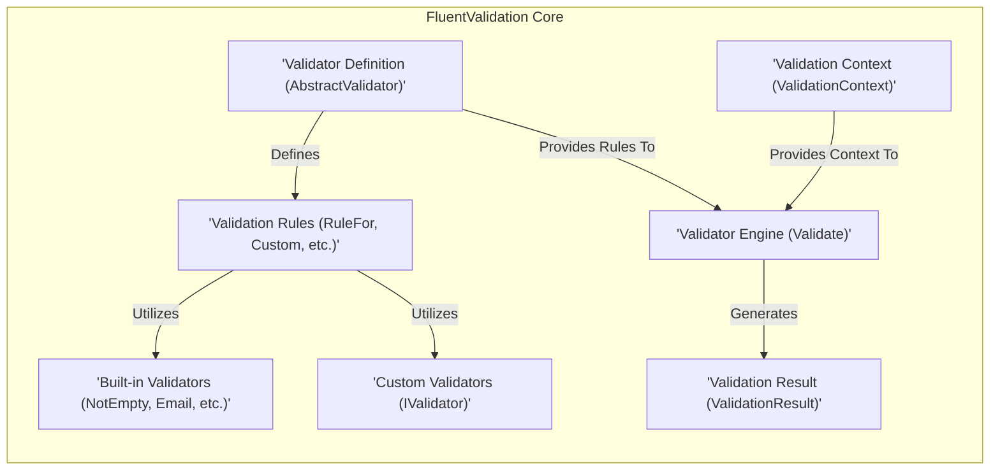
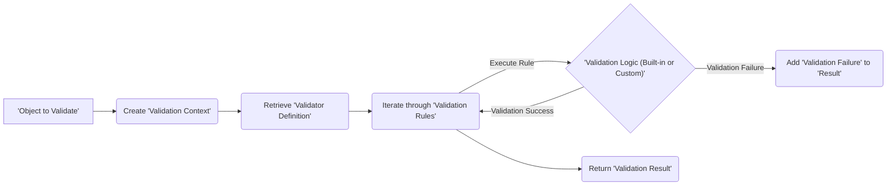

# Project Design Document: FluentValidation Library

**Version:** 1.1
**Date:** October 26, 2023
**Author:** AI Software Architect

## 1. Introduction

This document provides a detailed architectural design of the FluentValidation library, an open-source validation library for .NET. The primary purpose of this document is to serve as a comprehensive reference for understanding the library's structure, components, and data flow, specifically to facilitate effective threat modeling. Understanding these aspects is crucial for identifying potential vulnerabilities and designing appropriate security mitigations within applications utilizing FluentValidation.

## 2. Goals and Objectives

The overarching goal of this document is to provide a clear and detailed description of the FluentValidation library's architecture to support thorough threat modeling. The specific objectives are:

*   To clearly outline the key components of FluentValidation and their respective responsibilities.
*   To meticulously describe the interactions and dependencies between these components.
*   To accurately illustrate the flow of data during the validation process.
*   To explicitly identify potential integration points with external systems and their associated risks.
*   To provide sufficient technical detail to enable security engineers and developers to perform comprehensive threat analysis.

## 3. Scope

This document encompasses the core architecture and functionalities of the FluentValidation library as represented in the provided GitHub repository. It concentrates on the internal mechanisms of the library and the process of defining and executing validation logic. The scope specifically includes:

*   The fundamental validation engine responsible for processing validation rules.
*   The fluent interface employed for defining validation rules in a declarative manner.
*   The structure and lifecycle of validator instances and the resulting validation outcomes.
*   A selection of commonly used built-in validators provided by the library.
*   The extension points available for developers to introduce custom validation logic and rules.

This document explicitly excludes:

*   Detailed implementations of specific applications that integrate with FluentValidation.
*   The intricacies of the library's build process, testing methodologies, or deployment strategies.
*   Contributions from the community or external integrations that are not part of the core library's functionality.

## 4. High-Level Architecture

The FluentValidation library adopts a design where validation logic is defined independently from the domain objects being validated. The core components interact in a structured manner to execute this validation logic.

**Components:**

*   **Validator Definition (`AbstractValidator<T>`):** This serves as the blueprint for creating validators. It offers a fluent API for developers to define validation constraints for a specific type `T`. This is where the rules are declared, representing the expected state of the data.
*   **Validation Context (`ValidationContext<T>`):** This object encapsulates the instance of the object that needs to be validated, along with optional contextual information relevant to the validation process. It acts as a container providing necessary data for the validation engine.
*   **Validation Rules (`RuleFor`, `Custom`, etc.):** These represent the individual validation constraints applied to the properties of the target object. They leverage built-in validators or allow for the definition of custom validation logic. Each rule specifies a condition that must be met for the validation to pass.
*   **Validator Engine (`Validate`):** This is the core processing unit responsible for executing the validation rules defined in the validator definition against the object provided within the validation context. It orchestrates the entire validation process.
*   **Validation Result (`ValidationResult`):** This object encapsulates the outcome of the validation process. It indicates whether the validation was successful and, in case of failures, contains a collection of detailed validation errors.
*   **Built-in Validators (`NotEmpty`, `Email`, etc.):** These are pre-defined, reusable validation logic units for common validation scenarios. They provide a convenient way to enforce standard data quality requirements.
*   **Custom Validators (`IValidator`):** This interface allows developers to create their own reusable, encapsulated validation logic. This promotes modularity and allows for the implementation of complex or domain-specific validation rules.

## 5. Detailed Design

### 5.1. Validator Definition (`AbstractValidator<T>`)

*   Provides a strongly-typed, fluent interface, enhancing readability and maintainability of validation rules.
*   Employs methods like `RuleFor(x => x.Property)` to target specific properties of the type `T` for validation. This allows for precise targeting of validation constraints.
*   Supports method chaining to apply multiple validators to a single property (e.g., `.NotEmpty().EmailAddress()`). This enables concise and expressive rule definitions.
*   Offers conditional validation through methods like `When` and `Unless`, allowing rules to be applied based on the state of the object being validated. This adds flexibility and context-awareness to the validation process.
*   Includes support for validating elements within collections using the `ForEach` method. This is crucial for ensuring the integrity of data within lists or arrays.
*   Can be extended to create abstract base validators, promoting code reuse and consistency across multiple validators. This helps in establishing common validation patterns.

### 5.2. Validation Context (`ValidationContext<T>`)

*   Holds a direct reference to the instance of the object being validated, providing the data to be evaluated against the defined rules.
*   Optionally includes a `PropertyChain`, representing the path to the currently being validated property, particularly useful for navigating nested object structures. This aids in pinpointing the source of validation errors.
*   Can contain a `Selector` to specify a subset of properties to be validated, allowing for targeted validation when only specific parts of an object need to be checked.
*   Supports the inclusion of a `RuleSet`, enabling the execution of a specific group of validation rules. This is useful for scenarios with different validation requirements based on context.
*   Provides a `RootContextData` dictionary for sharing data across different validation rules within the same validation execution. This allows for communication and coordination between rules.

### 5.3. Validation Rules

*   Defined using methods such as `RuleFor`, `Custom`, and `Must`, each offering different ways to specify validation logic.
*   `RuleFor` is the primary method for targeting a specific property and chaining validators.
*   `Custom` allows for the definition of arbitrary validation logic using a delegate, providing maximum flexibility. This can be a point of security concern if not carefully implemented.
*   `Must` enables the definition of a predicate (a function that returns a boolean) that must evaluate to true for the validation to pass.
*   Rules can be configured to execute asynchronously, which is important for performance in I/O-bound validation scenarios.
*   Each rule can be assigned a severity level (Error, Warning, Information), allowing for categorization of validation failures.
*   Custom error messages can be associated with each rule, providing more informative feedback to the user or system.

### 5.4. Validator Engine (`Validate`)

*   Serves as the central orchestrator of the validation process.
*   Accepts a `ValidationContext<T>` as input, providing the object and context for validation.
*   Iterates through the validation rules defined within the associated validator definition.
*   Executes each rule against the object in the context, invoking the corresponding validation logic.
*   Aggregates any validation failures encountered into a `ValidationResult` object.
*   Supports both synchronous and asynchronous validation execution.
*   Allows for specifying a `RuleSet` to execute only a subset of the defined rules.

### 5.5. Validation Result (`ValidationResult`)

*   Contains a boolean `IsValid` property indicating the overall success or failure of the validation process.
*   Holds a collection of `ValidationFailure` objects if any validation rules were violated.
*   Each `ValidationFailure` object provides detailed information about the failure, including:
    *   `PropertyName`: The name of the property that failed validation.
    *   `ErrorMessage`: A human-readable description of the validation error.
    *   `ErrorCode`: An optional, machine-readable code representing the error type.
    *   `AttemptedValue`: The actual value of the property that caused the validation failure.
    *   `CustomState`: Allows for the inclusion of optional, application-specific state information.
*   Provides methods for accessing and manipulating the collection of validation errors.

### 5.6. Built-in Validators

*   Offers a range of pre-built validators for common validation scenarios, reducing the need for repetitive code.
*   Examples include: `NotEmpty`, `NotNull`, `EmailAddress`, `Length`, `Regex`, `GreaterThan`, `LessThan`, and many more.
*   These validators encapsulate common validation logic and are designed for reusability.
*   Often accept parameters to customize their behavior (e.g., `Length(min, max)` to specify minimum and maximum length). Care should be taken when using validators like `Regex` to avoid potential ReDoS vulnerabilities.

### 5.7. Custom Validators (`IValidator`)

*   Enables developers to create reusable and encapsulated validation logic within separate classes.
*   Custom validators implement the `IValidator` interface (or inherit from `AbstractValidator<TProperty>`), promoting a clear separation of concerns.
*   Can be integrated into `RuleFor` definitions using the `SetValidator` method, allowing for the composition of complex validation logic from smaller, reusable units.
*   Promotes modularity, testability, and maintainability of validation code. However, security vulnerabilities can be introduced if custom validators are not implemented with security in mind.

## 6. Data Flow

The typical data flow within FluentValidation during the validation process can be visualized as follows:

**Steps:**

1. An "Object to Validate" is the starting point of the process.
2. A "Validation Context" is created, wrapping the object and providing necessary contextual information.
3. The appropriate "Validator Definition" for the object's type is retrieved.
4. The "Validator Engine" iterates through the defined "Validation Rules".
5. For each rule, the corresponding "Validation Logic (Built-in or Custom)" is executed.
6. If the validation logic succeeds, the process moves to the next rule.
7. If the validation logic fails, a "Validation Failure" object is created and added to the "Validation Result".
8. Once all rules have been processed, the "Validation Result" is returned, indicating the outcome of the validation.

## 7. Integration Points

FluentValidation's flexibility allows it to be integrated into various layers and components of an application. Understanding these integration points is crucial for identifying potential attack surfaces.

*   **Web APIs (ASP.NET Core):**
    *   Commonly used to validate data transfer objects (DTOs) received in API requests, ensuring that incoming data conforms to expected formats and constraints.
    *   Integration packages like `FluentValidation.AspNetCore` provide seamless integration with the ASP.NET Core model validation pipeline, automatically triggering validation upon request arrival.
    *   Validators are typically registered with the dependency injection container, making them readily available for use by the framework. *Potential Threat:* If validation is not configured correctly or if custom validators have vulnerabilities, malicious requests could bypass validation or cause unexpected behavior.
*   **User Interface (UI) Frameworks (e.g., WPF, Blazor):**
    *   Used to validate user input in forms and other UI elements before submitting data to the backend. This provides immediate feedback to the user and prevents invalid data from being processed.
    *   Can be integrated with data binding mechanisms to provide real-time validation feedback as the user interacts with the UI. *Potential Threat:* Client-side validation should not be the sole mechanism for security, as it can be bypassed. Server-side validation using FluentValidation remains crucial.
*   **Background Services and Message Handlers:**
    *   Used to validate data received from message queues or other background processes, ensuring data integrity before further processing. This is critical for maintaining the reliability of asynchronous operations.
    *   Helps to prevent the propagation of invalid data throughout the system. *Potential Threat:* If validation is missing or insufficient, corrupted or malicious messages could be processed, leading to errors or security breaches.
*   **Data Access Layer:**
    *   Can be employed to validate data before it is persisted to a database, acting as a final gatekeeper for data integrity.
    *   Provides an additional layer of defense against invalid data entering the persistent storage. *Potential Threat:* While not the primary responsibility of FluentValidation, ensuring that data passed to the data access layer is valid is crucial to prevent database corruption or injection attacks.
*   **Unit Tests:**
    *   FluentValidation provides a dedicated testing API (`ShouldHaveValidationErrorFor`, `ShouldNotHaveValidationErrorFor`) to facilitate thorough testing of validation logic.
    *   Ensures that validation rules are behaving as expected and helps to catch errors early in the development cycle. *Potential Benefit for Security:*  Well-tested validation rules are less likely to contain errors that could lead to vulnerabilities.

## 8. Security Considerations (Crucial for Threat Modeling)

While FluentValidation itself is a validation library and does not inherently introduce security vulnerabilities, its proper usage and configuration are paramount for application security. Here are key security considerations for threat modeling:

*   **Denial of Service (DoS) through Complex Validation:**
    *   **Threat:**  Attackers might craft input that triggers computationally expensive validation rules, consuming excessive server resources and leading to a DoS. This is particularly relevant for custom validators or complex regular expressions.
    *   **Mitigation:**  Implement timeouts for validation processes, carefully review the performance implications of complex rules, and consider input sanitization before validation.
*   **Information Disclosure through Verbose Error Messages:**
    *   **Threat:**  Overly detailed error messages might reveal sensitive information about the system's internal workings, data structures, or even business logic to potential attackers.
    *   **Mitigation:**  Ensure error messages are generic and do not expose sensitive details. Log detailed error information securely for debugging purposes.
*   **Bypass of Validation Logic:**
    *   **Threat:** If validation is not consistently applied across all entry points (e.g., different API endpoints or UI forms), attackers might find ways to bypass validation checks.
    *   **Mitigation:**  Enforce validation at every point where external data enters the system. Centralize validation logic and ensure consistent application.
*   **Indirect Injection Attacks:**
    *   **Threat:** While FluentValidation helps prevent injection by validating input, insufficient or incorrectly configured validation rules might still allow malicious data to pass through and be used in subsequent operations, leading to SQL injection, command injection, or other injection attacks.
    *   **Mitigation:**  Implement comprehensive validation rules that cover all potential injection vectors. Combine FluentValidation with output encoding and parameterized queries for robust protection.
*   **Regular Expression Denial of Service (ReDoS):**
    *   **Threat:**  Using regular expression validators with poorly crafted or overly complex regular expressions can be exploited by attackers to cause excessive backtracking, leading to a DoS.
    *   **Mitigation:**  Carefully design and test regular expressions. Avoid overly complex or nested patterns. Consider using alternative validation methods if regular expressions are too risky.
*   **Security Vulnerabilities in Custom Validators:**
    *   **Threat:**  Custom validators implemented by developers might contain security vulnerabilities if not designed and reviewed with security in mind. This could include logic flaws, resource exhaustion issues, or even injection vulnerabilities within the custom validation logic itself.
    *   **Mitigation:**  Treat custom validators as security-sensitive code. Conduct thorough code reviews and security testing of custom validator implementations. Follow secure coding practices.
*   **Deserialization Vulnerabilities:**
    *   **Threat:** If FluentValidation is used to validate objects that are deserialized from external sources, vulnerabilities in the deserialization process itself could allow attackers to inject malicious code or data before validation even occurs.
    *   **Mitigation:**  Use secure deserialization practices. Validate data *after* deserialization to catch any potentially malicious payloads.

## 9. Assumptions and Constraints

*   It is assumed that the FluentValidation library is used according to its intended purpose and adhering to documented best practices.
*   The focus of this document is on the logical architecture, and specific implementation details or version-specific nuances are not exhaustively covered.
*   The reader is assumed to have a foundational understanding of .NET development principles and concepts.

## 10. Future Considerations

*   A deeper analysis of the security implications of specific built-in validators, particularly those involving regular expressions or external data lookups.
*   A thorough examination of the security aspects of the library's extensibility points, focusing on the potential risks associated with custom validator implementations.
*   An investigation into various integration patterns and their impact on the overall security posture of applications utilizing FluentValidation.
*   Guidance on secure coding practices for developers implementing custom validators and validation rules.
