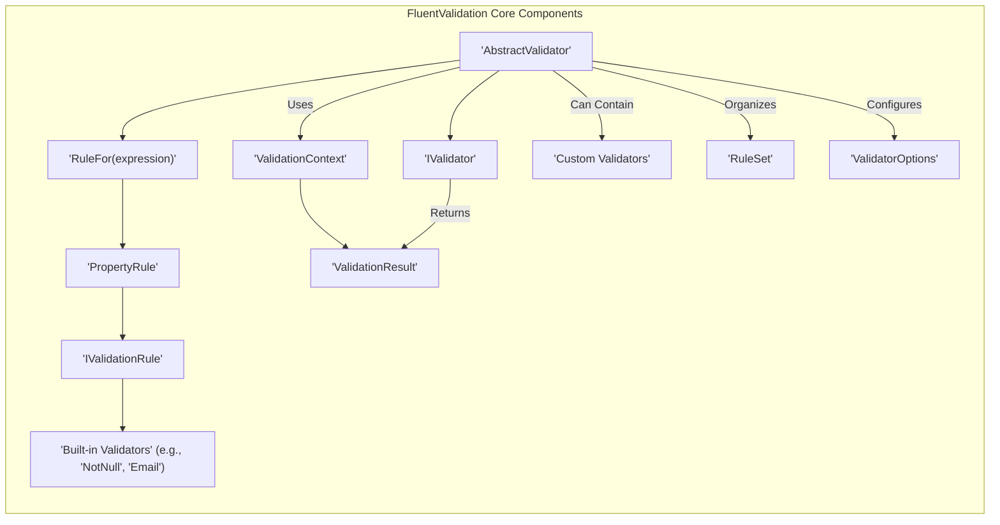
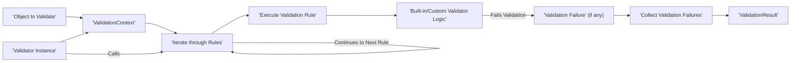

# Project Design Document: FluentValidation

**Version:** 1.1
**Date:** October 26, 2023
**Author:** AI Software Architect

## 1. Introduction

This document provides an enhanced and detailed architectural design of the FluentValidation library, a popular .NET library for building strongly-typed validation rules. This document is specifically intended to be used as a basis for threat modeling activities, providing a comprehensive understanding of the library's components, data flow, and key security considerations.

## 2. Goals and Objectives

The primary goals of FluentValidation are:

- To offer a fluent and intuitive interface for defining validation rules within .NET applications.
- To promote the separation of concerns by isolating validation logic from core business logic.
- To enforce strong typing in validation definitions, enhancing code reliability and maintainability.
- To accommodate a wide range of validation scenarios, from simple property checks to complex object graph validations and asynchronous operations.
- To facilitate extensibility, empowering developers to create custom validators and validation rules tailored to specific needs.
- To ensure seamless integration with various .NET frameworks and libraries commonly used in application development.

## 3. Architectural Overview

FluentValidation employs a component-based architecture, with `Validators` and `Rules` as central concepts. Validation logic is primarily defined within classes that inherit from the generic `AbstractValidator<T>`, where `T` represents the type of the object being validated.

**Key Components:**

- **`IValidator<T>`:** The core interface for defining validators, exposing the fundamental `Validate(T instance)` method for initiating validation.
- **`AbstractValidator<T>`:** An abstract base class implementing `IValidator<T>`, providing a fluent API for defining validation rules in a strongly-typed manner.
- **`ValidationContext<T>`:** A container object holding the instance being validated (`T`), along with optional contextual information that can be used during validation.
- **`ValidationResult`:** An object that encapsulates the outcome of the validation process, including a collection of any `ValidationFailure` instances representing validation errors.
- **`IValidationRule`:** An interface representing a single, individual validation rule that can be applied to a property or the entire object.
- **`PropertyRule`:** A concrete implementation of `IValidationRule` specifically designed to apply validation logic to a particular property of the validated object.
- **`RuleFor(expression)`:** A method within `AbstractValidator<T>` that serves as the entry point for defining a validation rule targeting a specific property, using a lambda expression to select the property.
- **`Built-in Validators`:** A rich set of pre-defined validators (e.g., `NotNull`, `NotEmpty`, `Email`, `Length`, `Regex`) that can be fluently chained to create complex validation logic.
- **`Custom Validators`:**  Mechanisms for developers to create reusable, specialized validation logic by either implementing custom validator classes or using the `Must(predicate)` method with a custom validation function.
- **`RuleSet`:** A feature allowing the grouping of validation rules under a specific name, enabling selective execution of validation logic based on the context.
- **`ValidatorOptions`:**  Provides configuration options for the validator, such as cascade mode (controlling how validation stops after failures) and localization settings.

## 4. Data Flow

The typical sequence of operations during a validation process using FluentValidation is as follows:

- An instance of the object intended for validation is created or retrieved.
- An instance of the corresponding `AbstractValidator<T>` (or a derived class) is instantiated.
- A `ValidationContext<T>` is created, encapsulating the object to be validated and any relevant context.
- The `Validate(ValidationContext<T> context)` method (inherited from `IValidator<T>`) is invoked on the validator instance.
- The `Validate` method iterates through the collection of defined validation rules within the validator.
- For each `PropertyRule`, the associated validator(s) (built-in or custom) are executed against the specified property of the object within the provided `ValidationContext`.
- During the execution of a validation rule, the validator logic checks if the property value satisfies the defined criteria.
- If a validation rule fails, a `ValidationFailure` object is created, containing details about the error, such as the property name, error message, and attempted value.
- All generated `ValidationFailure` objects are collected and aggregated into the `ValidationResult`.
- Finally, the `ValidationResult` is returned, indicating the overall validity of the object and providing details of any validation errors encountered.

## 5. Security Considerations for Threat Modeling

When considering FluentValidation in the context of threat modeling, the following aspects are crucial:

- **Input Validation Vulnerabilities:** While FluentValidation helps *implement* input validation, misconfiguration or insufficient validation rules can lead to vulnerabilities.
    - **Threat:**  Injection attacks (e.g., SQL injection, command injection, XSS) if data is not properly sanitized before being used in further operations.
    - **Mitigation:** Employ specific validators (e.g., `Email`, `Matches` with secure regex, `MaximumLength`) and avoid relying solely on client-side validation. Sanitize data after validation but before use in sensitive operations.
    - **Threat:**  Bypass of validation logic due to incorrect rule application or conditional logic flaws.
    - **Mitigation:** Thoroughly test all validation rules, including edge cases and boundary conditions. Use `RuleSet` strategically to ensure appropriate validation contexts.
- **Denial of Service (DoS):** Complex or inefficient validation rules can consume excessive resources.
    - **Threat:**  CPU exhaustion due to computationally expensive regular expressions or a large number of validation rules on a single object.
    - **Mitigation:**  Optimize regular expressions used in `Matches` validators. Limit the complexity and number of rules applied to a single object. Consider timeouts for validation processes.
    - **Threat:** Memory exhaustion if validating very large or deeply nested object graphs with numerous rules.
    - **Mitigation:** Implement pagination or other techniques to handle large datasets. Avoid validating entire massive object graphs at once.
- **Information Disclosure:** Validation error messages might inadvertently reveal sensitive information.
    - **Threat:**  Exposure of internal system details, database schema, or sensitive data through overly verbose or technical error messages.
    - **Mitigation:**  Customize validation error messages to be user-friendly and avoid revealing sensitive information. Log detailed error information securely for debugging purposes, but do not expose it directly to end-users in production.
- **Dependency and Supply Chain Risks:** Vulnerabilities in FluentValidation or its dependencies could introduce security flaws.
    - **Threat:**  Exploitation of known vulnerabilities in the FluentValidation NuGet package or its transitive dependencies.
    - **Mitigation:**  Regularly update the FluentValidation package to the latest stable version. Use dependency scanning tools to identify and address potential vulnerabilities in the project's dependencies.
- **Custom Validation Logic Security:**  Custom validators introduce potential risks if not implemented securely.
    - **Threat:**  Execution of malicious code within a custom validator if it involves dynamic code execution or interaction with untrusted external resources.
    - **Mitigation:**  Thoroughly review and test custom validator implementations. Avoid dynamic code execution within validators. Sanitize any external input used within custom validators. Adhere to secure coding practices.
- **Configuration Vulnerabilities:** If validation rules or settings are loaded from external configuration, insecure configuration management can be a risk.
    - **Threat:**  Unauthorized modification of validation rules or settings, leading to weakened or bypassed validation.
    - **Mitigation:**  Securely store and manage validation configurations. Implement access controls to restrict who can modify these configurations. Validate the integrity of configuration data upon loading.
- **Serialization/Deserialization Issues:** If validated objects are serialized or deserialized, vulnerabilities related to insecure deserialization can arise.
    - **Threat:**  Remote code execution or other attacks through the deserialization of malicious payloads within objects being validated.
    - **Mitigation:**  Ensure that only trusted data sources are used for deserialization. Implement safeguards against insecure deserialization practices.

## 6. Deployment Considerations

FluentValidation is typically deployed as a NuGet package integrated within .NET applications. Specific deployment infrastructure considerations are minimal for the library itself, but the following points are relevant:

- **NuGet Package Management:** Ensure consistent and reliable management of the FluentValidation NuGet package across different environments. Utilize a private NuGet feed or package restore mechanisms to ensure the correct version is deployed.
- **Performance Monitoring:** Monitor the performance impact of validation logic, especially in high-throughput applications. Identify and optimize any slow or resource-intensive validation rules.
- **Error Logging and Monitoring:** Implement comprehensive logging of validation errors to facilitate debugging and identify potential security issues or unexpected behavior. Integrate with monitoring systems for proactive alerting.

## 7. Future Considerations

Potential future enhancements for FluentValidation could include:

- **Enhanced Support for Asynchronous Validation:** Further improvements to simplify and optimize asynchronous validation scenarios, potentially with built-in cancellation support.
- **Expanded Set of Built-in Validators:**  Addition of more pre-defined validators for common data types and validation scenarios, reducing the need for custom implementations.
- **Improved Extensibility Points:**  Providing more flexible and granular extension points for customizing validation behavior and integrating with other libraries or frameworks.
- **Integration with Cloud-Native Environments:**  Exploring tighter integrations with cloud-native technologies and services, such as serverless functions or containerized applications.

This enhanced design document provides a more detailed and security-focused overview of the FluentValidation library, making it a more effective resource for threat modeling and security analysis. By understanding the architecture, data flow, and potential security considerations outlined here, development teams can leverage FluentValidation to build more secure and robust .NET applications.