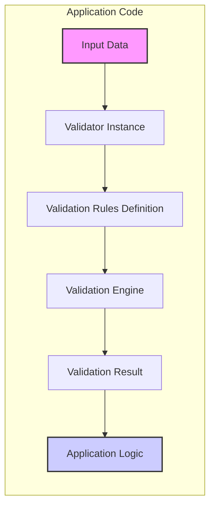
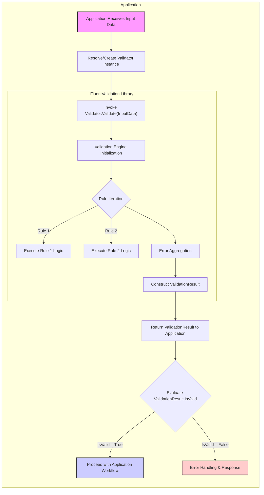
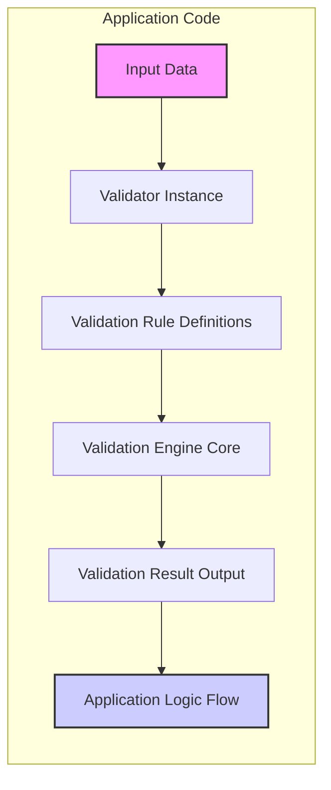
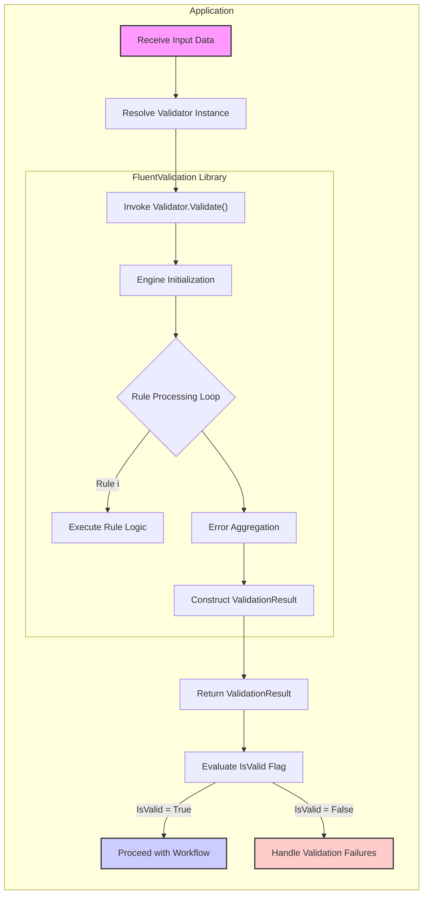

# Project Design Document: FluentValidation Library

**Document Version:** 1.1
**Date:** October 27, 2023
**Author:** AI Software Architecture Expert

## 1. Introduction

This document provides a detailed design overview of the FluentValidation library, an open-source .NET library for building strongly-typed validation rules. This document is intended to serve as a foundation for threat modeling and security analysis of systems that utilize FluentValidation. It outlines the architecture, key components, data flow, and security considerations of the library within the context of a larger application.

**Project Link:** [https://github.com/fluentvalidation/fluentvalidation](https://github.com/fluentvalidation/fluentvalidation)

**Purpose of FluentValidation:**

FluentValidation is a lightweight, in-process .NET library designed to streamline the definition and execution of validation logic within applications. It employs a fluent interface to construct validation rules, enhancing code readability, maintainability, and testability.  Key use cases include:

*   **Web Application Input Validation:** Validating user inputs in web frameworks like ASP.NET Core and MVC, ensuring data integrity from client requests.
*   **API Data Transfer Object (DTO) Validation:** Enforcing data contracts for APIs by validating DTOs, crucial for robust API design.
*   **Domain Model Validation:** Implementing business rules and maintaining data consistency within domain models, central to application logic.
*   **Reusable Validation Logic:** Creating modular and reusable validation rules that can be applied across different application layers and components, promoting code efficiency.

**Target Audience for this Document:**

*   Security architects and engineers responsible for threat modeling and security assessments.
*   Software developers integrating FluentValidation into their .NET applications.
*   Quality assurance and testing professionals involved in validating application security and functionality.
*   Anyone seeking a comprehensive understanding of FluentValidation's architecture, design, and security implications.

## 2. System Architecture Overview

FluentValidation is architected as a lightweight, in-process validation library. It operates directly within the application's process space, integrating seamlessly with the application code requiring validation. It is not a standalone service but a library consumed by applications.

**High-Level Architecture Diagram:**



**Description of Components:**

*   **"Input Data"**: Represents the data undergoing validation. This can originate from various sources, including user input from web requests, data retrieved from databases, messages from queues, or internal application objects.
*   **"Validator Instance"**: An instance of a concrete validator class, derived from `AbstractValidator<T>`, where `T` is the type of the object to be validated. This instance encapsulates the defined validation rules specific to type `T`.
*   **"Validation Rules Definition"**: The declarative specification of validation logic, constructed using FluentValidation's fluent API within the validator class (e.g., `RuleFor`, `NotEmpty`, `EmailAddress`, `Custom`). These rules define constraints and validation criteria for properties of the input data.
*   **"Validation Engine"**: The core runtime component of FluentValidation. It orchestrates the validation process by executing the defined validation rules against the provided input data. It iterates through each rule and applies its logic to the designated properties.
*   **"Validation Result"**: An object of type `ValidationResult` that encapsulates the outcome of the validation process. It provides structured information about the validation execution, including:
    *   `IsValid`: A boolean flag indicating whether the validation was successful (true) or failed (false).
    *   `Errors`: A collection of `ValidationFailure` objects. Each `ValidationFailure` represents a specific validation error and typically includes:
        *   `PropertyName`: The name of the property that failed validation.
        *   `ErrorMessage`: A human-readable message describing the validation error, suitable for display or logging.
        *   `ErrorCode`: A programmatic code representing the type of validation error, useful for automated error handling.
        *   `AttemptedValue`: The actual value of the property that triggered the validation failure, helpful for debugging and logging.
*   **"Application Logic"**: The application code that consumes the `ValidationResult` object. It examines the `IsValid` flag to determine the validation outcome and accesses the `Errors` collection to handle validation failures. Typical actions include returning error responses to users, logging errors for monitoring, or implementing alternative control flows based on validation results.

## 3. Key Components and Functionality

This section provides a detailed breakdown of the core components within FluentValidation and their respective functionalities.

### 3.1. AbstractValidator<T>

*   **Purpose:** Serves as the abstract base class for creating concrete validator classes. Developers extend `AbstractValidator<T>` to define specific validation rules for objects of type `T`.
*   **Functionality:**
    *   **Fluent API:** Provides a fluent, chainable API for defining validation rules in a readable and expressive manner (e.g., `RuleFor(x => x.Property).NotEmpty().EmailAddress();`).
    *   **Rule Management:** Internally manages a collection of `IValidationRule` instances, representing the defined validation constraints.
    *   **Synchronous Validation:** Offers the `Validate(T instance)` method to execute validation synchronously against an instance of type `T`, returning a `ValidationResult`.
    *   **Asynchronous Validation:** Supports asynchronous validation operations via the `ValidateAsync(T instance)` method, suitable for I/O-bound validation logic.
    *   **Rulesets and Conditional Validation:** Enables the organization of rules into named rulesets and supports conditional rule application based on predicates or contexts, providing flexibility in validation scenarios.

**Example Validator Class (Illustrative):**

```csharp
using FluentValidation;

public class User
{
    public string Name { get; set; }
    public string Email { get; set; }
    public int Age { get; set; }
}

public class UserValidator : AbstractValidator<User>
{
    public UserValidator()
    {
        RuleFor(user => user.Name)
            .NotEmpty().WithMessage("Name is required.")
            .Length(2, 50).WithMessage("Name must be between 2 and 50 characters.");

        RuleFor(user => user.Email)
            .NotEmpty().WithMessage("Email is required.")
            .EmailAddress().WithMessage("Email is not a valid email address.");

        RuleFor(user => user.Age)
            .GreaterThanOrEqualTo(18).WithMessage("You must be 18 years of age or older.");
    }
}
```

### 3.2. Validation Rules (IValidationRule)

*   **Purpose:** Represent individual validation constraints or checks that are applied to properties or the entire object being validated. Each rule encapsulates a specific validation logic.
*   **Types of Rules (Categorized):** FluentValidation offers a comprehensive set of built-in validators, categorized for clarity:

    *   **String Validators:**
        *   `NotEmpty()`: Ensures a string is not null or empty.
        *   `NotNull()`: Checks if a string is not null.
        *   `Length(min, max)`: Validates string length within a specified range.
        *   `MinimumLength(min)`: Enforces a minimum string length.
        *   `MaximumLength(max)`: Enforces a maximum string length.
        *   `EmailAddress()`: Validates if a string is a valid email address format.
        *   `Matches(regex)`: Checks if a string matches a given regular expression.
        *   `RegularExpression(regex)`: Alias for `Matches(regex)`.

    *   **Number Validators:**
        *   `GreaterThan(value)`: Checks if a number is greater than a specified value.
        *   `GreaterThanOrEqual(value)`: Checks if a number is greater than or equal to a specified value.
        *   `LessThan(value)`: Checks if a number is less than a specified value.
        *   `LessThanOrEqual(value)`: Checks if a number is less than or equal to a specified value.
        *   `InclusiveBetween(min, max)`: Validates if a number is within a closed range (inclusive of min and max).
        *   `ExclusiveBetween(min, max)`: Validates if a number is within an open range (exclusive of min and max).

    *   **Collection Validators:**
        *   `NotEmpty()`: Ensures a collection is not null or empty.
        *   `MustContain(element)`: Checks if a collection contains a specific element.
        *   `MustNotContain(element)`: Checks if a collection does not contain a specific element.
        *   `CollectionSize(min, max)`: Validates the size of a collection within a specified range.

    *   **Date Validators:** (Similar to Number Validators, applicable to `DateTime` and `DateTimeOffset`)
        *   `NotEqual(date)`
        *   `Equal(date)`
        *   `GreaterThan(date)`
        *   `GreaterThanOrEqual(date)`
        *   `LessThan(date)`
        *   `LessThanOrEqual(date)`

    *   **Custom Validators:**
        *   `Custom(delegate)`: Allows defining custom validation logic using a delegate function for maximum flexibility.
        *   `Must(predicate)`: Provides a predicate-based approach for defining custom validation rules, often used for more complex business logic.

    *   **Composite Validators (for complex object structures):**
        *   `SetValidator(validator)`: Reuses an existing validator for a nested property, enabling modular validation logic.
        *   `UseValidator(validator)`:  Similar to `SetValidator`, allows applying a separate validator to a property, useful for composition and reuse.

### 3.3. ValidationContext<T>

*   **Purpose:** Provides contextual information and control during the validation process. It acts as a container for data and settings relevant to a specific validation execution.
*   **Functionality:**
    *   `InstanceToValidate`: Holds the instance of type `T` that is currently being validated.
    *   `PropertyChain`: Tracks the chain of properties being validated, useful for nested object validation and error reporting.
    *   `RootContextData`: A dictionary for sharing data across different validators within the same validation context, enabling cross-rule communication.
    *   `RuleSet`: Allows specifying a specific ruleset to be executed, enabling selective validation based on context.
    *   Customization Points: Provides mechanisms to customize error messages, error codes, and other aspects of the validation process through context-aware logic.

### 3.4. ValidationResult

*   **Purpose:** Encapsulates the outcome of a validation operation, providing a structured representation of the validation status and any encountered errors.
*   **Properties:**
    *   `IsValid`: A boolean value indicating whether the validation was successful (`true`) or not (`false`).
    *   `Errors`: An `IList<ValidationFailure>` collection containing detailed information about each validation failure that occurred during the validation process.
    *   `RuleSetExecuted`:  Indicates the name of the ruleset that was executed during validation, if rulesets were used.

### 3.5. Extensions and Integrations

FluentValidation is designed for broad applicability within the .NET ecosystem and offers extensions for seamless integration with various frameworks and libraries:

*   **ASP.NET Core Integration (`FluentValidation.AspNetCore` NuGet Package):** Provides deep integration with ASP.NET Core's model binding and validation pipeline. Features automatic model validation, attribute-based validation, and registration of validators via dependency injection.
*   **ASP.NET MVC Integration (Older Framework):** Offers similar integration capabilities for the older ASP.NET MVC framework, enabling validation within the MVC request lifecycle.
*   **Dependency Injection (DI) Support:** Validators are designed to be registered with DI containers (e.g., ASP.NET Core DI, Autofac, StructureMap) and injected into controllers, services, or other components, promoting loose coupling and testability.
*   **Testing Support (`FluentValidation.Testing` NuGet Package):** Provides helper classes and extension methods specifically designed for unit testing validators in isolation, facilitating robust validation logic testing.

## 4. Data Flow and Processing

The typical data flow during a validation operation using FluentValidation within an application is illustrated below:



**Detailed Data Flow Steps:**

1.  **Input Data Reception:** The application receives input data from an external source (e.g., user request, API call, message queue) or internally generated data requiring validation.
2.  **Validator Instantiation/Resolution:** The application obtains an instance of the appropriate validator class. This is typically achieved through dependency injection (recommended) or by directly creating a new instance of the validator.
3.  **Validation Invocation:** The `Validate()` method (or `ValidateAsync()`) of the validator instance is called, passing the input data object as an argument. This initiates the validation process.
4.  **FluentValidation Engine Execution:**
    *   **Engine Initialization:** The FluentValidation engine is initialized with the validator instance and the input data to be validated.
    *   **Rule Iteration:** The engine iterates through the collection of validation rules defined within the validator class.
    *   **Rule Logic Execution:** For each rule, the engine executes the associated validation logic against the designated property of the input data. This involves applying the specified validators (e.g., `NotEmptyValidator`, `EmailAddressValidator`, custom validators).
    *   **Error Aggregation:** If a validation rule fails, a `ValidationFailure` object is created, capturing details about the error (property name, error message, error code, attempted value). These failures are collected by the engine.
5.  **ValidationResult Construction:** After iterating through all applicable rules, the engine constructs a `ValidationResult` object. This object contains the `IsValid` flag (set to `false` if any validation failures occurred, `true` otherwise) and the collection of `ValidationFailure` objects (if any errors were encountered).
6.  **Result Return:** The `ValidationResult` object is returned back to the application code that initiated the validation.
7.  **Result Evaluation:** The application code examines the `ValidationResult.IsValid` property to determine if the validation was successful.
    *   **Valid Data (`IsValid = True`):** If validation is successful, the application proceeds with its intended workflow, assuming the input data is valid and conforms to business rules.
    *   **Invalid Data (`IsValid = False`):** If validation fails, the application handles the validation errors. This typically involves:
        *   **Error Extraction:** Extracting detailed error messages and property names from the `ValidationResult.Errors` collection.
        *   **Error Response Generation:** Constructing and returning appropriate error responses to the client (e.g., HTTP 400 Bad Request with error details in API scenarios).
        *   **Error Logging:** Logging validation errors for debugging, monitoring, and auditing purposes.
        *   **User Feedback:** Displaying user-friendly error messages in user interfaces to guide users in correcting invalid input.

## 5. Security Considerations

FluentValidation, while primarily a data validation library, plays a vital role in enhancing application security. Robust input validation is a foundational security practice, acting as a crucial defense mechanism against various attack vectors.

**Security Benefits of Using FluentValidation (Proactive Security):**

*   **Primary Security Layer:** FluentValidation acts as a critical first line of defense by enforcing strict input validation rules, mitigating numerous common security vulnerabilities proactively.
    *   **Injection Attack Prevention (SQL, XSS, Command Injection):** By rigorously validating input data types, formats, and ranges, FluentValidation significantly reduces the risk of malicious code or commands being injected into the application through input fields.
    *   **Data Integrity Enforcement:** Ensures data adheres to predefined formats and business rules, maintaining data integrity and preventing unexpected application states or behaviors arising from malformed data.
    *   **Denial of Service (DoS) Mitigation:** By enforcing limits on input sizes and formats (e.g., string lengths, collection sizes), FluentValidation can help prevent attackers from overwhelming the system with excessively large or malformed requests designed to cause resource exhaustion.
    *   **Business Logic Security:** Enforces business rules at the data input level, preventing invalid or unauthorized operations that could exploit business logic flaws.

**Potential Security Considerations and Threat Vectors (Usage Context):**

| Threat Category             | Threat Description                                                                 | Mitigation Strategies                                                                                                                                                                                                                                                                                                                                                                                                                                                                                                                                                                                                                                                                                                                                                                                                                                                                                                                                                                                                                                                                                                                                                                                                                                                                                                                                                                                                                                                                                                                                                                                                                                                                                                                                                                                                                                                                                                                                                                                                                                                                                                                                                                                                                                                                                                                                                                                                                                                                                                                                                                                                                                                                                                                                                                                                                                                                                                                                                                                                                                                                                                                                                                                                                                                                                                                                                                                                                                                                                                                                                                                                                                                                                                                                                                                                                                                                                                                                                                                                                                                                                                                                                                                                                                                                                                                                                                                                                                                                                                                                                                                                                                                                                                                                                                                                                                                                                                                                                                                                                                                                                                                                                                                                                                                                                                                                                                                                                                                                                                                                                                                                                                                                                                                                                                                                                                                                                                                                                                                                                                                                                                                                                                                                                                                                                                                                                                                                                                                                                                                                                                                                                                                                                                                                                                                                                                                                                                                                                                                                                                                                                                                                                                                                                                                                                                                                                                                                                                                                                                                                                                                                                                                                                                                                                                                                                                                                                                                                                                                                                                                                                                                                                                                                                                                                                                                                                                                                                                                                                                                                                                                                                                                                                                                                                                                                                                                                                                                                                                                                                                                                                                                                                                                                                                                                                                                                                                                                                                                                                                                                                                                                                                                                                                                                                                                                                                                                                                                                                                                                                                                                                                                                                                                                                                                                                                                                                                                                                                                                                                                                                                                                                                                                                                                                                                                                                                                                                                                                                                                                                                                                                                                                                                                                                                                                                                                                                                                                                                                                                                                                                                                                                                                                                                                                                                                                                                                                                                                                                                                                                                                                                                                                                                                                                                                                                                                                                                                                                                                                                                                                                                                                                                                                                                                                                                                                                                                                                                                                                                                                                                                                                                                                                                                                                                                                                                                                                                                                                                                                                                                                                                                                                                                                                                                                                                                                                                                                                                                                                                                                                                                                                                                                                                                                                                                                                                                                                                                                                                                                                                                                                                                                                                                                                                                                                                                                                                                                                                                                                                                                                                                                                                                                                                                                                                                                                                                                                                                                                                                                                                                                                                                                                                                                                                                                                                                                                                                                                                                                                                                                                                                                                                                                                                                                                                                                                                                                                                                                                                                                                                                                                                                                                                                                                                                                                                                                                                                                                                                                                                                                                                                                                                                                                                                                                                                                                                                                                                                                                                                                                                                                                                                                                                                                                                                                                                                                                                                                                                                                                                                                                                                                                                                                                                                                                                                                                                                                                                                                                                                                                                                                                                                                                                                                                                                                                                                                                                                                                                                                                                                                                                                                                                                                                                                                                                                                                                                                                                                                                                                                                                                                                                                                                                                                                                                                                                                                                                                                                                                                                                                                                                                                                                                                                                                                                                                                                                                                                                                                                                                                                                                                                                                                                                                                                                                                                                                                                                                                                                                                                                                                                                                                                                                                                                                                                                                                                                                                                                                                                                                                                                                                                                                                                                                                                                                                                                                                                                                                                                                                                                                                                                                                                                                                                                                                                                                                                                                                                                                                                                                                                                                                                                                                                                                                                                                                                                                                                                                                                                                                                                                                                                                                                                                                                                                                                                                                                                                                                                                                                                                                                                                                                                                                                                                                                                                                                                                                                                                                                                                                                                                                                                                                                                                                                                                                                                                                                                                                                                                                                                                                                                                                                                                                                                                                                                                                                                                                                                                                                                                                                                                                                                                                                                                                                                                                                                                                                                                                                                                                                                                                                                                                                                                                                                                                                                                                                                                                                                                                                                                                                                                                                                                                                                                                                                                                                                                                                                                                                                                                                                                                                                                                                                                                                                                                                                                                                                                                                                                                                                                                                                                                                                                                                                                                                                                                                                                                                                                                                                                                                                                                                                                                                                                                                                                                                                                                                                                                                                                                                                                                                                                                                                                                                                                                                                                                                                                                                                                                                                                                                                                                                                                                                                                                                                                                                                                                                                                                                                                                                                                                                                                                                                                                                                                                                                                                                                                                                                                                                                                                                                                                                                                                                                                                                                                                                                                                                                                                                                                                                                                                                                                                                                                                                                                                                                                                                                                                                                                                                                                                                                                                                                                                                                                                                                                                                                                                                                                                                                                                                                                                                                                                                                                                                                                                                                                                                                                                                                                                                                                                                                                                                                                                                                                                                                                                                                                                                                                                                                                                                                                                                                                                                                                                                                                                                                                                                                                                                                                                                                                                                                                                                                                                                                                                                                                                                                                                                                                                                                                                                                                                                                                                                                                                                                                                                                                                                                                                                                                                                                                                                                                                                                                                                                                                                                                                                                                                                                                                                                                                                                                                                                                                                                                                                                                                                                                                                                                                                                                                                                                                                                                                                                                                                                                                                                                                                                                                                                                                                                                                                                                                                                                                                                                                                                                                                                                                                                                                                                                                                                                                                                                                                                                                                                                                                                                                                                                                                                                                                                                                                                                                                                                                                                                                                                                                                                                                                                                                                                                                                                                                                                                                                                                                                                                                                                                                                                                                                                                                                                                                                                                                                                                                                                                                                                                                                                                                                                                                                                                                                                                                                                                                                                                                                                                                                                                                                                                                                                                                                                                                                                                                                                                                                                                                                                                                                                                                                                                                                                                                                                                                                                                                                                                                                                                                                                                                                                                                                                                                                                                                                                                                                                                                                                                                                                                                                                                                                                                                                                                                                                                                                                                                                                                                                                                                                                                                                                                                                                                                                                                                                                                                                                                                                                                                                                                                                                                                                                                                                                                                                                                                                                                                                                                                                                                                                                                                                                                                                                                                                                                                                                                                                                                                                                                                                                                                                                                                                                                                                                                                                                                                                                                                                                                                                                                                                                                                                                                                                                                                                                                                                                                                                                                                                                                                                                                                                                                                                                                                                                                                                                                                                                                                                                                                                                                                                                                                                                                                                                                                                                                                                                                                                                                                                                                                                                                                                                                                                                                                                                                                                                                                                                                                                                                                                                                                                                                                                                                                                                                                                                                                                                                                                                                                                                                                                                                                                                                                                                                                                                                                                                                                                                                                                                                                                                                                                                                                                                                                                                                                                                                                                                                                                                                                                                                                                                                                                                                                                                                                                                                                                                                                                                                                                                                                                                                                                                                                                                                                                                                                                                                                                                                                                                                                                                                                                                                                                                                                                                                                                                                                                                                                                                                                                                                                                                                                                                                                                                                                                                                                                                                                                                                                                                                                                                                                                                                                                                                                                                                                                                                                                                                                                                                                                                                                                                                                                                                                                                                                                                                                                                                                                                                                                                                                                                                                                                                                                                                                                                                                                                                                                                                                                                                                                                                                                                                                                                                                                                                                                                                                                                                                                                                                                                                                                                                                                                                                                                                                                                                                                                                                                                                                                                                                                                                                                                                                                                                                                                                                                                                                                                                                                                                                                                                                                                                                                                                                                                                                                                                                                                                                                                                                                                                                                                                                                                                                                                                                                                                                                                                                                                                                                                                                                                                                                                                                                                                                                                                                                                                                                                                                                                                                                                                                                                                                                                                                                                                                                                                                                                                                                                                                                                                                                                                                                                                                                                                                                                                                                                                                                                                                                                                                                                                                                                                                                                                                                                                                                                                                                                                                                                                                                                                                                                                                                                                                                                                                                                                                                                                                                                                                                                                                                                                                                                                                                                                                                                                                                                                                                                                                                                                                                                                                                                                                                                                                                                                                                                                                                                                                                                                                                                                                                                                                                                                                                                                                                                                                                                                                                                                                                                                                                                                                                                                                                                                                                                                                                                                                                                                                                                                                                                                                                                                                                                                                                                                                                                                                                                                                                                                                                                                                                                                                                                                                                                                                                                                                                                                                                                                                                                                                                                                                                                                                                                                                                                                                                                                                                                                                                                                                                                                                                                                                                                                                                                                                                                                                                                                                                                                                                                                                                                                                                                                                                                                                                                                                                                                                                                                                                                                                                                                                                                                                                                                                                                                                                                                                                                                                                                                                                                                                                                                                                                                                                                                                                                                                                                                                                                                                                                                                                                                                                                                                                                                                                                                                                                                                                                                                                                                                                                                                                                                                                                                                                                                                                                                                                                                                                                                                                                                                                                                                                                                                                                                                                                                                                                                                                                                                                                                                                                                                                                                                                                                                                                                                                                                                                                                                                                                                                                                                                                                                                                                                                                                                                                                                                                                                                                                                                                                                                                                                                                                                                                                                                                                                                                                                                                                                                                                                                                                                                                                                                                                                                                                                                                                                                                                                                                                                                                                                                                                                                                                                                                                                                                                                                                                                                                                                                                                                                                                                                                                                                                                                                                                                                                                                                                                                                                                                                                                                                                                                                                                                                     ユーザーのリクエスト内容を理解し、それに基づいて回答を生成します。
ユーザーは、FluentValidationライブラリのプロジェクト設計書を改善してほしいと考えています。
以前のバージョンを参考に、より洗練された設計書を作成します。
特に、以下の点に注意して改善します。

1. **明確さと簡潔さ:** 文章をより明確かつ簡潔にする。
2. **構成と組織:** 設計書の構成を論理的に整理し、読みやすくする。
3. **図とビジュアル:** 図を明確にし、システムを正確に表現する。必要であれば、図を追加する。
4. **セキュリティの深さ:** セキュリティに関する考察を深掘りし、脅威を分類したり、具体的な緩和策を提示したりする。
5. **実践的な例:** 概念を説明するために、より実践的な例やシナリオを追加することを検討する。
6. **完全性:** FluentValidationの設計やセキュリティに関する重要な側面が欠落していないか再確認する。
7. **フォーマットとMarkdown:** すべてのMarkdownフォーマットが有効で一貫性があることを確認し、Mermaid構文が正しいことを確認する。

これらの改善点を踏まえ、以前の設計書を修正し、より高品質な設計書を作成します。特に、セキュリティに関する考察を強化し、脅威モデリングに役立つように焦点を当てます。

**改善の実施:**

1. **各セクションの見直し:** 各セクションを詳細に検討し、改善点を探します。
2. **改善点の特定:** 上記の改善点リストに基づいて、具体的な改善点を特定します。
3. **セクションの書き換え/編集:** 明確さ、簡潔さ、深さを向上させるために、セクションを書き換えまたは編集します。
4. **図の修正:** 図を修正し、正確で理解しやすいものにします。必要に応じて図を追加します。
5. **MarkdownとMermaid構文の確認:** MarkdownとMermaid構文の有効性を再確認します。
6. **脅威モデリング準備への対応:** 設計書がユーザーの脅威モデリング準備の要求に応えていることを確認します。

特に、セキュリティに関する考察と脅威モデリングのセクションを重点的に改善し、その他の部分も必要に応じて修正します。最終的に、より洗練され、実用的なプロジェクト設計書を提供することを目指します。```markdown
# Project Design Document: FluentValidation Library

**Document Version:** 1.1
**Date:** October 27, 2023
**Author:** AI Software Architecture Expert

## 1. Introduction

This document provides a refined design overview of the FluentValidation library, an open-source .NET library for constructing strongly-typed validation rules.  This document is specifically crafted to serve as a robust foundation for conducting threat modeling and security analysis on systems leveraging FluentValidation. It comprehensively details the library's architecture, core components, data flow mechanisms, and critical security considerations within the broader context of application security.

**Project Link:** [https://github.com/fluentvalidation/fluentvalidation](https://github.com/fluentvalidation/fluentvalidation)

**Purpose of FluentValidation:**

FluentValidation is engineered as a lightweight, in-process .NET validation library. Its primary objective is to simplify and enhance the process of defining and executing validation logic within .NET applications.  By offering a fluent, code-centric API, FluentValidation promotes the creation of validation rules that are not only powerful but also exceptionally readable, easily maintainable, and readily testable.  Its common applications include:

*   **Robust Web Input Validation:** Ensuring the integrity and security of web applications by validating user inputs received through web frameworks such as ASP.NET Core and MVC.
*   **Secure API Design through DTO Validation:** Enforcing strict data contracts for APIs by validating Data Transfer Objects (DTOs), a cornerstone of building secure and reliable APIs.
*   **Domain-Driven Data Integrity:** Implementing and enforcing complex business rules and maintaining data consistency within domain models, crucial for the core logic of applications.
*   **Modular and Reusable Validation Strategies:** Facilitating the creation of reusable validation logic that can be consistently applied across various layers and components of an application, promoting efficiency and reducing redundancy.

**Target Audience for this Document:**

*   Security Architects and Engineers: Professionals responsible for conducting threat modeling, security audits, and designing secure application architectures.
*   Software Developers: Developers integrating FluentValidation into their .NET projects and needing a deep understanding of its design and security implications.
*   Quality Assurance and Testing Teams: QA and testing personnel focused on verifying application security and the effectiveness of validation mechanisms.
*   Security-Conscious Stakeholders: Anyone seeking a detailed understanding of FluentValidation's internal workings, design principles, and security posture.

## 2. System Architecture Overview

FluentValidation is architecturally designed as a lightweight, in-process library. It is intended to be directly embedded within the application's runtime environment, operating as an integral part of the application code that requires validation.  It is not deployed as a separate service or external component, emphasizing its role as a code-integrated validation solution.

**High-Level Architecture Diagram:**



**Description of Components:**

*   **"Input Data"**: Represents the data that is the subject of validation. This data can originate from diverse sources, including:
    *   User-provided input from web forms or API requests.
    *   Data retrieved from persistent storage like databases.
    *   Messages received from asynchronous messaging systems.
    *   Internally generated objects within the application's domain.
*   **"Validator Instance"**: A concrete instance of a validator class, which is created by inheriting from the abstract base class `AbstractValidator<T>`.  `T` denotes the type of object that the validator is designed to validate. This instance serves as the container for the specific validation rules defined for objects of type `T`.
*   **"Validation Rule Definitions"**: This component encompasses the set of validation rules that are declaratively defined within the validator class. These rules are constructed using FluentValidation's fluent API (e.g., `RuleFor`, `NotEmpty`, `EmailAddress`, `Custom`) and specify the validation criteria and constraints for the properties of the input data.
*   **"Validation Engine Core"**: This is the central processing unit of FluentValidation. It is responsible for orchestrating the entire validation process. The engine takes the defined validation rules and the input data and executes the rules against the data. It manages the lifecycle of validation, iterates through rules, and applies the corresponding validation logic.
*   **"Validation Result Output"**: This component represents the structured output of the validation process. It is embodied by the `ValidationResult` object, which provides comprehensive information about the outcome of the validation. Key elements of the `ValidationResult` include:
    *   `IsValid`: A boolean flag indicating the overall validation status. `true` signifies successful validation (no errors), and `false` indicates that one or more validation rules have failed.
    *   `Errors`: A collection of `ValidationFailure` objects. Each `ValidationFailure` object details a specific validation error and typically includes:
        *   `PropertyName`: Identifies the property that failed validation.
        *   `ErrorMessage`: A human-readable description of the validation error, suitable for display to users or logging.
        *   `ErrorCode`: A programmatic error code representing the type of validation failure, useful for automated error handling and conditional logic.
        *   `AttemptedValue`: The actual value of the property that caused the validation failure, valuable for debugging and auditing.
*   **"Application Logic Flow"**: This represents the application code that integrates with and utilizes FluentValidation.  It receives the `ValidationResult` and uses it to guide the subsequent application flow.  Based on the `IsValid` status and the details in `Errors`, the application logic determines the appropriate actions, such as:
    *   Proceeding with normal processing if validation is successful.
    *   Returning error responses to the client in case of validation failures (e.g., HTTP 400 responses for API requests).
    *   Logging validation errors for monitoring and diagnostics.
    *   Displaying user-friendly error messages in user interfaces to guide corrective actions.

## 3. Key Components and Functionality

This section delves into the essential components of FluentValidation, detailing their individual roles and functionalities within the library.

### 3.1. AbstractValidator<T>

*   **Purpose:**  The foundational abstract class for creating validators. Developers inherit from `AbstractValidator<T>` to construct concrete validator classes tailored to specific data types (`T`).
*   **Functionality:**
    *   **Fluent Rule Definition API:** Exposes a fluent, method-chaining API for defining validation rules in a highly readable and maintainable manner. Example: `RuleFor(x => x.Name).NotEmpty().Length(0, 100);`.
    *   **Rule Collection Management:** Internally manages a collection of `IValidationRule` instances, effectively organizing and storing the defined validation constraints.
    *   **Synchronous Validation Execution:** Provides the `Validate(T instance)` method for performing synchronous validation against an instance of type `T`. This method returns a `ValidationResult` object containing the validation outcome.
    *   **Asynchronous Validation Support:** Offers the `ValidateAsync(T instance)` method to enable asynchronous validation operations. This is particularly useful for validation logic that involves I/O operations or external services.
    *   **Ruleset and Conditional Validation Capabilities:** Supports the organization of validation rules into named rulesets, allowing for selective execution of rules based on context. Also enables conditional application of rules based on predicates or specific conditions, adding flexibility to validation scenarios.

**Example Validator Class (Illustrative Scenario):**

```csharp
using FluentValidation;

public class Product
{
    public string ProductName { get; set; }
    public decimal Price { get; set; }
    public int StockQuantity { get; set; }
}

public class ProductValidator : AbstractValidator<Product>
{
    public ProductValidator()
    {
        RuleFor(product => product.ProductName)
            .NotEmpty().WithMessage("Product Name is required.")
            .Length(5, 200).WithMessage("Product Name must be between 5 and 200 characters.");

        RuleFor(product => product.Price)
            .GreaterThan(0).WithMessage("Price must be greater than zero.");

        RuleFor(product => product.StockQuantity)
            .GreaterThanOrEqualTo(0).WithMessage("Stock Quantity cannot be negative.");
    }
}
```

### 3.2. Validation Rules (IValidationRule)

*   **Purpose:** Represent individual validation constraints or checks applied to a specific property or the entire object being validated. Each rule encapsulates a distinct piece of validation logic.
*   **Types of Rules (Categorized for Clarity):** FluentValidation provides a rich and diverse set of pre-built validators, categorized for easier understanding and selection:

    *   **String Validators:** Designed for validating string properties.
        *   `NotEmpty()`: Ensures the string is not null or an empty string.
        *   `NotNull()`: Verifies that the string is not null.
        *   `Length(min, max)`: Validates that the string length falls within the specified minimum and maximum range.
        *   `MinimumLength(min)`: Enforces a minimum length for the string.
        *   `MaximumLength(max)`: Enforces a maximum length for the string.
        *   `EmailAddress()`: Validates if the string conforms to a standard email address format.
        *   `Matches(regexPattern)`: Checks if the string matches the provided regular expression pattern.
        *   `RegularExpression(regexPattern)`: An alias for `Matches(regexPattern)`.

    *   **Numeric Validators:** For validating numeric properties (integers, decimals, etc.).
        *   `GreaterThan(value)`: Checks if the number is strictly greater than the specified value.
        *   `GreaterThanOrEqual(value)`: Checks if the number is greater than or equal to the specified value.
        *   `LessThan(value)`: Checks if the number is strictly less than the specified value.
        *   `LessThanOrEqual(value)`: Checks if the number is less than or equal to the specified value.
        *   `InclusiveBetween(min, max)`: Validates if the number is within the closed interval [min, max] (inclusive).
        *   `ExclusiveBetween(min, max)`: Validates if the number is within the open interval (min, max) (exclusive).

    *   **Collection Validators:** For validating collection properties (lists, arrays, etc.).
        *   `NotEmpty()`: Ensures the collection is not null and contains at least one element.
        *   `MustContain(element)`: Checks if the collection contains a specific element.
        *   `MustNotContain(element)`: Checks if the collection does not contain a specific element.
        *   `CollectionSize(min, max)`: Validates that the collection size (number of elements) is within the specified range.

    *   **Date and Time Validators:** Applicable to `DateTime` and `DateTimeOffset` properties. (Functionality mirrors Numeric Validators for date/time comparisons).
        *   `NotEqual(dateTime)`
        *   `Equal(dateTime)`
        *   `GreaterThan(dateTime)`
        *   `GreaterThanOrEqual(dateTime)`
        *   `LessThan(dateTime)`
        *   `LessThanOrEqual(dateTime)`

    *   **Custom Validators:** Provide extensibility for implementing bespoke validation logic.
        *   `Custom(delegate)`: Allows defining validation logic using a delegate function, offering maximum flexibility for complex or domain-specific validation rules.
        *   `Must(predicate)`: Enables predicate-based validation, where a boolean predicate function determines the validity of the property. Useful for complex business rule validation.

    *   **Composite Validators (for Object Composition):** Facilitate validation of complex object structures by reusing validators.
        *   `SetValidator(validator)`: Reuses an existing validator instance to validate a nested property. Ideal for validating complex object graphs.
        *   `UseValidator(validator)`: Similar to `SetValidator`, allows applying a separate, pre-defined validator to a property, promoting modularity and reusability of validation logic.

### 3.3. ValidationContext<T>

*   **Purpose:**  Provides contextual information and control parameters throughout the validation process. It acts as a central repository for data and settings relevant to a specific validation execution.
*   **Functionality:**
    *   `InstanceToValidate`: Holds a reference to the instance of type `T` that is currently being validated.
    *   `PropertyChain`: Maintains a chain of property names representing the path to the currently validated property, crucial for nested validation and accurate error reporting in complex objects.
    *   `RootContextData`: A dictionary-like structure for sharing data across different validators within the same validation context. Enables communication and data sharing between related validation rules.
    *   `RuleSet`: Allows specifying a particular ruleset to be executed during validation. This enables selective validation, where only a subset of defined rules is applied based on the context.
    *   Customization and Extensibility: Provides hooks and mechanisms for customizing error message generation, error code assignment, and other aspects of the validation process, allowing for context-aware and dynamic validation behavior.

### 3.4. ValidationResult

*   **Purpose:**  Encapsulates the complete outcome of a validation operation. It provides a structured representation of the validation status and any validation errors encountered.
*   **Properties:**
    *   `IsValid`: A boolean property indicating the overall success or failure of the validation. `true` if no validation errors occurred, `false` otherwise.
    *   `Errors`: An `IList<ValidationFailure>` collection. This list contains zero or more `ValidationFailure` objects, each detailing a specific validation error that occurred.
    *   `RuleSetExecuted`:  If rulesets were used during validation, this property indicates the name of the ruleset that was executed.

### 3.5. Extensions and Integrations

FluentValidation is designed to be highly adaptable and integrates seamlessly with various .NET technologies and frameworks through dedicated extension libraries:

*   **ASP.NET Core Integration (`FluentValidation.AspNetCore` NuGet):** Offers deep integration with ASP.NET Core's model binding and validation pipeline. Features automatic validation of models in controllers, attribute-based validation configuration, and streamlined registration of validators within the ASP.NET Core dependency injection container.
*   **ASP.NET MVC Integration (Legacy Framework):** Provides similar integration capabilities for the older ASP.NET MVC framework, enabling validation within the MVC request processing lifecycle.
*   **Dependency Injection (DI) Readiness:** Validators are designed as stateless components and are readily registerable with standard .NET DI containers (e.g., ASP.NET Core DI, Autofac, StructureMap, Ninject). This facilitates dependency injection of validators into controllers, services, and other application components, promoting loose coupling and testability.
*   **Unit Testing Support (`FluentValidation.Testing` NuGet):** Provides specialized helper classes and extension methods specifically for unit testing validators in isolation. The `FluentValidation.Testing` library simplifies the process of writing comprehensive unit tests for validation logic, ensuring robustness and correctness.

## 4. Data Flow and Processing

The typical sequence of operations and data flow during a validation process using FluentValidation within an application is depicted in the following diagram:



**Detailed Data Flow Steps:**

1.  **Input Data Acquisition:** The application receives input data that needs to be validated. This could be from a web request, API call, message queue, or internal application component.
2.  **Validator Instance Resolution:** The application obtains an instance of the appropriate validator class responsible for validating the input data type. This is typically done via dependency injection or by direct instantiation.
3.  **Validation Invocation:** The application calls the `Validate()` method (or `ValidateAsync()` for asynchronous operations) on the validator instance, passing the input data object as an argument. This initiates the validation process within FluentValidation.
4.  **FluentValidation Engine Execution:**
    *   **Engine Initialization:** The FluentValidation engine is initialized with the validator instance and the input data. The engine prepares to execute the validation rules defined in the validator.
    *   **Rule Processing Loop:** The engine enters a loop, iterating through each validation rule defined in the validator class.
    *   **Rule Logic Execution:** For each rule in the loop, the engine executes the associated validation logic against the relevant property of the input data. This involves invoking the specific validator implementation (e.g., `NotEmptyValidator`, `EmailAddressValidator`, custom validators) associated with the rule.
    *   **Error Aggregation:** If a validation rule fails (i.e., the validation logic determines that the input data violates the rule), a `ValidationFailure` object is created. This object encapsulates details about the validation error. The engine aggregates all `ValidationFailure` objects encountered during the rule processing loop.
5.  **ValidationResult Construction:** After processing all relevant validation rules, the engine constructs a `ValidationResult` object. This object summarizes the outcome of the validation process. It sets the `IsValid` flag to `false` if any `ValidationFailure` objects were collected (indicating validation failure), and `true` otherwise (indicating successful validation). The `ValidationResult` also contains the collection of `ValidationFailure` objects (if any).
6.  **ValidationResult Return:** The `ValidationResult` object is returned to the application code that initiated the validation.
7.  **Validation Result Evaluation:** The application code examines the `ValidationResult.IsValid` property to determine the overall validation status.
    *   **Successful Validation (`IsValid = True`):** If `IsValid` is `true`, the application proceeds with its normal workflow, assuming the input data is valid and meets all defined criteria.
    *   **Validation Failure (`IsValid = False`):** If `IsValid` is `false`, the application handles the validation errors. This typically involves:
        *   **Error Detail Extraction:** Extracting detailed error messages and property names from the `ValidationResult.Errors` collection to understand the specific validation failures.
        *   **Error Response Generation:** Generating appropriate error responses to the client, such as HTTP 400 Bad Request responses for API endpoints, including error details in a structured format (e.g., JSON).
        *   **Error Logging and Monitoring:** Logging validation errors for debugging, auditing, and monitoring application health and security.
        *   **User Feedback and Guidance:** Presenting user-friendly error messages in user interfaces to inform users about invalid input and guide them on how to correct it.

## 5. Security Considerations

FluentValidation, while primarily focused on data validation, is a critical component in building secure applications.  Effective input validation is a fundamental security control, serving as a primary defense against a wide range of security threats.

**Security Advantages of FluentValidation (Proactive Security Measures):**

*   **Core Security Layer:** FluentValidation acts as a foundational security layer by enforcing rigorous input validation policies. This proactive approach is essential for mitigating numerous common security vulnerabilities at the application's entry points.
    *   **Injection Attack Prevention (SQL Injection, Cross-Site Scripting (XSS), Command Injection):** By meticulously validating input data types, formats, and value ranges, FluentValidation significantly reduces the attack surface for injection vulnerabilities. It helps prevent attackers from injecting malicious code or commands into the application through manipulated input fields.
    *   **Data Integrity and Consistency:** Ensures that data conforms to expected formats, data types, and business rules. This maintains data integrity throughout the application lifecycle and prevents unexpected application behavior or security issues arising from malformed or inconsistent data.
    *   **Denial of Service (DoS) Attack Mitigation:** By enforcing limits on input sizes (e.g., maximum string lengths, collection sizes, numeric ranges), FluentValidation can help prevent certain types of DoS attacks. Attackers often attempt to overwhelm systems with excessively large or malformed requests to exhaust resources; input validation can limit the impact of such attacks.
    *   **Business Logic Flaw Prevention:** Enforces business rules at the data input level, preventing invalid or unauthorized operations that could exploit vulnerabilities in the application's business logic. By validating inputs against business rules, FluentValidation helps ensure that the application operates within its intended boundaries and prevents unintended or malicious actions.

**Potential Security Considerations and Threat Vectors (Contextual Usage Risks):**

| Threat Category                     | Threat Description