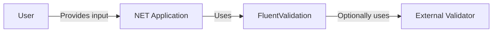
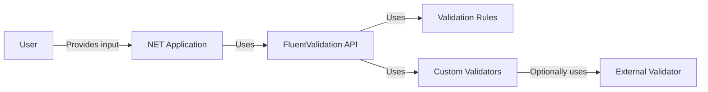
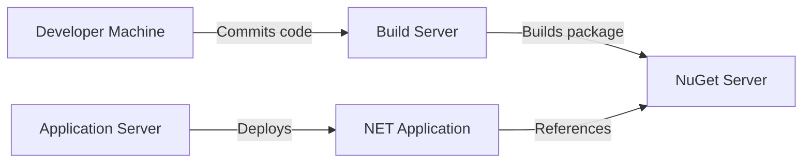
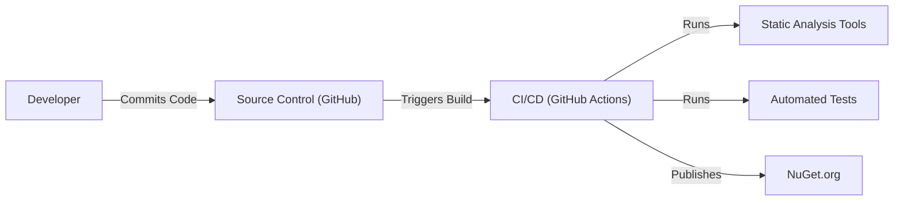

# BUSINESS POSTURE

Business Priorities and Goals:

*   Provide a robust, flexible, and easy-to-use validation library for .NET applications.
*   Enable developers to define validation rules using a fluent interface, making the code more readable and maintainable.
*   Support a wide range of validation scenarios, including simple property validation, complex object graph validation, and asynchronous validation.
*   Offer seamless integration with popular .NET frameworks like ASP.NET Core and Blazor.
*   Maintain a high level of code quality, test coverage, and documentation.
*   Foster a strong community around the library, encouraging contributions and providing support.

Most Important Business Risks:

*   Inconsistent or incorrect validation logic leading to data integrity issues in applications using the library.
*   Security vulnerabilities within the library that could be exploited by malicious actors (e.g., injection attacks, denial of service).
*   Lack of support for specific validation scenarios or frameworks, limiting the library's adoption.
*   Performance bottlenecks in the library, impacting the performance of applications using it.
*   Difficulties in maintaining and evolving the library due to complex or poorly documented code.

# SECURITY POSTURE

Existing Security Controls:

*   security control: Input validation is the core purpose of the library. The library provides mechanisms to validate user input and prevent invalid data from being processed. (Implemented throughout the library's codebase).
*   security control: The library uses parameterized queries where applicable to prevent SQL injection vulnerabilities when interacting with databases. (Described in documentation and examples).
*   security control: The library is regularly tested for security vulnerabilities using static analysis tools and manual code reviews. (Implied by the project's commitment to quality and security).
*   security control: The library provides mechanisms for custom validation rules, allowing developers to implement application-specific security checks. (Implemented throughout the library's codebase).
*   security control: The library supports asynchronous validation, which can help prevent denial-of-service attacks by offloading long-running validation tasks to background threads. (Implemented in the asynchronous validation features).

Accepted Risks:

*   accepted risk: The library relies on developers to correctly implement and configure validation rules. Incorrect usage could lead to security vulnerabilities.
*   accepted risk: The library does not provide built-in protection against all types of security threats (e.g., cross-site scripting, cross-site request forgery). Developers are responsible for implementing appropriate security measures in their applications.

Recommended Security Controls:

*   security control: Implement a comprehensive security testing strategy, including fuzzing and penetration testing, to identify and address potential vulnerabilities.
*   security control: Provide clear and concise security documentation, guiding developers on how to use the library securely and avoid common pitfalls.
*   security control: Establish a vulnerability disclosure program to encourage responsible reporting of security issues.
*   security control: Regularly review and update dependencies to address known vulnerabilities in third-party libraries.
*   security control: Consider adding built-in support for common security-related validation scenarios, such as anti-forgery token validation or input sanitization.

Security Requirements:

*   Authentication: Not directly applicable to the validation library itself. Authentication should be handled by the application using the library.
*   Authorization: Not directly applicable to the validation library itself. Authorization should be handled by the application using the library.
*   Input Validation:
    *   All user-provided input must be validated against a predefined schema or set of rules.
    *   Validation rules should be comprehensive and cover all relevant data types and formats.
    *   Validation failures should be handled gracefully, providing informative error messages to the user.
    *   The library should support both synchronous and asynchronous validation.
    *   The library should allow for custom validation rules to be defined.
*   Cryptography:
    *   If the library handles sensitive data (which it shouldn't, as its primary focus is validation), it should use appropriate cryptographic algorithms and techniques to protect the data at rest and in transit.
    *   Cryptographic keys should be managed securely.
*   Output Encoding:
    *   If library is used to generate any output, it should be properly encoded to prevent injection attacks.

# DESIGN

## C4 CONTEXT

Element Descriptions:

*   Element:
    *   Name: User
    *   Type: Person
    *   Description: Represents a user interacting with a .NET application that utilizes FluentValidation.
    *   Responsibilities: Provides input to the application.
    *   Security controls: None (responsibility of the .NET application).

*   Element:
    *   Name: .NET Application
    *   Type: Software System
    *   Description: A .NET application that uses FluentValidation for input validation.
    *   Responsibilities: Handles user requests, processes data, and interacts with other systems.
    *   Security controls: Implements authentication, authorization, and other application-level security measures.

*   Element:
    *   Name: FluentValidation
    *   Type: Library
    *   Description: The FluentValidation library itself.
    *   Responsibilities: Provides validation logic and rules for the .NET application.
    *   Security controls: Implements input validation, supports parameterized queries, and provides mechanisms for custom validation rules.

*   Element:
    *   Name: External Validator
    *   Type: Software System
    *   Description: External system that can be used by FluentValidation. E.g. ReCaptha validator.
    *   Responsibilities: Provides external validation logic.
    *   Security controls: Implements own security controls.

## C4 CONTAINER

Element Descriptions:

*   Element:
    *   Name: User
    *   Type: Person
    *   Description: Represents a user interacting with a .NET application.
    *   Responsibilities: Provides input to the application.
    *   Security controls: None (responsibility of the .NET application).

*   Element:
    *   Name: .NET Application
    *   Type: Software System
    *   Description: A .NET application that uses FluentValidation.
    *   Responsibilities: Handles user requests, processes data, and interacts with other systems.
    *   Security controls: Implements authentication, authorization, and other application-level security measures.

*   Element:
    *   Name: FluentValidation API
    *   Type: API
    *   Description: The public API of the FluentValidation library.
    *   Responsibilities: Provides methods for defining and executing validation rules.
    *   Security controls: Implements input validation logic.

*   Element:
    *   Name: Validation Rules
    *   Type: Component
    *   Description: Pre-built validation rules provided by FluentValidation.
    *   Responsibilities: Implements specific validation logic (e.g., not null, email, max length).
    *   Security controls: Implements input validation checks.

*   Element:
    *   Name: Custom Validators
    *   Type: Component
    *   Description: Custom validation rules defined by developers.
    *   Responsibilities: Implements application-specific validation logic.
    *   Security controls: Implements custom input validation checks.

*   Element:
    *   Name: External Validator
    *   Type: Software System
    *   Description: External system that can be used by FluentValidation. E.g. ReCaptha validator.
    *   Responsibilities: Provides external validation logic.
    *   Security controls: Implements own security controls.

## DEPLOYMENT

Possible Deployment Solutions:

1.  NuGet Package: The most common way to deploy FluentValidation is as a NuGet package. The package is added as a dependency to the .NET application project.
2.  Manual DLL Reference: The FluentValidation DLL can be manually referenced in the .NET application project.
3.  Source Code Integration: The FluentValidation source code can be directly integrated into the .NET application project.

Chosen Solution (NuGet Package):

Element Descriptions:

*   Element:
    *   Name: Developer Machine
    *   Type: Infrastructure Node
    *   Description: The developer's workstation where the code is written and tested.
    *   Responsibilities: Code development, unit testing, and local debugging.
    *   Security controls: Development environment security best practices.

*   Element:
    *   Name: Build Server
    *   Type: Infrastructure Node
    *   Description: A server that builds the FluentValidation NuGet package.
    *   Responsibilities: Compiling the code, running tests, and creating the NuGet package.
    *   Security controls: Build server security best practices, code signing.

*   Element:
    *   Name: NuGet Server
    *   Type: Infrastructure Node
    *   Description: A server that hosts the FluentValidation NuGet package. This could be the public NuGet.org server or a private NuGet server.
    *   Responsibilities: Storing and serving NuGet packages.
    *   Security controls: NuGet server security best practices, access control.

*   Element:
    *   Name: Application Server
    *   Type: Infrastructure Node
    *   Description: The server where the .NET application is deployed.
    *   Responsibilities: Running the .NET application.
    *   Security controls: Server security best practices, network security.

*   Element:
    *   Name: .NET Application
    *   Type: Software System
    *   Description: The .NET application that uses FluentValidation.
    *   Responsibilities: Handling user requests, processing data, and interacting with other systems.
    *   Security controls: Application-level security measures, including input validation using FluentValidation.

## BUILD

Build Process Description:

1.  Developer commits code changes to the GitHub repository.
2.  GitHub Actions (CI/CD) is triggered by the commit.
3.  The CI/CD pipeline performs the following steps:
    *   Checks out the code from the repository.
    *   Restores NuGet dependencies.
    *   Builds the project in Release configuration.
    *   Runs static analysis tools (e.g., linters, code analyzers) to identify potential code quality and security issues.
    *   Runs automated tests (unit tests, integration tests) to ensure the code functions correctly and meets quality standards.
    *   If all checks and tests pass, creates a NuGet package.
    *   Publishes the NuGet package to NuGet.org.

Security Controls:

*   security control: Source Control (GitHub): Provides version control and audit trails for code changes.
*   security control: CI/CD (GitHub Actions): Automates the build process, ensuring consistency and reducing the risk of manual errors.
*   security control: Static Analysis Tools: Identify potential code quality and security issues early in the development lifecycle.
*   security control: Automated Tests: Ensure the code functions correctly and meets quality standards, reducing the risk of introducing bugs or vulnerabilities.
*   security control: NuGet Package Signing: The NuGet package can be signed to ensure its integrity and authenticity.

# RISK ASSESSMENT

Critical Business Processes to Protect:

*   Data validation process: Ensuring that data processed by applications using FluentValidation is accurate and consistent.
*   Application functionality: Preventing disruptions or malfunctions in applications due to invalid data or security vulnerabilities in the library.

Data to Protect and Sensitivity:

*   FluentValidation itself does not store or process sensitive data directly. Its primary function is to validate data. However, the *applications* using FluentValidation may handle sensitive data of varying levels of sensitivity, depending on the application's purpose. This could include:
    *   Personally Identifiable Information (PII): Names, addresses, email addresses, phone numbers, etc. (High sensitivity)
    *   Financial Data: Credit card numbers, bank account details, transaction history. (High sensitivity)
    *   Authentication Credentials: Usernames, passwords, API keys. (High sensitivity)
    *   Business Data: Proprietary information, trade secrets, internal documents. (High sensitivity)
    *   User Preferences and Settings: Non-sensitive data related to user preferences. (Low sensitivity)

# QUESTIONS & ASSUMPTIONS

Questions:

*   Are there any specific compliance requirements (e.g., GDPR, HIPAA, PCI DSS) that applications using FluentValidation must adhere to?
*   What are the expected performance requirements for applications using FluentValidation?
*   Are there any specific security concerns or threats that the FluentValidation team is particularly worried about?
*   What is the process for reporting and addressing security vulnerabilities in FluentValidation?
*   Are there any plans to add built-in support for specific security-related validation scenarios in the future?

Assumptions:

*   BUSINESS POSTURE: The primary goal of FluentValidation is to provide a robust and easy-to-use validation library, prioritizing developer experience and flexibility.
*   SECURITY POSTURE: Developers using FluentValidation are responsible for implementing appropriate security measures in their applications, including authentication, authorization, and output encoding. FluentValidation is assumed to be a tool for input validation, not a comprehensive security solution.
*   DESIGN: The library is primarily used as a NuGet package and integrated into .NET applications. The build process is automated using GitHub Actions, and the package is published to NuGet.org.