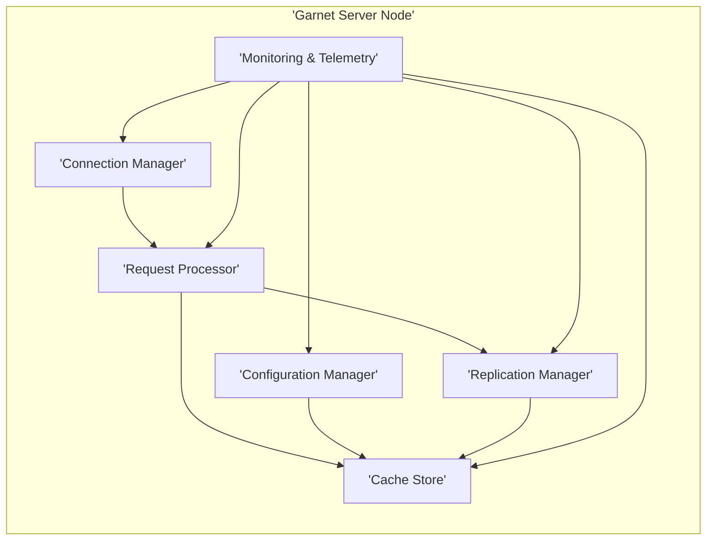
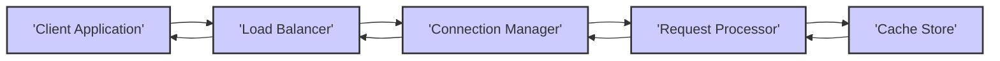

## Project Design Document: Garnet - In-Memory Remote Caching

**Version:** 1.1
**Date:** October 26, 2023
**Author:** AI Software Architect

### 1. Project Overview

Garnet is a high-performance, distributed in-memory remote caching system developed by Microsoft. It is engineered to provide extremely low-latency access to frequently accessed data, significantly enhancing the performance and scalability of applications. This document details the architectural design of Garnet, with a specific focus on its core components, data flow mechanisms, and critical security considerations. This document is intended to be the primary resource for subsequent threat modeling activities.

### 2. Goals and Objectives

* **Primary Goal:** To furnish a comprehensive and detailed architectural overview of the Garnet system, specifically tailored for effective threat modeling.
* **Objectives:**
    * Clearly and concisely define the major architectural components of the Garnet system.
    * Accurately illustrate the flow of data within the system during various operations.
    * Identify and articulate key security considerations and potential areas of vulnerability.
    * Establish a solid foundation for the identification, analysis, and mitigation of potential security threats.

### 3. Target Audience

This document is primarily intended for:

* Security engineers and architects tasked with performing threat modeling and security assessments of the Garnet system.
* Development teams involved in the development, maintenance, or extension of the Garnet system.
* Operations teams responsible for the deployment, configuration, and ongoing management of Garnet clusters.

### 4. High-Level Architecture

Garnet is designed as a distributed system where client applications interact with a cluster of independent Garnet server nodes. A load balancer is typically employed to distribute client requests across these nodes.

```mermaid
graph LR
    subgraph "Garnet Cluster"
        A["'Garnet Server Node 1'"]
        B["'Garnet Server Node 2'"]
        C["'Garnet Server Node N'"]
        LB["'Load Balancer'"]
        A --- "'Replication / Data Sharing'" --- B
        B --- "'Replication / Data Sharing'" --- C
    end
    D["'Client Application 1'"]
    E["'Client Application 2'"]
    F["'Client Application M'"]
    D --> LB
    E --> LB
    F --> LB
    LB --> A
    LB --> B
    LB --> C
```

**Key Components:**

* **Client Application:**  Any application that interacts with the Garnet cache to perform data storage and retrieval operations.
* **Load Balancer:**  A network component responsible for distributing incoming client requests evenly across the available Garnet server nodes. This ensures high availability, fault tolerance, and efficient resource utilization.
* **Garnet Server Node:**  An individual instance of the Garnet server application. Each node is responsible for storing a subset of the cached data in its in-memory store.
* **Replication / Data Sharing Mechanism:**  The underlying mechanism that ensures data consistency and availability across the Garnet cluster. This may involve techniques like data replication, data sharding, or a combination of both.

### 5. Component Design

This section provides a more detailed breakdown of the internal components within a typical Garnet Server Node.



**Detailed Component Descriptions:**

* **Connection Manager:**
    - Responsible for establishing and managing incoming network connections from client applications.
    - Handles the initial authentication and authorization of client requests to ensure only authorized clients can interact with the server.
    - May implement connection pooling and keep-alive mechanisms for efficient resource utilization.
* **Request Processor:**
    - Receives validated requests from the Connection Manager.
    - Parses and validates the syntax and semantics of incoming requests (e.g., GET, SET, DELETE operations).
    - Orchestrates the interaction with the Cache Store and Replication Manager to fulfill client requests.
* **Cache Store:**
    - The core component responsible for the in-memory storage of cached data.
    - Implements efficient data structures (e.g., hash tables, concurrent dictionaries) for rapid storage and retrieval of data.
    - May implement various eviction policies (e.g., LRU, LFU) to manage memory usage when the cache reaches its capacity.
* **Replication Manager:**
    - Responsible for maintaining data consistency and fault tolerance across the Garnet cluster by replicating data to other nodes.
    - Handles inter-node communication for data synchronization and consistency protocols.
    - May implement different replication strategies, such as synchronous or asynchronous replication, depending on consistency and performance requirements.
* **Configuration Manager:**
    - Manages the configuration settings for the Garnet server node.
    - Loads configuration parameters from files, environment variables, or a centralized configuration store.
    - May support dynamic reconfiguration of certain settings without requiring a server restart.
* **Monitoring & Telemetry:**
    - Collects and exposes real-time metrics about the server's performance, health, and resource utilization.
    - Provides insights into key performance indicators (KPIs) such as cache hit rates, latency, memory usage, and error rates.
    - May integrate with external monitoring and logging systems for centralized monitoring and alerting.

### 6. Data Flow

This section illustrates the typical data flow for both data write and read operations within the Garnet system.

**6.1. Write Operation:**

```mermaid
graph LR
    CA["'Client Application'"] --> LB["'Load Balancer'"]
    LB --> CM["'Connection Manager'"]
    CM --> RP["'Request Processor'"]
    RP --> CS["'Cache Store'"]
    RP --> RM["'Replication Manager'"]
    RM --> "Other Server Nodes"
    style CA fill:#ccf,stroke:#333,stroke-width:2px
    style LB fill:#ccf,stroke:#333,stroke-width:2px
    style CM fill:#ccf,stroke:#333,stroke-width:2px
    style RP fill:#ccf,stroke:#333,stroke-width:2px
    style CS fill:#ccf,stroke:#333,stroke-width:2px
    style RM fill:#ccf,stroke:#333,stroke-width:2px
```

1. The Client Application initiates a write request (e.g., a SET operation) and sends it to the Load Balancer.
2. The Load Balancer intelligently routes the request to an appropriate and available Garnet Server Node based on its load balancing algorithm.
3. The Connection Manager on the receiving server establishes and manages the connection with the client.
4. The Request Processor receives the request, performs necessary validation, and interacts with the Cache Store to store the provided data in memory.
5. The Replication Manager then takes over to propagate the newly stored data to other nodes within the cluster, ensuring data consistency according to the configured replication strategy.

**6.2. Read Operation:**



1. The Client Application sends a read request (e.g., a GET operation) to the Load Balancer.
2. The Load Balancer directs the request to an appropriate Garnet Server Node.
3. The Connection Manager on the receiving server handles the connection.
4. The Request Processor validates the request and queries the local Cache Store for the requested data.
5. The Cache Store retrieves the data from its in-memory storage and returns it to the Request Processor.
6. The Request Processor constructs the response and sends it back to the Client Application through the Connection Manager and Load Balancer.

### 7. Security Considerations

This section details critical security considerations relevant to the Garnet system, highlighting potential vulnerabilities and areas of concern for threat modeling.

* **Authentication and Authorization:**
    - **Consideration:** How are client applications authenticated when establishing connections with the Garnet cluster? Are API keys, certificates, or other mechanisms used?
    - **Threats:** Weak or default credentials, lack of mutual authentication, unauthorized access due to compromised credentials.
    - **Consideration:** Are there granular access control mechanisms to restrict client access to specific data or operations?
    - **Threats:** Privilege escalation, data breaches due to insufficient access controls.
    - **Consideration:** How are secrets (e.g., API keys, passwords for inter-node communication) managed and stored securely?
    - **Threats:** Exposure of sensitive credentials leading to unauthorized access or control.
* **Data Confidentiality:**
    - **Consideration:** Is data encrypted in transit between client applications and the Garnet cluster? Is TLS/SSL enforced?
    - **Threats:** Man-in-the-middle attacks, eavesdropping on sensitive data.
    - **Consideration:** Is data encrypted at rest within the Garnet server's memory? While less common for in-memory caches, it's relevant for highly sensitive data.
    - **Threats:** Memory dumping attacks, unauthorized access to data in memory.
* **Data Integrity:**
    - **Consideration:** How is the integrity of data ensured during transmission and storage? Are checksums or other mechanisms used?
    - **Threats:** Data tampering during transmission or within the cache.
* **Availability:**
    - **Consideration:** How is the Garnet cluster protected against denial-of-service (DoS) and distributed denial-of-service (DDoS) attacks?
    - **Threats:** Service disruption, resource exhaustion.
    - **Consideration:** Are there rate limiting mechanisms in place to prevent abuse?
    - **Threats:** Resource exhaustion by malicious clients.
    - **Consideration:** How is high availability achieved through replication and load balancing? Are there potential single points of failure?
    - **Threats:** Service outages due to infrastructure failures.
* **Input Validation:**
    - **Consideration:** How are client requests validated to prevent injection attacks (e.g., command injection, NoSQL injection if applicable)?
    - **Threats:** Remote code execution, data manipulation.
    - **Consideration:** Are there limitations on the size or type of data that can be stored to prevent resource exhaustion or other vulnerabilities?
    - **Threats:** Buffer overflows, denial of service.
* **Network Security:**
    - **Consideration:** How is network access to the Garnet cluster controlled? Are firewalls and network segmentation used?
    - **Threats:** Unauthorized access to the cluster from untrusted networks.
    - **Consideration:** Are the communication channels between server nodes secured?
    - **Threats:** Eavesdropping or tampering with inter-node communication.
* **Secrets Management:**
    - **Consideration:** How are sensitive credentials (e.g., for inter-node communication, integration with external services) stored and managed securely? Is a dedicated secrets management system used?
    - **Threats:** Exposure of sensitive credentials leading to broader system compromise.
* **Auditing and Logging:**
    - **Consideration:** What events are logged within the Garnet system? Are authentication attempts, data access, and administrative actions logged?
    - **Threats:** Lack of visibility into security incidents, difficulty in forensic analysis.
    - **Consideration:** Are logs securely stored and accessible for auditing purposes?
    - **Threats:** Tampering with or deletion of audit logs.
    - **Consideration:** Are there mechanisms to detect and alert on suspicious activity?
    - **Threats:** Delayed detection of security breaches.
* **Vulnerability Management:**
    - **Consideration:** How are vulnerabilities in the Garnet codebase and its dependencies identified and addressed? Is there a regular security scanning and patching process?
    - **Threats:** Exploitation of known vulnerabilities.
* **Secure Configuration:**
    - **Consideration:** Are there secure default configurations for the Garnet server nodes? Are unnecessary features disabled?
    - **Threats:** Exploitation of insecure default settings.
    - **Consideration:** Are there guidelines and best practices for securely configuring the system?
    - **Threats:** Misconfiguration leading to security weaknesses.

### 8. Deployment Considerations

* **Infrastructure:**
    - Where will the Garnet cluster be deployed (e.g., cloud environment, on-premises data center)? This impacts network security and access control strategies.
    - What are the specific infrastructure requirements (e.g., network bandwidth, compute resources, memory)?
* **Scalability:**
    - How can the Garnet cluster be scaled horizontally to accommodate increased load and data volume?
    - What are the procedures for adding or removing nodes from the cluster while maintaining availability and data consistency?
* **High Availability:**
    - How is high availability ensured in the deployment architecture? Are there redundant components and automatic failover mechanisms?
    - What is the recovery time objective (RTO) and recovery point objective (RPO) for the Garnet service?
* **Monitoring and Logging:**
    - What monitoring and logging infrastructure will be used to continuously monitor the health, performance, and security of the Garnet cluster?
    - How will alerts be configured for critical events, including security incidents?

### 9. Future Enhancements (Potential Areas for Threat Consideration)

* **Persistence:** If Garnet were to introduce persistence capabilities (e.g., writing data to disk), this would introduce new security considerations related to persistent data storage, encryption at rest, and access control to storage media.
* **Advanced Querying:** Implementing more complex querying functionalities could introduce new attack vectors, such as query injection vulnerabilities, requiring careful input sanitization and validation.
* **Integration with other services:** Integrating Garnet with other internal or external services could create new attack surfaces if the integration points are not secured properly. This includes authentication and authorization between services.

This revised document provides a more detailed and comprehensive overview of the Garnet system architecture, specifically tailored to facilitate a thorough and effective threat modeling exercise. The enhanced descriptions of components, data flows, and security considerations aim to provide a solid foundation for identifying potential vulnerabilities and developing appropriate mitigation strategies.