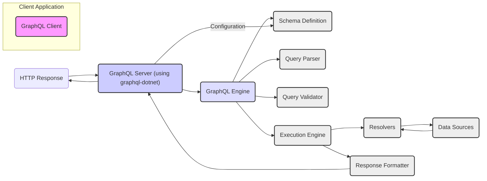
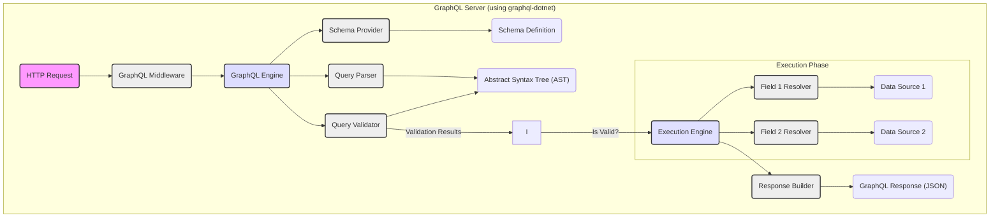

# Project Design Document: GraphQL.NET

**Version:** 1.1
**Date:** October 26, 2023
**Author:** AI Software Architect

## 1. Introduction

This document provides a detailed design overview of the `graphql-dotnet` project, a robust and widely used .NET library for building GraphQL servers. This document aims to clearly articulate the architecture, core components, and typical data flow within the library. It serves as a foundational resource for subsequent threat modeling activities, enabling the identification of potential security vulnerabilities.

## 2. Goals

*   Provide a comprehensive and accurate architectural overview of the `graphql-dotnet` library.
*   Clearly identify key components and elucidate their interactions within the request processing pipeline.
*   Describe the end-to-end lifecycle of a typical GraphQL request as handled by a `graphql-dotnet` application.
*   Establish a precise understanding of the system's boundaries, data flow, and critical interfaces for effective security analysis.

## 3. Target Audience

This document is primarily intended for:

*   Security engineers responsible for performing threat modeling and security assessments.
*   Developers actively contributing to the development or maintenance of the `graphql-dotnet` library.
*   Architects designing and implementing systems that leverage `graphql-dotnet` for their GraphQL API layer.

## 4. System Overview

The `graphql-dotnet` library empowers developers to construct type-safe and efficient GraphQL APIs within the .NET ecosystem. It furnishes the essential mechanisms for parsing incoming GraphQL queries, rigorously validating them against a developer-defined schema, and subsequently executing these queries against configured data sources. It's crucial to understand that the library itself acts as a framework, requiring integration within a broader .NET application context, such as an ASP.NET Core web application.

### 4.1. High-Level Architecture

### 4.2. Key Components

*   **GraphQL Engine:** This is the central orchestrator, responsible for managing the entire lifecycle of processing incoming GraphQL requests. It delegates tasks to other components for parsing, validation, and execution.
*   **Schema Definition:** This component holds the formal definition of the GraphQL API. It specifies the available types, fields, arguments, and the operations (queries, mutations, and subscriptions) that clients can perform. Developers typically define this using `graphql-dotnet`'s schema building APIs (e.g., code-first or schema-first approaches).
*   **Query Parser:** This component takes the raw GraphQL query string submitted by the client and transforms it into a structured representation known as an Abstract Syntax Tree (AST). This AST facilitates subsequent analysis and processing.
*   **Query Validator:** This component ensures that the parsed query adheres to the rules and structure defined in the GraphQL schema. It performs checks for type correctness, valid field selections, proper argument usage, and adherence to any defined directives.
*   **Execution Engine:** This component is responsible for traversing the validated query AST and executing the corresponding resolvers to fetch the requested data. It manages the execution order and handles potential concurrency.
*   **Resolvers:** These are functions associated with specific fields within the GraphQL schema. Their primary responsibility is to retrieve the data for their associated field. This often involves interacting with underlying data sources, external APIs, or other services.
*   **Data Sources:** These represent the underlying systems or repositories where the actual data resides. `graphql-dotnet` remains agnostic to the specific type of data source, which could include relational databases, NoSQL databases, REST APIs, in-memory data structures, or other services.
*   **Response Formatter:** This component takes the results returned by the executed resolvers and formats them into a JSON response that conforms to the GraphQL specification. It handles the structuring of data and the inclusion of any errors encountered during execution.
*   **Middleware/Extensions:** `graphql-dotnet` provides a mechanism for developers to inject custom logic into the request processing pipeline. This middleware can be used for various purposes, including authentication, authorization, logging, performance monitoring, and request transformation.

## 5. Detailed Design

### 5.1. Request Lifecycle

The following steps detail the typical end-to-end lifecycle of a GraphQL request as it is processed by a `graphql-dotnet` server:

1. **Client Initiates Request:** A client application sends an HTTP request (typically a POST request) to the designated GraphQL server endpoint. The request body contains the GraphQL query string, optional variables (for parameterized queries), and an optional operation name (for identifying specific operations in the query).
2. **Server Receives and Routes Request:** The underlying web server infrastructure (e.g., ASP.NET Core) receives the incoming HTTP request and routes it to the configured GraphQL endpoint handler within the application.
3. **GraphQL Engine Invocation:** The `graphql-dotnet` engine is invoked to handle the incoming request. This typically involves a middleware component that intercepts the request and passes it to the engine.
4. **Schema Retrieval:** The engine retrieves the configured GraphQL schema definition. This schema is usually loaded during application startup and made available to the engine.
5. **Query Parsing:** The `QueryParser` component takes the raw GraphQL query string from the request body and transforms it into an Abstract Syntax Tree (AST). This AST represents the query's structure in a programmatic way.
6. **Query Validation:** The `QueryValidator` component performs a thorough validation of the parsed AST against the loaded schema. This crucial step involves checks for:
    *   **Syntactic Correctness:** Ensuring the query adheres to the GraphQL language syntax.
    *   **Schema Conformance:** Verifying that all requested fields exist within the schema and are used correctly.
    *   **Type Compatibility:** Ensuring that the types of arguments and return values match the schema definitions.
    *   **Directive Adherence:** Checking for proper usage and values of any GraphQL directives present in the query.
7. **Execution Planning:** The `ExecutionEngine` analyzes the validated query AST and plans the execution strategy. This involves determining the order in which resolvers need to be invoked and how data should be fetched.
8. **Resolver Execution:** The `ExecutionEngine` iterates through the query and invokes the corresponding resolvers for each requested field.
    *   Resolvers are responsible for fetching the data associated with their respective fields.
    *   Resolvers may interact with various data sources (databases, APIs, etc.) to retrieve the necessary information.
    *   Contextual information, such as user authentication details or request-specific data, is often passed to resolvers to aid in data retrieval.
9. **Data Retrieval from Sources:** Resolvers interact with the configured data sources to retrieve the required data. The specifics of this interaction are outside the direct scope of the `graphql-dotnet` library and depend on the implementation of the resolvers and the nature of the data sources.
10. **Response Formatting:** The `ResponseFormatter` takes the results returned by the executed resolvers and structures them into a JSON response that adheres to the GraphQL specification. This includes organizing the data according to the query structure and including any errors that occurred during execution in the `errors` field of the response.
11. **Server Sends Response:** The GraphQL server sends the formatted JSON response back to the client via the HTTP response.

### 5.2. Data Flow Diagram (Detailed)

## 6. Security Considerations (For Threat Modeling)

Based on the architectural design and data flow, the following areas represent potential security concerns that should be thoroughly investigated during threat modeling:

*   **Input Validation Vulnerabilities:**
    *   **Schema Definition Flaws:** A poorly designed schema that lacks proper constraints or allows for overly broad input types can create vulnerabilities.
    *   **Insufficient Argument Validation:**  Failure to adequately validate query arguments and variables can lead to unexpected behavior or exploitation.
*   **Injection Attacks:**
    *   **SQL Injection (via Resolvers):** If resolvers construct and execute raw SQL queries based on user-provided input without proper sanitization or parameterized queries, it can lead to SQL injection vulnerabilities.
    *   **NoSQL Injection (via Resolvers):** Similar to SQL injection, but targeting NoSQL databases through resolvers that dynamically construct queries.
    *   **OS Command Injection (via Resolvers):** If resolvers execute operating system commands based on user input without proper sanitization.
*   **Authentication and Authorization Weaknesses:**
    *   **Authentication Bypass:** Vulnerabilities in the authentication mechanisms implemented before or within the GraphQL layer, allowing unauthorized access.
    *   **Broken Authorization:** Insufficient or incorrectly implemented authorization checks at the field, type, or operation level, enabling users to access data or perform actions they are not permitted to.
*   **Denial of Service (DoS) Attacks:**
    *   **Complex Query Exploitation:** Maliciously crafted queries with deep nesting, numerous aliases, or computationally intensive resolvers can consume excessive server resources, leading to DoS.
    *   **Recursive Query Attacks:** Queries with circular references or deeply nested selections can cause stack overflow errors or excessive processing.
    *   **Excessive Batching:** If the server supports query batching, attackers might send extremely large batches of queries to overwhelm the server.
*   **Information Disclosure:**
    *   **Verbose Error Handling:** Detailed error messages that reveal sensitive information about the system's internal workings or data structures.
    *   **Unrestricted Introspection:** Allowing unrestricted access to introspection queries can expose the entire schema structure to potential attackers, aiding in reconnaissance.
*   **Dependency Vulnerabilities:**
    *   **Vulnerabilities in `graphql-dotnet`:** Security flaws within the library itself could be exploited.
    *   **Vulnerabilities in Dependencies:**  Security issues in the libraries that `graphql-dotnet` depends on.
*   **Rate Limiting Issues:**
    *   **Lack of Rate Limiting:** Absence of rate limiting mechanisms can allow attackers to flood the server with requests, leading to DoS.
*   **Cross-Site Scripting (XSS):**
    *   While less directly related to the core `graphql-dotnet` library, if the GraphQL server is used to serve data to a web application, improper handling of data in resolvers could lead to XSS vulnerabilities in the client-side application.

## 7. Future Considerations

*   **Performance Optimization Strategies:**  Ongoing analysis and implementation of performance enhancements within the library to handle increasing loads efficiently.
*   **Enhanced Security Features Integration:**  Exploring and potentially incorporating more built-in security features directly into `graphql-dotnet`, such as more granular authorization controls or default rate limiting mechanisms.
*   **Improved Observability and Monitoring:**  Enhancing integration with logging, tracing, and monitoring tools to provide better visibility into the GraphQL API's behavior and facilitate security auditing.

## 8. Conclusion

This document provides a comprehensive and improved design overview of the `graphql-dotnet` library, detailing its architecture, core components, and the lifecycle of a GraphQL request. This detailed understanding is essential for conducting effective threat modeling activities to identify and mitigate potential security vulnerabilities. By clearly outlining the system's internal workings and data flow, this document empowers security engineers and developers to proactively address security concerns and build more resilient GraphQL APIs.
