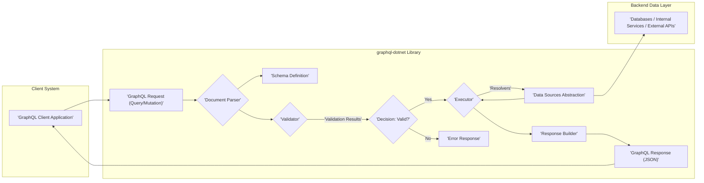

# Project Design Document: graphql-dotnet

**Version:** 1.1
**Date:** October 26, 2023
**Author:** AI Software Architect

## 1. Introduction

This document provides an enhanced architectural design of the `graphql-dotnet` project, a port of Facebook's GraphQL to .NET. This revised document aims to provide an even stronger foundation for subsequent threat modeling activities by offering a more detailed understanding of the system's components, interactions, and data flow, with a sharper focus on security implications.

**Goals of this Document:**

*   Provide a clear and detailed architectural overview of the `graphql-dotnet` library, emphasizing security-relevant aspects.
*   Identify key components and their responsibilities, with specific attention to potential vulnerabilities.
*   Illustrate the data flow within the library during query execution, highlighting potential points of interception or manipulation.
*   Elaborate on security considerations for each component and the overall system to facilitate effective threat modeling.

**Scope:**

This document focuses on the core `graphql-dotnet` library's internal architecture and its security characteristics. While external dependencies are mentioned, their internal workings are not within the scope. Specific implementations built *using* `graphql-dotnet` are also excluded.

## 2. Project Overview

The `graphql-dotnet` library enables the creation of GraphQL servers and clients within the .NET environment. It handles the crucial tasks of parsing, validating, and executing GraphQL operations against a user-defined schema. The library's architecture is centered around processing incoming requests and generating appropriate responses based on the schema and underlying data sources.

**Architectural Diagram:**

**Key Components:**

*   **GraphQL Client Application:** The entity initiating the GraphQL operation by sending a query or mutation.
*   **GraphQL Request (Query/Mutation):** The textual representation of the desired GraphQL operation.
*   **Document Parser:**  Analyzes the incoming GraphQL request string and transforms it into a structured Abstract Syntax Tree (AST).
*   **Schema Definition:**  The blueprint of the GraphQL API, defining the available types, fields, relationships, and directives. This is crucial for understanding the API's capabilities and potential vulnerabilities.
*   **Validator:**  Compares the parsed AST against the `Schema Definition` to ensure the request is valid according to the defined rules and the GraphQL specification.
*   **Decision: Valid?:** A logical point representing the outcome of the validation process.
*   **Executor:** The core engine that drives the execution of a valid GraphQL request by traversing the AST and invoking the appropriate resolvers.
*   **Resolvers:** Functions or methods associated with specific fields in the schema, responsible for fetching the data required to fulfill the request. These are the primary points of interaction with backend systems.
*   **Data Sources Abstraction:** Represents the layer through which resolvers interact with underlying data sources, allowing for flexibility and potentially adding security measures.
*   **Response Builder:**  Constructs the final GraphQL response, typically in JSON format, containing the requested data or error information.
*   **GraphQL Response (JSON):** The structured output of the GraphQL operation sent back to the client.
*   **Databases / Internal Services / External APIs:** The actual data stores and services that provide the data resolved by the resolvers.

## 3. Component Details

This section provides a more in-depth examination of the key components, highlighting their functionalities and security considerations relevant for threat modeling.

*   **Document Parser:**
    *   **Responsibility:** Converts the raw GraphQL query string into a structured AST.
    *   **Key Functionalities:** Lexical analysis, syntactic analysis, tokenization.
    *   **Security Considerations:**
        *   **Denial of Service (DoS):**  Susceptible to attacks using excessively large or deeply nested queries that consume significant parsing resources.
        *   **Injection Attacks:** While less direct than in SQL, vulnerabilities in the parser could potentially be exploited with crafted input.

*   **Schema Definition:**
    *   **Responsibility:** Defines the structure and capabilities of the GraphQL API.
    *   **Key Functionalities:** Type definition, field declaration, argument specification, directive application, resolver mapping.
    *   **Security Considerations:**
        *   **Information Disclosure:**  Poorly designed schemas can unintentionally expose sensitive data or relationships.
        *   **Authorization Bypass:** Lack of proper field-level authorization within the schema can lead to unauthorized data access.
        *   **Mutation Abuse:**  Unrestricted or overly permissive mutations can allow malicious data manipulation.

*   **Validator:**
    *   **Responsibility:** Enforces the rules defined in the schema and the GraphQL specification.
    *   **Key Functionalities:** Type checking, argument validation, directive validation, operation validation (e.g., ensuring only one mutation per request).
    *   **Security Considerations:**
        *   **Insufficient Validation:** Weak validation can allow invalid or malicious queries to proceed to the execution phase.
        *   **Bypass Vulnerabilities:** Flaws in the validation logic could be exploited to bypass intended restrictions.
        *   **Error Handling:** Verbose error messages during validation might reveal sensitive information about the schema.

*   **Executor:**
    *   **Responsibility:** Orchestrates the execution of validated GraphQL requests.
    *   **Key Functionalities:** AST traversal, resolver invocation, data aggregation, error handling during execution.
    *   **Security Considerations:**
        *   **Performance Issues:**  Execution of complex queries or resolvers can lead to performance degradation or DoS.
        *   **Authorization Enforcement:** The executor is often responsible for enforcing authorization rules before or during resolver invocation.
        *   **Resource Exhaustion:**  Malicious queries could be crafted to trigger expensive resolver operations, leading to resource exhaustion.

*   **Resolvers:**
    *   **Responsibility:** Implement the business logic for fetching and manipulating data for specific fields.
    *   **Key Functionalities:** Data retrieval from databases, API calls, data transformation, business rule enforcement.
    *   **Security Considerations:**
        *   **Injection Attacks (SQL, NoSQL, etc.):** If resolvers directly construct database queries or API calls based on user-provided arguments without proper sanitization.
        *   **Authorization Flaws:**  Failure to properly authorize access to underlying data sources within resolvers.
        *   **Data Leaks:**  Resolvers might unintentionally expose more data than intended.
        *   **Vulnerable Dependencies:**  Resolvers might rely on external libraries with known vulnerabilities.

*   **Data Sources Abstraction:**
    *   **Responsibility:** Provides an intermediary layer between resolvers and the actual data sources.
    *   **Key Functionalities:** Data access logic, caching, potentially security enforcement (e.g., common authorization checks).
    *   **Security Considerations:**
        *   **Bypass Risk:** If not properly implemented, resolvers might bypass this layer and directly access data sources, circumventing security measures.
        *   **Vulnerabilities in Abstraction Layer:** The abstraction layer itself could have security flaws.

*   **Response Builder:**
    *   **Responsibility:** Formats the execution results into a GraphQL response.
    *   **Key Functionalities:** Data serialization (typically to JSON), error formatting, adherence to the GraphQL response specification.
    *   **Security Considerations:**
        *   **Information Disclosure in Errors:**  Detailed error messages might reveal sensitive information about the system or data.
        *   **Data Integrity:** Ensuring the response accurately reflects the executed operation and hasn't been tampered with (though less common at this stage).

## 4. Data Flow with Security Implications

The flow of data through the `graphql-dotnet` library, with a focus on security checkpoints, is as follows:

1. **Client Request:** A `'GraphQL Request (Query/Mutation)'` is sent from the `'GraphQL Client Application'`. *Security Implication: This is the entry point for potential malicious input.*
2. **Parsing:** The `'Document Parser'` processes the request. *Security Implication: Vulnerable to DoS and potential injection attempts through malformed queries.*
3. **Schema Access:** The `'Document Parser'` interacts with the `'Schema Definition'` to understand the API structure. *Security Implication: Access to schema information itself might need to be controlled in certain environments.*
4. **Validation:** The `'Validator'` compares the parsed request against the `'Schema Definition'`. *Security Implication: Crucial for preventing invalid and potentially harmful queries from proceeding. Insufficient validation is a major vulnerability.*
5. **Execution Decision:** The `'Decision: Valid?'` point determines the next step. If invalid, an `'Error Response'` is generated. *Security Implication: Error responses should be carefully crafted to avoid revealing sensitive information.*
6. **Execution:** The `'Executor'` takes the valid request and the `'Schema Definition'`. *Security Implication: The executor must enforce authorization rules and manage resource consumption.*
7. **Resolver Invocation:** The `'Executor'` calls the appropriate `'Resolvers'`. *Security Implication: Resolvers are the primary interaction point with backend systems and are highly susceptible to injection and authorization flaws.*
8. **Data Retrieval:** `'Resolvers'` interact with the `'Data Sources Abstraction'` layer, which in turn communicates with `'Databases / Internal Services / External APIs'`. *Security Implication: Secure communication and proper authorization are critical at this stage.*
9. **Response Building:** The `'Response Builder'` formats the results into a `'GraphQL Response (JSON)'`. *Security Implication: Error handling and data serialization must be done carefully to prevent information leaks.*
10. **Client Response:** The `'GraphQL Response (JSON)'` is sent back to the `'GraphQL Client Application'`. *Security Implication: Ensure the response itself is not vulnerable to client-side exploits (though this is less about the `graphql-dotnet` library itself).*

## 5. Security Considerations (Detailed)

This section expands on the general security considerations, providing more specific guidance for threat modeling.

*   **Input Sanitization and Validation:**
    *   **Parser Level:** Implement robust checks in the `'Document Parser'` to prevent excessively large or deeply nested queries.
    *   **Validator Level:**  Enforce strict validation rules based on the `'Schema Definition'`, including type checking, argument validation, and potentially custom validation logic.
*   **Authorization and Authentication:**
    *   **Schema-Driven Authorization:** Define authorization rules within the `'Schema Definition'` using directives or custom logic.
    *   **Resolver-Level Authorization:** Implement fine-grained authorization checks within the `'Resolvers'` before accessing data sources.
    *   **Authentication Middleware:** Integrate authentication mechanisms (e.g., JWT, OAuth) before the request reaches the `graphql-dotnet` pipeline.
*   **Rate Limiting and Request Throttling:** Implement mechanisms to limit the number of requests from a single client or source to prevent DoS attacks. This would typically be implemented outside the core library but is crucial for overall security.
*   **Query Complexity Analysis:**  Implement checks to prevent the execution of overly complex queries that could consume excessive resources. This can be done by analyzing the AST.
*   **Secure Error Handling:**  Avoid exposing sensitive information in error messages. Provide generic error messages to clients while logging detailed errors securely on the server.
*   **Dependency Management:** Regularly audit and update dependencies to address known vulnerabilities.
*   **Resolver Security Best Practices:**
    *   **Parameterization:** Use parameterized queries or prepared statements when interacting with databases to prevent injection attacks.
    *   **Least Privilege:** Ensure resolvers only have access to the data they need.
    *   **Secure API Integrations:** Securely handle API keys and authentication when resolvers interact with external APIs.
*   **Schema Security:**
    *   **Principle of Least Exposure:** Only expose the necessary data and operations in the schema.
    *   **Careful Definition of Mutations:**  Thoroughly consider the impact of mutations and implement appropriate authorization controls.

## 6. Deployment Model

The deployment model significantly impacts the security posture of applications using `graphql-dotnet`. Common deployment scenarios include:

*   **ASP.NET Core Web API:**  The library is integrated into an ASP.NET Core application, leveraging its security features (e.g., authentication middleware, HTTPS).
*   **Self-Hosted Applications:**  Requires careful configuration of security measures, including network security and access controls.
*   **Serverless Functions:**  Security considerations depend on the specific serverless platform's security model and configuration.

Regardless of the deployment model, ensuring secure communication (HTTPS), proper network segmentation, and robust access controls are essential.

## 7. Dependencies

Key dependencies of `graphql-dotnet` that require security consideration include:

*   **Newtonsoft.Json:**  Vulnerabilities in JSON parsing could potentially be exploited if not kept up-to-date.
*   **System.Linq.Async:** Generally less of a direct security concern but should still be monitored for updates.

Regularly reviewing and updating these dependencies is crucial for maintaining the security of the application.

## 8. Assumptions

The following assumptions underpin this design document:

*   The development team implementing the GraphQL API using `graphql-dotnet` understands and applies secure coding practices.
*   The underlying infrastructure and deployment environment provide a baseline level of security.
*   Security best practices for web applications are followed (e.g., HTTPS, input validation at the application level).

## 9. Out of Scope

This document specifically excludes:

*   Detailed code-level analysis of the `graphql-dotnet` library.
*   Specific security configurations for different deployment environments.
*   Comprehensive penetration testing results.
*   Detailed analysis of all transitive dependencies.

This enhanced design document provides a more detailed and security-focused view of the `graphql-dotnet` architecture, facilitating more effective threat modeling and risk assessment. By understanding the components, data flow, and specific security considerations outlined here, security professionals can better identify and mitigate potential vulnerabilities within applications built using this library.