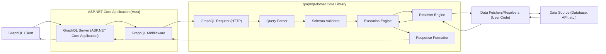

# Project Design Document: graphql-dotnet (Improved)

**Project Name:** graphql-dotnet

**Project Repository:** [https://github.com/graphql-dotnet/graphql-dotnet](https://github.com/graphql-dotnet/graphql-dotnet)

**Document Version:** 1.1
**Date:** 2023-10-27
**Author:** AI Expert (Based on request)

## 1. Introduction

This document provides an enhanced design overview of the `graphql-dotnet` project, specifically tailored for threat modeling and security analysis. Building upon the initial design, this version offers more detailed explanations and emphasizes security considerations within each component and process.  This document serves as a foundation for identifying potential vulnerabilities and attack vectors within systems built using `graphql-dotnet`.

`graphql-dotnet` is a robust .NET library implementing the GraphQL specification. It empowers developers to create GraphQL servers in .NET environments, handling the complexities of query parsing, schema validation, and efficient execution. This document focuses on the core library architecture and its interaction with user-defined code and external systems, highlighting security-relevant aspects for comprehensive threat modeling.

## 2. System Architecture

The following diagram illustrates the refined high-level architecture of a system utilizing `graphql-dotnet`. It meticulously depicts the journey of a GraphQL request, from client initiation to data retrieval and response delivery, emphasizing the critical components within the `graphql-dotnet` library and their interactions within a typical ASP.NET Core hosting environment.

## 3. Component Description (Enhanced Security Focus)

This section provides a detailed description of each key component involved in processing a GraphQL request using `graphql-dotnet`, with a heightened focus on security implications and potential vulnerabilities.

*   **"GraphQL Client"**: This is the entity initiating GraphQL requests. It could be a web application, mobile app, or another service.  From a security perspective, the client's trustworthiness is variable.  The server must not assume client-side validation is sufficient and must always perform server-side validation and authorization.

*   **"GraphQL Server (ASP.NET Core Application)"**: This is the hosting ASP.NET Core application. It's responsible for:
    *   **Endpoint Security:**  Securing the GraphQL endpoint (e.g., using HTTPS, authentication for access).
    *   **Middleware Configuration:** Properly configuring GraphQL middleware and other security middleware (e.g., CORS, rate limiting).
    *   **Error Handling:**  General application-level error handling and logging.
    *   **Dependency Management:** Keeping dependencies up-to-date to mitigate known vulnerabilities.

*   **"GraphQL Middleware"**: This ASP.NET Core middleware component is the entry point for GraphQL requests. Security responsibilities include:
    *   **Request Handling:** Receiving and parsing HTTP requests, extracting GraphQL query details.
    *   **CORS Policy Enforcement:**  Implementing Cross-Origin Resource Sharing (CORS) policies to control allowed origins.
    *   **Authentication Handling (Integration):**  Integrating with ASP.NET Core authentication mechanisms to verify user identity before processing GraphQL requests.
    *   **Request Size Limits:**  Enforcing limits on request size to prevent denial-of-service attacks.
    *   **Error Response Handling:**  Formatting GraphQL errors and HTTP error responses securely, avoiding excessive information disclosure.

*   **"GraphQL Request (HTTP)"**:  The raw HTTP request carrying the GraphQL query. Security considerations:
    *   **Request Method:** Typically POST for mutations, GET for queries (less common for complex queries). Enforce expected methods.
    *   **Request Body Parsing:** Securely parsing the request body (usually JSON) to extract query, variables, and operation name. Vulnerabilities can arise from parser exploits if not handled correctly (though less likely in well-established libraries).
    *   **Content-Type Validation:**  Validating the `Content-Type` header to ensure expected types (e.g., `application/json`).

*   **"Query Parser"**:  Parses the GraphQL query string into an Abstract Syntax Tree (AST). Security implications:
    *   **Syntax Validation:**  Strictly enforcing GraphQL syntax rules to prevent injection-style attacks through malformed queries (though GraphQL syntax itself is designed to mitigate traditional injection).
    *   **Parser Exhaustion:**  Resilience against excessively large or deeply nested queries that could exhaust parser resources (DoS).  While `graphql-dotnet` is robust, extreme inputs could theoretically be problematic.
    *   **Error Reporting:**  Providing informative but not overly revealing error messages during parsing.

*   **"Schema Validator"**: Validates the parsed query (AST) against the defined GraphQL schema.  Crucial for security:
    *   **Schema Definition Security:**  The schema itself must be securely designed, only exposing necessary data and operations. Avoid over-exposure of internal data structures.
    *   **Authorization Logic (Schema Directives/Custom Validation):**  Schema validation can incorporate authorization rules using custom directives or validation logic. This is a key point for access control. Ensure these rules are robust and correctly implemented.
    *   **Input Type Validation:**  Validating input types and arguments against the schema to prevent unexpected or malicious input data from reaching resolvers.
    *   **Query Complexity Analysis (Integration Point):**  Schema validation is a good place to integrate query complexity analysis to detect and reject overly complex queries before execution.

*   **"Execution Engine"**: Orchestrates the execution of the validated GraphQL query. Security considerations:
    *   **Execution Plan Security:**  Ensuring the execution plan itself doesn't introduce vulnerabilities (less likely in a well-designed engine, but worth considering in complex scenarios).
    *   **Resource Management:**  Managing resources (threads, memory, connections) during query execution to prevent resource exhaustion DoS.
    *   **Error Propagation:**  Handling errors during execution gracefully and securely, avoiding sensitive information leaks in error responses.

*   **"Resolver Engine"**: Invokes resolvers for each field. Security is heavily reliant on resolvers:
    *   **Resolver Selection Logic:**  Ensuring the correct resolvers are invoked based on the schema and query.
    *   **Context Management:**  Providing a secure and controlled context to resolvers, including user identity and authorization information.
    *   **Resolver Performance:**  Inefficient resolvers can lead to performance issues and DoS. Monitor resolver performance and optimize as needed.

*   **"Data Fetchers/Resolvers (User Code)"**:  User-defined functions that fetch data. **This is the most critical area for security vulnerabilities.**
    *   **Authorization Implementation:**  Resolvers are often responsible for implementing fine-grained authorization logic, determining if the current user is allowed to access specific data. **Vulnerabilities here are common.**
    *   **Input Validation (Resolver-Specific):**  Even with schema validation, resolvers may need additional input validation specific to their data sources or business logic.  **Lack of validation can lead to injection attacks (SQL, NoSQL, Command Injection).**
    *   **Data Source Interaction Security:**  Securely interacting with data sources (databases, APIs). Use parameterized queries or ORMs to prevent injection. Secure API keys and credentials.
    *   **Error Handling (Resolver-Specific):**  Handle errors gracefully within resolvers and return meaningful GraphQL errors without exposing sensitive internal details. Avoid stack traces in production error responses.
    *   **Performance and Efficiency:**  Write efficient resolvers to prevent performance bottlenecks and DoS vulnerabilities. Avoid N+1 query problems and optimize data fetching.

*   **"Data Source (Database, API, etc.)"**: Backend data storage. Security is paramount:
    *   **Data Source Security Best Practices:**  Apply all relevant security best practices for the specific data source (database hardening, API security, access control lists, encryption).
    *   **Least Privilege Access:**  Resolvers should only have the minimum necessary permissions to access the data source.
    *   **Connection Security:**  Use secure connections (e.g., TLS/SSL) to data sources.

*   **"Response Formatter"**: Formats the execution result into a JSON response. Security considerations:
    *   **Data Sanitization (If Needed):**  In rare cases, you might need to sanitize data before including it in the response (e.g., removing sensitive information that should not be exposed to the client, though ideally, this should be handled in resolvers or schema design).
    *   **Error Formatting:**  Formatting GraphQL errors according to the specification, ensuring error messages are informative for developers but not overly revealing to potential attackers in production.

## 4. Data Flow (Detailed Security Points)

The data flow remains similar, but with added security considerations at each step:

1.  **"Client Request"**: (Security: Client trustworthiness is assumed to be low. Server must validate everything.)
2.  **"Middleware Processing"**: (Security: CORS, Authentication, Request Size Limits enforced here.)
3.  **"Parsing"**: (Security: Syntax validation, parser resource limits, error reporting.)
4.  **"Validation"**: (Security: Schema validation, authorization rules, input type validation, query complexity analysis integration.)
5.  **"Execution Planning"**: (Security: Execution plan security, resource management.)
6.  **"Resolver Execution"**: (Security: Resolver selection, secure context, resolver performance.)
7.  **"Data Fetching"**: (Security: **CRITICAL** - Resolver authorization, input validation, secure data source interaction, error handling.)
8.  **"Data Aggregation"**: (Security: Ensure aggregated data doesn't inadvertently expose more than intended.)
9.  **"Response Formatting"**: (Security: Data sanitization if needed, secure error formatting.)
10. **"Middleware Response"**: (Security: Secure HTTP response headers, error handling.)
11. **"Client Receives Response"**: (Security: Client-side handling of sensitive data in response - client application security is now relevant.)

## 5. Security Considerations (Expanded and Categorized)

This section expands on security considerations, categorizing them for clarity and providing more specific examples and mitigation strategies.

*   **GraphQL Specific Vulnerabilities:**
    *   **"Introspection Queries"**:
        *   **Threat:**  Attackers can use introspection to understand the entire schema, including types, fields, and relationships, potentially revealing sensitive information and attack surface.
        *   **Mitigation:** Disable introspection in production environments or restrict access to authorized users only. Implement rate limiting on introspection queries.
    *   **"Complex Queries (Query Depth/Complexity)"**:
        *   **Threat:** Denial of Service (DoS) attacks by sending deeply nested or computationally expensive queries that overload the server.
        *   **Mitigation:**
            *   **Query Depth Limiting:** Limit the maximum depth of queries.
            *   **Query Complexity Scoring:** Assign complexity scores to fields and reject queries exceeding a defined complexity threshold. Libraries like `graphql-dotnet` offer tools for this.
            *   **Timeout Settings:** Implement timeouts for query execution to prevent long-running queries from consuming resources indefinitely.
    *   **"Batching Attacks"**:
        *   **Threat:** Amplification of complex query attacks if batching is enabled.
        *   **Mitigation:** Apply complexity analysis and limits to individual queries within a batch and to the batch as a whole. Consider disabling batching if not strictly necessary.
    *   **"Field Suggestions in Error Messages"**:
        *   **Threat:** Information leakage about the schema through field suggestions in error messages.
        *   **Mitigation:** Disable or sanitize field suggestions in production error responses. Provide generic error messages instead of detailed suggestions.

*   **"Resolver Security (User Code Vulnerabilities)"**:
    *   **"Authorization Flaws"**:
        *   **Threat:** Unauthorized access to data or operations due to insufficient or incorrectly implemented authorization logic in resolvers.
        *   **Mitigation:** Implement robust authorization checks in resolvers, based on user roles, permissions, or policies. Use authorization libraries or frameworks to simplify implementation. Test authorization logic thoroughly.
    *   **"Input Validation Failures"**:
        *   **Threat:** Injection attacks (SQL, NoSQL, Command Injection) if resolvers don't properly validate and sanitize user inputs before using them in data source queries or external system interactions.
        *   **Mitigation:**  Perform thorough input validation in resolvers. Use parameterized queries or ORMs to prevent SQL injection. Sanitize inputs before using them in commands or external API calls.
    *   **"Data Source Access Control Issues"**:
        *   **Threat:** Resolvers accessing data sources with excessive privileges, potentially leading to data breaches if resolvers are compromised.
        *   **Mitigation:**  Apply the principle of least privilege. Grant resolvers only the necessary permissions to access data sources. Use secure connection methods and authentication for data source access.
    *   **"Error Handling and Information Disclosure"**:
        *   **Threat:**  Resolvers leaking sensitive information (e.g., database connection strings, internal paths, stack traces) in error messages.
        *   **Mitigation:** Implement secure error handling in resolvers. Log detailed errors server-side but return generic, user-friendly error messages to the client in production.

*   **General Web Application Security (Standard Protections)**:
    *   **"Cross-Site Scripting (XSS)"**: (If GraphQL server interacts with web browsers)
        *   **Mitigation:** Implement standard XSS prevention techniques (output encoding, Content Security Policy).
    *   **"Cross-Site Request Forgery (CSRF)"**: (For mutations)
        *   **Mitigation:** Implement CSRF protection mechanisms (anti-CSRF tokens, SameSite cookies).
    *   **"Rate Limiting and Throttling"**:
        *   **Mitigation:** Implement rate limiting and throttling at the GraphQL endpoint to prevent abuse and DoS.
    *   **"Logging and Monitoring"**:
        *   **Mitigation:** Implement comprehensive logging of GraphQL requests, responses, and errors for security auditing and incident response. Monitor system performance and security metrics.
    *   **"Dependency Vulnerabilities"**:
        *   **Mitigation:** Regularly update `graphql-dotnet` and all other dependencies to patch known security vulnerabilities. Use dependency scanning tools.

## 6. Deployment Considerations (Security in Deployment)

Expanding on deployment security:

*   **"ASP.NET Core Web Application Deployment"**:
    *   **IIS/Kestrel/Cloud Platforms (Azure, AWS, GCP)**:
        *   **Security Hardening:** Harden the hosting environment (OS, web server). Follow platform-specific security best practices.
        *   **HTTPS Configuration:** Enforce HTTPS for all communication. Configure TLS/SSL certificates correctly.
        *   **Firewall Configuration:** Configure firewalls to restrict access to necessary ports and services.
        *   **Regular Security Updates:** Keep the OS, web server, and .NET runtime updated with security patches.
    *   **Containerized Deployment (Docker, Kubernetes)**:
        *   **Secure Container Images:** Use minimal and hardened container base images. Scan container images for vulnerabilities.
        *   **Container Security Context:** Configure secure container security contexts (user IDs, capabilities).
        *   **Network Policies:** Implement network policies to restrict network access between containers.
        *   **Secrets Management:** Securely manage secrets (API keys, database credentials) using container orchestration secrets management features.

*   **"Serverless Functions Deployment (Azure Functions, AWS Lambda)"**:
    *   **Function App Security Configuration:** Configure function app security settings (authentication, authorization).
    *   **Least Privilege Function Permissions:** Grant serverless functions only the necessary permissions to access other cloud resources.
    *   **Secure Environment Variables/Secrets Management:** Securely manage environment variables and secrets used by serverless functions.
    *   **Cold Start Considerations (Performance DoS):** Be aware of cold start times and potential performance implications that could be exploited for DoS.

## 7. Technologies Used (No Change)

*   **.NET:**  The primary platform for `graphql-dotnet`.
*   **C#:** The programming language used for `graphql-dotnet` and typically for applications using it.
*   **GraphQL Specification:**  `graphql-dotnet` implements the GraphQL specification.
*   **JSON:** Used for request and response serialization in GraphQL over HTTP.
*   **ASP.NET Core (Commonly):**  Often used as the hosting framework for `graphql-dotnet` based GraphQL servers.

This improved document provides a more comprehensive and security-focused design overview of `graphql-dotnet`. It is better suited for conducting thorough threat modeling exercises and identifying potential security vulnerabilities in systems built using this library. Remember that this document is a starting point, and deeper code analysis and specific application context are crucial for a complete security assessment.