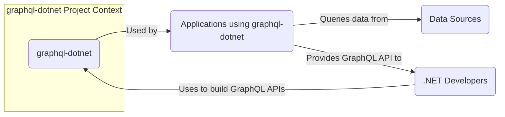
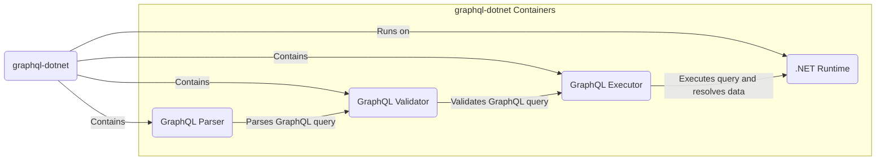
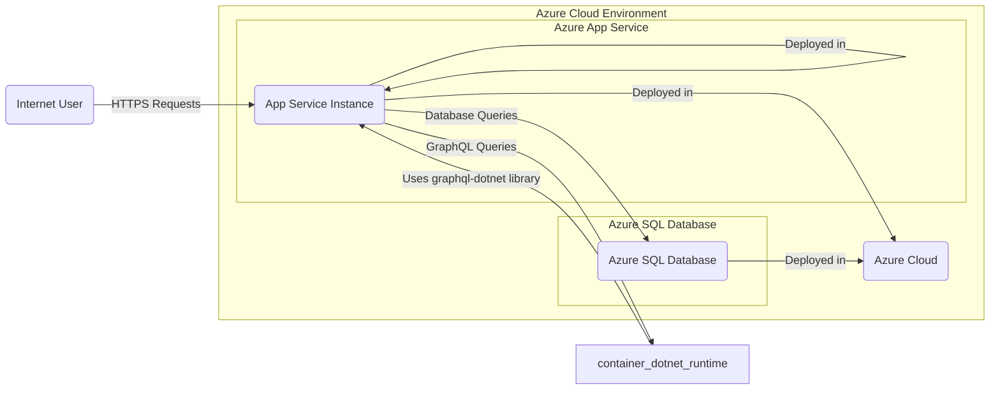
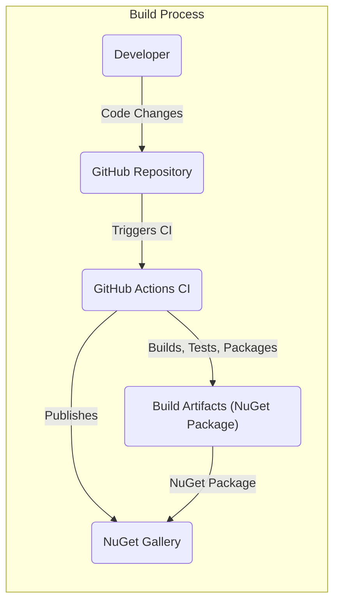

# BUSINESS POSTURE

This project, graphql-dotnet, provides a GraphQL server implementation for .NET. It aims to enable .NET developers to easily build and deploy GraphQL APIs.

- Business Priorities and Goals:
  - Provide a robust, performant, and developer-friendly GraphQL library for the .NET ecosystem.
  - Facilitate the adoption of GraphQL in .NET applications.
  - Maintain an active and supportive open-source community around the library.

- Most Important Business Risks:
  - Security vulnerabilities within the graphql-dotnet library could be exploited in applications that depend on it, leading to data breaches, service disruption, or other security incidents.
  - Poor performance or scalability of the library could limit its adoption and negatively impact the performance of applications using it.
  - Lack of community support or maintenance could lead to the library becoming outdated or insecure over time.
  - Incompatibility with newer .NET versions or other ecosystem changes could require significant rework and hinder adoption.

# SECURITY POSTURE

- Existing Security Controls:
  - security control: Code reviews by project maintainers and community contributors, implemented as part of the pull request process on GitHub.
  - security control: Public issue reporting on GitHub, allowing users to report potential security vulnerabilities.
  - security control: Version control using Git and GitHub, providing traceability and history of code changes.
  - security control: Open source licensing, allowing for community scrutiny and contribution to security improvements.

- Accepted Risks:
  - accepted risk: As an open-source project, the project relies on community contributions for security vulnerability discovery and patching, which might introduce delays in addressing security issues.
  - accepted risk: Security testing is primarily the responsibility of the community and users of the library, and might not be as comprehensive as in commercial software.
  - accepted risk:  Dependency vulnerabilities in third-party libraries used by graphql-dotnet are a potential risk.

- Recommended Security Controls:
  - recommended security control: Implement automated Static Application Security Testing (SAST) tools in the Continuous Integration (CI) pipeline to detect potential code-level vulnerabilities early in the development cycle.
  - recommended security control: Integrate Dependency Vulnerability Scanning into the CI pipeline to automatically identify and alert on known vulnerabilities in third-party dependencies.
  - recommended security control: Conduct periodic security audits or penetration testing, potentially by engaging external security experts, to proactively identify and address security weaknesses.
  - recommended security control: Establish a clear vulnerability disclosure and response policy to handle security issues reported by the community in a timely and transparent manner.

- Security Requirements:
  - Authentication:
    - Requirement: While graphql-dotnet itself does not enforce authentication, it should provide mechanisms and guidance for developers to easily integrate authentication into their GraphQL APIs built with the library. This could include documentation and examples on how to use authentication middleware or directives within the GraphQL schema.
  - Authorization:
    - Requirement: Similar to authentication, graphql-dotnet should offer patterns and best practices for implementing authorization within GraphQL resolvers. This should include mechanisms to control access to specific fields, types, or operations based on user roles or permissions.
  - Input Validation:
    - Requirement: graphql-dotnet must provide robust input validation capabilities to prevent common injection attacks (e.g., SQL injection if data sources are SQL databases, or NoSQL injection). This should include features for validating query parameters, variables, and input types against defined schemas. The library should encourage or enforce validation before query execution.
  - Cryptography:
    - Requirement: While graphql-dotnet might not directly handle cryptographic operations, it should be designed to be compatible with secure communication protocols like HTTPS.  If the library provides features for data persistence or caching, it should support or recommend encryption of sensitive data at rest and in transit. Developers using graphql-dotnet should be guided on best practices for secure data handling and encryption within their applications.

# DESIGN

## C4 CONTEXT

- Context Diagram Elements:
  - - Name: graphql-dotnet
    - Type: System
    - Description: The graphql-dotnet library, a .NET implementation of a GraphQL server. It provides the core functionality for parsing, validating, and executing GraphQL queries.
    - Responsibilities:
      - Parsing GraphQL queries and schemas.
      - Validating GraphQL queries against the schema.
      - Executing GraphQL queries and resolving data.
      - Providing extensibility points for developers to customize behavior.
    - Security controls:
      - Security control: Input validation of GraphQL queries to prevent malicious queries.
      - Security control: Error handling to avoid leaking sensitive information in error messages.

  - - Name: .NET Developers
    - Type: Person
    - Description: Software developers who use the graphql-dotnet library to build GraphQL APIs for their applications.
    - Responsibilities:
      - Designing GraphQL schemas.
      - Implementing resolvers to fetch data.
      - Configuring and integrating graphql-dotnet into their .NET applications.
      - Ensuring security of their applications, including authentication and authorization.
    - Security controls:
      - Security control: Implementing authentication and authorization in their applications.
      - Security control: Securely configuring and deploying applications using graphql-dotnet.
      - Security control: Following secure coding practices when using the library.

  - - Name: Applications using graphql-dotnet
    - Type: System
    - Description: Various applications built by .NET developers that utilize the graphql-dotnet library to expose GraphQL APIs. These applications can range from web applications to mobile backends and other services.
    - Responsibilities:
      - Hosting and serving the GraphQL API.
      - Handling user requests and routing them to the GraphQL endpoint.
      - Interacting with data sources to fetch and manipulate data.
      - Enforcing application-level security controls.
    - Security controls:
      - Security control: Implementing HTTPS for secure communication.
      - Security control: Rate limiting and request throttling to prevent denial-of-service attacks.
      - Security control: Monitoring and logging of API requests and errors.

  - - Name: Data Sources
    - Type: System
    - Description: Backend systems and databases that hold the data queried by GraphQL APIs built with graphql-dotnet. These can be relational databases, NoSQL databases, REST APIs, or other data services.
    - Responsibilities:
      - Storing and managing application data.
      - Providing data access to applications.
      - Enforcing data-level security controls.
    - Security controls:
      - Security control: Access control lists (ACLs) to restrict data access.
      - Security control: Encryption of data at rest and in transit.
      - Security control: Regular security patching and updates.

## C4 CONTAINER

- Container Diagram Elements:
  - - Name: GraphQL Parser
    - Type: Container
    - Description: Component responsible for parsing the incoming GraphQL query string into an Abstract Syntax Tree (AST).
    - Responsibilities:
      - Lexical analysis and syntax parsing of GraphQL queries.
      - Generating an AST representation of the query.
      - Handling syntax errors and reporting them to the client.
    - Security controls:
      - Security control: Input validation to prevent malformed queries from crashing the parser.
      - Security control: Protection against denial-of-service attacks through excessively complex queries.

  - - Name: GraphQL Validator
    - Type: Container
    - Description: Component that validates the parsed GraphQL query (AST) against the defined GraphQL schema.
    - Responsibilities:
      - Schema validation to ensure the query is valid against the schema.
      - Semantic validation to check for type correctness and other semantic rules.
      - Authorization checks (can be integrated here or in the executor).
      - Reporting validation errors to the client.
    - Security controls:
      - Security control: Schema validation to prevent queries that access unauthorized data or operations (if schema is designed with security in mind).
      - Security control: Input validation to prevent injection attacks by validating query structure and parameters.

  - - Name: GraphQL Executor
    - Type: Container
    - Description: Component responsible for executing the validated GraphQL query. It traverses the AST and calls the appropriate resolvers to fetch data.
    - Responsibilities:
      - Query execution and resolver invocation.
      - Data fetching from data sources.
      - Data transformation and formatting.
      - Error handling during execution.
    - Security controls:
      - Security control: Authorization enforcement within resolvers to control access to data based on user permissions.
      - Security control: Input sanitization and output encoding in resolvers to prevent injection attacks when interacting with data sources.
      - Security control: Resource management to prevent excessive resource consumption during query execution.

  - - Name: .NET Runtime
    - Type: Container
    - Description: The .NET runtime environment that hosts and executes the graphql-dotnet library and applications using it.
    - Responsibilities:
      - Providing the execution environment for .NET code.
      - Managing memory and resources.
      - Providing core libraries and functionalities.
    - Security controls:
      - Security control: Operating system and runtime security patching.
      - Security control: Configuration and hardening of the .NET runtime environment.
      - Security control: Resource limits and isolation provided by the runtime environment.

## DEPLOYMENT

Deployment of graphql-dotnet itself is as a NuGet package. Applications using it will be deployed in various ways. Let's consider a typical deployment scenario for an ASP.NET Core application using graphql-dotnet to a cloud environment like Azure App Service.

- Deployment Diagram Elements:
  - - Name: Azure App Service Instance
    - Type: Deployment Environment
    - Description: An instance of Azure App Service hosting the ASP.NET Core application that uses graphql-dotnet. This is the runtime environment where the application code executes.
    - Responsibilities:
      - Hosting the application and serving HTTP requests.
      - Managing application lifecycle and scaling.
      - Providing network connectivity and security.
    - Security controls:
      - Security control: HTTPS termination and TLS encryption.
      - Security control: Web Application Firewall (WAF) to protect against common web attacks.
      - Security control: Azure App Service platform security features (e.g., managed identities, access restrictions).

  - - Name: .NET Runtime (within App Service Instance)
    - Type: Software Environment
    - Description: The .NET runtime environment running within the Azure App Service instance, executing the application code and the graphql-dotnet library.
    - Responsibilities:
      - Executing .NET code.
      - Providing runtime libraries and functionalities.
      - Managing resources within the App Service instance.
    - Security controls:
      - Security control: .NET runtime security features and patches.
      - Security control: Isolation and resource limits within the App Service environment.

  - - Name: Azure SQL Database
    - Type: Data Store
    - Description: An Azure SQL Database instance used as the data source for the GraphQL API.
    - Responsibilities:
      - Storing and managing application data.
      - Providing database access to the application.
      - Ensuring data persistence and availability.
    - Security controls:
      - Security control: Azure SQL Database security features (e.g., firewall, encryption at rest and in transit, auditing).
      - Security control: Database access control and authentication.
      - Security control: Regular database backups and disaster recovery.

  - - Name: Internet User
    - Type: External Actor
    - Description: Users accessing the GraphQL API over the internet.
    - Responsibilities:
      - Authenticating and authorizing to access the API (if required).
      - Sending valid GraphQL queries.
    - Security controls:
      - Security control: User authentication mechanisms (e.g., OAuth 2.0, API keys).
      - Security control: Client-side security practices to protect user credentials and data.

  - - Name: Azure Cloud
    - Type: Cloud Platform
    - Description: The underlying Azure cloud platform providing infrastructure and services for the application deployment.
    - Responsibilities:
      - Providing secure and reliable infrastructure.
      - Managing cloud services and resources.
      - Ensuring overall platform security and compliance.
    - Security controls:
      - Security control: Azure platform security controls and certifications.
      - Security control: Physical security of Azure data centers.
      - Security control: Network security and isolation within Azure.

## BUILD

- Build Process Elements:
  - - Name: Developer
    - Type: Actor
    - Description: A software developer contributing code to the graphql-dotnet project.
    - Responsibilities:
      - Writing and committing code changes.
      - Performing local testing and code reviews.
      - Adhering to coding standards and security guidelines.
    - Security controls:
      - Security control: Developer workstation security (e.g., antivirus, OS patching).
      - Security control: Secure coding practices training.
      - Security control: Code review process to identify potential security flaws.

  - - Name: GitHub Repository
    - Type: Code Repository
    - Description: The GitHub repository hosting the source code of the graphql-dotnet project.
    - Responsibilities:
      - Storing and versioning source code.
      - Managing code contributions and pull requests.
      - Triggering CI/CD pipelines.
    - Security controls:
      - Security control: Access control to the repository (e.g., branch protection, permissions).
      - Security control: Audit logging of repository activities.
      - Security control: Vulnerability scanning of dependencies used in the project (GitHub Dependabot).

  - - Name: GitHub Actions CI
    - Type: CI/CD System
    - Description: GitHub Actions workflows configured for the graphql-dotnet project to automate the build, test, and release process.
    - Responsibilities:
      - Automating the build process.
      - Running unit and integration tests.
      - Performing static analysis and security checks (recommended).
      - Packaging and publishing build artifacts.
    - Security controls:
      - Security control: Secure configuration of CI/CD pipelines.
      - Security control: Use of secure build environments and secrets management.
      - Security control: Integration of SAST and dependency scanning tools in the pipeline (recommended).

  - - Name: Build Artifacts (NuGet Package)
    - Type: Artifact
    - Description: The NuGet package generated by the build process, containing the compiled graphql-dotnet library.
    - Responsibilities:
      - Packaging the library for distribution.
      - Ensuring integrity and authenticity of the package.
    - Security controls:
      - Security control: Signing of NuGet packages to ensure authenticity and prevent tampering.
      - Security control: Storage of build artifacts in secure repositories.

  - - Name: NuGet Gallery
    - Type: Package Registry
    - Description: The public NuGet Gallery (nuget.org) where the graphql-dotnet NuGet package is published and made available to .NET developers.
    - Responsibilities:
      - Hosting and distributing NuGet packages.
      - Providing package metadata and versioning.
      - Ensuring package integrity and security.
    - Security controls:
      - Security control: NuGet Gallery security measures to protect against malicious packages.
      - Security control: Package verification and signing.
      - Security control: Vulnerability scanning of published packages.

# RISK ASSESSMENT

- Critical Business Processes:
  - Development and maintenance of the graphql-dotnet library itself.
  - Development and operation of applications that rely on graphql-dotnet.
  - Distribution of the graphql-dotnet library to .NET developers.

- Data to Protect and Sensitivity:
  - Source code of graphql-dotnet: High sensitivity. Confidentiality and integrity are crucial to prevent unauthorized modifications or exposure of vulnerabilities.
  - NuGet packages: High sensitivity. Integrity and authenticity are paramount to prevent supply chain attacks and ensure users are using a trusted and unmodified library.
  - Data processed by applications using graphql-dotnet: Sensitivity depends on the specific application. Could range from low to high sensitivity, including personal data, financial data, or other confidential information. The graphql-dotnet library itself should be designed to facilitate secure handling of sensitive data by applications using it.

# QUESTIONS & ASSUMPTIONS

- Questions:
  - What is the current process for handling security vulnerability reports for graphql-dotnet? Is there a dedicated security team or contact?
  - Are there any existing SAST/DAST or dependency scanning tools integrated into the graphql-dotnet CI/CD pipeline?
  - What are the guidelines or recommendations provided to developers using graphql-dotnet regarding secure coding practices, especially concerning authentication, authorization, and input validation in GraphQL APIs?
  - Is there a formal security audit or penetration testing plan for graphql-dotnet?

- Assumptions:
  - The primary use case for graphql-dotnet is building backend GraphQL APIs for web and mobile applications.
  - Security is a significant concern for developers choosing to use graphql-dotnet in their projects.
  - The graphql-dotnet project aims to follow best practices for open-source software development, including security considerations.
  - The deployment scenario described (ASP.NET Core application on Azure App Service) is a representative example of how applications using graphql-dotnet might be deployed.