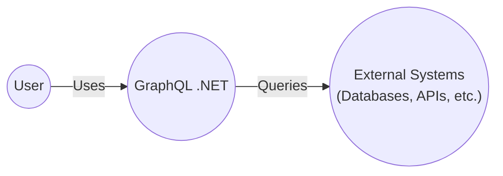
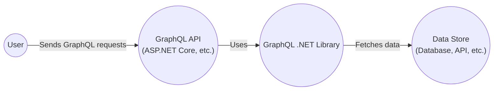
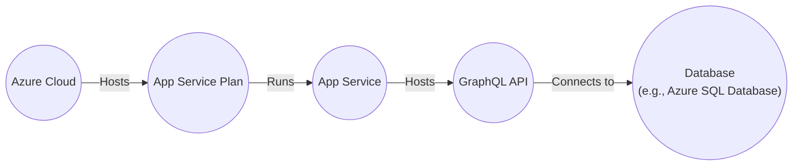
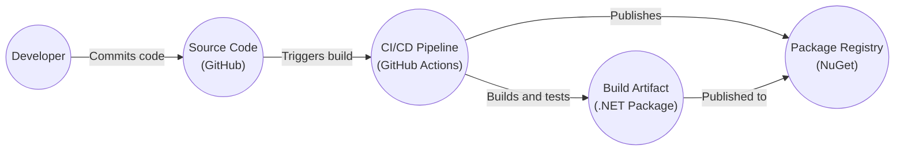

# BUSINESS POSTURE

Business Priorities and Goals:

*   Provide a robust, performant, and easy-to-use GraphQL implementation for the .NET ecosystem.
*   Enable developers to build GraphQL APIs in .NET with minimal friction.
*   Maintain compatibility with the GraphQL specification.
*   Foster a strong community and ecosystem around GraphQL on .NET.
*   Ensure the library is well-documented and easy to learn.
*   Provide a stable and reliable platform for building production-ready GraphQL APIs.
*   Support a wide range of .NET versions and platforms.

Business Risks:

*   Inability to keep up with the evolving GraphQL specification, leading to compatibility issues.
*   Performance bottlenecks that limit the scalability of applications built using the library.
*   Security vulnerabilities that could be exploited in production environments.
*   Lack of community adoption and contribution, hindering the long-term viability of the project.
*   Insufficient documentation or support, making it difficult for developers to use the library effectively.
*   Competition from other GraphQL implementations in the .NET ecosystem.
*   Breaking changes that disrupt existing applications.

# SECURITY POSTURE

Existing Security Controls:

*   security control: Regular dependency updates to address known vulnerabilities in third-party libraries. (Visible in the project's dependency management and build process).
*   security control: Use of static analysis tools (e.g., linters) to identify potential code quality and security issues. (Implied by the project's build process and contribution guidelines).
*   security control: Code reviews to ensure code quality and security. (Implied by the project's contribution guidelines and open-source nature).
*   security control: Test coverage to identify and prevent regressions, including security-related issues. (Visible in the project's test suite).
*   security control: Adherence to secure coding practices. (Implied by the project's maturity and community involvement).
*   security control: The project uses GitHub's built-in security features, such as Dependabot, for vulnerability scanning.

Accepted Risks:

*   accepted risk: The project relies on community contributions, which may introduce security risks if not properly reviewed.
*   accepted risk: The project supports a wide range of .NET versions, which may increase the attack surface.
*   accepted risk: The project is open-source, making its source code publicly available, which could potentially aid attackers in finding vulnerabilities.

Recommended Security Controls:

*   security control: Implement a comprehensive security policy that outlines the project's approach to security, including vulnerability disclosure procedures.
*   security control: Conduct regular security audits and penetration testing to identify and address potential vulnerabilities.
*   security control: Implement input validation and sanitization to prevent common web vulnerabilities such as cross-site scripting (XSS) and injection attacks.
*   security control: Implement authorization mechanisms to control access to sensitive data and functionality.
*   security control: Use a secure configuration management system to store and manage sensitive configuration data.
*   security control: Implement logging and monitoring to detect and respond to security incidents.
*   security control: Integrate SAST (Static Application Security Testing) and DAST (Dynamic Application Security Testing) tools into the CI/CD pipeline.
*   security control: Implement Software Composition Analysis (SCA) to identify and manage vulnerabilities in third-party dependencies.

Security Requirements:

*   Authentication:
    *   The library itself does not handle authentication. It is the responsibility of the application using the library to implement authentication mechanisms. The library should provide hooks or integration points for applications to integrate their authentication solutions.
*   Authorization:
    *   The library should provide mechanisms for implementing authorization at the field level. This could include directives, middleware, or other extension points.
    *   Authorization logic should be clearly separated from business logic.
    *   Support for role-based access control (RBAC) and attribute-based access control (ABAC) should be considered.
*   Input Validation:
    *   The library should validate all incoming data against the GraphQL schema.
    *   Customizable validation rules should be supported.
    *   Input sanitization should be performed to prevent injection attacks.
*   Cryptography:
    *   The library should not handle sensitive data directly. If necessary, it should rely on established cryptographic libraries provided by the .NET framework.
    *   Any use of cryptography should adhere to industry best practices.

# DESIGN

## C4 CONTEXT

Element Descriptions:

*   Element:
    *   Name: User
    *   Type: Person
    *   Description: Represents a user of a GraphQL API built using the GraphQL .NET library.
    *   Responsibilities: Sends GraphQL queries and mutations to the API.
    *   Security controls: Authentication and authorization are typically handled by the application layer, not the GraphQL .NET library itself.

*   Element:
    *   Name: GraphQL .NET
    *   Type: Software System
    *   Description: The GraphQL .NET library, providing the core functionality for building GraphQL APIs in .NET.
    *   Responsibilities: Parsing GraphQL queries, validating them against a schema, executing resolvers, and returning results.
    *   Security controls: Schema validation, input sanitization (to be implemented), field-level authorization (to be implemented).

*   Element:
    *   Name: External Systems
    *   Type: Software System
    *   Description: Represents external systems that the GraphQL API interacts with, such as databases, other APIs, or microservices.
    *   Responsibilities: Providing data and functionality to the GraphQL API.
    *   Security controls: Dependent on the specific external system. The GraphQL API should use secure communication channels (e.g., HTTPS) and appropriate authentication/authorization mechanisms when interacting with these systems.

## C4 CONTAINER

Element Descriptions:

*   Element:
    *   Name: User
    *   Type: Person
    *   Description: Represents a user of the GraphQL API.
    *   Responsibilities: Sends GraphQL queries and mutations.
    *   Security controls: Authentication and authorization are typically handled by the application layer.

*   Element:
    *   Name: GraphQL API
    *   Type: Container (Web Application)
    *   Description: The web application that hosts the GraphQL endpoint. This is typically built using a framework like ASP.NET Core.
    *   Responsibilities: Handling HTTP requests, routing requests to the GraphQL engine, providing authentication and authorization, and returning responses.
    *   Security controls: Authentication, authorization, input validation, output encoding, rate limiting, CORS configuration.

*   Element:
    *   Name: GraphQL .NET Library
    *   Type: Container (Library)
    *   Description: The GraphQL .NET library itself.
    *   Responsibilities: Parsing, validating, and executing GraphQL queries.
    *   Security controls: Schema validation, input sanitization (to be implemented), field-level authorization (to be implemented).

*   Element:
    *   Name: Data Store
    *   Type: Container (Database, API, etc.)
    *   Description: The data source for the GraphQL API. This could be a database, another API, or any other source of data.
    *   Responsibilities: Storing and retrieving data.
    *   Security controls: Data encryption at rest and in transit, access control, auditing.

## DEPLOYMENT

Possible Deployment Solutions:

1.  **Azure App Service:** Deploy the GraphQL API as a web app on Azure App Service.
2.  **Azure Kubernetes Service (AKS):** Deploy the GraphQL API as a containerized application on AKS.
3.  **AWS Elastic Beanstalk:** Deploy the GraphQL API as a web app on AWS Elastic Beanstalk.
4.  **AWS Elastic Container Service (ECS):** Deploy the GraphQL API as a containerized application on ECS.
5.  **Google Cloud Run:** Deploy the GraphQL API as a containerized application on Google Cloud Run.
6.  **Google Kubernetes Engine (GKE):** Deploy the GraphQL API as a containerized application on GKE.
7.  **On-premises IIS:** Deploy the GraphQL API as a web application on an on-premises IIS server.
8.  **Self-hosted:** Deploy as a self-hosted application using Kestrel.

Chosen Solution (Azure App Service):

Element Descriptions:

*   Element:
    *   Name: Azure Cloud
    *   Type: Cloud Provider
    *   Description: Microsoft Azure cloud platform.
    *   Responsibilities: Providing infrastructure and services for hosting the application.
    *   Security controls: Azure platform security features, network security groups, Azure Active Directory.

*   Element:
    *   Name: App Service Plan
    *   Type: Deployment Environment
    *   Description: Defines the resources and scaling characteristics for the App Service.
    *   Responsibilities: Providing compute resources for the web app.
    *   Security controls: Network isolation, scaling limits.

*   Element:
    *   Name: App Service
    *   Type: Deployment Environment
    *   Description: The Azure App Service instance that hosts the GraphQL API.
    *   Responsibilities: Running the web application.
    *   Security controls: App Service security features, SSL/TLS configuration, access restrictions.

*   Element:
    *   Name: GraphQL API
    *   Type: Application
    *   Description: The deployed GraphQL API.
    *   Responsibilities: Handling GraphQL requests.
    *   Security controls: Application-level security controls, as described in previous sections.

*   Element:
    *   Name: Database
    *   Type: Data Store
    *   Description: The database used by the GraphQL API (e.g., Azure SQL Database).
    *   Responsibilities: Storing and retrieving data.
    *   Security controls: Database-level security controls, encryption, access control.

## BUILD

Build Process Description:

1.  **Developer Commits Code:** A developer commits code changes to the GitHub repository.
2.  **Source Code Triggers Build:** The commit triggers a build in the CI/CD pipeline (GitHub Actions).
3.  **CI/CD Pipeline Builds and Tests:** The CI/CD pipeline performs the following steps:
    *   Checks out the source code.
    *   Restores dependencies.
    *   Compiles the code.
    *   Runs unit tests.
    *   Runs integration tests.
    *   Performs static analysis (SAST) using tools like SonarQube or similar.
    *   Performs dependency scanning (SCA) to identify vulnerabilities in third-party libraries.
    *   Packages the application into a build artifact (e.g., a .NET package).
4.  **CI/CD Pipeline Publishes Artifact:** If all checks pass, the CI/CD pipeline publishes the build artifact to a package registry (NuGet).

Security Controls:

*   **Source Code Management:** GitHub provides access control and version history.
*   **CI/CD Pipeline:** GitHub Actions provides a secure and automated build environment.
*   **Static Analysis (SAST):** Identifies potential security vulnerabilities in the source code.
*   **Dependency Scanning (SCA):** Identifies known vulnerabilities in third-party libraries.
*   **Code Reviews:** Mandatory code reviews before merging changes into the main branch.
*   **Signed Commits:** Enforce signed commits to ensure the integrity of code changes.
*   **Build Artifact Signing:** Sign the build artifact to ensure its integrity and authenticity.

# RISK ASSESSMENT

Critical Business Processes:

*   Providing a reliable and performant GraphQL API service to users.
*   Maintaining the integrity and confidentiality of data accessed through the GraphQL API.
*   Ensuring the availability of the GraphQL API service.

Data Sensitivity:

*   The GraphQL .NET library itself does not handle sensitive data directly. However, it is used to build GraphQL APIs that may handle sensitive data. The sensitivity of the data depends on the specific application using the library.
*   Data sensitivity levels could range from public (non-sensitive) to highly confidential (e.g., PII, financial data, health data).
*   The application using the GraphQL .NET library is responsible for classifying and protecting data according to its sensitivity.

# QUESTIONS & ASSUMPTIONS

Questions:

*   What specific types of data will be exposed through GraphQL APIs built using this library?
*   What are the specific authentication and authorization requirements for applications using this library?
*   What are the performance and scalability requirements for applications using this library?
*   What are the specific deployment environments that will be used for applications using this library?
*   Are there any specific compliance requirements (e.g., GDPR, HIPAA) that need to be considered?
*   What level of logging and monitoring is required for applications using this library?
*   What is the expected threat model for applications using this library?

Assumptions:

*   BUSINESS POSTURE: The project prioritizes stability, maintainability, and community adoption.
*   SECURITY POSTURE: The project follows secure coding practices and addresses known vulnerabilities promptly. The project will implement additional security controls as needed.
*   DESIGN: The library will be used in conjunction with a web application framework (e.g., ASP.NET Core) to handle HTTP requests and responses. The library will be used to access data from various data sources, including databases and other APIs. The library will be deployed to a variety of environments, including cloud platforms and on-premises servers.