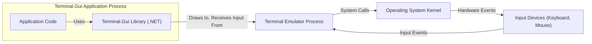

## Project Design Document: Terminal.Gui

**Document Version:** 1.1
**Date:** October 26, 2023
**Prepared By:** [Your Name/Organization]

### 1. Introduction

This document provides an enhanced and more detailed design overview of the Terminal.Gui project, a .NET library for creating console-based user interfaces. This revised document aims to provide a more robust foundation for subsequent activities, particularly threat modeling, by offering a deeper understanding of the system's architecture, components, and data flow.

### 2. Project Overview

Terminal.Gui is a cross-platform .NET library that empowers developers to construct rich, interactive text-based user interfaces (TUIs) for console applications. It offers a comprehensive set of widgets, sophisticated layout managers, and a robust event handling system, mirroring the capabilities of graphical user interface (GUI) frameworks but tailored for terminal environments.

**Key Features:**

*   **Extensive Widget Library:** Provides a wide array of pre-built UI elements such as buttons, labels, text boxes, lists, dialogs, and menus.
*   **Flexible Layout Management:** Offers various layout strategies (e.g., absolute positioning, relative positioning, stacking) to create responsive UIs within the constraints of a terminal.
*   **Comprehensive Event Handling:**  Supports capturing and processing a wide range of user interactions, including keyboard input (key presses, combinations), mouse events (clicks, movement, scrolling), and window resizing.
*   **Theming and Styling:** Enables customization of the visual appearance of applications through themes, color palettes, and attribute settings.
*   **Cross-Platform Compatibility:** Designed to function seamlessly across different operating systems (Windows, Linux, macOS) with minimal platform-specific code.
*   **Accessibility Support:** Incorporates features to enhance accessibility for users with disabilities, such as screen reader compatibility.
*   **Extensibility:** Allows developers to create custom widgets and extend the functionality of the framework.

**Target Audience:**

*   Developers building interactive console applications requiring user-friendly interfaces.
*   System administrators and DevOps engineers developing command-line tools with enhanced user interaction.
*   Individuals and organizations seeking to create efficient and accessible applications within a terminal environment.

### 3. System Architecture

The Terminal.Gui architecture is structured into distinct layers and components that interact to provide the framework's functionality.

*   **Core Library (`Terminal.Gui.dll`):** The central component, containing the fundamental classes for widgets, layout management, event processing, drawing, and input handling.
*   **Application Layer:** Represents the specific applications built by developers utilizing the Terminal.Gui library. These are the executable programs that instantiate and manage the UI.
*   **Terminal Emulator:** The host environment where Terminal.Gui applications are executed. Examples include Windows Terminal, GNOME Terminal, iTerm2, and the macOS Terminal.
*   **Operating System:** The underlying operating system providing the necessary APIs for terminal interaction, input/output operations, and system resources.



**Component Breakdown:**

*   **Application Code:** The developer-written code that defines the application's logic, creates and configures Terminal.Gui widgets, handles events, and manages the application's state.
*   **Terminal.Gui Library:**
    *   **Widgets:** A hierarchy of classes representing interactive UI elements (e.g., `Button`, `Label`, `TextField`, `ListView`, `Window`, `Dialog`). Each widget manages its own state, drawing, and event handling.
    *   **Layout Managers:** Classes responsible for determining the size and position of widgets within a container (e.g., `AbsoluteLayout`, `RelativeLayout`, `StackLayout`).
    *   **Event Handling System:** A mechanism for dispatching and handling events, including keyboard events (`KeyPress`, `KeyRelease`), mouse events (`MouseClick`, `MouseMove`, `MouseWheel`), and application lifecycle events.
    *   **Drawing Engine:**  Responsible for rendering the UI onto the terminal screen. This involves translating widget states into character-based representations, utilizing terminal control sequences for colors, attributes, and cursor manipulation.
    *   **Input Driver:**  Abstracts the differences between various terminal emulators and operating systems in handling input events. It translates raw input into a consistent event stream for the application.
    *   **Theme Engine:** Manages the visual appearance of the application by defining color schemes, attribute settings, and styles for different UI elements.
    *   **View Abstraction:** Provides a base class (`View`) from which all visual elements inherit, managing properties like position, size, focus, and subviews.
    *   **Clipboard Support:**  Facilitates copy and paste operations within the terminal environment.
    *   **Modal and Non-Modal Dialog Management:**  Provides mechanisms for creating and managing dialog boxes for user interaction.
*   **Terminal Emulator:**
    *   Provides the interface for displaying text and graphics in a terminal window.
    *   Interprets ANSI escape codes and other control sequences to render the UI elements as intended.
    *   Captures user input from the keyboard and mouse and transmits it to the running application.
    *   Manages the terminal buffer and screen updates.
*   **Operating System:**
    *   Provides the underlying terminal interface (e.g., PTY on Unix-like systems, Console API on Windows).
    *   Manages input and output streams for the terminal emulator.
    *   Provides access to system resources and APIs.
*   **Input Devices:** Physical devices such as keyboards and mice that generate user input events.

### 4. Data Flow

The data flow within a Terminal.Gui application encompasses both user interaction and the rendering of the user interface.

**Detailed User Input Flow:**

1. A user interacts with the terminal emulator by pressing a key or moving/clicking the mouse.
2. The terminal emulator captures the raw input event (e.g., key code, mouse coordinates).
3. The operating system receives the input event from the terminal emulator.
4. The operating system passes the input event to the Terminal.Gui application process.
5. The Terminal.Gui library's input driver receives the raw input.
6. The input driver translates the raw input into a higher-level Terminal.Gui event (e.g., `KeyPressEventArgs`, `MouseEventArgs`).
7. The event is then dispatched through the focus chain to the appropriate widget that has focus or is targeted by the event.
8. Event handlers within the targeted widget or the application code process the event.
9. The application logic may update the state of the application and its UI in response to the event.

**Detailed UI Rendering Flow:**

1. When the application state changes (e.g., data is updated, a button is clicked, a timer elapses), the application logic may trigger a redraw of parts or all of the UI.
2. The `Application.Refresh()` method or a widget's `SetNeedsDisplay()` method is called, marking the affected areas as needing to be redrawn.
3. During the next rendering cycle, the Terminal.Gui library traverses the view hierarchy.
4. For each view that needs to be redrawn, its `Draw()` method is invoked.
5. The `Draw()` method of a widget generates the character-based representation of the widget's content based on its current state and theme. This involves writing characters and ANSI escape codes to an internal buffer.
6. The drawing engine then flushes this buffer to the terminal emulator's output stream.
7. The terminal emulator interprets the characters and escape codes and updates the display on the screen.

```mermaid
graph LR
    subgraph "User Interaction"
        UA["User Input (Keyboard/Mouse Event)"]
        UB["Terminal Emulator Process"]
        UC["Operating System Kernel"]
    end
    subgraph "Terminal.Gui Application Process"
        TA["Terminal.Gui Input Driver"]
        TB["Terminal.Gui Event System"]
        TC["Target Widget/Application Code"]
        TD["Terminal.Gui Drawing Engine"]
    end

    UA -- "Input Signal" --> UB
    UB -- "System Call" --> UC
    UC -- "Input Event" --> TA
    TA -- "Translate to T.G Event" --> TB
    TB -- "Dispatch Event" --> TC
    TC -- "Update Application State" --> TD
    TD -- "Generate Drawing Commands" --> UB
    UB -- "Render to Display" --> "Terminal Display"
```

### 5. Security Considerations

This section outlines potential security considerations based on the architecture of Terminal.Gui. A more detailed threat model will build upon these points.

*   **Input Validation and Sanitization:**
    *   **Threat:** Malicious or unexpected input from the terminal (e.g., crafted escape sequences, excessively long strings) could lead to application crashes, unexpected behavior, or potential terminal vulnerabilities.
    *   **Consideration:**  Applications built with Terminal.Gui must implement robust input validation and sanitization to handle potentially harmful input. The library itself should also be resilient to malformed input from the terminal emulator.
*   **Dependency Vulnerabilities:**
    *   **Threat:**  Terminal.Gui relies on the .NET runtime and potentially other third-party libraries. Vulnerabilities in these dependencies could be exploited by attackers.
    *   **Consideration:**  Regularly update dependencies and perform security audits of the libraries used by Terminal.Gui. Employ Software Composition Analysis (SCA) tools to identify known vulnerabilities.
*   **Terminal Emulator Security:**
    *   **Threat:**  Vulnerabilities in the terminal emulator itself could be exploited to compromise the application or the user's system.
    *   **Consideration:**  Users should be advised to use reputable and up-to-date terminal emulators. Terminal.Gui developers should be aware of known terminal vulnerabilities and potentially implement mitigations where feasible.
*   **Resource Exhaustion:**
    *   **Threat:**  Malicious input or actions could be designed to consume excessive resources (CPU, memory), leading to denial-of-service.
    *   **Consideration:**  Implement safeguards against resource exhaustion, such as limiting input buffer sizes and preventing infinite loops in event handlers.
*   **Configuration Security:**
    *   **Threat:** If applications store sensitive configuration data, insecure storage or access mechanisms could lead to unauthorized disclosure or modification.
    *   **Consideration:**  Follow secure coding practices for storing and accessing configuration data. Avoid storing sensitive information in plain text.
*   **Code Injection through Terminal Commands:**
    *   **Threat:** If the application constructs and executes shell commands based on user input, vulnerabilities to command injection could exist.
    *   **Consideration:**  Avoid constructing shell commands directly from user input. If necessary, use parameterized commands or secure APIs to prevent injection attacks.
*   **Cross-Platform Security Variations:**
    *   **Threat:** Security features and vulnerabilities can differ across operating systems and terminal emulators.
    *   **Consideration:**  Thoroughly test Terminal.Gui applications on different platforms to identify and address platform-specific security issues.
*   **Clipboard Security:**
    *   **Threat:**  Malicious actors could potentially inject harmful content into the clipboard, which could then be pasted into the application.
    *   **Consideration:**  Be cautious when handling data pasted from the clipboard. Implement checks and sanitization as needed.

### 6. Assumptions and Constraints

*   It is assumed that the underlying operating system and terminal emulator provide a baseline level of security.
*   This design document primarily focuses on the security aspects of the Terminal.Gui library and applications directly built upon it. Interactions with external systems or network communication are generally outside the scope unless explicitly mentioned.
*   The library is designed for interactive console applications and not intended for security-critical server-side processes without careful consideration of the terminal environment.

### 7. Future Considerations

*   **Enhanced Security Features:** Explore incorporating built-in security features, such as input sanitization helpers or mechanisms to mitigate common terminal vulnerabilities.
*   **Formal Security Audits:** Conduct regular professional security audits and penetration testing to proactively identify and address potential vulnerabilities in the library.
*   **Community Security Engagement:** Foster a community where security concerns can be reported and addressed effectively.
*   **Improved Documentation on Security Best Practices:** Provide comprehensive guidance to developers on how to build secure Terminal.Gui applications.

This improved design document provides a more detailed and nuanced understanding of the Terminal.Gui project, making it a more effective foundation for threat modeling and security analysis. The expanded descriptions of the architecture, data flow, and security considerations offer a richer context for identifying potential vulnerabilities and developing appropriate mitigations.
